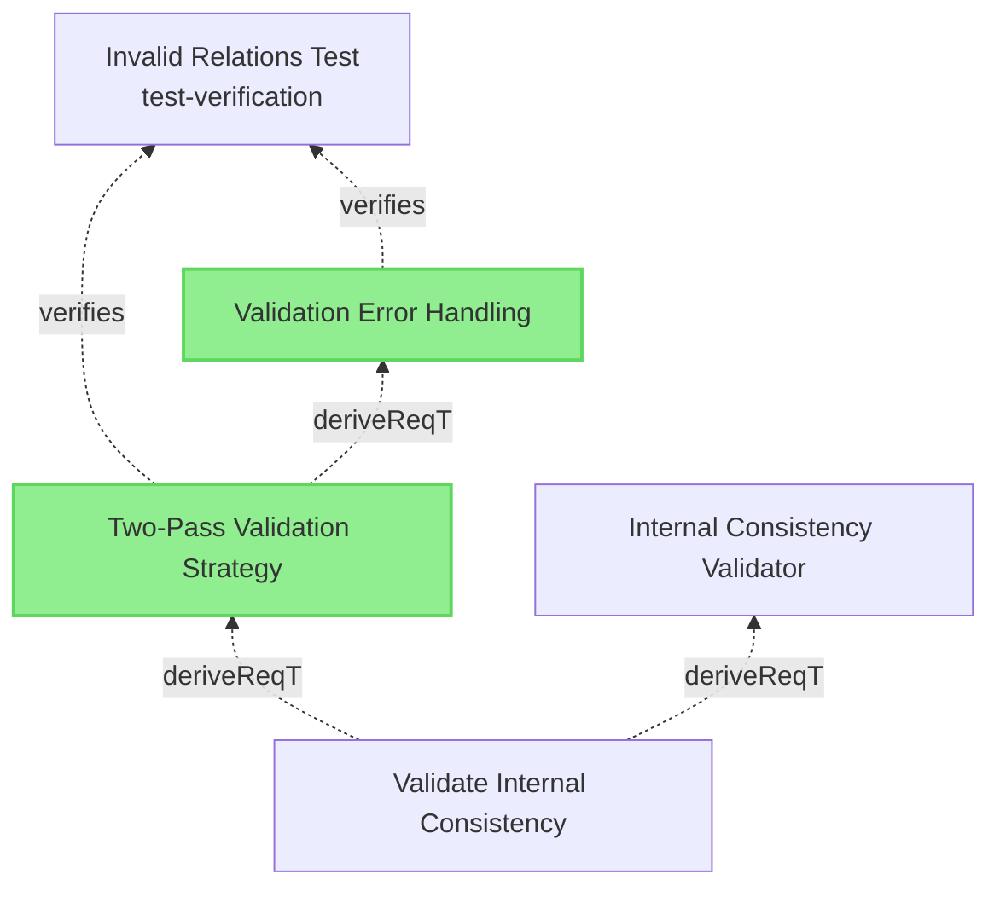

# Verification Traceability Feature Plan

## Overview
Implement upward traceability from verifications to requirements, showing the complete chain from verified requirements to root requirements in a single tree per verification. The feature generates text reports with embedded Mermaid diagrams for visualization.

## Requirement Relationships

### Parent Requirement
This feature relates to:
- **[Model Reports](specifications/UserRequirements.md#model-reports)** - Parent requirement that this feature refines

### New Requirements to Create

**Note:** All requirements must follow:
- **EARS Standard:** Use SHALL/SHOULD/MAY keywords and appropriate requirement patterns
- **Markdown Element Format:** Use the standard element structure defined in `specifications/CLAUDE.md`

**Element Structure Format:**
```markdown
### Element Name

Element content describing the requirement using EARS standard.

#### Metadata
  * type: requirement

#### Relations
  * relationType: [Target Element](path/to/file.md#target-element)
```

#### User Requirement: Verification Upward Traceability
**Location:** `specifications/UserRequirements.md`
**Section:** "Provide Reports" section, near "Verification Coverage Report"

**Markdown Format:**
```markdown
### Verification Upward Traceability

The system SHALL provide upward traceability visualization from verifications to root requirements, showing the complete requirement hierarchy and indicating which requirements are directly verified.

#### Metadata
  * type: user-requirement

#### Relations
  * refine: [Model Reports](#model-reports)
```

#### System Requirement: Verification Trace Builder
**Location:** `specifications/SystemRequirements/Requirements.md`

**Markdown Format:**
```markdown
### Verification Trace Builder

The system SHALL provide functionality to build upward trace trees from verification elements by traversing verify, derivedFrom, and refine relations to reach root requirements, merging all paths into a single tree structure with marked directly-verified requirements.

#### Metadata
  * type: requirement

#### Relations
  * derivedFrom: [Verification Upward Traceability](../UserRequirements.md#verification-upward-traceability)
```

#### System Requirement: Verification Traces CLI Command
**Location:** `specifications/SystemRequirements/Requirements.md`

**Markdown Format:**
```markdown
### Verification Traces CLI Command

The system SHALL implement a `verification-traces` CLI command that generates and outputs upward trace trees for verification elements in Markdown format with embedded Mermaid diagrams by default, and in JSON format when --json flag is provided.

#### Metadata
  * type: requirement

#### Relations
  * derivedFrom: [Verification Trace Builder](#verification-trace-builder)
```

#### System Requirement: Verification Traces Filter Options
**Location:** `specifications/SystemRequirements/Requirements.md`

**Markdown Format:**
```markdown
### Verification Traces Filter Options

The system SHALL support filtering verification traces by verification ID, name pattern, and verification type to allow users to generate traces for specific subsets of verifications.

#### Details

The following filter options SHALL be supported:
- `--verification-id=<id>`: Generate trace for a specific verification element by its full identifier
- `--filter-name=<regex>`: Filter verifications by name using regular expression matching
- `--filter-type=<type>`: Filter by verification type (test-verification, analysis-verification, inspection-verification, demonstration-verification)

Filters SHALL be combinable, and when multiple filters are specified, only verifications matching ALL filter criteria SHALL be included in the output.

#### Metadata
  * type: requirement

#### Relations
  * derivedFrom: [Verification Traces CLI Command](#verification-traces-cli-command)
```

#### Verification: Verification Traces Filter Options Test
**Location:** `specifications/Verifications/ReportsTests.md`

**Note:** Only leaf requirements (requirements that don't derive other requirements) must be verified. Filter Options is the leaf requirement and requires verification.

**Markdown Format:**
```markdown
### Verification Traces Filter Options Test

This test verifies that the verification-traces command filter options work correctly when generating upward trace trees from verification elements to root requirements.

#### Details

##### Acceptance Criteria
- System shall provide CLI command `verification-traces` that generates upward trace trees from verifications
- Command shall output to stdout in Markdown format with embedded Mermaid diagrams by default
- Command shall support `--json` flag for structured JSON output without diagrams
- Mermaid diagrams shall show verification element as root with arrows following relation semantics
- Directly verified requirements shall be marked/highlighted in diagrams using CSS classes
- System shall traverse verify, derivedFrom, and refine relations to reach root requirements
- System shall merge multiple verification paths into single tree per verification
- System shall support `--verification-id=<id>` filter for specific verification element
- System shall support `--filter-name=<regex>` for filtering by verification name pattern
- System shall support `--filter-type=<type>` for filtering by verification type
- Multiple filters shall be combinable using AND logic
- JSON output shall include verification ID, directly verified requirements, and complete trace tree structure

##### Test Criteria

1. **Basic Markdown Output**
   Command: `reqvire verification-traces`
   - exits code **0**
   - output contains `# Verification Traceability Report`
   - output contains Mermaid diagram blocks with `graph BT`
   - diagrams include verification element nodes and requirement nodes
   - directly verified requirements have `:::verified` CSS class in diagram

2. **JSON Output**
   Command: `reqvire verification-traces --json`
   - exits code **0**
   - output parses as valid JSON
   - JSON contains `verifications` array
   - each verification includes `verification_id`, `verification_name`, `verification_type`
   - each verification includes `directly_verified_requirements` array
   - each verification includes `trace_tree` with nested requirement structure

3. **Correct Arrow Directions**
   - Mermaid diagrams use `SYS001 -.->|verify| VER001` format (requirement verifies verification)
   - Mermaid diagrams use `USER001 -.->|deriveReqT| SYS001` format (parent derives child)
   - Arrow directions match Reqvire relation semantics (TargetToElement, ElementToTarget)

4. **Specific Verification Filter**
   Command: `reqvire verification-traces --verification-id="specifications/Verifications/ValidationTests.md#invalid-relations-test"`
   - exits code **0**
   - output contains only trace for specified verification
   - other verifications are excluded

5. **Name Pattern Filter**
   Command: `reqvire verification-traces --filter-name=".*Coverage.*"`
   - exits code **0**
   - output contains only verifications matching regex pattern
   - non-matching verifications are excluded

6. **Type Filter**
   Command: `reqvire verification-traces --filter-type="test-verification"`
   - exits code **0**
   - output contains only test-verification elements
   - analysis, inspection, demonstration verifications are excluded

7. **Combined Filters**
   Command: `reqvire verification-traces --filter-type="test-verification" --filter-name=".*Test"`
   - exits code **0**
   - output contains only verifications matching ALL filter criteria (AND logic)
   - verifications matching only one filter are excluded

#### Metadata
  * type: test-verification

#### Relations
  * verify: [Verification Traces Filter Options](../SystemRequirements/Requirements.md#verification-traces-filter-options)
  * satisfiedBy: ../../tests/test-verification-traces/test.sh
```

## Feature Requirements

### Core Functionality
1. **Start Point**: Begin from a verification element
2. **Trace Upward**: For each requirement that the verification verifies, trace upward through parent relationships to root requirements
3. **Single Tree**: Merge all paths into one unified tree structure
4. **Mark Verified Requirements**: Clearly indicate which requirements are directly verified by this verification within the tree
5. **Show Full Context**: Display the complete requirement hierarchy to understand verification coverage

### Use Cases
- Verify that verifications trace to top-level (User/Mission) requirements
- Identify when one verification covers multiple hierarchy levels
- Analyze verification coverage gaps
- Generate verification reports for compliance documentation
- Understand the full context of what a verification validates


## PR text

```
  ---
  Add Verification Upward Traceability Feature

  Summary

  This PR implements upward traceability visualization from verification artifacts to root requirements, allowing engineers to understand the complete requirement hierarchy verified by each test or
  verification activity.

  Motivation

  When working with large MBSE models, it's often difficult to trace verification artifacts upward through the requirement hierarchy to understand what high-level requirements are being validated. This
  feature addresses that gap by providing:

  - Upward trace trees from verifications to root requirements
  - Visual diagrams showing the complete requirement derivation chain
  - Verification coverage insights at each level of the hierarchy
  - Filtered views to focus on specific verifications or verification types

  This complements the existing coverage-report command by showing not just what's verified, but the complete upstream context for each verification.


```
## Implementation Approach

### 1. Data Structure

```rust
// Top-level report structure organized by files and sections
pub struct VerificationTracesReport {
    pub files: HashMap<String, FileVerifications>,
}

pub struct FileVerifications {
    pub sections: HashMap<String, SectionVerifications>,
}

pub struct SectionVerifications {
    pub verifications: Vec<VerificationTrace>,
}

// Individual verification trace
pub struct VerificationTrace {
    pub identifier: String,          // Full verification element ID
    pub name: String,                 // Verification name
    pub section: String,              // Section within file
    pub file: String,                 // File path
    pub verification_type: String,    // "type" in JSON (test-verification, etc.)
    pub directly_verified_requirements: Vec<String>,
    pub trace_tree: TraceTree,
    pub directly_verified_count: usize,
    pub total_requirements_in_tree: usize,
}

pub struct TraceTree {
    pub requirements: Vec<RequirementNode>,  // Root requirement nodes
}

pub struct RequirementNode {
    pub id: String,
    pub name: String,
    pub element_type: String,        // "type" in JSON (user-requirement, requirement, etc.)
    pub is_directly_verified: bool,  // True if directly verified by this verification
    pub children: Vec<RequirementNode>,
}
```

### 2. Algorithm

#### Step 1: Identify Verified Requirements
- Start with verification element
- Find all requirements it verifies (via `verify` relations)
- Store these IDs as "directly verified"

#### Step 2: Build Upward Chains
For each verified requirement:
- Traverse upward using parent relations:
 - use VERIFICATION_TRACES_RELATIONS in Relation.rs to know which relations to follow
 - Continue until reaching root requirements (requirements with no parents)
- Track all requirements encountered in each path

#### Step 3: Merge into Single Tree
- Start from root requirements (those with no parents)
- Build tree top-down using the collected paths
- Mark requirements that appear in "directly verified" set
- Handle cases where multiple verified requirements share ancestors

#### Step 4: Format Output
- Generate tree visualization with markers
- Support multiple output formats (text, JSON, HTML, diagram)

### 3. Parent Relation Types

Relations that indicate parent-child in requirements hierarchy:

**Upward (child -> parent):**
- `derivedFrom`: requirement derived from higher-level requirement
- `allocatedTo`: requirement allocated to higher-level component/requirement

**Downward (parent -> child) - need to traverse in reverse:**
- `refinedBy`: parent requirement refined by child requirement

### 4. CLI Interface

The feature provides a new command to generate verification traceability reports.

```bash
# Generate verification trace report for all verifications (outputs to stdout)
reqvire verification-traces

# Generate trace for specific verification
reqvire verification-traces --verification-id=<id>

# JSON format output (no diagrams, structured data only)
reqvire verification-traces --json

# Filter by verification type or name
reqvire verification-traces --filter-name=".*Integration.*"
reqvire verification-traces --filter-type="test-verification"
```

**Default Output:** Markdown text with embedded Mermaid diagrams showing upward trace trees for each verification (to stdout)

**JSON Output:** Structured JSON data without diagrams (to stdout, can be redirected: `> traces.json`)

### 5. Output Formats

#### Markdown/Text Format (Default)

Text report with embedded Mermaid diagrams. One section per verification element.

```markdown
# Verification Traceability Report

## Invalid Relations Test
**Verification ID:** specifications/Verifications/ValidationTests.md#invalid-relations-test
**Type:** test-verification

### Upward Trace Tree



### Requirements Traced
- ★ [Two-Pass Validation Strategy](../SystemRequirements/TwoPassValidation.md#two-pass-validation-strategy)
- ★ [Validation Error Handling](../SystemRequirements/TwoPassValidation.md#validation-error-handling)
- [Internal Consistency Validator](../SystemRequirements/Requirements.md#internal-consistency-validator)
- [Validate Internal Consistency](../UserRequirements.md#validate-internal-consistency) *(root)*

**Legend:**
- ★ = Directly verified by this verification (via verify relation)
- Green highlighted nodes = Directly verified requirements
- Graph shows upward trace from verification to root requirements

---
```

#### JSON Format (--json flag)

Structured data without diagrams. Organized by files and sections.

```json
{
  "files": {
    "specifications/Verifications/ValidationTests.md": {
      "sections": {
        "Validation Tests": {
          "verifications": [
            {
              "identifier": "specifications/Verifications/ValidationTests.md#invalid-relations-test",
              "name": "Invalid Relations Test",
              "section": "Validation Tests",
              "file": "specifications/Verifications/ValidationTests.md",
              "type": "test-verification",
              "directly_verified_requirements": [
                "specifications/SystemRequirements/TwoPassValidation.md#two-pass-validation-strategy",
                "specifications/SystemRequirements/TwoPassValidation.md#validation-error-handling"
              ],
              "trace_tree": {
                "requirements": [
                  {
                    "id": "specifications/UserRequirements.md#validate-internal-consistency",
                    "name": "Validate Internal Consistency",
                    "type": "user-requirement",
                    "is_directly_verified": false,
                    "children": [
                      {
                        "id": "specifications/SystemRequirements/TwoPassValidation.md#two-pass-validation-strategy",
                        "name": "Two-Pass Validation Strategy",
                        "type": "requirement",
                        "is_directly_verified": true,
                        "children": [
                          {
                            "id": "specifications/SystemRequirements/TwoPassValidation.md#validation-error-handling",
                            "name": "Validation Error Handling",
                            "type": "requirement",
                            "is_directly_verified": true,
                            "children": []
                          }
                        ]
                      },
                      {
                        "id": "specifications/SystemRequirements/Requirements.md#internal-consistency-validator",
                        "name": "Internal Consistency Validator",
                        "type": "requirement",
                        "is_directly_verified": false,
                        "children": []
                      }
                    ]
                  }
                ]
              },
              "directly_verified_count": 2,
              "total_requirements_in_tree": 4
            }
          ]
        }
      }
    }
  }
}
```

### 6. Implementation Files

#### New Module: `core/src/verification_trace.rs`
- `VerificationTrace` struct - holds the trace tree for one verification
- `RequirementNode` struct - represents a node in the upward trace tree
- `build_verification_trace()` - algorithm to build upward trace from verification
- `format_trace_markdown()` - format as Markdown with Mermaid diagram
- `format_trace_json()` - format as JSON structure
- `generate_trace_mermaid_diagram()` - generate Mermaid diagram for trace tree

#### Update: `core/src/lib.rs`
- Add `pub mod verification_trace;`

#### Update: `cli/src/cli.rs`
- Add new command `VerificationTraces` enum variant
- Add command-line arguments (--verification-id, --json, filter options)

#### Update: `core/src/model.rs`
- Add method `trace_verification(&self, verification_id: &str) -> Result<VerificationTrace>`
- Add method `trace_all_verifications(&self) -> Result<Vec<VerificationTrace>>`
- Methods use registry to navigate upward through parent relations

### 7. Edge Cases to Handle

1. **Circular Dependencies**: Requirements that form cycles in parent relationships
   - Solution: Track visited nodes, break cycles, emit warning

2. **Multiple Root Requirements**: One verification traces to multiple independent root requirements
   - Solution: Show multiple trees or merge with clear separation

3. **Orphan Requirements**: Verified requirements with no parent chain
   - Solution: Show as single-node tree with warning

4. **Verification with No Requirements**: Verification that doesn't verify anything
   - Solution: Show empty tree with informational message

5. **Cross-hierarchy Verification**: Verification verifies requirements from different branches
   - Solution: Merge branches at common ancestor

### 8. Testing Strategy

#### Unit Tests
- Test tree building algorithm with simple hierarchies
- Test marking of verified requirements
- Test merging of multiple paths
- Test cycle detection
- Test orphan requirements

#### Integration Tests
- Test with actual specification files
- Test all output formats
- Test filtering options
- Test performance with large models

#### Test Cases (in `tests/`)
- Create test specification with known verification traces
- Verify correct upward traversal
- Verify correct marking of verified requirements
- Verify correct tree merging

### 9. Documentation Requirements

- Update `CLAUDE.md` with new command usage
- Update `specifications/SpecificationsRequirements.md` with feature description
- Add examples to user documentation
- Document new relation traversal behavior

### 10. Future Enhancements

- **Coverage Analysis**: Show which root requirements lack verification coverage
- **Gap Analysis**: Identify requirements in tree that are not verified
- **Comparison View**: Compare verification coverage across multiple verifications
- **Export Options**: Export to PDF, Word, or other compliance formats
- **Interactive HTML**: Clickable tree with filtering and search
- **Statistics**: Verification coverage metrics and dashboards

## Implementation Order

1. **Phase 1: Core Algorithm**
   - Implement `verification_trace.rs` module
   - Implement upward traversal logic (follow verify, derivedFrom, refine relations)
   - Implement tree building and merging logic
   - Add unit tests for algorithm

2. **Phase 2: Output Formatting**
   - Implement Mermaid diagram generation
   - Implement Markdown text output with embedded diagrams
   - Implement JSON output format
   - Add tests for formatting

3. **Phase 3: CLI Integration**
   - Add `verification-traces` command to CLI
   - Add command-line options (--verification-id, --json, filters)
   - Wire up to model methods
   - Add integration tests

4. **Phase 4: Polish**
   - Handle edge cases (cycles, orphans, multiple roots)
   - Performance optimization for large models
   - Documentation and examples
   - Update CLAUDE.md with command usage

## Success Criteria

- ✅ Single tree per verification showing full upward trace
- ✅ Clear marking of directly verified requirements (highlighted in diagram)
- ✅ Support for Markdown/text output with embedded Mermaid diagrams
- ✅ Support for JSON output without diagrams
- ✅ CLI command `verification-traces` functional and documented
- ✅ Correct arrow directions following Reqvire relation semantics
- ✅ All tests passing
- ✅ Performance acceptable for large models (1000+ requirements)
- ✅ Documentation complete and accurate
