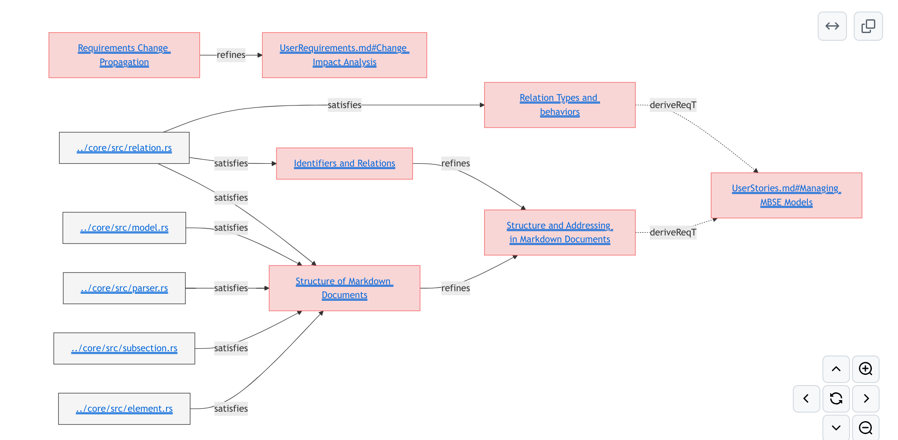
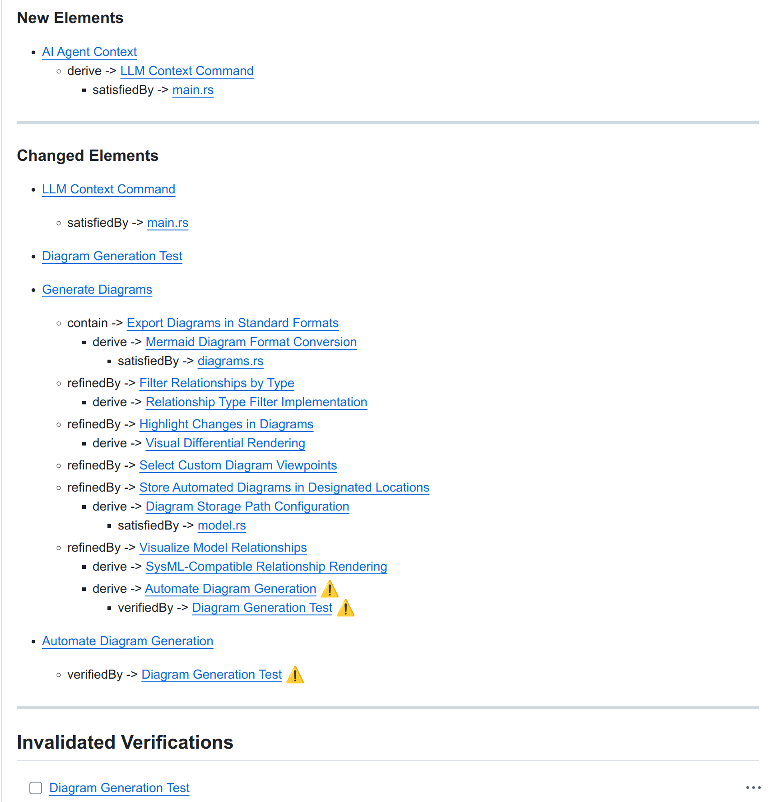

# Reqvire

<div align="center">


**The AI-Native Requirements As A Code framework for Modern Engineering Teams**

[](https://github.com/Reqvire/reqvire/releases)
[](https://opensource.org/licenses/Apache-2.0)
[](https://www.rust-lang.org/)

[📖 **Documentation**](./doc/README.md) • [🚀 **Quick Start**](#get-started) • [💬 **Community**](https://github.com/Reqvire/reqvire/discussions) • [🐛 **Report Bug**](https://github.com/Reqvire/reqvire/issues/new?template=bug_report.yml)

</div>

---

## What is Reqvire?

**Reqvire** is the lightweight Git-native **Requirements As a Code** framework that transforms how modern engineering teams build software. Seamlessly blending system modeling, requirements management, and AI-assisted development. Reqvire empowers teams to deliver better products faster with complete traceability and intelligent automation.

Experience the future of development where your requirements live alongside your code, evolve with your project, and unlock the full potential of AI-powered engineering—from intelligent requirement synthesis to automated code generation—all within your familiar Git workflow.

### **Requirements as Code**
Write requirements in **structured Markdown** that's both human-readable and AI-friendly. Version control everything with Git.

### **AI-First Engineering**
Built from day one for **Large Language Models**. Your requirements become the perfect context for AI-assisted development.

### **Automated Traceability**
Every requirement automatically traces to code, tests, and architecture. Change impact analysis with every commit.

### **Zero Context Switch**
Requirements, code, and documentation in one repository. Review requirement changes like code changes.

---

<sub>Figure 1: Example Diagram (click image to browse requirements)</sub>
[](specifications/SpecificationsRequirements.md#specifications-requirements)

---

## Why Reqvire?

- **Git-Native Workflow** – Requirements, specifications, and traceability artifacts live alongside code with full version control and collaboration via Git.
- **Agile & Human-Friendly** – Uses Markdown-based, semi-structured documents that are both readable and AI friendly.
- **Automation-Ready** – Supports traceability, impact analysis, validation, and documentation generation to reduce manual effort and enforce consistency.
- **Flexible Integration** – Seamlessly connects with GitHub, GitLab, CI/CD pipelines, and AI-driven tools to support continuous delivery and refinement.
- **MBSE-Inspired, Agile-Optimized** – Combines the rigor of Model-Based Systems Engineering with the speed and simplicity demanded by modern software teams.
- **Traceability & Impact Awareness** – Every change, decision, and dependency is trackable—enabling confident change management and system evolution.
- **Built for Developer Workflows** – Links directly to issues, pull requests, and test cases, keeping specifications aligned with real development activity.
- **Visual Modeling & Reporting** – Automatically generates diagrams, traceability matrices, and structured reports using tools like MermaidJS.
- **AI-Augmented Engineering** – Assists with requirement authoring, architecture analysis, validation, and code generation to boost both quality and velocity.

---

<sub>Figure 2: Example Change Impact Report (click image to read specifications)</sub>

[](specifications/SpecificationsRequirements.md#requirements-change-propagation)

---

## AI Compatibility

Reqvire is built to be **AI-friendly from the ground up**. Its use of **structured Markdown** with clearly defined sections, headings, metadata, and conventions makes it ideal for use with modern **Large Language Models (LLMs)** and other AI systems.

Because **requirements** are written in plain text with predictable patterns, AI tools can easily:
- Parse and understand system models
- Analyze relationships between artifacts
- Generate meaningful suggestions or summaries
- Validate consistency and completeness across the model

### Example AI Use Cases

#### 1. Requirement Analysis
LLMs can analyze Markdown-based requirements to identify missing elements, suggest clearer phrasing, propose edge cases, and generate acceptance criteria or verification steps.

#### 2. Architecture Suggestion
By understanding relationships in architecture files, AI can detect inconsistent component relationships, propose modular design improvements, and suggest missing interfaces or dependencies.

#### 3. Traceability & Impact Prediction
AI tools can automatically trace which tests or requirements are impacted by changes, flag affected downstream areas, and summarize model diffs for engineering teams.

#### 4. Test Coverage Assistance
Based on requirements and use cases, AI can recommend missing test scenarios, generate test case outlines, and flag unverified requirements.

#### 5. Code Generation Assistance
AI can leverage structured requirements for:
- **Context-Aware Generation**: Understanding the "why" behind every component through Reqvire's traceability structure
- **Specification-Driven Coding**: Generating code directly tied to specific requirements, reducing guesswork or misinterpretation
- **Verification-Backed Validation**: Referring to defined verifications to ensure implementation meets intended behavior
- **Trace-Based Refactoring**: Assisting in propagating requirement changes through the codebase and related artifacts

#### 6. Report Generation
AI can automatically generate traceability reports, summarize system architecture, and prepare documentation for releases or reviews.

### Human in Control — Always

While Reqvire empowers AI tools to act as smart collaborators, the **human engineer remains the system's captain** — setting direction, making decisions, and approving outcomes.

Reqvire ensures that:
- Every AI-suggested change is traceable and reviewable
- System evolution remains understandable and documented
- AI tooling acts in service of the engineer's intent, not in place of it

---

## Diagram & Traceability Automation

Reqvire automatically parses structured Markdown to generate:

- **Architecture diagrams** (component hierarchies, interfaces, dependencies)
- **Traceability matrices** linking requirements to architecture, verifications, and tests
- **Impact reports** showing what was changed, and what it affects
- **Requirement flow diagrams** visualizing hierarchical relationships and derivations
- **Verification coverage maps** showing which requirements are verified and how
- **Change propagation analysis** identifying all downstream effects of modifications
- **Cross-reference reports** tracking bidirectional relationships between elements
- **Compliance matrices** mapping requirements to standards, regulations, or policies
- **Model summary reports** providing overview statistics and health metrics
- **Interactive HTML documentation** with clickable diagrams and searchable content
- **Mermaid diagram exports** for integration with documentation platforms
- **JSON/CSV exports** for integration with external tools and dashboards

---

## CI/CD Integration

Reqvire is designed for automation. In typical Git-based workflows, you can:

- **Validate Markdown structure** using static checks
- **Auto-generate diagrams** during CI builds or PRs
- **Generate traceability and change impact reports** for stakeholder review
- **Block PRs** if requirements are incomplete or broken
- **Package models** into versioned documentation releases
- **Integrate with GitHub Actions/GitLab CI** for automated validation
- **Generate reports** that become part of your release artifacts

---

## Get Started

### Installation

Run the following command in your terminal:
```
curl -fsSL https://raw.githubusercontent.com/Reqvire/reqvire/main/scripts/install.sh | bash
```

### Quick Start

```bash
# 1. Create your first project
mkdir my-project && cd my-project
git init

# 2. Initialize Reqvire
cat > reqvire.yaml << EOF
paths:
  user_requirements_root_folder: "specifications"
  
  excluded_filename_patterns:
    - "**/TODO.md"

style:
  theme: "default"
  max_width: 1200
  diagram_direction: "LR"
  diagrams_with_blobs: false
EOF

mkdir specifications
mkdir output


# 3. Write your requirements

```

**[Full Documentation](./doc/README.md)** • 📋 **[Use Cases](./specifications/Usecases.md)** • 🎥 **[Demo Video](#)** (coming soon)

### Installation From Source (Linux and macOS)

1. **Install Rust and Cargo**
   - Install Rust using rustup:
     ```bash
     curl -sSf https://sh.rustup.rs | sh
     ```
   - Follow the on-screen prompts to complete the installation
   - Verify the installation:
     ```bash
     rustc --version
     cargo --version
     ```

2. **Clone the reqvire Repository**
   ```bash
   git clone https://github.com/Reqvire/reqvire.git
   cd reqvire
   ```

3. **Build reqvire**
   ```bash
   cargo build --release
   ```

4. **Install the Binary** (optional)
   ```bash
   cargo install --path .
   ```
   This will install the binary to `~/.cargo/bin/reqvire`

#### Using Pre-built Binaries

1. **Download the Latest Release**
   - Visit the [Releases page](https://github.com/Reqvire/reqvire/releases) on GitHub
   - Download the appropriate binary for your platform:
     - Linux: `reqvire-linux-x86_64.tar.gz`
     - macOS (Apple Silicon): `reqvire-darwin-arm64.tar.gz`
     - macOS: `reqvire-darwin-x86_64.tar.gz`

2. **Extract the Binary**
   ```bash
   tar -xzf reqvire-<platform>.tar.gz
   ```

3. **Move to a Directory in Your PATH**
   For most Linux and Intel-based macOS systems:
   ```bash
   sudo mv reqvire /usr/local/bin/
   ````

    For Apple Silicon (M1/M2) macOS:
    ```bash
    sudo mv reqvire /opt/homebrew/bin/
    ```

4. **Verify the Installation**
   ```bash
   reqvire --version
   ```

---

## Contributing

We welcome contributions to **Reqvire**! Whether you're improving the tooling, refining specifications, enhancing test cases, or shaping modeling conventions, your input is highly valued.

### Quick Contribution Links
- **[Report a Bug](https://github.com/Reqvire/reqvire/issues/new?template=bug_report.yml)**
- **[Request a Feature](https://github.com/Reqvire/reqvire/issues/new?template=feature_request.yml)**
- **[Ask a Question](https://github.com/Reqvire/reqvire/discussions)**
- **[Improve Documentation](./doc/CONTRIBUTING.md)**

### Contribution Discipline

To maintain **consistency**, **traceability**, and **quality** in **Reqvire**, we follow a strict **contribution discipline** that ensures the system model, tests, and verifications evolve alongside the code.

### Contribution Workflow

1. **Read the Contribution Guidelines**:
   - Begin by reviewing our [Contribution Guidelines](./doc/CONTRIBUTING.md) for details on processes, coding standards, and expectations.

2. **Fork the Repository**:
   - Create your own copy of the repository by forking it.

3. **Create a Feature Branch**:
   - Work on your changes in a dedicated branch:
     ```bash
     git checkout -b feature/your-feature-name
     ```

4. **Maintain Requirements, Tests, and Verifications**:
   - **Update or create requirements**:
     - For any **new code**, **feature**, or **change** in the codebase, always **create new requirements** or **update existing ones** to reflect those changes.
     - Requirements should be added in the appropriate **User Requirements** or **System Requirements** folders.
     - Requirements must be approved before code can be implemented or existing functionality changed
   - **Update verifications**:
     - For every **new requirement** or **E2E test**, create or update the corresponding **verification cases** in the `specifications/verifications/` directory.
     - Verifications ensure that **requirements** are linked to **tests**, and all features are properly validated.
   - **Add or update end-to-end (E2E) tests**:
     - If your changes introduce **new functionality** or modify existing behavior that is not covered by tests, ensure to **add E2E tests** in the `tests/` directory.
     - Tests must validate the **expected behavior** of your feature or change.
5. **Test Your Changes**:
   - Run **reqvire format** locally to ensure your requirements and verifications are consistent:
     ```bash
     reqvire format
     ```
   - Ensure that your code passes **all tests** and that **no existing functionality breaks**.

6. **Submit a Pull Request (PR)**:
   - Once your changes are ready, submit a pull request with a **clear and detailed description** of what you've implemented or fixed.
   - Include a summary of:
     - **Change impact report if requirements were updated**
     - **New or updated tests**
     - **New or updated verifications**

7. **Collaborate and Iterate**:
   - Engage with maintainers, respond to feedback, and collaborate to refine your PR until it's ready to be merged.

For more details, refer to the [Contributing Guide](./doc/CONTRIBUTING.md).

---

## Credits

**reqvire** is an open-source project created and maintained by [Ilija Ljubicic](https://github.com/ilijaljubicic).

### Special Thanks:

- [Juanjo Andres](https://github.com/juanjoandres)
  For valuable contributions to testing and in shaping reqvire's direction, especially in the early phases of reqvire's development.

- [GrapheneDB](https://www.graphenedb.com/)
  For **partial sponsorship** and for being the **first user** of reqvire. Their support helped shape the tool's early direction.

## What's Next?

### Join Our Growing Community
- ⭐ **Star us** on GitHub to stay updated
- 💬 **Join discussions** to share your use cases
- 📝 **Contribute** to make Reqvire even better
- 🐦 **Follow updates** on our blog and social media

---

## License

Licensed under the [Apache 2.0 License](LICENSE).

---

<div align="center">

**Built with ❤️ by the Reqvire Community**

[🏠 Website](#) • [📖 Docs](./doc/README.md) • [💬 Community](https://github.com/Reqvire/reqvire/discussions) • [🐛 Issues](https://github.com/Reqvire/reqvire/issues)

⭐ **Star us on GitHub** — it helps more than you know!

</div>
