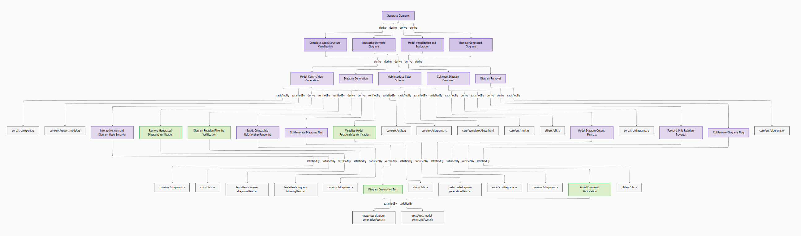

<div align="center">

# Reqvire


**Architecture and Requirements As A Code framework for Modern Engineering Teams**

[](https://github.com/reqvire-org/reqvire/releases)
[](https://opensource.org/licenses/Apache-2.0)
[](https://www.rust-lang.org/)

[📖 **Documentation**](https://www.reqvire.org) • [🔍 **Browse Model**](https://reqvire-org.github.io/reqvire/) • [🚀 **Quick Start**](#get-started) • [👥 **Contributing**](./doc/README.md)

</div>

---

## What is Reqvire?

**Reqvire** is the lightweight Git-native **Architecture** and **Requirements As a Code** framework that transforms how modern engineering teams build software. Seamlessly blending system modeling, requirements management, and AI-assisted development. Reqvire empowers teams to deliver better products faster with complete traceability and intelligent automation.

Experience the future of development where your architecture is expressed as system model with the requirements and specifications that live alongside your code, evolve with your project, and unlock the full potential of AI-powered engineering—from intelligent requirement synthesis to automated code generation—all within your familiar Git workflow.

## 🤖 Now Available for Claude Code

Reqvire is now available as a plugin for Claude Code! Get AI-assisted requirements engineering with specialized skills and commands directly in your Claude Code workflow.

**[Install and learn more →](https://www.reqvire.org/claude_plugin)**

## Key Features

- **Requirements as Code** – Write requirements in structured Markdown that's both human-readable and AI-friendly. Version control everything with Git.
- **AI-First Engineering** – Built from day one for AI. Your requirements become the perfect context and agentic memory.
- **Automated Traceability** – Every requirement automatically traces to code, tests, and architecture with automatic diagram and matrix generation.
- **Zero Context Switch** – Requirements, code, and documentation in one repository. Review requirement changes like code changes.
- **CI/CD Integration** – Validate requirements, auto-generate diagrams, and analyze change impact directly in your pipelines.
- **MBSE Meets Agile** – Combines Model-Based Systems Engineering rigor with the speed and simplicity of modern development.

[Learn more in our documentation →](https://www.reqvire.org/user_guide)

---

<sub>Figure 1: Example Diagram (click to enlarge)</sub>
[](https://raw.githubusercontent.com/Reqvire/reqvire/main/doc/diagram_1.png)

---
## Get Started

### Installation

```bash
curl -fsSL https://raw.githubusercontent.com/reqvire-org/reqvire/main/scripts/install.sh | bash
```

For detailed installation options (from source, pre-built binaries, etc.), see the [Installation Guide](https://www.reqvire.org/user_guide#installation).

### Next Steps

- **[Documentation](https://www.reqvire.org)** - Learn how to use Reqvire
- **[Browse Model](https://reqvire-org.github.io/reqvire/)** - Explore Reqvire's own specifications
- **[Use Cases](./requirements/Usecases.md)** - See Reqvire in action

---

## Contributing

We welcome contributions to **Reqvire**! Whether you're fixing bugs, adding features, improving documentation, or refining specifications, your input is highly valued.

### How to Contribute

1. **Read the [Contributing Guide](./doc/README.md)** - Understand our MBSE-based development workflow
2. **Fork and create a branch** - Work on your changes in a dedicated feature branch
3. **Follow the discipline** - Requirements first, then verifications, tests, and code
4. **Submit a PR** - Include clear description and link related issues

**Important**: Reqvire follows an MBSE workflow. All code changes must be accompanied by corresponding requirements and verifications. See our [Contributor Documentation](./doc/README.md) for details.

### Quick Links

- **[Report a Bug](https://github.com/reqvire-org/reqvire/issues/new?template=bug_report.yml)**
- **[Request a Feature](https://github.com/reqvire-org/reqvire/issues/new?template=feature_request.yml)**
- **[Ask a Question](https://github.com/reqvire-org/reqvire/discussions)**
- **[Contributor Guide](./doc/README.md)**

### Contributor License Agreement

All contributors must accept our [Contributor License Agreement](./doc/CLA.md). The CLA process is automated through GitHub PR comments.

---

## Credits

**reqvire** is an open-source project created and maintained by [Ilija Ljubicic](https://github.com/ilijaljubicic).

### Special Thanks:

- [Juanjo Andres](https://github.com/juanjoandres)
  For valuable contributions to testing and in shaping reqvire's direction, especially in the early phases of reqvire's development.

- [GrapheneDB](https://www.graphenedb.com/)
  For **partial sponsorship** and for being the **first user** of reqvire. Their support helped shape the tool's early direction.

## What's Next?

### Join Our Growing Community
- ⭐ **Star us** on GitHub to stay updated
- 💬 **Join discussions** to share your use cases
- 📝 **Contribute** to make Reqvire even better
- 🐦 **Follow updates** on our blog and social media

---

## License

Licensed under the [Apache 2.0 License](LICENSE).

---

<div align="center">

[🏠 Website](https://www.reqvire.org) • [📖 Docs](https://www.reqvire.org) • [👥 Contributing](./doc/README.md) • [💬 Community](https://github.com/reqvire-org/reqvire/discussions)

⭐ **Star us on GitHub** — it helps more than you know!

</div>
