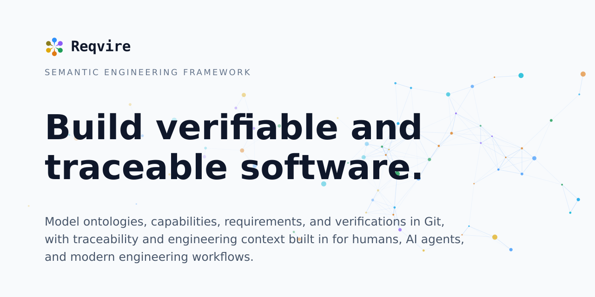

<div align="center">



[](https://github.com/reqvire-org/reqvire/releases)
[](https://opensource.org/licenses/Apache-2.0)
[](https://www.rust-lang.org/)

[📖 **Documentation**](https://www.reqvire.org) • [🔍 **Explore Reqvire**](https://reqvire-org.github.io/reqvire/) • [🚀 **Quick Start**](#quick-start) • [👥 **Contributing**](./doc/README.md)

</div>

# What is Reqvire?

Build verifiable and traceable software.

Reqvire is a Git-native semantic engineering model for ontologies, capabilities,
requirements, contracts, verification plans, evidence, and implementation links.
It keeps engineering intent close to the codebase while making the model
queryable through the CLI, Explorer UI, and MCP tools for AI assistants.

Use Reqvire to:
- define shared ontology vocabulary and semantic contracts
- connect capabilities to implementable requirements
- attach requirement-owned contracts for behavior, state, I/O, sources, and constraints
- plan verification and link concrete evidence
- inspect traceability, coverage, and change impact
- expose structured engineering context to AI workflows without exporting a separate model

## Latest Changes

Reqvire 1.0.0 is the first stable release. It formalizes the current model around ontologies, capabilities, requirements, semantic contracts, verification objectives, and concrete verification evidence.

For older workspaces, preview supported breaking model updates with:

```bash
reqvire migrate
reqvire migrate --fix
```

`reqvire migrate` is dry-run by default; `--fix` applies deterministic migrations such as legacy document header cleanup, verification-objective holder creation, contract relation cleanup, and legacy `Reused Contract Context` heading migration to `Reused Contract Context`.

---

# Quick Start

## Install Reqvire CLI

```bash
curl -fsSL https://raw.githubusercontent.com/reqvire-org/reqvire/main/scripts/install.sh | bash
```

Validate a Reqvire workspace:

```bash
reqvire validate
```

Open the Explorer UI from an installed Reqvire binary:

```bash
reqvire serve
```

Then open the printed local URL, usually:

```text
http://localhost:8080/
```

No-install npm form:

```bash
npx -y @reqvire-org/reqvire@latest --workspace /absolute/path/to/workspace serve
```

The Explorer UI is embedded in release/npm binaries. Source builds are for
development and must build the Explorer bundle before compiling Rust.

---

# AI Assistants and MCP

Reqvire provides assistant integrations for MCP clients, Claude Code, and Codex.
Full assistant setup details live in the documentation:
[https://www.reqvire.org/coding_assistants.html](https://www.reqvire.org/coding_assistants.html)

## MCP Server

Start the MCP server with the Reqvire CLI:

```bash
reqvire --workspace /absolute/path/to/workspace mcp
```

Convenience no-install form using the npm package:

```bash
npx -y @reqvire-org/reqvire@latest --workspace /absolute/path/to/workspace mcp
```

This exposes Reqvire engineering context to AI assistants through the Model Context Protocol (MCP).

Reqvire MCP uses Streamable HTTP. Start the server with the command above, then point MCP clients at:

```text
http://127.0.0.1:8081/mcp
```

Example MCP client configuration:

```json
{
  "mcpServers": {
    "reqvire-myrepository": {
      "type": "http",
      "url": "http://127.0.0.1:8081/mcp"
    }
  }
}
```

The MCP server exposes tools, resources, and prompts. Prompt templates include
regular Reqvire workflows such as model exploration, change planning, and
verification coverage review, plus semantic workflows for vocabulary-driven
SPARQL query construction and verification search.

Enable mutation tools:

```bash
reqvire --workspace /absolute/path/to/workspace mcp --enable-mutations
```

---

## Claude Code

The Reqvire Claude Code plugin is distributed through the reqvire-org plugin
marketplace. See the assistant documentation for current installation commands
and client setup.

---

## Codex Skills

This repository includes installable Codex skill packages for Reqvire model work:

```text
codex-skills/reqvire-syseng
codex-skills/reqvire-ontology-authoring
```

Use `reqvire-syseng` for semantic engineering, capability, requirement,
verification, traceability, migration, and general Reqvire CLI workflows.

Use `reqvire-ontology-authoring` for ontology scoping, OWL/Turtle vocabulary,
semantic contracts, concept references, namespace decisions, and ontology
refactoring.

The skills use the npm package directly:

```bash
npx -y @reqvire-org/reqvire@latest --workspace /absolute/path/to/workspace validate
```

To pin workflows to a specific Reqvire version:

```bash
export REQVIRE_NPX_PACKAGE=@reqvire-org/reqvire@0.13.2
```

Install globally:

```bash
git clone https://github.com/reqvire-org/reqvire.git
cd reqvire
./scripts/install-codex-skill.sh
```

The installer uses `CODEX_HOME` if set, otherwise defaults to:

```text
~/.codex
```

Installed locations:

```text
$CODEX_HOME/skills/reqvire-syseng
$CODEX_HOME/skills/reqvire-ontology-authoring
```

Restart Codex after installing or updating the skill.

See:
[doc/CODEX_SKILLS.md](./doc/CODEX_SKILLS.md)

---

# Reqvire Conceptual Model

Reqvire organizes engineering knowledge into a semantic graph:

```text
Ontology
    ↓
Capabilities
    ↓
Requirements
    ↓
Contracts
    ↓
Verification
```

---

## Ontologies

Ontologies define:
- concepts
- relationships
- domain vocabulary
- semantic meaning

Reqvire supports ontology modeling directly inside the engineering workflow.
Ontology boundary metadata and Turtle are explicit: a top ontology element declares `ontology_base` and `ontology_prefix`, and its Turtle must agree with the generated ontology IRI and term namespace.

Ontology elements can also declare local `External Ontology` source sections for pinned `.ttl` vocabularies. Reqvire uses those sources for validation and can materialize them in ontology exports with `reqvire ontologies --include-external` or MCP `include_external: true`.

RDF, RDFS, OWL, XSD reserved vocabulary and core SHACL shape syntax are built into Reqvire, so standard vocabulary does not need vendored source files.

Ontology itself defines the shared meaning; reusable constraints are authored separately as `semantic-contract` elements.

`semantic-contract` elements are first-class, reusable SHACL profiles that:
- declare constraints in a `#### Shapes` block
- bind to ontology terms through `use` / `usedBy`
- constrain requirements through `constrain` / `constrainedBy`

Requirements may exist without ontology or semantic-contract links. When they do
use semantic contracts, the SHACL profile stays in the ontology plane while the
requirement remains an implementation-facing obligation.

---

## Capabilities

Capabilities represent coherent operational or system abilities that the system provides or supports.

Capabilities:
- act as stable semantic anchors
- bridge ontology and requirements
- remain implementation-independent whenever possible
- support hierarchical decomposition
- provide durable traceability nodes

Examples:
- Real-Time Collaboration
- Autonomous Navigation
- Workflow Orchestration
- Semantic Search
- Distributed Coordination

Capabilities can contain optional semantic context sections such as:
- stakeholder needs
- product features
- operational context
- mission objectives
- regulatory drivers

without turning those concepts into separate graph node types.

---

## Requirements

Requirements define:
- implementable obligations
- system constraints
- measurable guarantees
- operational expectations
- behavioral contracts

Requirements are graph elements that:
- derive from capabilities
- connect to ontology concepts
- are defined by structured engineering contracts
- reuse compatible cross-subgraph contract context through `#### Reused Contract Context`
- can be constrained by ontologically anchored `semantic-contract`s
- trace to implementation artifacts
- link directly to verification evidence

Requirements can evolve from lightweight statements into progressively precise, machine-verifiable engineering semantics through:
- behavioral contracts
- state models
- I/O contracts
- constraints
- detailed specifications
- ontologically anchored semantic-contracts that constrain obligations via explicit ontology-shape references and remain machine-checkable

Examples:
- latency limits
- interoperability guarantees
- safety constraints
- synchronization behavior
- auditability obligations
- semantic consistency requirements

---

## Contracts

Requirements can be defined by structured engineering contracts such as:
- source contracts
- specifications
- behavioral contracts
- state models
- input/output contracts
- constraints

This allows requirements to evolve into precise, machine-readable engineering semantics while remaining Git-native and human-readable.

Semantic contracts are ontology-plane SHACL profiles covered in the Ontologies section; requirement-owned contracts are the implementation-facing detail layer.

Requirements can also reuse compatible requirement-owned contracts from another subgraph through the `#### Reused Contract Context` section. This is a dependency/context mechanism, not ownership: the reused contract remains owned by its defining requirement, while the consuming requirement makes the cross-subgraph obligation explicit.

---

## Verification Plan

Reqvire treats verification as an executable planning model, not a static checklist.

Verification planning in Reqvire follows this flow:

1) Define plan structure with `verification-objective` elements.
   These organize scope, sequencing, and grouping across capabilities and requirements.

2) Derive concrete verification elements from a `verification-objective`, such as:
- `test-verification`
- `formal-proof-verification`
- `analysis-verification`
- `inspection-verification`
- `demonstration-verification`

3) Connect each concrete verification element with `verify` relations to target capabilities or requirements.

4) Add execution evidence in implementation-facing layers using `satisfiedBy` on concrete verifications once execution is complete.

5) Track quality using Reqvire coverage and traceability outputs. Coverage reflects leaf requirements; requirements roll up through existing requirement relations.

This enables:
- verifiable plans instead of ad-hoc test lists
- impact-aware updates when requirements or context changes
- traceability from obligations to evidence
- repeatable, AI-readable validation workflows

---

# Next Steps

- **[Documentation](https://www.reqvire.org)** — Learn how to use Reqvire
- **[Explore Model](https://reqvire-org.github.io/reqvire/)** — Explore Reqvire's own specifications

---

# Contributing

Reproducible bug reports are very welcome.

Code, requirements, specification, ontology, verification, and other model
contributions are closed at the moment.

Reqvire currently uses its own repository as an experiment in AI-driven
engineering with a human in the loop: humans work primarily as architects on
higher-level planes such as ontology, architecture, requirements, and
specification intent, while implementation is generated and improved through
agentic coding workflows. The goal is to produce high-quality code that is not
directly human-authored, while keeping architectural accountability human-led.

For that reason, the most useful external contribution right now is a clear,
reproducible issue: what happened, what should have happened, the exact command
or workflow, the model/files involved, and any root-cause hypothesis.

Suggestions for improving Reqvire's own model, ontology, requirements,
verification structure, or architecture should be opened as
[GitHub Discussions](https://github.com/reqvire-org/reqvire/discussions), not
pull requests. Discussions are the right place to compare modeling options
before maintainers decide whether and how to update the model.

The collaborator program may open selectively over time. If you are interested,
start a GitHub Discussion with your background, the areas where you want to
help, examples of relevant work, and how you would support Reqvire's AI-driven
engineering process. The normal path is sustained useful participation through
reproducible bug reports, model discussions, and design analysis before any
repository access is considered.

---

## How to Contribute

1. **Read the [Contributing Guide](./doc/CONTRIBUTING.md)**
2. **Open or upvote a bug report**
3. **Use Discussions for model-improvement suggestions and design discussion**
4. **Use Discussions to express collaborator interest**
5. **Do not open pull requests for code or model changes**

---

## Quick Links

- **[Report a Bug](https://github.com/reqvire-org/reqvire/issues/new?template=bug_report.yml)**
- **[Request a Feature](https://github.com/reqvire-org/reqvire/issues/new?template=feature_request.yml)**
- **[Suggest a Model Improvement](https://github.com/reqvire-org/reqvire/discussions)**
- **[Express Collaborator Interest](https://github.com/reqvire-org/reqvire/discussions)**
- **[Ask a Question](https://github.com/reqvire-org/reqvire/discussions)**
- **[Contributor Guide](./doc/README.md)**

---

# Credits

**Reqvire** is an open-source project created and maintained by [Ilija Ljubicic](https://github.com/ilijaljubicic).

---

## Special Thanks

### [Juanjo Andres](https://github.com/juanjoandres)

For valuable contributions to testing and in shaping Reqvire's direction, especially during the early phases of development.

---

### [GrapheneDB](https://www.graphenedb.com/)

For partial sponsorship and for being the first user of Reqvire.

Their support helped shape the project's early direction.

---

# What's Next?

## Join the Community

- ⭐ Star the repository
- 💬 Join discussions
- 📝 Contribute ideas and analysis
- 🚀 Explore semantic engineering workflows
- 🤖 Build AI-native engineering systems

---

# License

Licensed under the [Apache 2.0 License](LICENSE).

---
