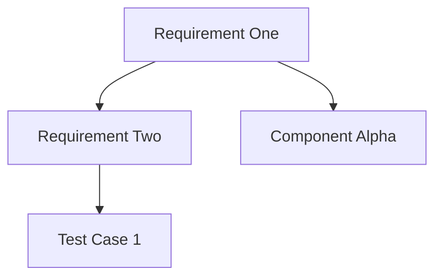

# Reqvire

**Reqvire** is a tool and structured Markdown format for modeling system of interest requirements, architecture, and traceability.

## Core Concepts

### Elements

- An **Element** is the fundamental unit in Reqvire, defined by a `###` header in Markdown
- Elements must have unique names within a document
- Element content includes everything under the header until the next element or end of document
- Example:
  ```markdown
  ### My Requirement
  
  This is the requirement text that describes what the system must do.
  
  #### Relations
  ...
  ```

### Relations

- Relations connect elements to other elements, forming the traceability structure
- Relations are defined in a `#### Relations` subsection within an element using bullet points
- Format: `* relationType: [identifier](link)`
- Each relation must be on a separate line with proper indentation (2 spaces before bullet)
- Example:
  ```markdown
  #### Relations
    * refine: [UserStories.md/Generate Diagrams](UserStories.html#generate-diagrams)
    * verifiedBy: [TestCases.md/TC12](TestCases.html#tc12)
  ```

### Key Relation Types

- **refine**: Further elaborates another element (bidirectional impact)
- **verifiedBy/verify**: Links to verification methods or tests
- **derivedFrom/derive**: Source and derived requirements (upward impact)
- **containedBy/contain**: Parent-child relationships (hierarchical)
- **satisfiedBy/satisfy**: Implementation relationships (implementation artifacts)
- **tracedFrom/trace**: General traceability without specific semantics
- **dependsOn/enable**: Dependency relationships (directional)

### Identifiers

- Identifiers uniquely reference elements across documents
- Format: `path/to/file.md/element name`
- Relative or absolute paths are supported
  - Relative paths: Based on document location (`../UserStories.md/My Element`)
  - Absolute paths: Starting from specifications root (`/Requirements.md/My Element`)
- Element names in identifiers must match the exact element name in the target file
- Links in Markdown vs HTML:
  - Markdown links use file.md format
  - HTML links replace .md with .html and use URL-encoded fragment identifiers

### Subsections

- Elements may contain various subsections marked by `####` headers
- Reserved subsections with defined structures include:
  - **Relations**: Defines connections to other elements
  - **Details**: Extension of requirement text with the same validity
  - **Properties**: Contains structured metadata about the element
  - **Metadata**: Additional standard metadata fields

## Document Structure

A typical Reqvire document follows this structure:

1. **Document title** (`# Title`)
2. **Optional overview sections** (`## Section`)
3. **Elements** (`### Element Name`) containing:
   - Primary content describing the element
   - Relations subsection (`#### Relations`)
   - Optional Details subsection (`#### Details`)
   - Separators between elements (`---`)

Example document structure:
```markdown
# Requirements Document

This document contains system requirements.

## Functional Requirements

### Requirement One

The system shall provide feature X.

#### Relations
  * refine: [UserStories.md/Story One](UserStories.html#story-one)
  * verifiedBy: [TestCases.md/Test Case 1](TestCases.html#test-case-1)

---

### Requirement Two

The system shall implement capability Y.

#### Relations
  * derivedFrom: [Requirements.md/Requirement One](Requirements.html#requirement-one)
  * satisfiedBy: [Components.md/Component Alpha](Components.html#component-alpha)

#### Details

Additional details about Requirement Two implementation.
```

## Reqvire CLI Operations

The Reqvire CLI tool provides various operations including:
- `--lint` : Enable linting to find potential improvements (non-blocking) By default, fixes will be applied automatically.
- `--dry-run`: When linting, only show suggestions without applying fixes.
- `--traces`: Generate traceability information without processing other files Creates matrices and reports showing relationships between elements in the model.
- `--validate`: Validate model.
- `--json`: Output validation results in JSON format Useful for CI/CD pipelines and automation.
- `--generate-diagrams`: Generate mermaid diagrams in markdown files showing requirements relationships. The diagrams will be placed at the top of each requirements document.
- `--model-summary`:  Output model registry and summary, also supports json output.
  - By file path: ` --model-summary  --filter-file="src/**/*Reqs.md"`
  - By name: ` --model-summary  --filter-name=".*safety.*"`
  - By section: ` --model-summary  --filter-section="System*"`
  - By type: ` --model-summary  --filter-type="system-requirement"` (exact match)
  - By content: ` --model-summary  --filter-content="MUST"`
  - Not verified: ` --model-summary  --filter-is-not-verified`
  - Not satisfied: ` --model-summary  --filter-is-not-satisfied`
  - Combined: ` --model-summary --filter-file="src/**/*Reqs.md" --filter-section="System*" --filter-is-not-verified`  
- `--change-impact`:  Change Impact Analysis Report.
- `--git-commit`: Git commit hash to use when comparing models for the change impact report (default: HEAD).


## Change Impact Analysis

Reqvire analyzes how changes propagate through the requirement hierarchy:

- **Downward Propagation**: Changes flow down to child/derived elements
  - Affected by: refine, derive, contain relations
  
- **Implementation Impact**: Changes require implementation updates
  - Affected by: satisfied relations
  
- **Verification Impact**: Changes require revalidation
  - Affected by: verified relations

## Diagrams and Visualization

Reqvire generates Mermaid diagrams to visualize requirement relationships:

- **Node Types**:
  - Red nodes: Requirements
  - Yellow nodes: Satisfying components
  - Green nodes: Verification artifacts
  - Light blue nodes: References to other diagrams/categories
  
- **Edge Types**:
  - Different arrow styles represent relationship types
  - Direction indicates flow of relationship

Example Mermaid diagram structure:


## Validation and Linting

Reqvire performs multiple types of validation and linting:

### Validation (Structural Errors)
- Unique element names within documents
- Proper heading hierarchy
- Valid relation types according to specification
- Valid relation targets (elements and files exist)
- Proper relationship format
- Cross-component dependency validation

### Linting (Formatting Improvements)
- Replacing absolute links with relative links
- Trimming excess whitespace
- Normalizing newlines before subsections
- Inserting separator lines between elements
- Ensuring consistent indentation in relation lists

## Best Practices for Working with Reqvire

1. **Element Naming**:
   - Make names unique and descriptive
   - Use consistent naming patterns
   - Avoid special characters when possible

2. **Relation Management**:
   - Choose relation types based on their semantic meaning
   - Maintain bidirectional relationships where appropriate
   - Ensure targets exist before creating relations

3. **Path Handling**:
   - Use relative paths when possible for portability
   - Verify paths resolve correctly

4. **Formatting Consistency**:
   - Follow standard indentation (2 spaces for bullets)
   - Use consistent separator lines between elements
   - Maintain proper nesting of headers

5. **Change Management**:
   - Consider change propagation when modifying elements
   - Review impacted elements when making changes
   - Update verification artifacts when requirements change

## Tips for LLMs Working with Reqvire

1. When creating requirements, always follow the exact format shown above

2. When modifying requirements, maintain all existing relationships unless explicitly directed to change them

3. When adding relationships, verify that target elements exist and use exact element names

4. When analyzing changes, trace through the relationship network to identify all potentially affected elements

5. When creating new files, follow existing naming and folder conventions

6. Always maintain separation between elements with horizontal rules `---` for better readability

7. Use the correct relation type based on the semantic relationship being established

10. Consider both upstream and downstream impacts when suggesting requirement changes
