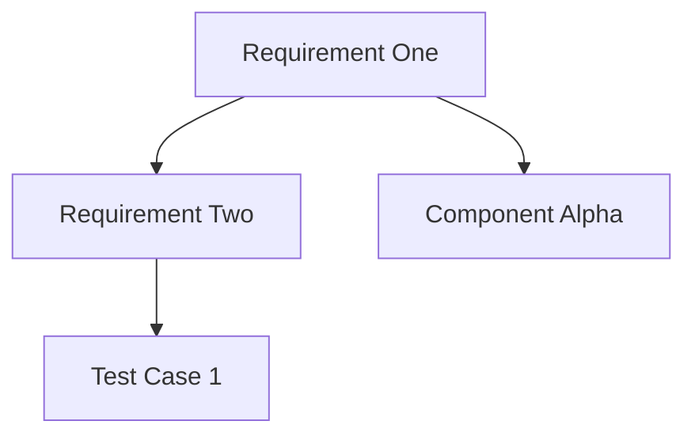

# ReqFlow for LLM Context

This document provides essential context for Large Language Models (LLMs) to understand and work effectively with ReqFlow-based specifications and requirements management.

## What is ReqFlow?

ReqFlow is a methodology and toolset for Model-Based Systems Engineering (MBSE) that uses Markdown as the primary format for requirements documentation and traceability. It enables:

- Requirements management in human-readable Markdown
- Relationship tracing between requirements and other artifacts
- Automated validation of document structure and relationships
- Diagram generation from requirements
- Change impact analysis and propagation
- HTML generation with navigable links
- Traceability matrix generation

## Core Concepts

### Elements

- An **Element** is the fundamental unit in ReqFlow, defined by a `###` header in Markdown
- Elements must have unique names within a document
- Element content includes everything under the header until the next element or end of document
- Example:
  ```markdown
  ### My Requirement
  
  This is the requirement text that describes what the system must do.
  
  #### Relations
  ...
  ```

### Relations

- Relations connect elements to other elements, forming the traceability structure
- Relations are defined in a `#### Relations` subsection within an element using bullet points
- Format: `* relationType: [identifier](link)`
- Each relation must be on a separate line with proper indentation (2 spaces before bullet)
- Example:
  ```markdown
  #### Relations
    * refine: [UserStories.md/Generate Diagrams](UserStories.html#generate-diagrams)
    * verifiedBy: [TestCases.md/TC12](TestCases.html#tc12)
  ```

### Key Relation Types

- **refine**: Further elaborates another element (bidirectional impact)
- **verifiedBy/verify**: Links to verification methods or tests
- **derivedFrom/derive**: Source and derived requirements (upward impact)
- **containedBy/contain**: Parent-child relationships (hierarchical)
- **satisfiedBy/satisfy**: Implementation relationships (implementation artifacts)
- **tracedFrom/trace**: General traceability without specific semantics
- **dependsOn/enable**: Dependency relationships (directional)

### Identifiers

- Identifiers uniquely reference elements across documents
- Format: `path/to/file.md/element name`
- Relative or absolute paths are supported
  - Relative paths: Based on document location (`../UserStories.md/My Element`)
  - Absolute paths: Starting from specifications root (`/Requirements.md/My Element`)
- Element names in identifiers must match the exact element name in the target file
- Links in Markdown vs HTML:
  - Markdown links use file.md format
  - HTML links replace .md with .html and use URL-encoded fragment identifiers

### Subsections

- Elements may contain various subsections marked by `####` headers
- Reserved subsections with defined structures include:
  - **Relations**: Defines connections to other elements
  - **Details**: Extension of requirement text with the same validity
  - **Properties**: Contains structured metadata about the element
  - **Metadata**: Additional standard metadata fields

## Document Structure

A typical ReqFlow document follows this structure:

1. **Document title** (`# Title`)
2. **Optional overview sections** (`## Section`)
3. **Elements** (`### Element Name`) containing:
   - Primary content describing the element
   - Relations subsection (`#### Relations`)
   - Optional Details subsection (`#### Details`)
   - Separators between elements (`---`)

Example document structure:
```markdown
# Requirements Document

This document contains system requirements.

## Functional Requirements

### Requirement One

The system shall provide feature X.

#### Relations
  * refine: [UserStories.md/Story One](UserStories.html#story-one)
  * verifiedBy: [TestCases.md/Test Case 1](TestCases.html#test-case-1)

---

### Requirement Two

The system shall implement capability Y.

#### Relations
  * derivedFrom: [Requirements.md/Requirement One](Requirements.html#requirement-one)
  * satisfiedBy: [Components.md/Component Alpha](Components.html#component-alpha)

#### Details

Additional details about Requirement Two implementation.
```

## ReqFlow CLI Operations

The ReqFlow CLI tool provides various operations:

- **Validation**: Check structure and relationships for errors
  - `cargo run -- validate`
  - `cargo run -- --validate_markdown` (structure only)
  - `cargo run -- --validate_relations` (relations only)
  - `cargo run -- --validate_all` (comprehensive validation)

- **Linting**: Automatically fix formatting issues
  - `cargo run -- --lint` (apply fixes)
  - `cargo run -- --lint --dry-run` (suggest fixes without applying)

- **HTML Generation**: Convert markdown to browsable HTML with linkable elements
  - `cargo run --  --html`

- **Matrix Generation**: Create traceability matrices
  - `cargo run --  --traces`

- **Diagram Generation**: Create Mermaid diagrams from requirements
  - `cargo run -- --generate_diagrams`

- **JSON Output**: Machine-readable validation results
  - `cargo run -- --validate_all --json`

## Configuration Options

ReqFlow supports configuration via YAML files:

```yaml
general:
  html_output: true
  verbose: false
  
paths:
  specifications_folder: "specifications"
  system_requirements_folder: "SystemRequirements"
  design_specifications_folder: "DesignSpecifications"
  
validation:
  validate_markdown: true
  validate_relations: true
  validate_cross_components: true
```

## Change Impact Analysis

ReqFlow analyzes how changes propagate through the requirement hierarchy:

- **Upward Propagation**: Changes flow up to parent/dependent elements
  - Affected by: derivedFrom, containedBy relations
  
- **Downward Propagation**: Changes flow down to child/derived elements
  - Affected by: derive, contain relations
  
- **Bidirectional Impact**: Changes affect both directions
  - Affected by: refine relations
  
- **Implementation Impact**: Changes require implementation updates
  - Affected by: satisfiedBy relations
  
- **Verification Impact**: Changes require revalidation
  - Affected by: verifiedBy relations

## Diagrams and Visualization

ReqFlow generates Mermaid diagrams to visualize requirement relationships:

- **Node Types**:
  - Red nodes: Requirements
  - Yellow nodes: Satisfying components
  - Green nodes: Verification artifacts
  - Light blue nodes: References to other diagrams/categories
  
- **Edge Types**:
  - Different arrow styles represent relationship types
  - Direction indicates flow of relationship

Example Mermaid diagram structure:


## Validation and Linting

ReqFlow performs multiple types of validation and linting:

### Validation (Structural Errors)
- Unique element names within documents
- Proper heading hierarchy
- Valid relation types according to specification
- Valid relation targets (elements and files exist)
- Proper relationship format
- Cross-component dependency validation

### Linting (Formatting Improvements)
- Replacing absolute links with relative links
- Trimming excess whitespace
- Normalizing newlines before subsections
- Inserting separator lines between elements
- Ensuring consistent indentation in relation lists

## Best Practices for Working with ReqFlow

1. **Element Naming**:
   - Make names unique and descriptive
   - Use consistent naming patterns
   - Avoid special characters when possible

2. **Relation Management**:
   - Choose relation types based on their semantic meaning
   - Maintain bidirectional relationships where appropriate
   - Ensure targets exist before creating relations

3. **Path Handling**:
   - Use relative paths when possible for portability
   - Verify paths resolve correctly

4. **Formatting Consistency**:
   - Follow standard indentation (2 spaces for bullets)
   - Use consistent separator lines between elements
   - Maintain proper nesting of headers

5. **Change Management**:
   - Consider change propagation when modifying elements
   - Review impacted elements when making changes
   - Update verification artifacts when requirements change

## Tips for LLMs Working with ReqFlow

1. When creating requirements, always follow the exact format shown above

2. When modifying requirements, maintain all existing relationships unless explicitly directed to change them

3. When adding relationships, verify that target elements exist and use exact element names

4. When analyzing changes, trace through the relationship network to identify all potentially affected elements

5. When creating new files, follow existing naming and folder conventions

6. Always maintain separation between elements with horizontal rules `---` for better readability

7. Use the correct relation type based on the semantic relationship being established

10. Consider both upstream and downstream impacts when suggesting requirement changes
