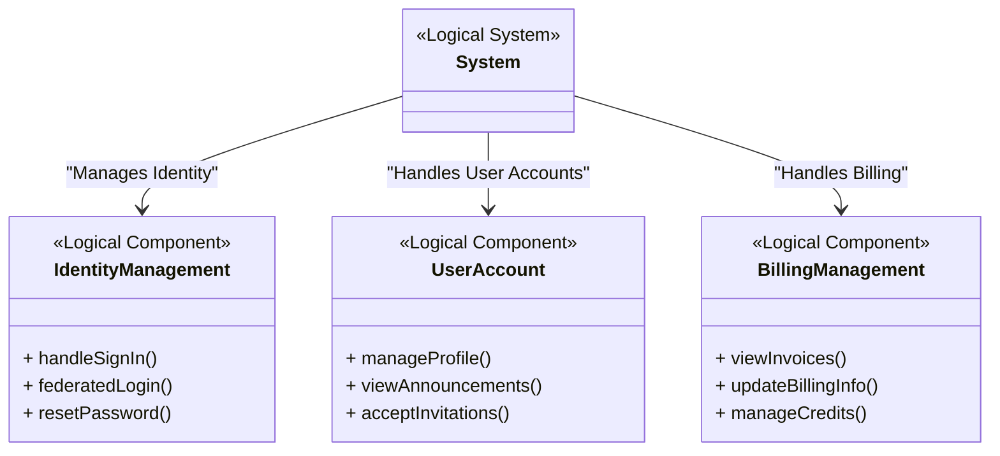
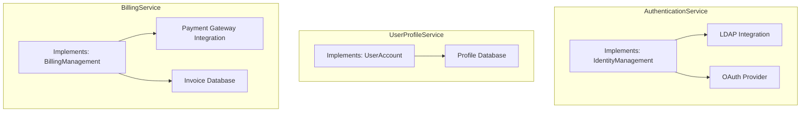

# Architectures in Reqvire

## Conceptual Overview

In Reqvire, system architecture is defined through two primary abstraction layers:

1. **Logical Architecture**: Focuses on *what* the system must do by defining the conceptual organization of functional components and their interactions.
2. **Physical Architecture**: Focuses on *how* the system is implemented by mapping logical components to concrete subsystems, technologies, services, and interfaces.


---

## Logical Architecture

The **Logical Architecture** represents the **high-level structure** of a system, focusing on **logical components** that define the system's **functional organization**. It serves as an **early-stage artifact** that provides a foundation for defining **systems**, **subsystems**, and **services** without prescribing implementation details.

### Purpose of Logical Architecture

The **logical architecture** serves multiple purposes in the **Reqvire methodology**:

- **Foundation for Physical Architecture**: It establishes the conceptual framework for developing the physical architecture.
- **Organizing System Requirements**: System requirements are systematically grouped based on the logical components, later refined into subsystems in the physical architecture.
- **High-Level Conceptualization**: Enables teams to visualize the system's structure and interactions at a high level.
- **Guiding Refinement**: Acts as a flexible draft structure that evolves alongside the physical architecture and system requirements.

---

## Physical Architecture

The **Physical Architecture** translates the **logical components** into **concrete systems, subsystems, and services**. It specifies **how** these elements will be implemented and interact, including:

- Technology choices (e.g., microservices, hardware platforms)
- Deployment configurations
- Interfaces between subsystems
- Implementation constraints

### Purpose of Physical Architecture

The **physical architecture** serves to:

- **Realize logical components** into deployable systems and subsystems.
- Define **interfaces**, **protocols**, and **integration points**.
- Apply **technical constraints** (e.g., performance, security, regulatory compliance).
- Enable **traceability** between requirements, subsystems, and test cases.

---

## Relationship Between Logical and Physical Architectures

The process in **Reqvire** flows as follows:

1. **Logical Architecture**:  
   Defines **what** the system must do by identifying logical components and their relationships.

2. **Physical Architecture**:  
   Refines **how** the system will be implemented by mapping logical components to physical systems, subsystems, services, and technologies.

3. **System Requirements**:  
   Structured based on the **physical architecture**, ensuring each subsystem/component has dedicated requirements for clarity and traceability.

### Example Flow

- **Logical Component**: `IdentityManagement` (handles user authentication processes).
- **Physical Subsystem**: `AuthenticationService` (implements the logical component using specific technologies like OAuth, LDAP, etc.).
- **System Requirement**:  
  - Placed under `specifications/systemRequirements/AuthenticationService/`
  - Example: "The system shall support federated login using OAuth."

This flow ensures alignment between **functional intent (logical)** and **technical realization (physical)**.

---

## Logical Architecture Diagram

The following diagram illustrates an example **Logical Architecture** using a **Mermaid class diagram**, representing logical components and their relationships.



## Physical Architecture Diagram

The following Mermaid graph represents the Physical Architecture, showing how logical components map to concrete subsystems and services.



## Summary of Architectures in Reqvire

| Layer                   | Purpose                                             | Focus                   | Example Component      |
|-------------------------|-----------------------------------------------------|-------------------------|------------------------|
| **Logical Architecture**  | Defines **what** the system must do conceptually     | Functional organization | IdentityManagement     |
| **Physical Architecture** | Defines **how** the system will be built and connected | Technical realization   | AuthenticationService  |

This structured approach ensures:

- **Traceability** from stakeholder needs through logical functions down to physical components and system requirements.
- **Flexibility** to refine the system design from conceptual functions to concrete technical solutions.
- **Scalability** for managing complex systems through a clear separation of **concerns** and **levels of abstraction**.

### Requirements Management and Traceability

The **Physical Architecture** plays a critical role in **requirements organization and traceability**:

- **System requirements** are **broken down** and **grouped** into **subfolders** and **files** aligned with **physical subsystems** and **components**.  
- This modular structure makes the requirements **easier to manage**, **maintain**, and **trace** across the system lifecycle.
- Each subsystem has a **dedicated location** for its related requirements, ensuring clear **separation** and **ownership** of requirements within the model.

For example:
```
specifications/systemRequirements/
 ├── AuthenticationService/ 
 │ ├── REQ_AUTH.md
 │ ├── REQ_PASSWORD.md
 │ └── REQ_OAUTH.md 
 ├── UserProfileService/ 
 │ └── REQ_PROFILE.md 
 └── BillingService/
 ├── REQ_INVOICE.md 
 └── REQ_PAYMENT.md
```


This structure supports:

- **Efficient traceability** from system requirements to **physical components**, **verification cases**, and **test artifacts**.
- **Impact analysis** when changes occur, as subsystems are isolated and traceable.
- **Collaborative development**, with teams working on different subsystems without conflicts.

Logical and physical architectures work together to support the **progressive refinement** process in Reqvire, guiding the system from **abstract functions** to **concrete implementations** while ensuring **alignment with requirements and verification**.


