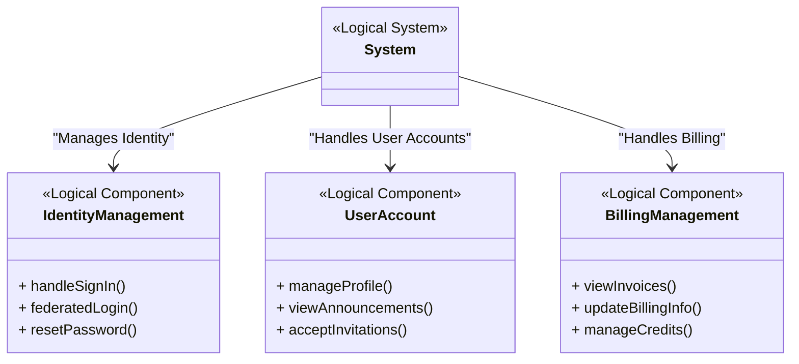

# Logical Architecture

The **Logical Architecture** represents the high-level structure of a system, focusing on **logical components** that define the system's functional organization. It serves as an early-stage artifact in the process, providing a foundation for defining systems, subsystems, and services.

## Purpose of Logical Architecture

The primary purpose of the logical architecture is to define the high-level functional organization of the system, focusing on what the system must do and how its components interact conceptually, without specifying implementation details.

Additionally, in ReqFlow methodology, the logical architecture plays a critical role in:
  * Foundation for Physical Architecture: Logical architecture establishes the conceptual framework for developing the physical architecture, where main systems, subsystems, and their interconnections are defined.
  * Organizing System Requirements: System requirements are systematically grouped into subfolders aligned with the main systems and subsystems outlined in the physical architecture.
  * High-Level Conceptualization: Logical architecture enables teams to visualize and understand the system's structure and interactions at a high level before advancing to detailed physical design and requirements breakdown.
  * Guiding Refinement: Logical architecture provides a flexible draft structure that evolves and aligns with the physical architecture and system requirements during subsequent refinement stages.
  
  
## Relationship to System Requirements

The **logical architecture comes before physical architecture and system requirements definition**, as it establishes the foundation for organizing both. The process flows as follows:

1. **Logical Architecture**: Defines the high-level logical components and their conceptual relationships, focusing on what the system must do.
2. **Physical Architecture**: Translates the logical components into concrete systems, subsystems, and services, specifying how these elements will be implemented and interact.
3. **System Requirements**: Groups and structures requirements into subfolders based on the systems and subsystems defined in the physical architecture, ensuring traceability and organization.

For example:
- A requirement like "The system shall allow users to sign in via email" is initially part of the **logical component** `IdentityManagement`, transitions to the **physical subsystem** `AuthenticationService`, and is subsequently placed in the corresponding system requirements folder.
- "The system shall provide metrics for deployments" begins in the **logical component** `DeploymentInsights`, maps to a **physical subsystem** such as `MetricsService`, and is organized under its related requirements folder.

This structure ensures that the **ReqFlow methodology** remains clear, scalable, and effectively aligns logical and physical organization with system requirements.

## Logical Architecture Diagram

The diagram below represents an example of a **Logical Architecture** for a system using a **Mermaid class diagram**. This type of diagram is commonly used to model **logical components** of a system and their relationships. It provides a clear view of the system's organization and helps in mapping requirements to functional areas.

