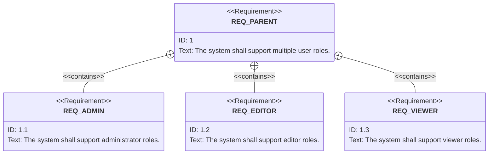
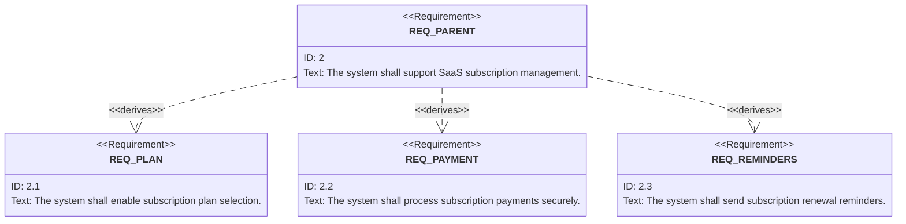
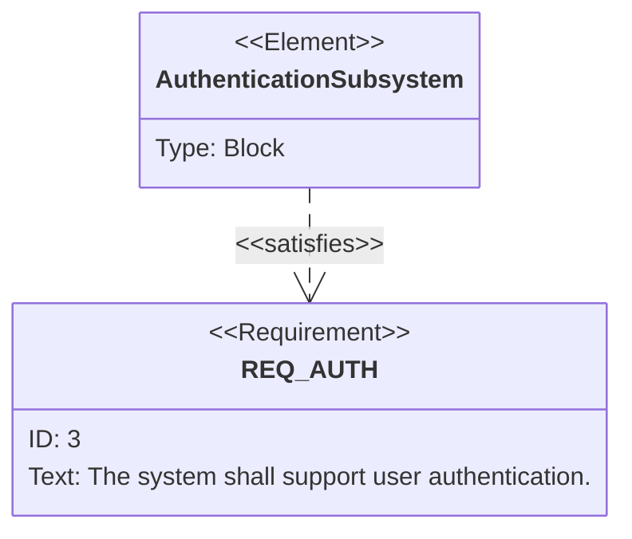

# Relations in Reqvire

In Reqvire, element can be linked using the following types of relationships:
 * contain / containedBy
 * derive / derivedFrom 
 * refine / refinedBy
 * satifsy / satisfiedBy
 * verify / verifiedBy
 * trace 
  

## **refine** and **refinedBy** Relationship

### Purpose
- Clarifies, details, or elaborates another element.
- Typically connects elements across different abstraction levels or different modeling domains.

### Usage Scenarios
- Connecting requirements to other system elements (blocks, activities, use cases) that clarify or provide more detail.
- Refining higher-level abstract requirements with more specific, detailed requirements.

### Allowed Elements
- Source (refining): Typically specific system elements (requirements, blocks, activities, use cases, constraints, etc.).
- Target (refined): Typically abstract or general elements (requirements, use cases, activities, interfaces, blocks).

---

## **derive** and **derivedFrom** Relationship

### Purpose
- Represents logical decomposition or derivation of one requirement into one or more sub-requirements.
- Clearly indicates the logical relationship or decomposition within requirements.

### Usage Scenarios
- Explicit decomposition of high-level requirements into lower-level, detailed, derived requirements.

### Allowed Elements
- Requirements → Requirements only.

### Example
- *High-level Requirement:* "Vehicle shall ensure passenger safety."
  - Derived Requirements:
    - "Vehicle shall include airbags."
    - "Vehicle shall pass crash-test standards."

---

## **contain** and **containedBy Relationship (Requirement Containment)

### Purpose
- Represents a hierarchical structure of requirements.
- Indicates that one requirement directly contains sub-requirements as part of a structured hierarchy.

### Usage Scenarios
- Organizing requirements into structured groups or hierarchies (e.g., parent-child relationships).
- Creating structured requirement trees or requirement specifications.

### Allowed Elements
- Requirements → Requirements (hierarchical containment only).

---

##  Quick Guidelines for Choosing Relationships

- **refine**:  
  Use when adding details or clarity between elements from different abstraction layers or domains (requirements ↔ design).

- **derive**:  
  Use explicitly within requirements to indicate logical decomposition or derivation.

- **contain**:  
  Use for structuring requirements hierarchically, grouping related requirements logically into a tree or structured form.

##  Comparison Table

| Aspect             | **refine** Relationship                               | **derive** Relationship                         | **contain** Relationship                           |
|--------------------|-----------------------------------------------------|---------------------------------------------------|--------------------------------------------------|
| Primary Use    | Clarification, elaboration, detailing               | Logical decomposition of requirements             | Hierarchical organization of requirements        |
| Allowed Elements | Requirements ↔ Requirements or Requirements ↔ Design elements | Requirements ↔ Requirements only                  | Requirements ↔ Requirements only                 |
| Directionality | Specific element → Abstract/general element         | Derived (lower-level) → Source (higher-level) requirement | Parent (higher-level) → Child (lower-level) requirement |
| Modeling Level | Across abstraction or modeling views                | Within requirements logical decomposition         | Within requirement hierarchies (structure)       |

---

## Double Relations (**deriveReqt** and **contain**)

It is valid and common in system modeling for a single requirement to have both **deriveReqt** and **contain** relationships simultaneously.

### Typical scenario:
- **deriveReqt:** Logical decomposition or derivation of requirements.
- **contain:** Structural organization (hierarchical grouping).

### Example:

Requirement A ("Vehicle shall be safe.") 
  ├── deriveReqt → Requirement B ("Vehicle shall pass crash-test standards.")
  └── contain → Requirement C ("Passenger safety requirements.")
  

---
     
  

## Examples

**Contains**:
  * Parent requirement: **"The system shall support multiple user roles."**
  * Sub-requirements (distinct, independent features):
     *  **"The system shall support administrator roles."**
     *  **"The system shall support editor roles."**
     *  **"The system shall support viewer roles."**

**Why `contains` fits**:
- Each sub-requirement is a **separate feature** within the broader scope of user roles.
- Sub-requirements don’t explain **how roles are managed**; they are distinct components grouped under a common parent.
- Implementation of each sub-requirement is **independent** of the others but collectively satisfies the parent.

**Derives**:
  * Parent requirement: **"The system shall support SaaS subscription management."**
  * Derived requirements (specific, actionable details):
     *  **"The system shall enable subscription plan selection."**
     *  **"The system shall process subscription payments securely."**
     *  **"The system shall send subscription renewal reminders."**

**Why `derives` fits**:
- These derived requirements **decompose the parent requirement** into specific, actionable tasks.
- Each derived requirement explains **how the parent goal is achieved**.
- Together, they trace back to the broader objective of subscription management.

---

## **satisfy** and **satisfiedBy**

These complementary relationships show how system design elements (e.g., block, activity, behavior) including code implementations fulfill or realize specific requirements.

### Purpose
- Indicates that a particular design element or code fulfills or meets a given requirement.

### Typical Usage
- Connecting design or implementation elements to the requirements they satisfy.

### Allowed Elements
- Blocks, Activities, Operations, Components, Code → Requirements

### Example:
  - Requirement: "The system shall support user authentication."
  - System Element: `AuthenticationSubsystem`.

---

## **verify** and **verifiedBy**

These two complementary relationships indicate how requirements are verified within a system model.

### Purpose
- Connects a test case (or verification element) to the requirement it verifies.
- Indicates that a requirement is formally checked or proven by the associated verification method.

### Typical Usage
- Linking tests or verification methods directly to requirements.
- Use **verify** when you need to demonstrate or test that a requirement is met.

### Allowed Elements
- Test Cases, Activities, Behaviors → Requirements

---

## **trace**

In the **Reqvire** **trace** relation doesn't have direction and is not used when calculating change impact.
It is **weak** relation used for general documentation and traceability.

### Purpose
- Establishes general-purpose traceability between model elements.
- Indicates that there is some form of dependency or connection without explicitly defining its nature.

### When to Use
- When a specific traceability relationship (e.g., «deriveReqt», «refine») isn't appropriate or clear.
- For linking elements across different abstraction levels or modeling domains to demonstrate general traceability.

### Typical Scenarios
- Tracing requirements back to stakeholders or source documents.
- Linking implementation elements back to originating requirements.
- Connecting design decisions or constraints to external references.

### Allowed Elements
- Any system element ↔ Any system element (very flexible).

---

