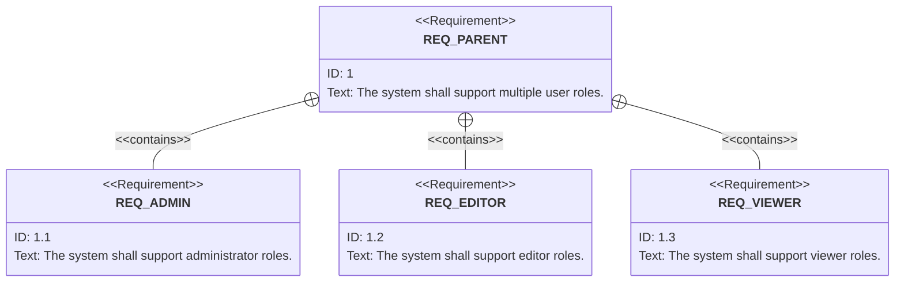
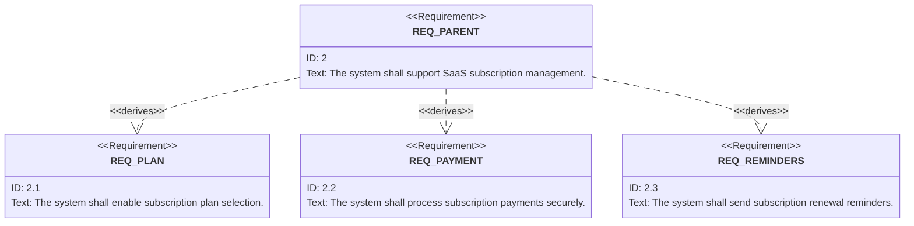
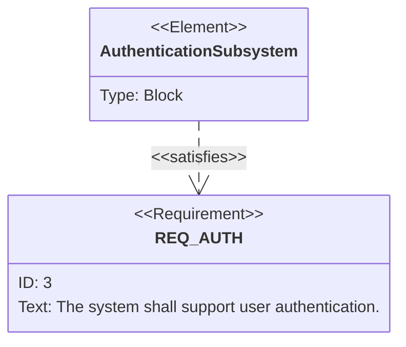

# Relations in ReqFlow

## ReqFlow relations

In ReqFlow, element can be linked using the following types of relationships:
 * containedBy
 * contain
 * derivedFrom 
 * derive
 * refine
 * satisfiedBy
 * satisfy
 * verifiedBy
 * verify 
 * tracedFrom
 * trace 
  

### `contain`, `containedBy`, `derive` and `derivedBy`

Both `contains` and `derives` relationships in SysML allow breaking down requirements, and their implementation may often look similar. However, the difference lies in the **modeling intent**:

- **`contains`**: Groups **independent, standalone sub-requirements** under a broader parent requirement.
- **`derives`**: Decomposes a **high-level requirement** into more specific, actionable requirements to show how the overall goal is achieved.

The choice depends on how you want to structure and trace your requirements:
- Use `contains` for **organizational grouping** eg. per feature sub-requirements.
- Use `derives` for **breaking down abstract requirements into detailed ones**.

While both relationships allow sub-requirements to be implemented independently, the clarity and traceability differ based on the intent of their relationship.

---

#### Practical Comparison

| Aspect                  | **`contains`**                           | **`derives`**                           |
|--------------------------|------------------------------------------|------------------------------------------|
| **Purpose**             | Groups **independent sub-requirements** under a parent. | Decomposes a general requirement into **specific actionable requirements**. |
| **Relationship**         | Parent is **loosely coupled** to sub-requirements. | Derived requirements are **traceable back** to the high-level requirement. |
| **Dependency**           | No logical or contextual dependency implied. | Derived requirements **logically flow** from the parent. |
| **Use Case**             | Organizing independent tasks or features. | Breaking down a general goal into specific system requirements. |
| **Example**              | User management grouped under a parent. | SaaS subscription management decomposed into feature requirements. |

---

#### Examples

**Contains**:
  * Parent requirement: **"The system shall support multiple user roles."**
  * Sub-requirements (distinct, independent features):
     *  **"The system shall support administrator roles."**
     *  **"The system shall support editor roles."**
     *  **"The system shall support viewer roles."**

**Why `contains` fits**:
- Each sub-requirement is a **separate feature** within the broader scope of user roles.
- Sub-requirements don’t explain **how roles are managed**; they are distinct components grouped under a common parent.
- Implementation of each sub-requirement is **independent** of the others but collectively satisfies the parent.

**Derives**:
  * Parent requirement: **"The system shall support SaaS subscription management."**
  * Derived requirements (specific, actionable details):
     *  **"The system shall enable subscription plan selection."**
     *  **"The system shall process subscription payments securely."**
     *  **"The system shall send subscription renewal reminders."**

**Why `derives` fits**:
- These derived requirements **decompose the parent requirement** into specific, actionable tasks.
- Each derived requirement explains **how the parent goal is achieved**.
- Together, they trace back to the broader objective of subscription management.

---

#### `refine` and `refinedBy`

- **Definition**: A `refines` relationship is a dependency that describes how a model element (e.g., use case, activity diagram, or text) provides further detail or context to a requirement. It can also describe how a text-based requirement refines a model element, elaborating on its purpose or functionality.

- **Purpose**: Use `refines` to illustrate how a requirement or model element is **further detailed or elaborated** to make its meaning clearer. This is particularly useful for connecting requirements to modeling elements (like use cases, activity diagrams, or blocks) that provide implementation or operational context.

- **When to Use**: Use `refines` when:
  1. A requirement needs to be connected to a more detailed model element (e.g., activity diagrams, use cases, or state machines).
  2. A text-based requirement refines a higher-level model element to provide more descriptive detail.

In the reqflow, refine is used to refine user-stories with user-requirements.

#### `satisfy` and `satisfiedBy`
- **Definition**: Links a system element (e.g., block, behavior) to the requirement it fulfills.
- **When to Use**: Use `satisfies` to trace the implementation of requirements to specific system elements.
- **Example**: 
  - Requirement: "The system shall support user authentication."
  - System Element: `AuthenticationSubsystem`.

---

### `verify` and `verifiedBy`
- **Definition**: Links a test case to a requirement to indicate how the requirement is validated.
- **When to Use**: Use `verifies` when you need to demonstrate or test that a requirement is met.
- **Example**: A test case "Verify system can encrypt files with AES-256" verifies "The system shall encrypt all uploaded files."

---

### `trace` and `tracedFrom`
- **Definition**: Establishes a generic relationship between requirements or between a requirement and a system element, without specifying a strict semantic meaning.
- **When to Use**: Use `traces` when a relationship exists but doesn’t fit into the specific categories like `satisfies`, `verifies`, or `refines`.
- **Example**: "The system shall notify users of critical events" traces to the behavior "CriticalNotificationBehavior."

---

### Summary Table of Relationships

| Relationship Type | Definition                                                                 | Typical Use Case                                               |
|--------------------|---------------------------------------------------------------------------|----------------------------------------------------------------|
| **`contains`**     | Groups independent, parallel sub-requirements under a broader requirement. | Organizational grouping of standalone features or tasks.       |
| **`copies`**       | Creates a duplicate of an existing requirement for reuse while maintaining traceability to the original. | Reusing and adapting requirements in different contexts.       |
| **`derives`**      | Breaks down a high-level requirement into more specific ones.             | Decomposing general goals into specific system requirements.   |
| **`satisfies`**    | Links a system element (block, behavior) to the requirement it fulfills.  | Tracing system design elements to requirements.                |
| **`verifies`**     | Links a test case to a requirement for validation.                        | Testing or demonstrating that a requirement is met.            |
| **`refines`**      | Describes how a model element or set of elements further elaborates a requirement. | Detailing a requirement through use cases, activity diagrams, or textual elaboration. |
| **`traces`**       | Establishes a general dependency or relationship.                        | Linking requirements to elements without strict semantics.      |

---

### Conclusion

SysML requirement relationships provide powerful ways to structure, trace, and validate system requirements. Choosing the correct relationship depends on the intent and context:

- Use **`contains`** for grouping independent tasks.
- Use **`copies`** for reusing requirements in different contexts while maintaining traceability.
- Use **`derives`** for breaking down high-level requirements into specific actionable components.
- Use **`satisfies`** to ensure system components fulfill requirements.
- Use **`verifies`** to connect test cases for validation of requirements.
- Use **`refines`** for providing additional detail or elaboration to a requirement.
- Use **`traces`** for general-purpose, flexible dependency mapping.

Each relationship ensures traceability and alignment between requirements and system design, facilitating clear communication and robust development processes.

