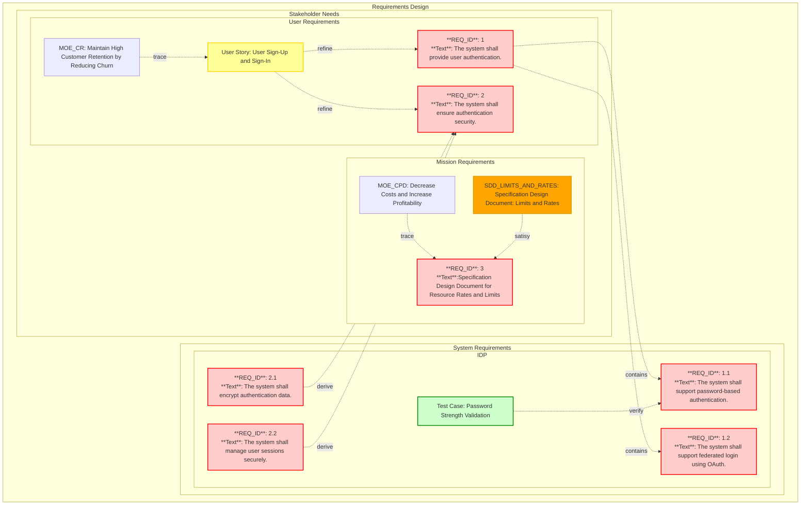

# Requirements in ReqFlow

## What Are Requirements?

In ReqFlow, a requirement represents a stakeholder's need, system capability, or constraint that the system must fulfill. 
Requirements define **what the system must do** (functional requirements) and **how well it must perform** (non-functional requirements), serving as the foundation for system design, development, and verification.

ReqFlow mandates a specific format for organizing and presenting requirements to ensure consistency across the project. 
However, it does not impose a specific syntax for expressing the content of requirements, offering flexibility to tailor expressions based on the project's needs and the team's preferences. 
Structured syntaxes like **EARS (Easy Approach to Requirements Syntax)** are encouraged to improve clarity and consistency, but their use is not required.


### Requirements document format
 
Requirements are organizied within requirements documents: a markdow document with specific format.


```
# Document title

## Grouping Title: User Interface Requirements

### Requirement Title: Login Functionality

The system shall provide a login interface that allows users to authenticate using a username and password.

Relations:
 * tracedFrom: specifications/UserStories.md/authentication
 * verifiedBy: specifications/tests.md/testLogin

## Other group

### Requirement 4

### Requirement 5

### Requirement 6

```


#### Document title

The **Document Title** provides a descriptive name for the entire requirements document. 
It identifies the scope or subject of the requirements contained within and is placed at the very beginning of the file.

Expected Markdown:

```
# <Descriptive Title for the Document>
```

#### Grouping Title

Each group of related requirements is introduced by a **Grouping Title**. This serves as a high-level categorization or organizational header for the set of requirements.

Expected Markdown:

```
## <Descriptive Title for the Group>

```


### Requirements format


Example:
```
### Login Functionality

The system shall provide a login interface that allows users to authenticate using a username and password.

Relations:
 * tracedFrom: specifications/UserStories.md/Authentication


### Password Recovery

The system shall provide a mechanism for users to recover forgotten passwords.

#### Relations
 * tracedFrom: specifications/UserStories.md/Security
 * verifiedBy: specifications/tests.md/testPasswordRecovery
  
#### Metadata
 * Priority: High
 * Criticality: Moderate

#### Some other additional context

```

#### Requirement Name

Each individual requirement is identified with a Requirement Name. This provides a brief and descriptive name for the requirement and must be unique within a document itself.

```
### <Requirement name>

```

#### Requirement Text

The Requirement Text describes the specific functionality, constraint, or need in detail. This is the main body of the requirement.

#### Relations

The **"#### Relations** section documents links between this requirement and other system elements,requirements, specifications, or validation methods.

Relations used for the requirements are a subset of relations that exist in the **Reqflow**:
 * containedBy
 * derivedFrom 
 * refine
 * satisfiedBy 
 * verifiedBy
 * tracedFrom

Relations foher the requirements are mandatory: at least 1 relation to parent object must exist.
The parent objects depends on type of requirement and is explained further down.


#### Metadata

The **#### Metadata** section is optional and provides additional key-value pair details about the requirement. These details help define attributes or characteristics of the requirement.

The keys and values are expressed as bullet points. Accepted key-value pairs include:

- **Priority**: High | Medium | Low
- **Criticality**: High | Moderate | Low


Expected markdow:
```
#### Metadata
  * Key: value
```

#### Additional context section

The Additional Context Section is optional and allows for any supplementary information that might be relevant or useful for understanding the requirement. It provides flexibility to include detailed explanations, clarifications, or related information.

Content in this section should follow valid Markdown syntax and cannot include headers with a level less than ####.
Expected markdow:
```
#### <A section title>

Markdown valid text which cannot have headers less than ####

```

## Structure of Requirements in ReqFlow

The diagram below demonstrates how requirements, their relationships, and hierarchical structures are organized within the **ReqFlow methodology**. 
It showcases the connection between stakeholder needs, user requirements, mission requirements, system requirements, and their links to test cases, specification documents, and other system elements.



Requirements in ReqFlow are divided into three main categories:
 * User Requirements
 * Mission Requirements
 * System Requirements

  
### User Requirements

User requirements describe the specific functionalities and capabilities that users expect from the system. They focus on *what* the system must provide to fulfill user needs, improve user experience, and achieve business objectives as well as capture specific needs of end-users.

User requirements are directly related to user story: they **refine** user story.

User requirements are expected to be documented in the `specifications/UserRequirement.md` file.


### Mission Requirements

Mission and System Requirements are expected to be documented in the `specifications/MissionRequirement.md` file.

These requirements represent the high-level mission / enterprise  objectives, needs and measures of effectiveness, that a system must fulfill to align with the strategic goals of the organization and satisfy stakeholder expectations. 

**mission requirement** must at least have a relation to specific MOE.

User requirements are expected to be documented in the `specifications/MissionRequirement.md` file.

### System  Requirements

System requirements define the detailed technical and functional specifications that the system must meet to fulfill the user and mission requirements. They describe *how* the system will achieve the objectives set by the user and mission requirements.

System requirements are structured to map to specific subsystems or components of the overall system. Each subsystem or component has its own dedicated folder in the `specifications/systemRequirements` directory, ensuring modularity and clarity.

#### Organization and File Structure

1. **Location**: System requirements must be documented in the `specifications/systemRequirements` directory.
2. **Subfolders**: Each subsystem has its own subfolder. Subfolders can nest further into sub-subsystems as needed.
3. **File Name**: Each folder must contain exactly one `Requirements.md` file, where the requirements for that specific subsystem are documented.

#### Traceability

System requirements must trace back to their respective user and mission requirements to ensure alignment with user needs and mission objectives. Traceability is documented through relations like `tracedFrom` and `verifiedBy`.

#### Expected File Structure for System Requirements

- **Top-Level File**: 
  - `specifications/systemRequirements/Requirements.md` – Contains high-level system requirements that apply to the overall system.
- **Subsystem Folders**:
  - `specifications/systemRequirements/<subsystem>/Requirements.md`
  - Subsystems can have nested folders, as shown:
    ```plaintext
    specifications/systemRequirements/subsystem/subsubsystem/Requirements.md
    specifications/systemRequirements/othersubsystem/subsystem/Requirements.md
    ```

Each `Requirements.md` file contains requirements specific to the subsystem or component it corresponds to.


## Requirements Diagrams

mermaid's requirementsDiagram which is based on SysML is not that flexible in regards to picking colors and making links for docRefs thefor ReqFlow uses graphTD diagram for the time being.


