# Usecases

Use cases define the key interactions between the system and its users, external systems, or other stakeholders. They describe the functional behavior of the system at a high level, capturing how the system fulfills its intended purpose and aligns with stakeholder expectations. By detailing these interactions, use cases serve as a bridge between stakeholder needs and the technical design, ensuring the system is built to achieve its goals.

Use cases not only provide a structured way to capture functional requirements but also:
- **Clarify the System's Scope**: By identifying actors, their goals, and the system's boundaries, use cases ensure clarity about what the system will and will not do.
- **Facilitate Communication**: They act as a common language between technical teams, stakeholders, and users.
- **Support Traceability**: Use cases link high-level requirements to specific system functionalities, helping ensure all requirements are addressed during development.
- **Guide Validation and Verification**: They provide a baseline for testing, ensuring that implemented functionalities align with stakeholder goals.

By systematically capturing these interactions, use cases ensure the system is designed and implemented with a clear understanding of its intended functions and external interactions.

## Usecase diagrams

In SysML (Systems Modeling Language), use case diagrams are a type of behavioral diagram used to describe the high-level functional interactions between a system and its external environment. 
They help in identifying the goals of the system and the functionality it must support.

### Purpose in SysML
1. **Define functional boundaries**: Helps to understand and clarify the scope of the system.
2. **Capture stakeholder needs**: Represents what the system must achieve from an external perspective.

To be able to render usecase diargams in mermaid as part of markdown document, mermaid's flowchart diagram is used instead.

## SOI (System of interest) product usecase example diagram

The user stories and user requirements are derived from the use case diagram provided below:

```mermaid
flowchart LR
    subgraph "GDB Product usecase diagram"
        status((Use status service))
        signup((Sign Up))
        signin((Sign In))

        emailSignup[Sign Up via Email]
        validateEmail[Validate Email]
        federatedLogin[Sign Up via Federated Login]
        federatedLoginSignIn[Sign In via Federated Login]
        emailLogin[Sign In via Email]
        PasswordReset[Reset Password]

        manageAccount((Manage account))
        
        editPassword[Edit Password]
        deleteAccount[Delete Account]
                
        viewAnnouncements[View Announcements]
        
        accessDocumentation((Access Documentation))
        
        manageAccountSecurity((Manage security))         
        manageMFA[Add/Remove MFA]
         
    end


                
    user[User👤]

    %% Relationships for Sign Up and Sign In
    user --> status
    user --> signup
    user --> signin
    signup -. include .-> emailSignup
    emailSignup -. with .-> validateEmail
    signup -. include .-> federatedLogin
    signin -. include .-> federatedLoginSignIn
    signin -. include .-> emailLogin
    emailLogin -. with .-> PasswordReset



```

