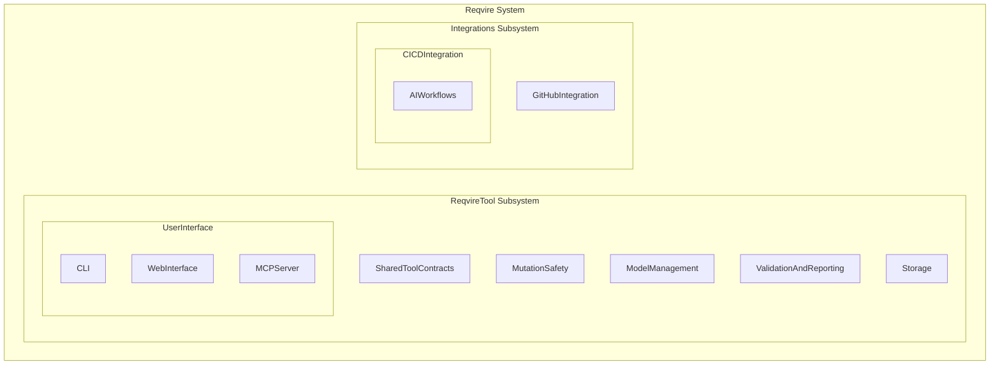
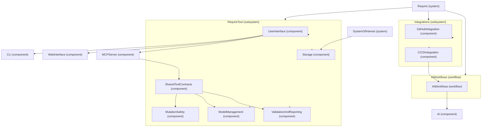
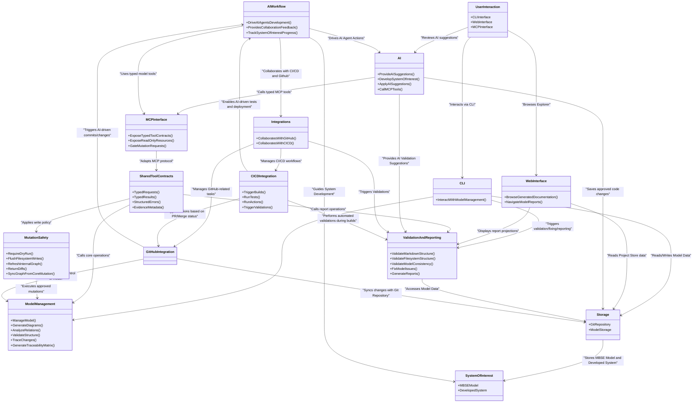

# Architecture

## Physical Architecture

### Physical Architecture Block

The Physical Architecture represents the concrete systems, services, and components that implement the functionality of Reqvire. It defines the deployment-level structure of the tool, detailing how various components interact and are organized in the actual system.



**Logical to Physical Architecture Mapping:**



#### Metadata
  * type: block
---

## Logical Architecture

### Logical Architecture Block

The Logical Architecture for Reqvire defines the high-level functional organization of the tool, focusing on the main components that deliver its core functionalities. This architecture serves as the foundation for further contract into physical architecture and implementation-facing requirements.



#### Metadata
  * type: block
---

## Implementation Architecture

# Elements

### CRUD Operations Delegation Pattern

The system shall implement all CRUD operations using a delegation pattern where the CRUD layer orchestrates user requests and delegates validation and execution to the graph_registry layer.

#### Details
All element manipulation operations follow this architectural pattern:
- CRUD layer (crud.rs) provides public API and orchestration logic
- Graph registry layer (graph_registry.rs) performs validation and executes changes
- CRUD delegates to graph_registry for all model mutations

**Operation Delegation Mapping:**
```
crud.add_element() → graph_registry.add_element_to_file()
crud.remove_element() → graph_registry.remove_element_with_cleanup()
crud.move_element() → graph_registry.move_element_comprehensive()
crud.merge_elements() → graph_registry.merge_elements()
crud.rename_element() → graph_registry.rename_element()
crud.link() → graph_registry.add_element_relation_full()
crud.unlink() → graph_registry.remove_element_relation_full()
```

**Benefits:**
- Clear separation of concerns between orchestration and execution
- Centralized validation logic in graph_registry
- Consistent error handling across all operations
- Maintainable and testable code structure

#### Metadata
  * type: requirement

#### Relations
  * satisfiedBy: [crud.rs](core/src/crud.rs)
  * satisfiedBy: [graph_registry.rs](core/src/graph_registry.rs)
---

### Shared Utility Functions

The system shall extract common code patterns into shared utility functions to reduce duplication and maintain consistency across modules.

#### Details
When a code pattern appears in multiple locations, it should be extracted into a shared utility function. This follows the DRY (Don't Repeat Yourself) principle and improves maintainability.

**Example: Parent Directory Extraction**
The `get_parent_dir()` utility function provides consistent parent directory extraction logic used across crud.rs and graph_registry.rs, replacing 6 instances of duplicate code.

```rust
pub fn get_parent_dir(file_path: &str) -> PathBuf {
    PathBuf::from(file_path).parent()
        .map(|p| p.to_path_buf())
        .unwrap_or_default()
}
```

**Benefits:**
- Eliminates code duplication
- Single source of truth for common operations
- Easier to test and maintain
- Consistent behavior across modules

#### Metadata
  * type: requirement

#### Relations
  * satisfiedBy: [utils.rs](core/src/utils.rs)
  * satisfiedBy: [crud.rs](core/src/crud.rs)
  * satisfiedBy: [graph_registry.rs](core/src/graph_registry.rs)
---
