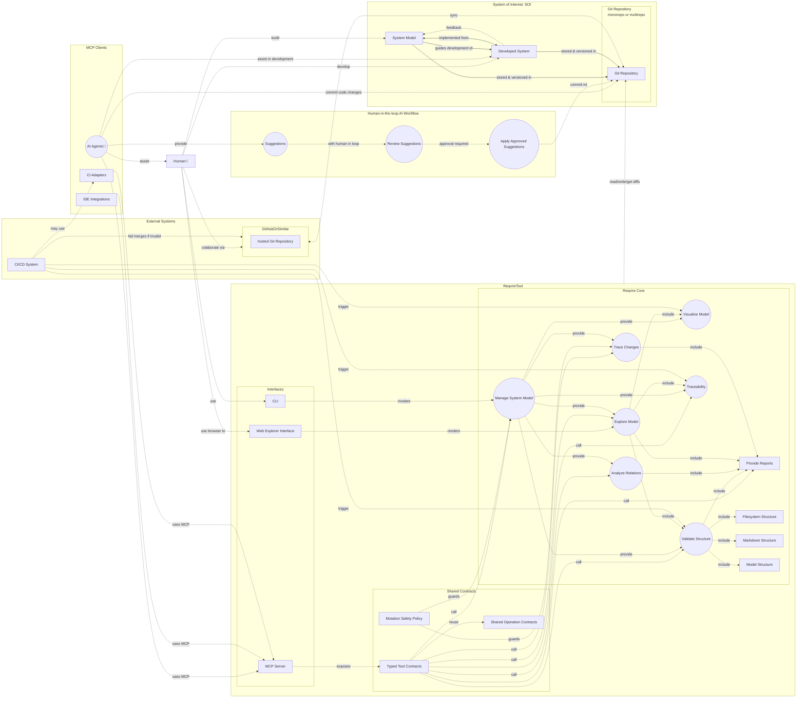

# Usecase diagrams

## Reqvire Tool Use Case Diagram

The use case diagram below highlights the primary interactions between the Reqvire Tool and its users, including developers, CI/CD systems, and other actors. It captures the high-level functional behaviors that the tool is designed to support, from managing requirements to automating tasks in Git workflows.

## Explanation of Reqvire Use Case Diagram

This diagram outlines the core interactions, components, and workflows of the **Reqvire** tool in the context of managing Model-Based Systems Engineering (System) models, integrating with external systems, and supporting development activities for a System of Interest (SOI).

### Reqvire Tool

The central component of the system, which facilitates various MBSE-related activities. It exposes human and machine interfaces over the same Reqvire core behavior.

#### Tool Interfaces

Tool interfaces are **CLI** (Command Line Interface), **Web Explorer Interface**, and **MCP** (Model Context Protocol) server:
- CLI: Human and automation interface for direct command execution.
- Web Explorer Interface: Human browsing and visualization interface for served model content, diagrams, reports, and traces.
- MCP Server: Typed external interface for AI agents, IDE integrations, CI adapters, and other tools.

The MCP server exposes shared tool contracts, including semantic model evidence through `reqvire.semantic.ontologies`. It does not expose arbitrary shell execution, does not own model state, and does not bypass Reqvire core semantics.

#### Core Capabilities

- Manage System Model: Core functionality to handle the System model lifecycle including refactoring model.
- Visualize Model: Allows users to generate visual representations of the system model.
 - Diagrams can be generated for different viewpoints.
- Analyze Relations: Provides tools to analyze relationships and dependencies within the model.
- Provide Reports: Generates structured reports based on the model and analysis.
- Validate Structure: Ensures the model adheres to defined structure and guidelines:
  - Markdown Structure: Verifies the correctness of the Markdown-based requirements and documentation.
  - Filesystem Structure: Validates the file organization in the project.
  - Model Structure: Validates model relations and semantics.
- Trace Changes
  - Tracks changes and display/visualize affected elements based on relations.
  - Tracks elements such as verifications, that may require invalidation based on detected changes.
  - This ensures that all affected components are flagged for review or updates.

### System of Interest (SOI)

The **System of Interest (SOI)** refers to the system which is under development.
 
It represents the primary focus of development and includes the following key elements:
- System Model: The structured system specification and design documentation created and managed using Reqvire. 
  - This model defines the requirements, architecture, and traceability necessary for developing the SOI.
- Developed System: The actual physical or implemented system that is built based on the System model. 
  - It embodies the realization of the design and requirements outlined in the model.
- Git Repository: A storage and version control system where the System model and the developed system artifacts are stored.
  - This repository can be organized as a monorepo or a multirepo, depending on the project’s needs.

The SOI serves as the centerpiece of the Reqvire framework, linking specifications, development, and validation processes.

### External Systems

Reqvire interacts with external systems to enhance functionality and support development workflows.

### CI/CD System

Reqvire provides tools and capabilities that CI/CD systems, such as GitHub Actions, can utilize to perform tasks like validation and diagram generation. 

These tools enable CI/CD systems to enforce PR merge rules, validate changes, and automate feedback processes, such as adding comments, creating issues, or reporting statuses. 

### GitHub or Similar

Reqvire integrates into existing agile and collaborative workflows by providing the necessary tools and scripts to support version control, change management, and traceability. 
These capabilities allow teams to seamlessly integrate System practices into their development processes, enabling effective collaboration through GitHub or similar platforms.

### Human Interaction

Humans interact with Reqvire tools to manage, define, and validate System models, as well as to collaborate effectively within development workflows:
- Via CLI: Users leverage Reqvire’s CLI to perform tasks such as managing models, generating diagrams, analyzing relationships, and validating structures.
- Via Browser: Users browse the served Explorer UI for model content, diagrams, reports, and traces.
- Via AI Agents: Users interact with AI agents to receive intelligent suggestions, review potential improvements, and approve changes, ensuring a human-in-the-loop approach.
  - AI agents use Reqvire’s MCP server for typed model evidence, reports, and approved mutation requests.
- Collaboration: Users integrate Reqvire into agile workflows by collaborating through GitHub or similar platforms to manage repositories, track changes, and maintain traceability.

## Workflows and Interactions

### Reqvire Interactions with Git

- Reqvire uses Git repositories to store and version the System model and developed system.
- Changes, including approved AI suggestions, are prepared and committed through standard Git workflows.
- MCP clients receive workspace revision and dirty-state metadata so they can reason about model freshness.
- MCP mutations must go through Reqvire core and preserve the shared filesystem persistence guarantees.

### CI/CD Integration
- CI/CD pipelines trigger validation, diagram generation, and traceability processes.
- Invalid merges are prevented based on the validation results.

### SOI Feedback Loop
- The Developed System provides feedback to the Syetem Model, enabling iterative refinement.
- The model guides the development of the system, ensuring alignment with requirements and objectives.

## Key Relationships

- The System Model is implemented into the Developed System, which is stored and versioned in the Git repository.
- The Reqvire CLI provides tools to validate, analyze, and generate artifacts from the model.
- The Reqvire MCP server provides typed, protocol-level access to the same Reqvire core operations for AI agents, IDE integrations, and CI adapters.
- AI Agents assist humans by generating suggestions and preparing approved changes through MCP-backed evidence and mutation contracts.
- The **CI/CD System** ensures quality control and prevents invalid changes from being merged.
