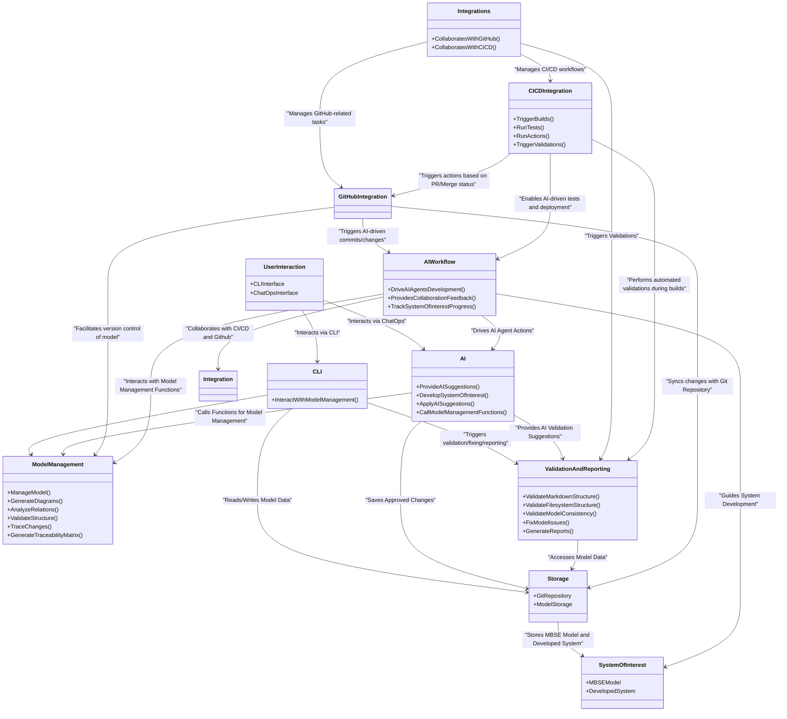
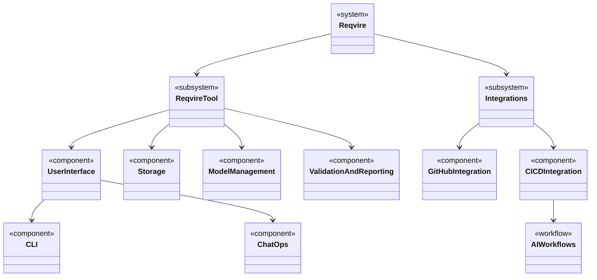
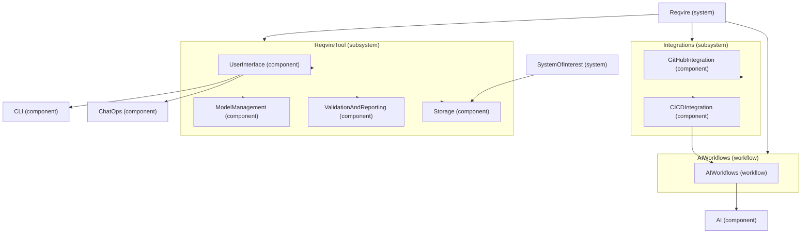

# Architecture

This document defines the Reqvire architecture using proper Reqvire specification elements with SysML types. The architecture is organized into Logical Architecture (functional organization) and Physical Architecture (deployment-level structure).

## Logical Architecture

The Logical Architecture for Reqvire defines the high-level functional organization of the tool, focusing on the main components that deliver its core functionalities. This architecture serves as the foundation for further refinement into physical architecture and system requirements.

### User Interaction

Facilitates interaction through CLI and ChatOps interfaces. Users can perform tasks like managing models, validating structures, and interacting with AI agents.

#### Metadata
  * type: block

---

### CLI Component

The CLI interface serves as the user-facing component that allows users to initiate interactions with the system. It delegates tasks related to model management to the ModelManagement component.

#### Metadata
  * type: block

---

### Model Management Component

This is the core logical component responsible for performing the core functionalities associated with managing the MBSE model. Functions include managing models, generating diagrams, analyzing relations, validating structures, and creating traceability matrices. AI can also call these functions to interact with the model.

#### Metadata
  * type: block

---

### AI Component

Provides AI-powered suggestions for model refinement and validation. In addition to suggesting changes, the AI component can also take a part in developing the SystemOfInterest. It can also apply suggested changes and call ModelManagement functions to interact with the model directly.

#### Metadata
  * type: block

---

### AI Workflow Component

The AIWorkflow component orchestrates AI-driven workflows that guide AI agents in the development process of the SystemOfInterest. It provides feedback on collaboration between AI and CI/CD workflows and tracks the progress of the system's development.

#### Metadata
  * type: block

---

### Validation and Reporting Component

This component performs checks on model consistency, structure (both filesystem and markdown), and generates reports summarizing relationships, changes, and dependencies within the MBSE model. Also this component can be tasked with fixing some of consistency issues it finds.

#### Metadata
  * type: block

---

### Storage Component

Handles the storage of the MBSE model and developed system in Git repositories. The Storage component serves as the central data source for the rest of the system, ensuring versioning and proper management of model-related data.

#### Metadata
  * type: block

---

### Integrations Component

The Integrations facilitates agile workflows while adhering to MBSE methodologies. It manages the connection between the Reqvire tool and external systems like GitHub and CI/CD tools, ensuring that both human users and AI agents collaborate seamlessly in an agile environment. This component facilitates smooth synchronization of model changes, pull request management, automated testing, and deployment, all while ensuring the integrity of the MBSE model and system development process.

#### Metadata
  * type: block

---

### GitHub Integration Component

Manages tasks related to GitHub, including monitoring pull requests (PRs), syncing branches, and handling commits. Triggers AI-driven activities, such as committing changes or updating the model.

#### Metadata
  * type: block

---

### CI/CD Integration Component

The CICDIntegration component manages the CI/CD pipeline, including triggering builds, running automated tests, and validating changes. It also integrates with the AIWorkflow to enable AI-driven tests and deployments.

#### Metadata
  * type: block

---

### System Of Interest

The SystemOfInterest represents the real-world system being developed, which is guided by the MBSE model. It includes the MBSEModel and the DevelopedSystem, both of which are versioned and stored in Git repositories.

#### Metadata
  * type: system

---

## Physical Architecture

The Physical Architecture represents the concrete systems, services, and components that implement the functionality of Reqvire. It defines the deployment-level structure of the tool, detailing how various components interact.

Logical to physical architecture mapping:

### Reqvire System

The Reqvire system is the top-level system that encompasses all subsystems and components. It provides the complete solution for AI-driven requirements management and MBSE modeling.

#### Metadata
  * type: system

---

### Reqvire Tool Subsystem

The ReqvireTool subsystem contains the core functionality of Reqvire, including user interfaces, model management, validation, and storage capabilities.

#### Metadata
  * type: subsystem

---

### User Interface Physical

The UserInterface component provides the physical implementation of user interaction capabilities through CLI and ChatOps interfaces.

#### Metadata
  * type: component

---

### CLI Physical

The CLI component is the physical command-line interface implementation that allows users to execute Reqvire commands and interact with the system.

#### Metadata
  * type: component

---

### ChatOps Physical

The ChatOps component provides the physical implementation of conversational AI interfaces for interacting with Reqvire through natural language.

#### Metadata
  * type: component

---

### Model Management Physical

The ModelManagement component is the physical implementation of model processing, diagram generation, relation analysis, and traceability features.

#### Metadata
  * type: component

---

### Validation and Reporting Physical

The ValidationAndReporting component is the physical implementation of model validation, consistency checking, and report generation capabilities.

#### Metadata
  * type: component

---

### Storage Physical

The Storage component provides the physical implementation of Git-based storage for MBSE models and developed systems.

#### Metadata
  * type: component

---

### Integrations Subsystem

The Integrations subsystem manages connections to external systems like GitHub and CI/CD platforms, facilitating agile workflows within MBSE methodology.

#### Metadata
  * type: subsystem

---

### GitHub Integration Physical

The GitHubIntegration component provides the physical implementation of GitHub integration, including PR management, branch syncing, and commit handling.

#### Metadata
  * type: component

---

### CI/CD Integration Physical

The CICDIntegration component provides the physical implementation of CI/CD pipeline integration, including build triggers, automated testing, and deployment management.

#### Metadata
  * type: component

---

### AI Workflows Physical

The AIWorkflows component provides the physical implementation of AI-driven development workflows that orchestrate AI agents in system development.

#### Metadata
  * type: workflow

---
