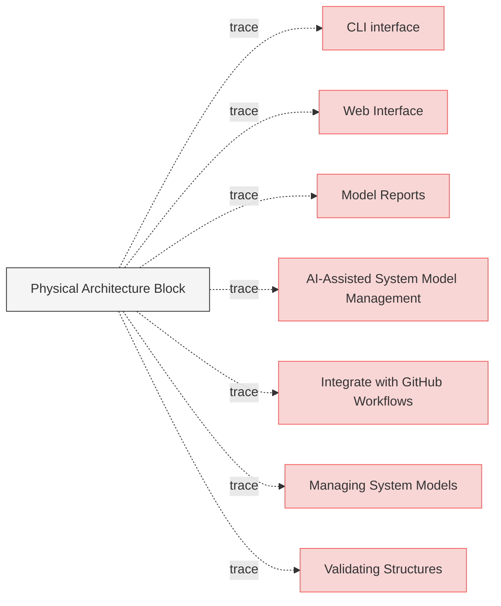
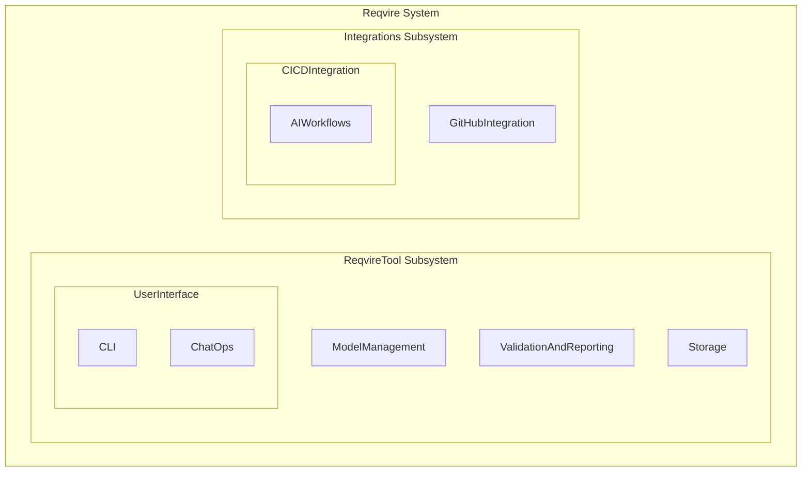
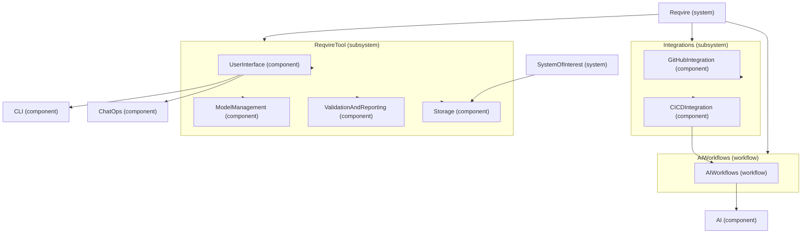
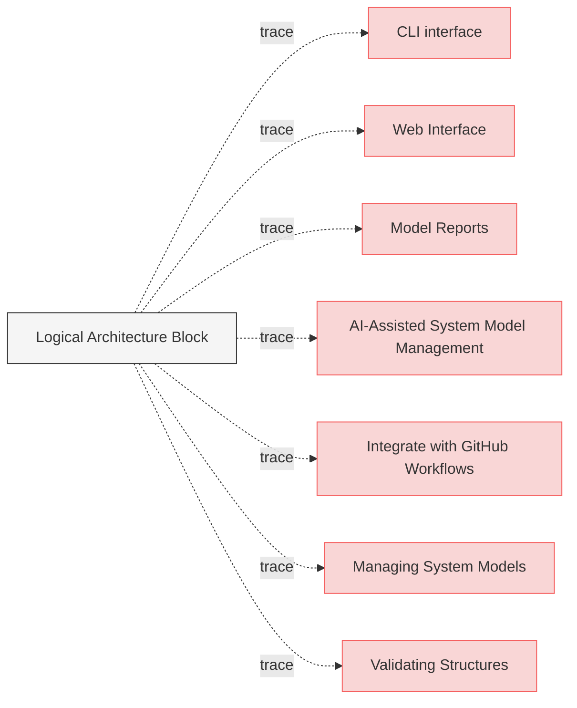
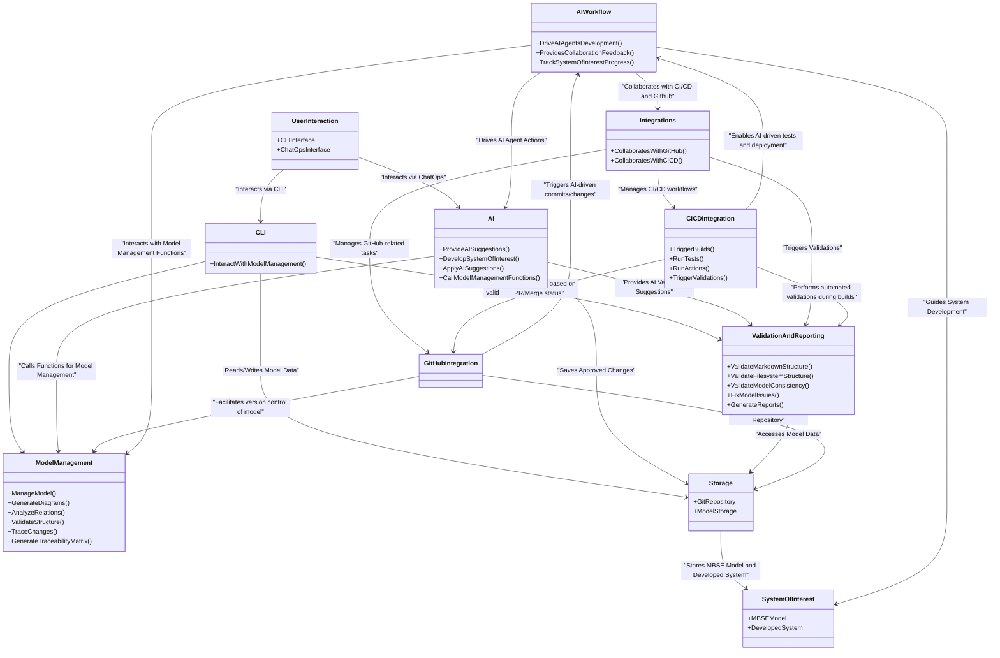

# Architecture

## Physical Architecture

```mermaid
graph LR;
  %% REQVIRE-AUTOGENERATED-DIAGRAM
  %% Graph styling
  classDef userRequirement fill:#f9d6d6,stroke:#f55f5f,stroke-width:1px;
  classDef systemRequirement fill:#fce4e4,stroke:#e68a8a,stroke-width:1px;
  classDef verification fill:#d6f9d6,stroke:#5fd75f,stroke-width:1px;
  classDef default fill:#f5f5f5,stroke:#333333,stroke-width:1px;

  4f5b8eb9100ba32a["Physical Architecture Block"];
  class 4f5b8eb9100ba32a default;
  click 4f5b8eb9100ba32a "Architecture.md#physical-architecture-block";
  1ac3e4fc194fd9d["CLI interface"];
  class 1ac3e4fc194fd9d userRequirement;
  click 1ac3e4fc194fd9d "Interfaces/Interfaces.md#cli-interface";
  4f5b8eb9100ba32a -.->|trace| 1ac3e4fc194fd9d;
  adfe41db00d52285["Web Interface"];
  class adfe41db00d52285 userRequirement;
  click adfe41db00d52285 "Interfaces/Interfaces.md#web-interface";
  4f5b8eb9100ba32a -.->|trace| adfe41db00d52285;
  1c6b7180f4e0214a["Model Reports"];
  class 1c6b7180f4e0214a userRequirement;
  click 1c6b7180f4e0214a "System/Reporting.md#model-reports";
  4f5b8eb9100ba32a -.->|trace| 1c6b7180f4e0214a;
  8c8c33ba0c6249d1["AI-Assisted System Model Management"];
  class 8c8c33ba0c6249d1 userRequirement;
  click 8c8c33ba0c6249d1 "UserStories.md#ai-assisted-system-model-management";
  4f5b8eb9100ba32a -.->|trace| 8c8c33ba0c6249d1;
  98eaeddc27f99e11["Integrate with GitHub Workflows"];
  class 98eaeddc27f99e11 userRequirement;
  click 98eaeddc27f99e11 "UserStories.md#integrate-with-github-workflows";
  4f5b8eb9100ba32a -.->|trace| 98eaeddc27f99e11;
  3f1b65e8cdc9ec2["Managing System Models"];
  class 3f1b65e8cdc9ec2 userRequirement;
  click 3f1b65e8cdc9ec2 "UserStories.md#managing-system-models";
  4f5b8eb9100ba32a -.->|trace| 3f1b65e8cdc9ec2;
  113748a94885138d["Validating Structures"];
  class 113748a94885138d userRequirement;
  click 113748a94885138d "UserStories.md#validating-structures";
  4f5b8eb9100ba32a -.->|trace| 113748a94885138d;
```
### Physical Architecture Block

The Physical Architecture represents the concrete systems, services, and components that implement the functionality of Reqvire. It defines the deployment-level structure of the tool, detailing how various components interact and are organized in the actual system.

```mermaid
graph TD
    subgraph Reqvire["Reqvire System"]
        subgraph ReqvireTool["ReqvireTool Subsystem"]
            subgraph UserInterface["UserInterface"]
                CLI["CLI"]
                ChatOps["ChatOps"]
            end
            ModelManagement["ModelManagement"]
            ValidationAndReporting["ValidationAndReporting"]
            Storage["Storage"]
        end

        subgraph Integrations["Integrations Subsystem"]
            GitHubIntegration["GitHubIntegration"]
            subgraph CICDIntegration["CICDIntegration"]
                AIWorkflows["AIWorkflows"]
            end
        end
    end
```

**Logical to Physical Architecture Mapping:**

```mermaid
graph TD
    %% Root System
    Reqvire["Reqvire (system)"]

    %% Subsystems under Reqvire
    subgraph ReqvireTool["ReqvireTool (subsystem)"]
        UserInterface["UserInterface (component)"]
        ModelManagement["ModelManagement (component)"]
        ValidationAndReporting["ValidationAndReporting (component)"]
        Storage["Storage (component)"]
    end

    subgraph Integrations["Integrations (subsystem)"]
        GitHubIntegration["GitHubIntegration (component)"]
        CICDIntegration["CICDIntegration (component)"]
    end

    subgraph AIWorkflows["AIWorkflows (workflow)"]
        AIWorkflowsComponent["AIWorkflows (workflow)"]
    end

    %% AI component (added based on the logical architecture)
    AI["AI (component)"]

    %% Systems
    SystemOfInterest["SystemOfInterest (system)"]

    %% Hierarchical Structure
    Reqvire --> ReqvireTool
    Reqvire --> Integrations
    Reqvire --> AIWorkflows

    ReqvireTool --> UserInterface
    ReqvireTool --> ModelManagement
    ReqvireTool --> ValidationAndReporting
    ReqvireTool --> Storage

    UserInterface --> CLI["CLI (component)"]
    UserInterface --> ChatOps["ChatOps (component)"]

    Integrations --> GitHubIntegration
    Integrations --> CICDIntegration

    CICDIntegration --> AIWorkflowsComponent

    AIWorkflowsComponent --> AI

    SystemOfInterest --> Storage
```

#### Metadata
  * type: block

#### Relations
  * trace: [Managing System Models](UserStories.md#managing-system-models)
  * trace: [AI-Assisted System Model Management](UserStories.md#ai-assisted-system-model-management)
  * trace: [CLI interface](Interfaces/Interfaces.md#cli-interface)
  * trace: [Web Interface](Interfaces/Interfaces.md#web-interface)
  * trace: [Integrate with GitHub Workflows](UserStories.md#integrate-with-github-workflows)
  * trace: [Model Reports](System/Reporting.md#model-reports)
  * trace: [Validating Structures](UserStories.md#validating-structures)
---

## Logical Architecture

```mermaid
graph LR;
  %% REQVIRE-AUTOGENERATED-DIAGRAM
  %% Graph styling
  classDef userRequirement fill:#f9d6d6,stroke:#f55f5f,stroke-width:1px;
  classDef systemRequirement fill:#fce4e4,stroke:#e68a8a,stroke-width:1px;
  classDef verification fill:#d6f9d6,stroke:#5fd75f,stroke-width:1px;
  classDef default fill:#f5f5f5,stroke:#333333,stroke-width:1px;

  7d9bdb39c1c646f3["Logical Architecture Block"];
  class 7d9bdb39c1c646f3 default;
  click 7d9bdb39c1c646f3 "Architecture.md#logical-architecture-block";
  1ac3e4fc194fd9d["CLI interface"];
  class 1ac3e4fc194fd9d userRequirement;
  click 1ac3e4fc194fd9d "Interfaces/Interfaces.md#cli-interface";
  7d9bdb39c1c646f3 -.->|trace| 1ac3e4fc194fd9d;
  adfe41db00d52285["Web Interface"];
  class adfe41db00d52285 userRequirement;
  click adfe41db00d52285 "Interfaces/Interfaces.md#web-interface";
  7d9bdb39c1c646f3 -.->|trace| adfe41db00d52285;
  1c6b7180f4e0214a["Model Reports"];
  class 1c6b7180f4e0214a userRequirement;
  click 1c6b7180f4e0214a "System/Reporting.md#model-reports";
  7d9bdb39c1c646f3 -.->|trace| 1c6b7180f4e0214a;
  8c8c33ba0c6249d1["AI-Assisted System Model Management"];
  class 8c8c33ba0c6249d1 userRequirement;
  click 8c8c33ba0c6249d1 "UserStories.md#ai-assisted-system-model-management";
  7d9bdb39c1c646f3 -.->|trace| 8c8c33ba0c6249d1;
  98eaeddc27f99e11["Integrate with GitHub Workflows"];
  class 98eaeddc27f99e11 userRequirement;
  click 98eaeddc27f99e11 "UserStories.md#integrate-with-github-workflows";
  7d9bdb39c1c646f3 -.->|trace| 98eaeddc27f99e11;
  3f1b65e8cdc9ec2["Managing System Models"];
  class 3f1b65e8cdc9ec2 userRequirement;
  click 3f1b65e8cdc9ec2 "UserStories.md#managing-system-models";
  7d9bdb39c1c646f3 -.->|trace| 3f1b65e8cdc9ec2;
  113748a94885138d["Validating Structures"];
  class 113748a94885138d userRequirement;
  click 113748a94885138d "UserStories.md#validating-structures";
  7d9bdb39c1c646f3 -.->|trace| 113748a94885138d;
```
### Logical Architecture Block

The Logical Architecture for Reqvire defines the high-level functional organization of the tool, focusing on the main components that deliver its core functionalities. This architecture serves as the foundation for further refinement into physical architecture and system requirements.

```mermaid
classDiagram
    class UserInteraction {
        +CLIInterface
        +ChatOpsInterface
    }
    class CLI {
        +InteractWithModelManagement()
    }
    class ModelManagement {
        +ManageModel()
        +GenerateDiagrams()
        +AnalyzeRelations()
        +ValidateStructure()
        +TraceChanges()
        +GenerateTraceabilityMatrix()
    }
    class AI {
        +ProvideAISuggestions()
        +DevelopSystemOfInterest()
        +ApplyAISuggestions()
        +CallModelManagementFunctions()
    }
    class AIWorkflow {
        +DriveAIAgentsDevelopment()
        +ProvidesCollaborationFeedback()
        +TrackSystemOfInterestProgress()
    }
    class ValidationAndReporting {
        +ValidateMarkdownStructure()
        +ValidateFilesystemStructure()
        +ValidateModelConsistency()
        +FixModelIssues()
        +GenerateReports()
    }
    class Storage {
        +GitRepository
        +ModelStorage
    }
    class Integrations {
        +CollaboratesWithGitHub()
        +CollaboratesWithCICD()
    }

    class GitHubIntegration {
    }

    class CICDIntegration {
        +TriggerBuilds()
        +RunTests()
        +RunActions()
        +TriggerValidations()
    }

    class SystemOfInterest {
        +MBSEModel
        +DevelopedSystem
    }

    %% Relationships
    UserInteraction --> CLI : "Interacts via CLI"
    UserInteraction --> AI : "Interacts via ChatOps"
    CLI --> ModelManagement
    AI --> ModelManagement : "Calls Functions for Model Management"
    CLI --> ValidationAndReporting : "Triggers validation/fixing/reporting"
    CLI --> Storage : "Reads/Writes Model Data"
    AI --> ValidationAndReporting : "Provides AI Validation Suggestions"
    AI --> Storage : "Saves Approved Changes"
    ValidationAndReporting --> Storage : "Accesses Model Data"
    Integrations --> ValidationAndReporting : "Triggers Validations"
    Integrations --> GitHubIntegration : "Manages GitHub-related tasks"
    Integrations --> CICDIntegration : "Manages CI/CD workflows"
    GitHubIntegration --> Storage : "Syncs changes with Git Repository"
    GitHubIntegration --> AIWorkflow : "Triggers AI-driven commits/changes"
    GitHubIntegration --> ModelManagement : "Facilitates version control of model"
    CICDIntegration --> GitHubIntegration : "Triggers actions based on PR/Merge status"
    CICDIntegration --> ValidationAndReporting : "Performs automated validations during builds"
    CICDIntegration --> AIWorkflow : "Enables AI-driven tests and deployment"

    Storage --> SystemOfInterest : "Stores MBSE Model and Developed System"

    %% New AIWorkflow Component Relationships
    AIWorkflow --> Integrations : "Collaborates with CI/CD and Github"
    AIWorkflow --> SystemOfInterest : "Guides System Development"
    AIWorkflow --> AI : "Drives AI Agent Actions"
    AIWorkflow --> ModelManagement : "Interacts with Model Management Functions"
```

#### Metadata
  * type: block

#### Relations
  * trace: [Managing System Models](UserStories.md#managing-system-models)
  * trace: [AI-Assisted System Model Management](UserStories.md#ai-assisted-system-model-management)
  * trace: [CLI interface](Interfaces/Interfaces.md#cli-interface)
  * trace: [Web Interface](Interfaces/Interfaces.md#web-interface)
  * trace: [Integrate with GitHub Workflows](UserStories.md#integrate-with-github-workflows)
  * trace: [Model Reports](System/Reporting.md#model-reports)
  * trace: [Validating Structures](UserStories.md#validating-structures)
---