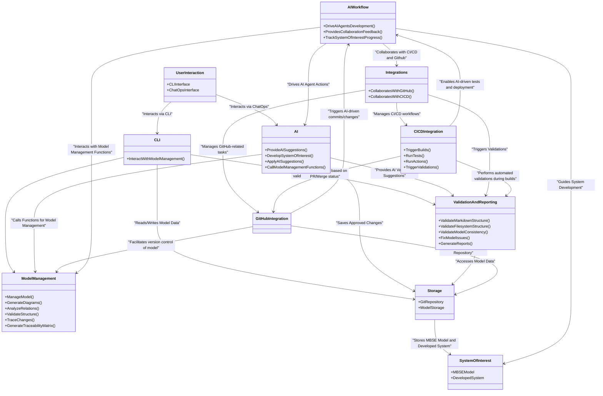

# Architecture

This document defines the Reqvire architecture using block diagrams that show the logical and physical structure of the system.

## Logical Architecture

### Logical Architecture Block

The Logical Architecture for Reqvire defines the high-level functional organization of the tool, focusing on the main components that deliver its core functionalities. This architecture serves as the foundation for further refinement into physical architecture and system requirements.

#### Metadata
  * type: block

#### Relations
  * trace: [Managing MBSE Models](UserStories.md#managing-mbse-models)
  * trace: [AI-Assisted MBSE Model Management](UserStories.md#ai-assisted-mbse-model-management)
  * trace: [CLI interface](UserRequirements.md#cli-interface)
  * trace: [Browse Model via Web Interface](UserRequirements.md#browse-model-via-web-interface)
  * trace: [Integrate with GitHub Workflows](UserStories.md#integrate-with-github-workflows)
  * trace: [Model Reports](UserRequirements.md#model-reports)
  * trace: [Validating Structures](UserStories.md#validating-structures)
---

## Physical Architecture

### Physical Architecture Block

The Physical Architecture represents the concrete systems, services, and components that implement the functionality of Reqvire. It defines the deployment-level structure of the tool, detailing how various components interact and are organized in the actual system.

**Logical to Physical Architecture Mapping:**

#### Metadata
  * type: block

#### Relations
  * trace: [Managing MBSE Models](UserStories.md#managing-mbse-models)
  * trace: [AI-Assisted MBSE Model Management](UserStories.md#ai-assisted-mbse-model-management)
  * trace: [CLI interface](UserRequirements.md#cli-interface)
  * trace: [Browse Model via Web Interface](UserRequirements.md#browse-model-via-web-interface)
  * trace: [Integrate with GitHub Workflows](UserStories.md#integrate-with-github-workflows)
  * trace: [Model Reports](UserRequirements.md#model-reports)
  * trace: [Validating Structures](UserStories.md#validating-structures)
---