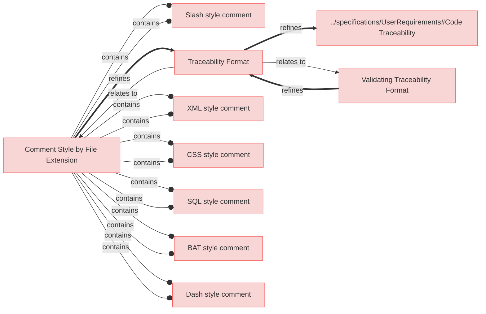

# Requirements

## Code Traecability

TODO:
 * this comes with config param to define code folder locations (special case as external foders but for the code) 
 * this is not implemented yet !!

---

### Traceability Format

When parsing a source file for traceability, the system shall identify and extract all `[reqflow::...]` markers along with their associated requirement element identifiers.

#### Details

Syntax used for `[reqflow::...]` markers:

```
[reqflow::<relation_type>: <element identifier>] START [reqflow::<relation_type>: <element idetifier>] END

```

Where:
- `<relation_type>` specifies the type of relation with only 2 types allowed:
  * satisfies
  * trace
- `<element identifier>` is the identifier of the requirement being traced.

#### Relations
  * refine: [../specifications/UserRequirements#Code Traceability](../specifications/UserRequirements.md#code-traceability)

---

### Validating Traceability Format


While processing traceability in code, the system shall ensure that each `[reqflow::...] START` tag has a corresponding `[reqflow::...] END` tag.

#### Relations
  * refine: [Traceability Format](#traceability-format)

---

### Comment Style by File Extension


The system shall use different comment style based of file extension of the code source file.

#### Relations
  * refine: [Traceability Format](#traceability-format)

---

### Slash style comment

When a source file has a `.c`, `.cpp`, `.cs`, `.java`, `.js`, or `.ts` extension, the system shall use `//` for single-line comments.

#### Details

```
// [reqflow::satisfies: Req1] START
void processSensorData() {
    // Implementation logic
}
// [reqflow::satisfies: Req1] END
```

#### Relations
  * containedBy: [Comment Style by File Extension](#comment-style-by-file-extension)

---

### Dash style comment

When a source file has a `.py`, `.sh`, `.rb`, or `.yml` extension, the system shall use `#` for single-line comments.

#### Details

```
# [reqflow::satisfies: Req1] START
def process_sensor_data():
    pass  # Implementation logic
# [reqflow::satisfies: Req1] END
```

#### Relations
  * containedBy: [Comment Style by File Extension](#comment-style-by-file-extension)

---

### XML style comment

When a source file has a `.html`, `.xml`, or `.xsl` extension, the system shall use `<!-- -->` for comments.

#### Details

```
<!-- [reqflow::satisfies: Req1] START -->
<div> UI Component </div>
<!-- [reqflow::satisfies: Req1] END -->

```

#### Relations
  * containedBy: [Comment Style by File Extension](#comment-style-by-file-extension)

---

### CSS style comment

When a source file has a `.css` or `.scss` extension, the system shall use `/* */` for comments.

#### Details

```
/* [reqflow::satisfies: Req1] START */
.button { background-color: blue; }
/* [reqflow::satisfies: Req1] END */
```

#### Relations
  * containedBy: [Comment Style by File Extension](#comment-style-by-file-extension)

---

### SQL style comment

When a source file has a `.sql` extension, the system shall use `--` for single-line comments.

```
-- [reqflow::satisfies: Req1] START
SELECT * FROM users;
-- [reqflow::satisfies: Req1] END
```

#### Relations
  * containedBy: [Comment Style by File Extension](#comment-style-by-file-extension)

---

### BAT style comment

When a source file has a `.bat` or `.cmd` extension, the system shall use `REM` for comments.

#### Details

```
REM [reqflow::satisfies: Req1] START

echo Hello, World!

REM [reqflow::satisfies: Req1] END

```

#### Relations
  * containedBy: [Comment Style by File Extension](#comment-style-by-file-extension)

---