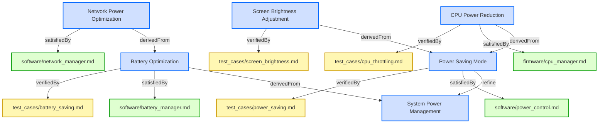
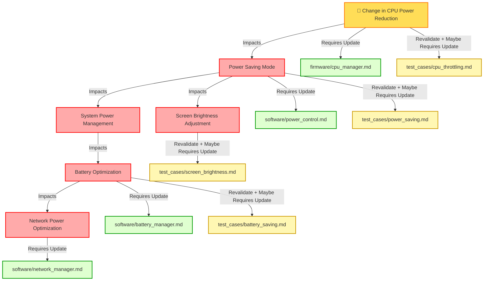

# Design Specification Document: Requirements Change Impact Propagation

This document defines how requirements changes propagate through relationships within a Markdown-based requirements model. It specifies how changes affect child requirements, parent requirements, verification artifacts, and related design elements, ensuring controlled and traceable impact analysis.

## Change Impact Propagation in Requirements

Requirements are interconnected through relations, and changes to a requirement may affect related requirements, verification methods, design specifications, or software components.

Changes propagate based on the relation type, which determines the impact direction and scope.

Changes to high-level requirements cascade down to implementation.
Refine relation is of special impact type: it cascades down and also upwards to a refined requirement and then again down from refined requirement to a implementation.
Verification artifacts must be invalidated and updated to reflect changes.
Automated tools should flag all impacted requirements for review.


## Relation Types and Change Propagation Rules

### Parent-Child Relationship Impact

These relations define hierarchical connections where changes to a parent requirement propagate to child requirements.

#### containedBy
Links a child requirement to a parent requirement. Changes in the parent propagate to the child.

#### contain
Links a parent requirement to a child requirement. Changes in the parent propagate to the child.

#### derivedFrom
Links a child requirement to a parent requirement. Changes in the parent propagate to the child.

#### derive
Links a parent requirement to a child requirement. Changes in the parent propagate to the child.

#### refine
Links a child requirement to a parent requirement. Changes propagate bidirectionally:
 * modifications in the parent requirement propagate to the child, and modifications in the child requirement propagate back to the parent.


---

### Requirement Satisfaction and Design Impact

These relations define how a requirement is satisfied by design, code, or architecture.

#### satisfiedBy
Links a requirement to code, architecture, or specifications that satisfy it. Changes in the requirement propagate to the satisfying resource.

#### satisfy
Links a design artifact to the requirement it satisfies. Changes in the requirement propagate to the satisfying resource.


---

### Verification and Validation Impact

These relations define verification artifacts that confirm a requirement is met.

#### verifiedBy
Links a requirement to a document or test that verifies it. Changes in the requirement propagate to the verification artifact, requiring re-validation.

#### verify
Links a verification document to the requirement it verifies. Changes in the requirement propagate to the verification artifact, requiring re-validation.


---

### Traceability and Non-Propagating Relations

These relations establish soft traceability and do not propagate changes. It is omnidirectional.

#### trace
Soft traceability relation pointing to a source. No direct impact on change propagation.

---

## Relation Types and Change Propagation Rules table

| Relation Type | Direction | Impact of Change                                          |
|---------------|-----------|-----------------------------------------------------------|
| **containedBy** | Child Req. →  Parent Req. | Changes in the parent propagate down to the child. |
| **contain**     | Parent Req. → Child Req. | Changes in the parent propagate down to the child.|
| **derivedFrom** | Child Req. → Parent Req. | Changes in the parent propagate down to the child. |
| **derive**      | Parent Req. → Child Req.| Changes in the parent propagate down to the child. |
| **refine**      | Child Req. → Parent Req.| Changes propagate bidirectionally. |
| **satisfiedBy** | Requirement → Artifact | Changes in Requirement propagate down to the design, code, or implementation artifact. |
| **satisfy**     | Artifact → Requirement | Changes in Requirement propagate down to the design, code, or implementation artifact. |
| **verifiedBy**  | Requirement → Verification |  Changes in Requirement propagate down to the verification/test. |
| **verifiy**     | Verification → Requirement  |  Changes in Requirement propagate down to the verification/test. |
| **trace**       | Traceability (non-propagating) | No propagation, for documentation only. |

---


## Change Propagation Mechanism

When a requirement changes, impact analysis must be conducted based on its relations. The following mechanism ensures traceability and controlled updates.


---

### Identify Impacted Relations
When a requirement is modified, check its Relations subsection to identify linked elements.


---

### Determine Change Propagation Scope
Apply the rules in Relation Types and Change Propagation Rules to assess whether the change affects child requirements, design artifacts, verification, or other linked documents.


---

### Invalidate Affected Elements
If a related element is impacted, flag it for review.  
Example: If a requirement verified by a test changes, the test must be reviewed.


---

### Require Re-validation or Re-design
If changes affect satisfaction (e.g., code or architecture), update the relevant design.  
If changes affect verification, update test cases or validation documents.


---

### Update Relations
If a change results in a requirement being merged, split, or removed, update its Relations to maintain traceability.

## Examples of Change Propagation


---

### Parent-Child Requirement Change

```markdown

---

### Parent Requirement
This requirement defines a high-level system constraint.

#### Relations
  * contain: [Child Requirement](#child-requirement)


---

### Child Requirement
This requirement defines additional functionality.

#### Relations
  * containedBy: [Parent Requirement](#parent-requirement)
  
```

If Parent Requirement changes, Child Requirement must be reviewed and updated.


---

### Requirement Satisfied by a Design Specification

```markdown

---

### Functional Requirement
The system shall process transactions within 500ms.

#### Relations
  * satisfiedBy: [architecture/system_design.md/Performance Constraints](architecture/system_design.html#performance-constraints)
```

If Functional Requirement changes, Performance Constraints in the architecture document must be updated.


---

### Requirement Verified by a Test

```

---

### Safety Requirement
The system shall shut down if temperature exceeds 100°C.

#### Relations
  * verifiedBy: [test_cases/safety_verification.md/Overheat Shutdown Test](test_cases/safety_verification.html#overheat-shutdown-test)

```

If Safety Requirement changes, the Overheat Shutdown Test must be reviewed for update and executed again for verification.


---

### Example of Multi-Level Change Propagation in Requirements

The following analysis explains how a **change in the requirement** that also  **refine** relation with the  root requirement propagates through multiple levels of related requirements, impacting their definitions, design artifacts, and verification processes.

---

```

---

### Root Requirement: System Power Management

The system shall implement power-saving mechanisms to optimize battery usage.  

---

### Power Saving Mode

The system shall activate power-saving mode when the battery level drops below 20%.  

#### Relations
  * refine: [System Power Management](#system-power-management)
  * satisfiedBy: [software/power_control.md](software/power_control.html)
  * verifiedBy: [test_cases/power_saving.md](test_cases/power_saving.html)

---

### CPU Power Reduction

The system shall reduce CPU frequency by 30% in power-saving mode.  

#### Relations
  * derivedFrom: [Power Saving Mode](#power-saving-mode)
  * satisfiedBy: [firmware/cpu_manager.md](firmware/cpu_manager.html)
  * verifiedBy: [test_cases/cpu_throttling.md](test_cases/cpu_throttling.html)

---

### Screen Brightness Adjustment

The system shall reduce screen brightness by 40% in power-saving mode.  

#### Relations
  * derivedFrom: [Power Saving Mode](#power-saving-mode)
  * verifiedBy: [test_cases/screen_brightness.md](test_cases/screen_brightness.html)

---

### Battery Optimization

The system shall disable non-essential background services when battery levels drop below 15%.  

#### Relations
  * derivedFrom: [System Power Management](#system-power-management)
  * satisfiedBy: [software/battery_manager.md](software/battery_manager.html)
  * verifiedBy: [test_cases/battery_saving.md](test_cases/battery_saving.html)

---

### Network Power Optimization
The system shall reduce network polling frequency when battery levels drop below 15%.  

#### Relations
  * derivedFrom: [Battery Optimization](#battery-optimization)
  * satisfiedBy: [software/network_manager.md](software/network_manager.html)
```

**Power Saving Mode** requirment has been changed to:
>The system shall activate power-saving mode when the battery level drops below 30%.


Change Propagation Flow:
1. A **change** in **CPU Power Reduction** flows **downward** to **Power Saving Mode** because it is **derivedFrom** it.  
2. Since **Power Saving Mode** refines **System Power Management**, the **change** propagates **upward** to **System Power Management**.  
3. **System Power Management** has a **child requirement**, **Battery Optimization**, which is **derivedFrom** it, so the **change** affects it as well.  
4. The **change** then propagates **downward** to **Network Power Optimization**, which is **derivedFrom** **Battery Optimization**.  
5. Meanwhile, the **change** also impacts **Screen Brightness Adjustment**, which is **derivedFrom** **Power Saving Mode**.  
6. Since **System Power Management** is a **top-level requirement**, it must be **validated** to ensure all related requirements remain consistent.  
7. Additionally, all **satisfiedBy** and **verifiedBy** relations from affected requirements must be reviewed:
   - **CPU Power Reduction** → **firmware/cpu_manager.md** (implementation) & **test_cases/cpu_throttling.md** (verification).  
   - **Power Saving Mode** → **software/power_control.md** (implementation) & **test_cases/power_saving.md** (verification).  
   - **Battery Optimization** → **software/battery_manager.md** (implementation) & **test_cases/battery_saving.md** (verification).  
   - **Screen Brightness Adjustment** → **test_cases/screen_brightness.md** (verification).  


Mermaid diagram showing relations:


Legend:
- **🟦 Requirements (Blue)** → Directly from your provided requirements.  
- **🟩 Implementations (Green)** → Only **satisfiedBy** links
- **🟨 Verifications (Yellow)** → Only **verifiedBy** links

Change propagation flow diagram:


---
