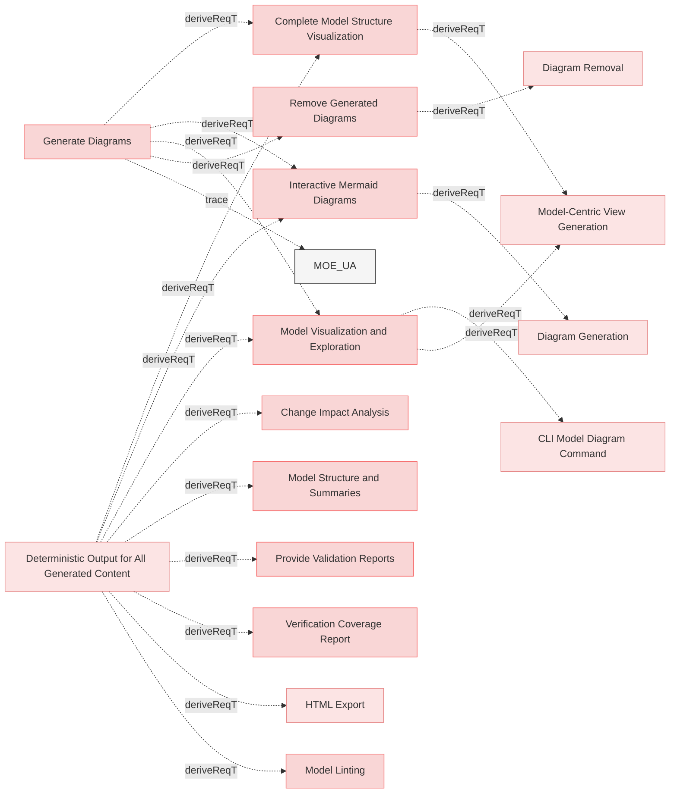

# Generate Diagrams

## Requirements

### Interactive Mermaid Diagrams

The system shall produce visual representations of relationships within the MBSE model in the form of Mermaid diagrams, enabling users to explore relations and understand dependencies and their impact.

#### Details
Diagrams must be broken into several diagrams using following logic:
 * requirements_file_name/'## section name'
   * all requirements inside are 1 diagram
   * if requirements documents doesn't have '##' paragraphs then requirements file name is used only
   * external related resources box must be a link to actual resource

Color code for rendering diagrams:
 * red for requirement
 * yellow for resources which satisfies requirement
 * green for verifiction which verifies requirement
 * light blue for box representing another diagram/category with requirments where linked requirement or resource exist.

#### Metadata
  * type: user-requirement

#### Relations
  * derivedFrom: [Generate Diagrams](UserStories.md#generate-diagrams)
  * derivedFrom: [Deterministic Output for All Generated Content](ReqvireTool/ValidationAndReporting/Reports.md#deterministic-output-for-all-generated-content)
---

### Remove Generated Diagrams

The system shall provide functionality to remove all generated Mermaid diagrams from the model, allowing users to clean up generated artifacts when needed.

#### Metadata
  * type: user-requirement

#### Relations
  * derivedFrom: [Generate Diagrams](UserStories.md#generate-diagrams)
---

### Complete Model Structure Visualization

The system shall provide visualization of the complete model structure showing an element-centric view with nested relations.

#### Details
The visualization shall:
- Display elements with their properties (identifier, name, type, file location, section)
- Show relations nested inside elements with full target details
- Support recursive nesting for element-to-element relations
- Handle file path and external URL relations
- Provide metadata about total elements and relations
- Use consistent visual styling with mermaid diagrams showing hash-based node identifiers

The visualization helps users understand the model's logical structure, navigate relationships between elements, and explore the model from any starting point.

#### Metadata
  * type: user-requirement

#### Relations
  * derivedFrom: [Generate Diagrams](UserStories.md#generate-diagrams)
  * derivedFrom: [Deterministic Output for All Generated Content](ReqvireTool/ValidationAndReporting/Reports.md#deterministic-output-for-all-generated-content)
---

### Model Visualization and Exploration

Users shall be able to generate and view model structure diagrams from any starting point of the model.

#### Details
- Generate complete model structure with nested relations showing element details recursively
- Default view shows root requirements (no hierarchical parent)
- Filter from specific element using --from flag
- View both JSON and markdown output formats
- Nested structure shows relations with full target details
- Mermaid diagrams display all nested relations recursively

#### Metadata
  * type: user-requirement

#### Relations
  * derivedFrom: [Generate Diagrams](UserStories.md#generate-diagrams)
  * derivedFrom: [Deterministic Output for All Generated Content](ReqvireTool/ValidationAndReporting/Reports.md#deterministic-output-for-all-generated-content)
---