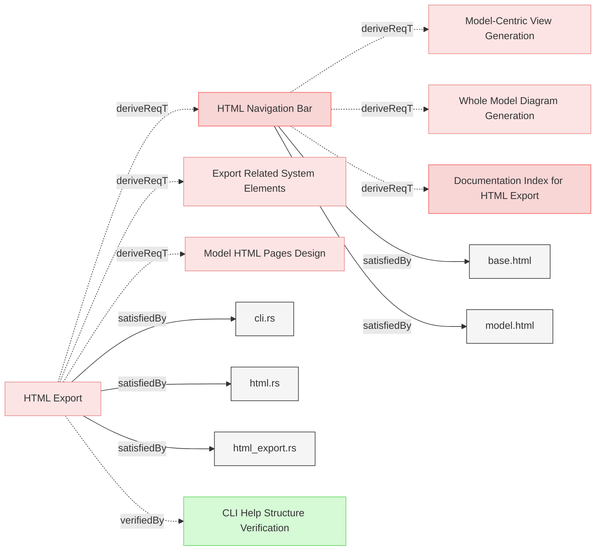

# Exporting Specifications

## Requirements

### HTML Navigation Bar

The system SHALL provide a fixed navigation bar in all HTML pages with links to key model artifacts for easy access.

#### Details
The navigation bar must include:
- Home: Link to index.html (model structure overview)
- Model: Link to model.html (model-centric view with nested relations)
- Whole Model: Link to whole-model.html (complete model diagram)
- Traces: Link to traces.html (verification upward traceability report)
- Coverage: Link to coverage.html (verification coverage report)

The navigation bar must be:
- Always visible (fixed position) while scrolling
- Consistent across all HTML pages
- Clearly visible and accessible

#### Metadata
  * type: user-requirement

#### Relations
  * derivedFrom: [HTML Export](ReqvireTool/UserInterface/WebInterface.md#html-export)
  * satisfiedBy: [base.html](../core/templates/base.html)
  * satisfiedBy: [model.html](../core/templates/model.html)
---