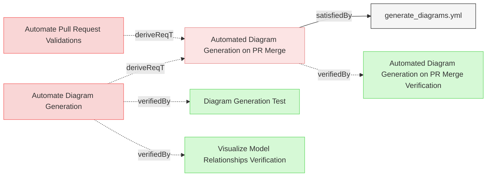

# GitHub Integration

## GitHub Workflows

### Automated Diagram Generation on PR Merge

The system shall implement a GitHub workflow that automatically generates and commits updated diagrams when pull requests are merged to the main branch.

#### Details
The GitHub workflow shall:
- Be triggered only when a pull request is merged to the main branch (not on PR creation or updates)
- Check out the latest code from the main branch post-merge
- Build the Reqvire tool from source
- Run the diagram generation process using the `--generate-diagrams` flag
- Generate a traceability matrix SVG using the `--traces --svg` flags
- Check if any diagrams or matrix files have been added or modified
- Commit any updated files with a standardized commit message
- Push the updates back to the main branch

This ensures that the Mermaid diagrams in the repository are always up-to-date after changes are merged to the main branch, providing accurate visual representations of the latest model state without requiring manual intervention.

#### Relations
  * derivedFrom: [Automate Diagram Generation](../UserRequirements.md#automate-diagram-generation)
  * derivedFrom: [Automate Pull Request Validations](../UserRequirements.md#automate-pull-request-validations)
  * satisfiedBy: [generate_diagrams.yml](../../.github/workflows/generate_diagrams.yml)
---