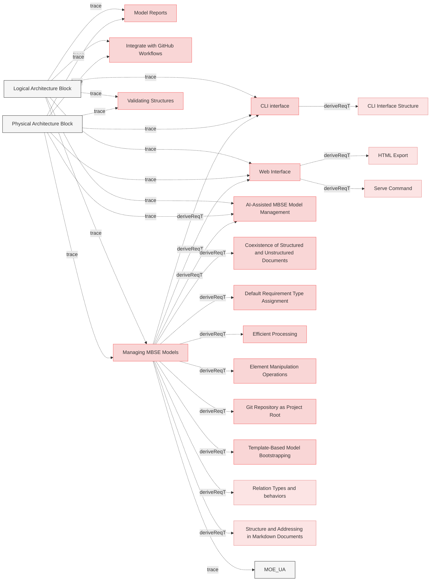

# Interfaces

## Requirements

### CLI interface

The system shall provide command line interface (CLI) to faciliate model management.

#### Metadata
  * type: user-requirement

#### Relations
  * derivedFrom: [Managing MBSE Models](UserStories.md#managing-mbse-models)
---

### Web Interface

The system SHALL provide a web-based interface to browse the MBSE model documentation, including all generated artifacts such as diagrams, reports, and verification traces.

#### Details
The browse interface allows users to:
- View HTML-rendered specifications and requirements
- Navigate through diagrams and visualizations
- Access verification traces and coverage reports
- Explore the complete model structure through an integrated web interface

This capability enables both human users (via browser) and AI agents (via MCP server) to efficiently explore and understand the MBSE model without manually navigating file structures.

#### Metadata
  * type: user-requirement

#### Relations
  * derivedFrom: [Managing MBSE Models](UserStories.md#managing-mbse-models)
---