# CLI

## CLI Interface
```mermaid
graph LR;
  %% REQVIRE-AUTOGENERATED-DIAGRAM
  %% Graph styling
  classDef userRequirement fill:#f9d6d6,stroke:#f55f5f,stroke-width:1px;
  classDef systemRequirement fill:#fce4e4,stroke:#e68a8a,stroke-width:1px;
  classDef verification fill:#d6f9d6,stroke:#5fd75f,stroke-width:1px;
  classDef default fill:#f5f5f5,stroke:#333333,stroke-width:1px;

  d6a8d0b0ef89a349["CLI Add Element Command"];
  class d6a8d0b0ef89a349 systemRequirement;
  click d6a8d0b0ef89a349 "CLI.md#cli-add-element-command";
  80defdd4cbc7ee18["cli.rs"];
  class 80defdd4cbc7ee18 default;
  click 80defdd4cbc7ee18 "../../cli/src/cli.rs";
  d6a8d0b0ef89a349 -->|satisfiedBy| 80defdd4cbc7ee18;
  2c686dc939f5e5c8["CLI Add Element Test"];
  class 2c686dc939f5e5c8 verification;
  click 2c686dc939f5e5c8 "../System/ElementManipulation.md#cli-add-element-test";
  d6a8d0b0ef89a349 -.->|verifiedBy| 2c686dc939f5e5c8;
  7b6287a68f3ac83f["CLI Change Impact Report Command"];
  class 7b6287a68f3ac83f systemRequirement;
  click 7b6287a68f3ac83f "CLI.md#cli-change-impact-report-command";
  22117162ff572231["CLI Git Commit Hash Flag"];
  class 22117162ff572231 systemRequirement;
  click 22117162ff572231 "CLI.md#cli-git-commit-hash-flag";
  7b6287a68f3ac83f -.->|deriveReqT| 22117162ff572231;
  b60dcbf8f89bb1d9["Change Impact Command Line Interface"];
  class b60dcbf8f89bb1d9 systemRequirement;
  click b60dcbf8f89bb1d9 "../System/ChangeImpact.md#change-impact-command-line-interface";
  7b6287a68f3ac83f -.->|deriveReqT| b60dcbf8f89bb1d9;
  80defdd4cbc7ee18["cli.rs"];
  class 80defdd4cbc7ee18 default;
  click 80defdd4cbc7ee18 "../../cli/src/cli.rs";
  7b6287a68f3ac83f -->|satisfiedBy| 80defdd4cbc7ee18;
  7ff28ff401dbaef7["CLI Help Structure Verification"];
  class 7ff28ff401dbaef7 verification;
  click 7ff28ff401dbaef7 "CLI.md#cli-help-structure-verification";
  7b6287a68f3ac83f -.->|verifiedBy| 7ff28ff401dbaef7;
  c9d3c9fb2d43619b["CLI Containment Command"];
  class c9d3c9fb2d43619b systemRequirement;
  click c9d3c9fb2d43619b "CLI.md#cli-containment-command";
  f3bdc01040587c85["CLI Coverage Command"];
  class f3bdc01040587c85 systemRequirement;
  click f3bdc01040587c85 "CLI.md#cli-coverage-command";
  80defdd4cbc7ee18["cli.rs"];
  class 80defdd4cbc7ee18 default;
  click 80defdd4cbc7ee18 "../../cli/src/cli.rs";
  f3bdc01040587c85 -->|satisfiedBy| 80defdd4cbc7ee18;
  f3bdc01040587c85 -.->|verifiedBy| 7ff28ff401dbaef7;
  a0b45e16c10b8708["Verification Coverage Report Test"];
  class a0b45e16c10b8708 verification;
  click a0b45e16c10b8708 "../System/Reporting.md#verification-coverage-report-test";
  f3bdc01040587c85 -.->|verifiedBy| a0b45e16c10b8708;
  892e19ec234ec4d8["CLI Generate Diagrams Flag"];
  class 892e19ec234ec4d8 systemRequirement;
  click 892e19ec234ec4d8 "CLI.md#cli-generate-diagrams-flag";
  80defdd4cbc7ee18["cli.rs"];
  class 80defdd4cbc7ee18 default;
  click 80defdd4cbc7ee18 "../../cli/src/cli.rs";
  892e19ec234ec4d8 -->|satisfiedBy| 80defdd4cbc7ee18;
  892e19ec234ec4d8 -.->|verifiedBy| 7ff28ff401dbaef7;
  babbb4a0fd887157["Diagram Generation Test"];
  class babbb4a0fd887157 verification;
  click babbb4a0fd887157 "../System/DiagramGeneration.md#diagram-generation-test";
  892e19ec234ec4d8 -.->|verifiedBy| babbb4a0fd887157;
  80defdd4cbc7ee18["cli.rs"];
  class 80defdd4cbc7ee18 default;
  click 80defdd4cbc7ee18 "../../cli/src/cli.rs";
  22117162ff572231 -->|satisfiedBy| 80defdd4cbc7ee18;
  8e66d38b3f4fd8a4["CLI Git Commit Hash Flag Test"];
  class 8e66d38b3f4fd8a4 verification;
  click 8e66d38b3f4fd8a4 "../System/ChangeImpact.md#cli-git-commit-hash-flag-test";
  22117162ff572231 -.->|verifiedBy| 8e66d38b3f4fd8a4;
  e16108a30570f434["CLI Interface Structure"];
  class e16108a30570f434 systemRequirement;
  click e16108a30570f434 "CLI.md#cli-interface-structure";
  e16108a30570f434 -.->|deriveReqT| 7b6287a68f3ac83f;
  e16108a30570f434 -.->|deriveReqT| c9d3c9fb2d43619b;
  e16108a30570f434 -.->|deriveReqT| 892e19ec234ec4d8;
  7faaae7c608ed9f2["CLI Lint Command"];
  class 7faaae7c608ed9f2 systemRequirement;
  click 7faaae7c608ed9f2 "CLI.md#cli-lint-command";
  e16108a30570f434 -.->|deriveReqT| 7faaae7c608ed9f2;
  b3bb7792bbc95f02["CLI Remove Diagrams Flag"];
  class b3bb7792bbc95f02 systemRequirement;
  click b3bb7792bbc95f02 "CLI.md#cli-remove-diagrams-flag";
  e16108a30570f434 -.->|deriveReqT| b3bb7792bbc95f02;
  3814555dac6871e9["CLI Rename Element Command"];
  class 3814555dac6871e9 systemRequirement;
  click 3814555dac6871e9 "CLI.md#cli-rename-element-command";
  e16108a30570f434 -.->|deriveReqT| 3814555dac6871e9;
  e342a2a82ef67934["CLI Search Command"];
  class e342a2a82ef67934 systemRequirement;
  click e342a2a82ef67934 "CLI.md#cli-search-command";
  e16108a30570f434 -.->|deriveReqT| e342a2a82ef67934;
  e21c06baba741337["Format Command"];
  class e21c06baba741337 systemRequirement;
  click e21c06baba741337 "CLI.md#format-command";
  e16108a30570f434 -.->|deriveReqT| e21c06baba741337;
  4fd92091a4cfac13["Subdirectory Processing Option"];
  class 4fd92091a4cfac13 systemRequirement;
  click 4fd92091a4cfac13 "CLI.md#subdirectory-processing-option";
  e16108a30570f434 -.->|deriveReqT| 4fd92091a4cfac13;
  8f321516e91a74d6["Validate Command"];
  class 8f321516e91a74d6 systemRequirement;
  click 8f321516e91a74d6 "CLI.md#validate-command";
  e16108a30570f434 -.->|deriveReqT| 8f321516e91a74d6;
  59093bf57f656ef3["HTML Export"];
  class 59093bf57f656ef3 systemRequirement;
  click 59093bf57f656ef3 "WebInterface.md#html-export";
  e16108a30570f434 -.->|deriveReqT| 59093bf57f656ef3;
  ec8a8cc688b1d9d9["Integrated Validation"];
  class ec8a8cc688b1d9d9 systemRequirement;
  click ec8a8cc688b1d9d9 "../System/Validation.md#integrated-validation";
  e16108a30570f434 -.->|deriveReqT| ec8a8cc688b1d9d9;
  80defdd4cbc7ee18["cli.rs"];
  class 80defdd4cbc7ee18 default;
  click 80defdd4cbc7ee18 "../../cli/src/cli.rs";
  e16108a30570f434 -->|satisfiedBy| 80defdd4cbc7ee18;
  6a435286a5c0531f["Lint Auto-fix Capability"];
  class 6a435286a5c0531f systemRequirement;
  click 6a435286a5c0531f "../System/Linting.md#lint-auto-fix-capability";
  7faaae7c608ed9f2 -.->|deriveReqT| 6a435286a5c0531f;
  ccf73e5865717df6["CLI Model Diagram Command"];
  class ccf73e5865717df6 systemRequirement;
  click ccf73e5865717df6 "CLI.md#cli-model-diagram-command";
  e86cdd84f5faf281["Forward-Only Relation Traversal"];
  class e86cdd84f5faf281 systemRequirement;
  click e86cdd84f5faf281 "../System/Reporting.md#forward-only-relation-traversal";
  ccf73e5865717df6 -.->|deriveReqT| e86cdd84f5faf281;
  4b5b18163bbb808e["Model Diagram Output Formats"];
  class 4b5b18163bbb808e systemRequirement;
  click 4b5b18163bbb808e "../System/Reporting.md#model-diagram-output-formats";
  ccf73e5865717df6 -.->|deriveReqT| 4b5b18163bbb808e;
  80defdd4cbc7ee18["cli.rs"];
  class 80defdd4cbc7ee18 default;
  click 80defdd4cbc7ee18 "../../cli/src/cli.rs";
  ccf73e5865717df6 -->|satisfiedBy| 80defdd4cbc7ee18;
  dad7eeb932afdb92["diagrams.rs"];
  class dad7eeb932afdb92 default;
  click dad7eeb932afdb92 "../../core/src/diagrams.rs";
  ccf73e5865717df6 -->|satisfiedBy| dad7eeb932afdb92;
  2ea9a1b3289a7961["CLI Move Element Command"];
  class 2ea9a1b3289a7961 systemRequirement;
  click 2ea9a1b3289a7961 "CLI.md#cli-move-element-command";
  80defdd4cbc7ee18["cli.rs"];
  class 80defdd4cbc7ee18 default;
  click 80defdd4cbc7ee18 "../../cli/src/cli.rs";
  2ea9a1b3289a7961 -->|satisfiedBy| 80defdd4cbc7ee18;
  48206a12925753fe["CLI Move Element Test"];
  class 48206a12925753fe verification;
  click 48206a12925753fe "../System/ElementManipulation.md#cli-move-element-test";
  2ea9a1b3289a7961 -.->|verifiedBy| 48206a12925753fe;
  33f73ad674ea5b88["Subdirectory Processing Verification"];
  class 33f73ad674ea5b88 verification;
  click 33f73ad674ea5b88 "../System/Validation.md#subdirectory-processing-verification";
  2ea9a1b3289a7961 -.->|verifiedBy| 33f73ad674ea5b88;
  e090ad559abc31b0["CLI Move File Command"];
  class e090ad559abc31b0 systemRequirement;
  click e090ad559abc31b0 "CLI.md#cli-move-file-command";
  f8b8eb56f941a697["CLI Move File Test"];
  class f8b8eb56f941a697 verification;
  click f8b8eb56f941a697 "../System/ElementManipulation.md#cli-move-file-test";
  e090ad559abc31b0 -.->|verifiedBy| f8b8eb56f941a697;
  e090ad559abc31b0 -.->|verifiedBy| 33f73ad674ea5b88;
  80defdd4cbc7ee18["cli.rs"];
  class 80defdd4cbc7ee18 default;
  click 80defdd4cbc7ee18 "../../cli/src/cli.rs";
  b3bb7792bbc95f02 -->|satisfiedBy| 80defdd4cbc7ee18;
  b3bb7792bbc95f02 -.->|verifiedBy| 7ff28ff401dbaef7;
  196bcb7d75f45d2b["Remove Generated Diagrams Verification"];
  class 196bcb7d75f45d2b verification;
  click 196bcb7d75f45d2b "../System/DiagramGeneration.md#remove-generated-diagrams-verification";
  b3bb7792bbc95f02 -.->|verifiedBy| 196bcb7d75f45d2b;
  dc747a38a6fa7319["CLI Remove Element Command"];
  class dc747a38a6fa7319 systemRequirement;
  click dc747a38a6fa7319 "CLI.md#cli-remove-element-command";
  80defdd4cbc7ee18["cli.rs"];
  class 80defdd4cbc7ee18 default;
  click 80defdd4cbc7ee18 "../../cli/src/cli.rs";
  dc747a38a6fa7319 -->|satisfiedBy| 80defdd4cbc7ee18;
  839c6dca90d0b83b["CLI Remove Element Test"];
  class 839c6dca90d0b83b verification;
  click 839c6dca90d0b83b "../System/ElementManipulation.md#cli-remove-element-test";
  dc747a38a6fa7319 -.->|verifiedBy| 839c6dca90d0b83b;
  80defdd4cbc7ee18["cli.rs"];
  class 80defdd4cbc7ee18 default;
  click 80defdd4cbc7ee18 "../../cli/src/cli.rs";
  3814555dac6871e9 -->|satisfiedBy| 80defdd4cbc7ee18;
  94178a26b5d5bb02["CLI Rename Element Test"];
  class 94178a26b5d5bb02 verification;
  click 94178a26b5d5bb02 "../System/ElementManipulation.md#cli-rename-element-test";
  3814555dac6871e9 -.->|verifiedBy| 94178a26b5d5bb02;
  80defdd4cbc7ee18["cli.rs"];
  class 80defdd4cbc7ee18 default;
  click 80defdd4cbc7ee18 "../../cli/src/cli.rs";
  e342a2a82ef67934 -->|satisfiedBy| 80defdd4cbc7ee18;
  e342a2a82ef67934 -.->|verifiedBy| 7ff28ff401dbaef7;
  aba20c01c777da73["Search Command Tests"];
  class aba20c01c777da73 verification;
  click aba20c01c777da73 "../System/Reporting.md#search-command-tests";
  e342a2a82ef67934 -.->|verifiedBy| aba20c01c777da73;
  e0a8bb95946239f1["CLI Traces Command"];
  class e0a8bb95946239f1 systemRequirement;
  click e0a8bb95946239f1 "CLI.md#cli-traces-command";
  8770f019abe84008["CLI Traces Filter Options"];
  class 8770f019abe84008 systemRequirement;
  click 8770f019abe84008 "CLI.md#cli-traces-filter-options";
  e0a8bb95946239f1 -.->|deriveReqT| 8770f019abe84008;
  ade05907e4aa32e4["CLI Traces From-Folder Option"];
  class ade05907e4aa32e4 systemRequirement;
  click ade05907e4aa32e4 "CLI.md#cli-traces-from-folder-option";
  e0a8bb95946239f1 -.->|deriveReqT| ade05907e4aa32e4;
  80defdd4cbc7ee18["cli.rs"];
  class 80defdd4cbc7ee18 default;
  click 80defdd4cbc7ee18 "../../cli/src/cli.rs";
  e0a8bb95946239f1 -->|satisfiedBy| 80defdd4cbc7ee18;
  e0a8bb95946239f1 -.->|verifiedBy| 7ff28ff401dbaef7;
  21bf161c7d91513d["Verification Traces Filter Options Test"];
  class 21bf161c7d91513d verification;
  click 21bf161c7d91513d "../System/Reporting.md#verification-traces-filter-options-test";
  8770f019abe84008 -.->|verifiedBy| 21bf161c7d91513d;
  3f0b37e517d007a6["Verification Traces From-Folder Test"];
  class 3f0b37e517d007a6 verification;
  click 3f0b37e517d007a6 "../System/Reporting.md#verification-traces-from-folder-test";
  ade05907e4aa32e4 -.->|verifiedBy| 3f0b37e517d007a6;
  9717f5af74dd01c1["Detailed Error Handling and Logging"];
  class 9717f5af74dd01c1 systemRequirement;
  click 9717f5af74dd01c1 "CLI.md#detailed-error-handling-and-logging";
  2da3eb1fd895a5b8["Validation Error Handling"];
  class 2da3eb1fd895a5b8 systemRequirement;
  click 2da3eb1fd895a5b8 "../System/Validation.md#validation-error-handling";
  9717f5af74dd01c1 -.->|deriveReqT| 2da3eb1fd895a5b8;
  a581221890d15c0c["error.rs"];
  class a581221890d15c0c default;
  click a581221890d15c0c "../../core/src/error.rs";
  9717f5af74dd01c1 -->|satisfiedBy| a581221890d15c0c;
  80defdd4cbc7ee18["cli.rs"];
  class 80defdd4cbc7ee18 default;
  click 80defdd4cbc7ee18 "../../cli/src/cli.rs";
  e21c06baba741337 -->|satisfiedBy| 80defdd4cbc7ee18;
  e21c06baba741337 -.->|verifiedBy| 7ff28ff401dbaef7;
  11434b30ee3de97b["Format Command Requirements Verification"];
  class 11434b30ee3de97b verification;
  click 11434b30ee3de97b "../System/Formatting.md#format-command-requirements-verification";
  e21c06baba741337 -.->|verifiedBy| 11434b30ee3de97b;
  4fd92091a4cfac13 -.->|deriveReqT| d6a8d0b0ef89a349;
  4fd92091a4cfac13 -.->|deriveReqT| 2ea9a1b3289a7961;
  4fd92091a4cfac13 -.->|deriveReqT| e090ad559abc31b0;
  4fd92091a4cfac13 -.->|deriveReqT| dc747a38a6fa7319;
  80defdd4cbc7ee18["cli.rs"];
  class 80defdd4cbc7ee18 default;
  click 80defdd4cbc7ee18 "../../cli/src/cli.rs";
  4fd92091a4cfac13 -->|satisfiedBy| 80defdd4cbc7ee18;
  80defdd4cbc7ee18["cli.rs"];
  class 80defdd4cbc7ee18 default;
  click 80defdd4cbc7ee18 "../../cli/src/cli.rs";
  8f321516e91a74d6 -->|satisfiedBy| 80defdd4cbc7ee18;
  8f321516e91a74d6 -.->|verifiedBy| 7ff28ff401dbaef7;
  400e3d7614d84c23["Invalid Relations Test"];
  class 400e3d7614d84c23 verification;
  click 400e3d7614d84c23 "../System/Validation.md#invalid-relations-test";
  8f321516e91a74d6 -.->|verifiedBy| 400e3d7614d84c23;
  1ac3e4fc194fd9d["CLI interface"];
  class 1ac3e4fc194fd9d userRequirement;
  click 1ac3e4fc194fd9d "Interfaces.md#cli-interface";
  1ac3e4fc194fd9d -.->|deriveReqT| e16108a30570f434;
  ed77c8b81e72691f["Serve Command"];
  class ed77c8b81e72691f systemRequirement;
  click ed77c8b81e72691f "WebInterface.md#serve-command";
  80defdd4cbc7ee18["cli.rs"];
  class 80defdd4cbc7ee18 default;
  click 80defdd4cbc7ee18 "../../cli/src/cli.rs";
  ed77c8b81e72691f -->|satisfiedBy| 80defdd4cbc7ee18;
  e313808f7a755f6["serve.rs"];
  class e313808f7a755f6 default;
  click e313808f7a755f6 "../../cli/src/serve.rs";
  ed77c8b81e72691f -->|satisfiedBy| e313808f7a755f6;
  ed77c8b81e72691f -.->|trace| 8f321516e91a74d6;
  c9349ff6d96c56d7["Serve Command Verification"];
  class c9349ff6d96c56d7 verification;
  click c9349ff6d96c56d7 "WebInterface.md#serve-command-verification";
  ed77c8b81e72691f -.->|verifiedBy| c9349ff6d96c56d7;
  6fad3eb745d39b47["Structural Change Analyzer"];
  class 6fad3eb745d39b47 systemRequirement;
  click 6fad3eb745d39b47 "../System/ChangeImpact.md#structural-change-analyzer";
  6fad3eb745d39b47 -.->|deriveReqT| 7b6287a68f3ac83f;
  7c0b5cfb8630f955["Structural Change Reports"];
  class 7c0b5cfb8630f955 userRequirement;
  click 7c0b5cfb8630f955 "../System/ChangeImpact.md#structural-change-reports";
  6fad3eb745d39b47 -.->|deriveReqT| 7c0b5cfb8630f955;
  4b89dbed94c08c3e["change_impact.rs"];
  class 4b89dbed94c08c3e default;
  click 4b89dbed94c08c3e "../../core/src/change_impact.rs";
  6fad3eb745d39b47 -->|satisfiedBy| 4b89dbed94c08c3e;
  b740af57e790f8f0["Diagram Generation"];
  class b740af57e790f8f0 systemRequirement;
  click b740af57e790f8f0 "../System/DiagramGeneration.md#diagram-generation";
  b740af57e790f8f0 -.->|deriveReqT| 892e19ec234ec4d8;
  55be85ab88ea074a["Auto-Generated Diagram Identification"];
  class 55be85ab88ea074a systemRequirement;
  click 55be85ab88ea074a "../System/DiagramGeneration.md#auto-generated-diagram-identification";
  b740af57e790f8f0 -.->|deriveReqT| 55be85ab88ea074a;
  fe5b2cd21ded7398["Interactive Mermaid Diagram Node Behavior"];
  class fe5b2cd21ded7398 systemRequirement;
  click fe5b2cd21ded7398 "../System/DiagramGeneration.md#interactive-mermaid-diagram-node-behavior";
  b740af57e790f8f0 -.->|deriveReqT| fe5b2cd21ded7398;
  fe680bbc91a15fb9["SysML-Compatible Relationship Rendering"];
  class fe680bbc91a15fb9 systemRequirement;
  click fe680bbc91a15fb9 "../System/DiagramGeneration.md#sysml-compatible-relationship-rendering";
  b740af57e790f8f0 -.->|deriveReqT| fe680bbc91a15fb9;
  dad7eeb932afdb92["diagrams.rs"];
  class dad7eeb932afdb92 default;
  click dad7eeb932afdb92 "../../core/src/diagrams.rs";
  b740af57e790f8f0 -->|satisfiedBy| dad7eeb932afdb92;
  88a2a5cf6afe8fec["Visualize Model Relationships Verification"];
  class 88a2a5cf6afe8fec verification;
  click 88a2a5cf6afe8fec "../System/DiagramGeneration.md#visualize-model-relationships-verification";
  b740af57e790f8f0 -.->|verifiedBy| 88a2a5cf6afe8fec;
  e5bbe52f99fe7d46["Diagram Removal"];
  class e5bbe52f99fe7d46 systemRequirement;
  click e5bbe52f99fe7d46 "../System/DiagramGeneration.md#diagram-removal";
  e5bbe52f99fe7d46 -.->|deriveReqT| b3bb7792bbc95f02;
  dad7eeb932afdb92["diagrams.rs"];
  class dad7eeb932afdb92 default;
  click dad7eeb932afdb92 "../../core/src/diagrams.rs";
  e5bbe52f99fe7d46 -->|satisfiedBy| dad7eeb932afdb92;
  c57d76a5aa346a53["Model Visualization and Exploration"];
  class c57d76a5aa346a53 userRequirement;
  click c57d76a5aa346a53 "../System/DiagramGeneration.md#model-visualization-and-exploration";
  c57d76a5aa346a53 -.->|deriveReqT| ccf73e5865717df6;
  b07859a209e66b4b["Model-Centric View Generation"];
  class b07859a209e66b4b systemRequirement;
  click b07859a209e66b4b "WebInterface.md#model-centric-view-generation";
  c57d76a5aa346a53 -.->|deriveReqT| b07859a209e66b4b;
  39b03efc9e2074f5["Create Element Operation"];
  class 39b03efc9e2074f5 systemRequirement;
  click 39b03efc9e2074f5 "../System/ElementManipulation.md#create-element-operation";
  39b03efc9e2074f5 -.->|deriveReqT| d6a8d0b0ef89a349;
  80defdd4cbc7ee18["cli.rs"];
  class 80defdd4cbc7ee18 default;
  click 80defdd4cbc7ee18 "../../cli/src/cli.rs";
  39b03efc9e2074f5 -->|satisfiedBy| 80defdd4cbc7ee18;
  ea4ba0d9ffba93a5["crud.rs"];
  class ea4ba0d9ffba93a5 default;
  click ea4ba0d9ffba93a5 "../../core/src/crud.rs";
  39b03efc9e2074f5 -->|satisfiedBy| ea4ba0d9ffba93a5;
  e69395f926bba6a5["diff.rs"];
  class e69395f926bba6a5 default;
  click e69395f926bba6a5 "../../core/src/diff.rs";
  39b03efc9e2074f5 -->|satisfiedBy| e69395f926bba6a5;
  b7c871ab64a7059a["graph_registry.rs"];
  class b7c871ab64a7059a default;
  click b7c871ab64a7059a "../../core/src/graph_registry.rs";
  39b03efc9e2074f5 -->|satisfiedBy| b7c871ab64a7059a;
  f22d93285fcd7664["parser.rs"];
  class f22d93285fcd7664 default;
  click f22d93285fcd7664 "../../core/src/parser.rs";
  39b03efc9e2074f5 -->|satisfiedBy| f22d93285fcd7664;
  ce2625feec883e55["utils.rs"];
  class ce2625feec883e55 default;
  click ce2625feec883e55 "../../core/src/utils.rs";
  39b03efc9e2074f5 -->|satisfiedBy| ce2625feec883e55;
  536b2416710a3312["Create Element Test"];
  class 536b2416710a3312 verification;
  click 536b2416710a3312 "../System/ElementManipulation.md#create-element-test";
  39b03efc9e2074f5 -.->|verifiedBy| 536b2416710a3312;
  732965664f6f3888["Delete Element Operation"];
  class 732965664f6f3888 systemRequirement;
  click 732965664f6f3888 "../System/ElementManipulation.md#delete-element-operation";
  732965664f6f3888 -.->|deriveReqT| dc747a38a6fa7319;
  80defdd4cbc7ee18["cli.rs"];
  class 80defdd4cbc7ee18 default;
  click 80defdd4cbc7ee18 "../../cli/src/cli.rs";
  732965664f6f3888 -->|satisfiedBy| 80defdd4cbc7ee18;
  ea4ba0d9ffba93a5["crud.rs"];
  class ea4ba0d9ffba93a5 default;
  click ea4ba0d9ffba93a5 "../../core/src/crud.rs";
  732965664f6f3888 -->|satisfiedBy| ea4ba0d9ffba93a5;
  e69395f926bba6a5["diff.rs"];
  class e69395f926bba6a5 default;
  click e69395f926bba6a5 "../../core/src/diff.rs";
  732965664f6f3888 -->|satisfiedBy| e69395f926bba6a5;
  b7c871ab64a7059a["graph_registry.rs"];
  class b7c871ab64a7059a default;
  click b7c871ab64a7059a "../../core/src/graph_registry.rs";
  732965664f6f3888 -->|satisfiedBy| b7c871ab64a7059a;
  861fc6a32bf8e8b0["Delete Element Test"];
  class 861fc6a32bf8e8b0 verification;
  click 861fc6a32bf8e8b0 "../System/ElementManipulation.md#delete-element-test";
  732965664f6f3888 -.->|verifiedBy| 861fc6a32bf8e8b0;
  4710e82a69e1246f["Move Element Operation"];
  class 4710e82a69e1246f systemRequirement;
  click 4710e82a69e1246f "../System/ElementManipulation.md#move-element-operation";
  4710e82a69e1246f -.->|deriveReqT| 2ea9a1b3289a7961;
  80defdd4cbc7ee18["cli.rs"];
  class 80defdd4cbc7ee18 default;
  click 80defdd4cbc7ee18 "../../cli/src/cli.rs";
  4710e82a69e1246f -->|satisfiedBy| 80defdd4cbc7ee18;
  ea4ba0d9ffba93a5["crud.rs"];
  class ea4ba0d9ffba93a5 default;
  click ea4ba0d9ffba93a5 "../../core/src/crud.rs";
  4710e82a69e1246f -->|satisfiedBy| ea4ba0d9ffba93a5;
  e69395f926bba6a5["diff.rs"];
  class e69395f926bba6a5 default;
  click e69395f926bba6a5 "../../core/src/diff.rs";
  4710e82a69e1246f -->|satisfiedBy| e69395f926bba6a5;
  b7c871ab64a7059a["graph_registry.rs"];
  class b7c871ab64a7059a default;
  click b7c871ab64a7059a "../../core/src/graph_registry.rs";
  4710e82a69e1246f -->|satisfiedBy| b7c871ab64a7059a;
  15dd27c62fb2fa32["Move Element Test"];
  class 15dd27c62fb2fa32 verification;
  click 15dd27c62fb2fa32 "../System/ElementManipulation.md#move-element-test";
  4710e82a69e1246f -.->|verifiedBy| 15dd27c62fb2fa32;
  67cb6a2fa0f7b927["Move File Operation"];
  class 67cb6a2fa0f7b927 systemRequirement;
  click 67cb6a2fa0f7b927 "../System/ElementManipulation.md#move-file-operation";
  67cb6a2fa0f7b927 -.->|deriveReqT| e090ad559abc31b0;
  81039f528f015e75["Move File Squash Test"];
  class 81039f528f015e75 verification;
  click 81039f528f015e75 "../System/ElementManipulation.md#move-file-squash-test";
  67cb6a2fa0f7b927 -.->|verifiedBy| 81039f528f015e75;
  eaf9a98cbcf98dfe["Rename Element Operation"];
  class eaf9a98cbcf98dfe systemRequirement;
  click eaf9a98cbcf98dfe "../System/ElementManipulation.md#rename-element-operation";
  eaf9a98cbcf98dfe -.->|deriveReqT| 3814555dac6871e9;
  ea4ba0d9ffba93a5["crud.rs"];
  class ea4ba0d9ffba93a5 default;
  click ea4ba0d9ffba93a5 "../../core/src/crud.rs";
  eaf9a98cbcf98dfe -->|satisfiedBy| ea4ba0d9ffba93a5;
  e69395f926bba6a5["diff.rs"];
  class e69395f926bba6a5 default;
  click e69395f926bba6a5 "../../core/src/diff.rs";
  eaf9a98cbcf98dfe -->|satisfiedBy| e69395f926bba6a5;
  b7c871ab64a7059a["graph_registry.rs"];
  class b7c871ab64a7059a default;
  click b7c871ab64a7059a "../../core/src/graph_registry.rs";
  eaf9a98cbcf98dfe -->|satisfiedBy| b7c871ab64a7059a;
  8a37a2f2cdcda820["Model Formatting"];
  class 8a37a2f2cdcda820 userRequirement;
  click 8a37a2f2cdcda820 "../System/Formatting.md#model-formatting";
  8a37a2f2cdcda820 -.->|deriveReqT| e21c06baba741337;
  416d98eefd31dee3["Format Consistency Enforcement"];
  class 416d98eefd31dee3 systemRequirement;
  click 416d98eefd31dee3 "../System/Formatting.md#format-consistency-enforcement";
  8a37a2f2cdcda820 -.->|deriveReqT| 416d98eefd31dee3;
  2cde97b8bbea0703["Formatting Output"];
  class 2cde97b8bbea0703 systemRequirement;
  click 2cde97b8bbea0703 "../System/Formatting.md#formatting-output";
  8a37a2f2cdcda820 -.->|deriveReqT| 2cde97b8bbea0703;
  1869a2ddda635001["Replace Absolute Links with Relative Links"];
  class 1869a2ddda635001 systemRequirement;
  click 1869a2ddda635001 "../System/Formatting.md#replace-absolute-links-with-relative-links";
  8a37a2f2cdcda820 -.->|deriveReqT| 1869a2ddda635001;
  2158f3cb9fd89442["Model Linting"];
  class 2158f3cb9fd89442 userRequirement;
  click 2158f3cb9fd89442 "../System/Linting.md#model-linting";
  2158f3cb9fd89442 -.->|deriveReqT| 7faaae7c608ed9f2;
  1989110e4f387ac0["Lint Output Formatting"];
  class 1989110e4f387ac0 systemRequirement;
  click 1989110e4f387ac0 "../System/Linting.md#lint-output-formatting";
  2158f3cb9fd89442 -.->|deriveReqT| 1989110e4f387ac0;
  b2e88ccde814d231["Multi-Branch Convergence Detection"];
  class b2e88ccde814d231 systemRequirement;
  click b2e88ccde814d231 "../System/Linting.md#multi-branch-convergence-detection";
  2158f3cb9fd89442 -.->|deriveReqT| b2e88ccde814d231;
  a190b891ad2ea24a["Redundant Hierarchical Relations Detection"];
  class a190b891ad2ea24a systemRequirement;
  click a190b891ad2ea24a "../System/Linting.md#redundant-hierarchical-relations-detection";
  2158f3cb9fd89442 -.->|deriveReqT| a190b891ad2ea24a;
  49b24681b9a54557["Redundant Verify Relations Detection"];
  class 49b24681b9a54557 systemRequirement;
  click 49b24681b9a54557 "../System/Linting.md#redundant-verify-relations-detection";
  2158f3cb9fd89442 -.->|deriveReqT| 49b24681b9a54557;
  674b333d552bcab0["Git Repository as Project Root"];
  class 674b333d552bcab0 userRequirement;
  click 674b333d552bcab0 "../System/ModelManagement.md#git-repository-as-project-root";
  674b333d552bcab0 -.->|deriveReqT| 4fd92091a4cfac13;
  aabdd633a10c716b["Target Location Validation and Auto-Creation"];
  class aabdd633a10c716b systemRequirement;
  click aabdd633a10c716b "../System/ElementManipulation.md#target-location-validation-and-auto-creation";
  674b333d552bcab0 -.->|deriveReqT| aabdd633a10c716b;
  db48955418bc12c4["Containment View Report Generation"];
  class db48955418bc12c4 systemRequirement;
  click db48955418bc12c4 "../System/Reporting.md#containment-view-report-generation";
  db48955418bc12c4 -.->|deriveReqT| c9d3c9fb2d43619b;
  60a05c8f11eb949d["Containment Hierarchy Extraction Test"];
  class 60a05c8f11eb949d verification;
  click 60a05c8f11eb949d "../System/Reporting.md#containment-hierarchy-extraction-test";
  db48955418bc12c4 -.->|verifiedBy| 60a05c8f11eb949d;
  4abd423af9c79fa3["Containment View JSON Output Test"];
  class 4abd423af9c79fa3 verification;
  click 4abd423af9c79fa3 "../System/Reporting.md#containment-view-json-output-test";
  db48955418bc12c4 -.->|verifiedBy| 4abd423af9c79fa3;
  c68dce67ebf89189["Containment View Mermaid Diagram Test"];
  class c68dce67ebf89189 verification;
  click c68dce67ebf89189 "../System/Reporting.md#containment-view-mermaid-diagram-test";
  db48955418bc12c4 -.->|verifiedBy| c68dce67ebf89189;
  b42c04ef9eecc18f["Containment View Text Output Test"];
  class b42c04ef9eecc18f verification;
  click b42c04ef9eecc18f "../System/Reporting.md#containment-view-text-output-test";
  db48955418bc12c4 -.->|verifiedBy| b42c04ef9eecc18f;
  dc1bfb49e886f3c5["HTML Export Containment View Integration Test"];
  class dc1bfb49e886f3c5 verification;
  click dc1bfb49e886f3c5 "../System/Reporting.md#html-export-containment-view-integration-test";
  db48955418bc12c4 -.->|verifiedBy| dc1bfb49e886f3c5;
  9c9b9aa3155688f3["Provide Validation Reports"];
  class 9c9b9aa3155688f3 userRequirement;
  click 9c9b9aa3155688f3 "../System/Reporting.md#provide-validation-reports";
  9c9b9aa3155688f3 -.->|deriveReqT| 8f321516e91a74d6;
  8abe5a5d90331b2f["Validation Report Generator"];
  class 8abe5a5d90331b2f systemRequirement;
  click 8abe5a5d90331b2f "../System/Reporting.md#validation-report-generator";
  9c9b9aa3155688f3 -.->|deriveReqT| 8abe5a5d90331b2f;
  9c9b9aa3155688f3 -.->|deriveReqT| ec8a8cc688b1d9d9;
  174f7b15b99683f0["Search Fine Grained Filtering"];
  class 174f7b15b99683f0 systemRequirement;
  click 174f7b15b99683f0 "../System/Reporting.md#search-fine-grained-filtering";
  174f7b15b99683f0 -.->|deriveReqT| e342a2a82ef67934;
  80defdd4cbc7ee18["cli.rs"];
  class 80defdd4cbc7ee18 default;
  click 80defdd4cbc7ee18 "../../cli/src/cli.rs";
  174f7b15b99683f0 -->|satisfiedBy| 80defdd4cbc7ee18;
  1c9b1c7c49701993["filters.rs"];
  class 1c9b1c7c49701993 default;
  click 1c9b1c7c49701993 "../../core/src/filters.rs";
  174f7b15b99683f0 -->|satisfiedBy| 1c9b1c7c49701993;
  46f5ca73b0822d14["search.rs"];
  class 46f5ca73b0822d14 default;
  click 46f5ca73b0822d14 "../../core/src/search.rs";
  174f7b15b99683f0 -->|satisfiedBy| 46f5ca73b0822d14;
  174f7b15b99683f0 -.->|verifiedBy| aba20c01c777da73;
  9e64d4ae2e639237["Verification Coverage Report Generator"];
  class 9e64d4ae2e639237 systemRequirement;
  click 9e64d4ae2e639237 "../System/Reporting.md#verification-coverage-report-generator";
  9e64d4ae2e639237 -.->|deriveReqT| f3bdc01040587c85;
  1261cbc7612c8952["report_coverage.rs"];
  class 1261cbc7612c8952 default;
  click 1261cbc7612c8952 "../../core/src/report_coverage.rs";
  9e64d4ae2e639237 -->|satisfiedBy| 1261cbc7612c8952;
  f7984d9de36af48f["Enhanced Validation Error Reporting"];
  class f7984d9de36af48f userRequirement;
  click f7984d9de36af48f "../System/Validation.md#enhanced-validation-error-reporting";
  f7984d9de36af48f -.->|deriveReqT| 9717f5af74dd01c1;
  f7984d9de36af48f -.->|deriveReqT| 8f321516e91a74d6;
  2fb0f5fc24af5e8c["Relation Type Validation"];
  class 2fb0f5fc24af5e8c systemRequirement;
  click 2fb0f5fc24af5e8c "../System/Validation.md#relation-type-validation";
  f7984d9de36af48f -.->|deriveReqT| 2fb0f5fc24af5e8c;
  8e06d2864718a991["Two-Pass Validation Strategy"];
  class 8e06d2864718a991 systemRequirement;
  click 8e06d2864718a991 "../System/Validation.md#two-pass-validation-strategy";
  8e06d2864718a991 -.->|deriveReqT| 8f321516e91a74d6;
  d50a859650933e55["model.rs"];
  class d50a859650933e55 default;
  click d50a859650933e55 "../../core/src/model.rs";
  8e06d2864718a991 -->|satisfiedBy| d50a859650933e55;
  d2d0316461014a95["Verification Roll-up Strategy"];
  class d2d0316461014a95 systemRequirement;
  click d2d0316461014a95 "../System/VerificationTraces.md#verification-roll-up-strategy";
  d2d0316461014a95 -.->|deriveReqT| f3bdc01040587c85;
  aebbb10b2edecacf["Verification Trace Builder"];
  class aebbb10b2edecacf systemRequirement;
  click aebbb10b2edecacf "../System/VerificationTraces.md#verification-trace-builder";
  aebbb10b2edecacf -.->|deriveReqT| e0a8bb95946239f1;
  aebbb10b2edecacf -.->|deriveReqT| b2e88ccde814d231;
  aebbb10b2edecacf -.->|deriveReqT| a190b891ad2ea24a;
  aebbb10b2edecacf -.->|deriveReqT| 49b24681b9a54557;
```
### CLI Interface Structure

The CLI interface shall implement the clear `[OPTIONS] <COMMAND> [COMMAND OPTIONS]` structure.

#### Details
The CLI must display all commands and options and command's options flattened in the main help output which must also be a default commnad:
```
Reqvire requirements & treacibility management tool

Usage: reqvire [OPTIONS] <COMMAND> [COMMAND OPTIONS]

Commands:
  format             Format and normalize requirements files. By default, shows preview without applying changes
  validate           Validate model
  help               Print this message or the help of the given subcommand(s)

Options:
  -h, --help               Print help
  -V, --version            Print version

FORMAT OPTIONS:
      --fix      Apply formatting changes to files
      --json     Output results in JSON format
```

#### Relations
  * derivedFrom: [CLI interface](Interfaces.md#cli-interface)
  * satisfiedBy: [cli.rs](../../cli/src/cli.rs)
---

### Format Command

The system shall provide a formatting function, activated by the (format command), which shall execute the formatting process upon user request.

#### Details
`format` command shall:
  - Default to dry-run mode (show suggested changes without applying them)
  - Require --fix flag to actually apply formatting changes to files
  - Display a diff-style summary of changes that would be or have been made
  - Support --json flag for structured output of formatting results
  - Show git diff style output with line numbers and colors for both preview and actual formatting

Additional behavior:
  - By default (no --fix flag), preview changes without applying them
  - --fix flag applies the formatting changes to files
  - --json flag outputs formatting results in JSON format including file changes and diff information
  - When formatting is applied, show a summary of changed files with diff details

#### Relations
  * derivedFrom: [Model Formatting](../System/Formatting.md#model-formatting)
  * derivedFrom: [CLI Interface Structure](#cli-interface-structure)
  * satisfiedBy: [cli.rs](../../cli/src/cli.rs)
---

### Validate Command

The system shall provide a validation command that executes model validation and reports any issues found.

#### Details
`validate` command shall:
  - Execute two-pass validation strategy:
    * **Pass 1: Element Collection and Local Validation**
      - Parse all markdown files
      - Extract elements with metadata
      - Perform local validation (element uniqueness, identifier format, metadata syntax)
      - Report errors if found
    * **Pass 2: Graph Construction and Relation Validation**
      - Build GraphRegistry from collected elements
      - Validate all relations (target existence, type compatibility)
      - Perform cross-component validation
      - Report errors if found
  - Print all validation issues found in the model
  - Output a success message "No validation issues found" when the model is valid
  - Support --json flag to output validation results in JSON format

#### Relations
  * derivedFrom: [Provide Validation Reports](../System/Reporting.md#provide-validation-reports)
  * derivedFrom: [Enhanced Validation Error Reporting](../System/Validation.md#enhanced-validation-error-reporting)
  * derivedFrom: [Two-Pass Validation Strategy](../System/Validation.md#two-pass-validation-strategy)
  * derivedFrom: [CLI Interface Structure](#cli-interface-structure)
  * satisfiedBy: [cli.rs](../../cli/src/cli.rs)
---

### Subdirectory Processing Option

The system shall automatically detect when it is run from a subdirectory of a git repository and process only files within that subdirectory.

#### Details
The subdirectory auto-detection is designed to limit the scope of processing to the current working directory when it is a subdirectory of the git root.

When run from the git root, the system processes all files. When run from a subdirectory, it automatically limits scope to that subdirectory:
```
cd specifications/Verifications
reqvire model-summary  # Only processes files in Verifications directory (with automatic validation)
```

The system shall validate references when processing from a subdirectory and generate validation errors for any references to elements or files outside the current subdirectory scope. This includes:

1. **Parent Directory Reference Validation**: Any relation that references an element or file outside the current subdirectory scope shall be reported as a missing relation target error
2. **Scope Boundary Enforcement**: References using relative paths (e.g., `../ParentFile.md#element`) that escape the subdirectory shall result in missing relation target errors when the referenced elements cannot be found
3. **Absolute Path Validation**: Absolute paths that point outside the subdirectory scope shall generate missing relation target errors
4. **Error Reporting**: Missing relation target errors shall clearly identify the unreachable reference due to subdirectory scope limitations

This validation ensures that subdirectory processing maintains logical boundaries and prevents architectural inconsistencies by reporting parent directory references as missing targets.

#### Relations
  * derivedFrom: [CLI Interface Structure](#cli-interface-structure)
  * derivedFrom: [Git Repository as Project Root](../System/ModelManagement.md#git-repository-as-project-root)
  * satisfiedBy: [cli.rs](../../cli/src/cli.rs)
---

### Detailed Error Handling and Logging

The system shall implement detailed error handling and logging throughout the application to facilitate troubleshooting and provide meaningful feedback.

#### Relations
  * derivedFrom: [Enhanced Validation Error Reporting](../System/Validation.md#enhanced-validation-error-reporting)
  * satisfiedBy: [error.rs](../../core/src/error.rs)
---

### CLI Search Command

The system shall provide a unified search function, activated by the `search` root command, which shall search and report on model elements with comprehensive filtering capabilities.

#### Details
Search command features:
- `search`: Search model elements and output results to stdout
- Support `--json` flag for structured JSON output
- Support `--short` flag for abbreviated output (both text and JSON)
- Support comprehensive filter options (all combinable):
  - By file path glob: `--filter-file="src/**/*Reqs.md"`
  - By element name regex: `--filter-name=".*safety.*"`
  - By section name glob: `--filter-section="System*"`
  - By element type: `--filter-type="system-requirement"` (exact match)
  - By element content regex: `--filter-content="MUST"`
  - By section content regex: `--filter-section-content="MUST.*implement"`
  - By page content regex: `--filter-page-content="architecture"`
  - By having relations: `--have-relations=verifiedBy,satisfiedBy` (comma-separated, must have ALL)
  - By not having relations: `--not-have-relations=verifiedBy` (comma-separated, must NOT have ALL)

Short mode behavior:
- Text output: Display abbreviated one-line format per element
- JSON output: Omit fields: `content`, `section_content`, `page_content`, `verified_relations_count`, `satisfied_relations_count`, `element_count`, `total_sections`, `total_elements`, `global_counters`

Error handling:
- Invalid regex patterns shall return clear error message showing the faulty pattern and exit
- Invalid relation type names shall return error with list of valid relation types

Default output:
- Human-readable text format when neither `--json` nor `--short` is specified
- Full detail mode showing all element metadata and relations

#### Relations
  * derivedFrom: [Search Fine Grained Filtering](../System/Reporting.md#search-fine-grained-filtering)
  * derivedFrom: [CLI Interface Structure](#cli-interface-structure)
  * satisfiedBy: [cli.rs](../../cli/src/cli.rs)
  * verifiedBy: [Search Command Tests](../System/Reporting.md#search-command-tests)
---

### CLI Model Diagram Command

System shall provide CLI command to generate model diagrams with optional filtering and output format selection.

#### Details
- Command shall be named `model`
- Shall support `--from=<name>` flag for filtering from specific element by name
- Element names are globally unique, allowing lookup by name alone
- Shall support `--json` flag for JSON output format
- Default output shall be markdown with embedded Mermaid diagram
- Shall integrate with existing model diagram generation functionality

#### Relations
  * derivedFrom: [Model Visualization and Exploration](../System/DiagramGeneration.md#model-visualization-and-exploration)
  * satisfiedBy: [diagrams.rs](../../core/src/diagrams.rs)
  * satisfiedBy: [cli.rs](../../cli/src/cli.rs)
---

### CLI Traces Command

The system shall implement a `traces` subcommand under the main `verifications` command that generates and outputs upward trace trees for verification elements, showing the complete requirement hierarchy from verifications to root requirements.

#### Details
The command shall:
- Be invoked as `reqvire traces`
- Generate output in Markdown format with embedded Mermaid diagrams by default
- Support `--json` flag for structured JSON output without diagrams
- Show verification elements as roots with arrows following relation semantics
- Include clickable links on all nodes (verifications and requirements) in Mermaid diagrams
- Highlight directly verified requirements using CSS classes in diagrams
- Traverse all upward parent relations to reach root requirements
- Merge multiple verification paths into a single tree per verification
- Exit with status code 0 on success
- Exit with non-zero status code on errors

The Mermaid diagrams generated for verification traces shall include clickable links on diagram nodes that navigate to the referenced element using relative paths (the `traces` command always uses relative paths and does not support the `--links-with-blobs` flag).

Command output shall be written to stdout for easy redirection to files.

#### Relations
  * derivedFrom: [Verification Trace Builder](../System/VerificationTraces.md#verification-trace-builder)
  * satisfiedBy: [cli.rs](../../cli/src/cli.rs)
---

### CLI Traces Filter Options

The system shall support filtering verification traces by verification ID, name pattern, and verification type to allow users to generate traces for specific subsets of verifications.

#### Details
The following filter options shall be supported:
- `--filter-id=<id>`: Generate trace for a specific verification element by its full identifier
- `--filter-name=<regex>`: Filter verifications by name using regular expression matching
- `--filter-type=<type>`: Filter by verification type (test-verification, analysis-verification, inspection-verification, demonstration-verification)

Filters shall be combinable, and when multiple filters are specified, only verifications matching ALL filter criteria shall be included in the output.

#### Relations
  * derivedFrom: [CLI Traces Command](#cli-traces-command)
---

### CLI Traces From-Folder Option

The system shall support a `--from-folder` option for the `traces` command that specifies the relative path from where Reqvire runs to the folder where generated output files will be saved, enabling generation of relative links in Mermaid diagrams and other outputs that are portable when the output is saved in different locations.

#### Details
The `--from-folder` option shall:
- Accept a relative path string as parameter (e.g., `--from-folder=docs/verification-reports`)
- Default to empty/current directory when not specified (maintaining existing behavior)
- Support special case `/` to indicate the reqvire root (git root), keeping identifiers as git-root-relative paths
- Adjust all clickable links in Mermaid diagrams to be relative to the specified folder path
- Adjust all file path references in output to be relative to the specified folder path
- Work with both Markdown output (with Mermaid diagrams) and JSON output
- Ensure generated links work correctly when the output file is saved in the specified folder
- Use the standard path resolution logic to calculate relative paths from the from-folder to git root

**Example usage:**
```bash
# Generate traces with links relative to docs/reports/ folder
reqvire traces --from-folder=docs/reports > docs/reports/traces.md

# The generated links will be relative to docs/reports/, so they work when traces.md is opened
```

**Link generation behavior:**
- When `diagrams_with_blobs` is true and Git info is available:
  - Links point to GitHub blob URLs (external, absolute)
  - `--from-folder` has no effect (external links are already absolute)
- When `diagrams_with_blobs` is false or Git info not available:
  - Links are element identifiers (relative paths from git root)
  - `--from-folder` adjusts these to be relative to the specified folder
  - Example: Identifier `specifications/file.md#element` becomes `../../specifications/file.md#element` when from-folder is `docs/reports`

#### Relations
  * derivedFrom: [CLI Traces Command](#cli-traces-command)
---

### CLI Coverage Command

The system shall implement a `coverage` subcommand under the main `verifications` command that generates verification coverage reports focusing on leaf requirements, test-verification satisfaction status, and orphaned verifications.

#### Details
The command shall:
- Be invoked as `reqvire coverage`
- Support `--json` flag for JSON output format
- Default to human-readable text output when JSON flag is not present
- Generate reports focusing on leaf requirements (requirements without forward relations to other requirements)
- Show the percentage and details of verified and unverified leaf requirements
- Include breakdowns by file, section, and verification type
- Show satisfaction status of test-verification elements (those with satisfiedBy relations)
- Show orphaned verifications (verification elements without any verify relations to requirements)
- Follow [Verification Roll-up Strategy](../ModelManagement/VerificationTraces.md#verification-roll-up-strategy)
- Test-verification elements require satisfiedBy relations to be considered satisfied
- Analysis, inspection, and demonstration verification elements are considered satisfied by default
- Exit with status code 0 on success
- Exit with non-zero status code on errors

Command output shall be written to stdout for easy redirection to files.

#### Relations
  * derivedFrom: [Verification Coverage Report Generator](../System/Reporting.md#verification-coverage-report-generator)
  * derivedFrom: [Verification Roll-up Strategy](../System/VerificationTraces.md#verification-roll-up-strategy)
  * satisfiedBy: [cli.rs](../../cli/src/cli.rs)
  * verifiedBy: [Verification Coverage Report Test](../System/Reporting.md#verification-coverage-report-test)
---

### CLI Lint Command

The system shall implement a `lint` command that analyzes model quality and detects issues in requirements relations, providing categorized output that distinguishes between auto-fixable issues and those requiring manual review.

#### Details
The command shall:
- Be invoked as `reqvire lint`
- Default to dry-run mode (report issues without applying fixes)
- Support `--fixable` flag to show only auto-fixable issues
- Support `--auditable` flag to show only issues requiring manual review
- Support `--fix` flag to automatically apply fixes for auto-fixable issues
- Support `--json` flag for structured JSON output
- Default to showing ALL issues when no filter flags are provided
- Categorize output into two sections:
  * **Auto-fixable Issues**: Issues that can be automatically corrected by the system
  * **Needs Manual Review**: Issues that require human judgment to resolve
- Exit with status code 0 when no issues are found or when fixes are successfully applied
- Exit with non-zero status code on errors

Command output shall be written to stdout for easy redirection to files.

#### Relations
  * derivedFrom: [Model Linting](../System/Linting.md#model-linting)
  * derivedFrom: [CLI Interface Structure](#cli-interface-structure)
---

### CLI Change Impact Report Command

The system shall provide a change and impact report function, activated by the (change-impact command), which shall generate change impact report

#### Details
Must support `--json` option flag to output json formated string.

#### Relations
  * derivedFrom: [Structural Change Analyzer](../System/ChangeImpact.md#structural-change-analyzer)
  * derivedFrom: [CLI Interface Structure](#cli-interface-structure)
  * satisfiedBy: [cli.rs](../../cli/src/cli.rs)
---

### CLI Git Commit Hash Flag

The system shall provide a git commit hash flag  (--git_commit command option flag), to be used with ** CLI Change Impact Report Flag**.

#### Relations
  * derivedFrom: [CLI Change Impact Report Command](#cli-change-impact-report-command)
  * satisfiedBy: [cli.rs](../../cli/src/cli.rs)
---

### CLI Generate Diagrams Flag

The system shall provide a diagrams generation function, activated by the (generate-diagrams command), which shall generate interactive mermaid diagrams.

#### Relations
  * derivedFrom: [Diagram Generation](../System/DiagramGeneration.md#diagram-generation)
  * derivedFrom: [CLI Interface Structure](#cli-interface-structure)
  * satisfiedBy: [cli.rs](../../cli/src/cli.rs)
  * verifiedBy: [Diagram Generation Test](../System/DiagramGeneration.md#diagram-generation-test)
---

### CLI Remove Diagrams Flag

The system shall provide a diagram removal function, activated by the remove-diagrams command, which shall remove all generated mermaid diagrams from the model.

#### Relations
  * derivedFrom: [Diagram Removal](../System/DiagramGeneration.md#diagram-removal)
  * derivedFrom: [CLI Interface Structure](#cli-interface-structure)
  * satisfiedBy: [cli.rs](../../cli/src/cli.rs)
  * verifiedBy: [Remove Generated Diagrams Verification](../System/DiagramGeneration.md#remove-generated-diagrams-verification)
---

### CLI Add Element Command

The system shall provide an `add` command to create new model elements by accepting element definition in Markdown format from stdin or as an inline string argument, validating the structure, and inserting it at the specified location.

#### Details
The `add` command shall:
- Accept element definition input from:
  - Standard input (stdin) for piped or redirected content
  - Last positional argument as inline string when not reading from stdin
- Accept target location arguments (resolved relative to Git repository root):
  - Target file path (required, provided as argument or `--to-file` flag)
  - Target section name (optional, provided as argument or `--to-section` flag)
  - Index within section (optional, provided as argument or `--index` flag, 0-based, defaults to end of section)
- Support command syntax:
  - `reqvire add <file> [<section>] [<index>]` - reads element from stdin
  - `reqvire add <file> [<section>] [<index>] <element-markdown>` - element as last argument
  - `reqvire add --to-file=<file> --to-section=<section> --index=<n> < element.md` - with named flags
- Validate element structure before insertion
- Apply changes immediately by default
- Support `--dry-run` flag to preview changes without applying
- Output git-style diff showing file changes by default
- Support `--json` flag for structured output format
- Report validation errors if element structure is invalid
- Exit with code 0 on success, non-zero on error

#### Relations
  * derivedFrom: [Create Element Operation](../System/ElementManipulation.md#create-element-operation)
  * derivedFrom: [Subdirectory Processing Option](#subdirectory-processing-option)
  * satisfiedBy: [cli.rs](../../cli/src/cli.rs)
---

### CLI Remove Element Command

The system shall provide an `rm` command to delete existing model elements and automatically remove all relations referencing the deleted element.

#### Details
The `rm` command shall:
- Accept element name as required positional argument
- Support command syntax: `reqvire rm <element-name>`
- Delete the specified element from its file
- Remove all incoming relations from other elements
- Apply changes immediately by default
- Support `--dry-run` flag to preview changes without applying
- Output git-style diff showing file changes by default
- Support `--json` flag for structured output with affected relations
- Report error if element does not exist
- Exit with code 0 on success, non-zero on error

#### Relations
  * derivedFrom: [Delete Element Operation](../System/ElementManipulation.md#delete-element-operation)
  * derivedFrom: [Subdirectory Processing Option](#subdirectory-processing-option)
  * satisfiedBy: [cli.rs](../../cli/src/cli.rs)
---

### CLI Move Element Command

The system shall provide a `mv` command to move existing model elements to different locations while automatically updating all relations that reference the moved element.

#### Details
The `mv` command shall:
- Accept element name (required, provided as argument)
- Accept target location arguments (resolved relative to Git repository root):
  - Target file path (required, provided as argument or `--to-file` flag)
  - Target section name (optional, provided as argument or `--to-section` flag)
  - Index within target section (optional, provided as argument or `--index` flag, 0-based, defaults to end of section)
- Support command syntax:
  - `reqvire mv <element-name> <file> [<section>] [<index>]` - positional arguments
  - `reqvire mv <element-name> --to-file=<file> --to-section=<section> --index=<n>` - with named flags
- Move element to target location at specified index
- Update all incoming relations system-wide with new identifier
- Preserve element content, metadata, and outgoing relations
- Apply changes immediately by default
- Support `--dry-run` flag to preview changes without applying
- Output git-style diff showing all affected files by default
- Support `--json` flag for structured output with relation updates and identifier change
- Report identifier change (old → new)
- Report error if element does not exist or target location is invalid
- Exit with code 0 on success, non-zero on error

#### Relations
  * derivedFrom: [Move Element Operation](../System/ElementManipulation.md#move-element-operation)
  * derivedFrom: [Subdirectory Processing Option](#subdirectory-processing-option)
  * satisfiedBy: [cli.rs](../../cli/src/cli.rs)
---

### CLI Move File Command

The system shall provide a `mv-file` command to move entire specification files with all their elements to a new location.

#### Details
The `mv-file` command shall:
- Accept source file path (required, relative to current working directory)
- Accept target file path (required, relative to current working directory)
- Support `--dry-run` flag to preview changes without applying
- Support `--json` flag for structured output
- Exit with code 0 on success, non-zero on error
- Command syntax: `reqvire mv-file <source-file> <target-file>`

#### Relations
  * derivedFrom: [Move File Operation](../System/ElementManipulation.md#move-file-operation)
  * derivedFrom: [Subdirectory Processing Option](#subdirectory-processing-option)
---

### CLI Rename Element Command

The system shall provide a `rename` command to rename existing model elements while automatically updating all relations that reference the renamed element.

#### Details
The `rename` command shall:
- Accept current element name (required)
- Accept new element name (required)
- Update all incoming relations system-wide with new identifier
- Apply changes immediately by default
- Support `--dry-run` flag to preview changes without applying
- Output git-style diff showing all affected files by default
- Support `--json` flag for structured output with relation updates and identifier change
- Report identifier change (old → new)
- Report error if element does not exist or new name conflicts with existing element
- Exit with code 0 on success, non-zero on error

#### Relations
  * derivedFrom: [Rename Element Operation](../System/ElementManipulation.md#rename-element-operation)
  * derivedFrom: [CLI Interface Structure](#cli-interface-structure)
  * satisfiedBy: [cli.rs](../../cli/src/cli.rs)
---

### CLI Containment Command

The system shall provide a `containment` command to generate markdown output with the containment view diagram showing the folder/file/element hierarchy.

#### Details
The `containment` command shall:
- Output markdown format with header and embedded Mermaid flowchart diagram
- Support `--json` flag for structured JSON output (optional)
- Exit with code 0 on success, non-zero on error
- Command syntax: `reqvire containment [--json]`

The markdown output shall include:
- `# Containment View` header
- Mermaid code block with flowchart diagram

#### Relations
  * derivedFrom: [CLI Interface Structure](#cli-interface-structure)
  * derivedFrom: [Containment View Report Generation](../System/Reporting.md#containment-view-report-generation)
---

## CLI Command Structure

```mermaid
graph LR;
  %% REQVIRE-AUTOGENERATED-DIAGRAM
  %% Graph styling
  classDef userRequirement fill:#f9d6d6,stroke:#f55f5f,stroke-width:1px;
  classDef systemRequirement fill:#fce4e4,stroke:#e68a8a,stroke-width:1px;
  classDef verification fill:#d6f9d6,stroke:#5fd75f,stroke-width:1px;
  classDef default fill:#f5f5f5,stroke:#333333,stroke-width:1px;

  7ff28ff401dbaef7["CLI Help Structure Verification"];
  class 7ff28ff401dbaef7 verification;
  click 7ff28ff401dbaef7 "CLI.md#cli-help-structure-verification";
  6fb925575a1602f1["test.sh"];
  class 6fb925575a1602f1 default;
  click 6fb925575a1602f1 "../../tests/test-cli-help-structure/test.sh";
  7ff28ff401dbaef7 -->|satisfiedBy| 6fb925575a1602f1;
  7b6287a68f3ac83f["CLI Change Impact Report Command"];
  class 7b6287a68f3ac83f systemRequirement;
  click 7b6287a68f3ac83f "CLI.md#cli-change-impact-report-command";
  22117162ff572231["CLI Git Commit Hash Flag"];
  class 22117162ff572231 systemRequirement;
  click 22117162ff572231 "CLI.md#cli-git-commit-hash-flag";
  7b6287a68f3ac83f -.->|deriveReqT| 22117162ff572231;
  b60dcbf8f89bb1d9["Change Impact Command Line Interface"];
  class b60dcbf8f89bb1d9 systemRequirement;
  click b60dcbf8f89bb1d9 "../System/ChangeImpact.md#change-impact-command-line-interface";
  7b6287a68f3ac83f -.->|deriveReqT| b60dcbf8f89bb1d9;
  80defdd4cbc7ee18["cli.rs"];
  class 80defdd4cbc7ee18 default;
  click 80defdd4cbc7ee18 "../../cli/src/cli.rs";
  7b6287a68f3ac83f -->|satisfiedBy| 80defdd4cbc7ee18;
  7b6287a68f3ac83f -.->|verifiedBy| 7ff28ff401dbaef7;
  f3bdc01040587c85["CLI Coverage Command"];
  class f3bdc01040587c85 systemRequirement;
  click f3bdc01040587c85 "CLI.md#cli-coverage-command";
  80defdd4cbc7ee18["cli.rs"];
  class 80defdd4cbc7ee18 default;
  click 80defdd4cbc7ee18 "../../cli/src/cli.rs";
  f3bdc01040587c85 -->|satisfiedBy| 80defdd4cbc7ee18;
  f3bdc01040587c85 -.->|verifiedBy| 7ff28ff401dbaef7;
  a0b45e16c10b8708["Verification Coverage Report Test"];
  class a0b45e16c10b8708 verification;
  click a0b45e16c10b8708 "../System/Reporting.md#verification-coverage-report-test";
  f3bdc01040587c85 -.->|verifiedBy| a0b45e16c10b8708;
  892e19ec234ec4d8["CLI Generate Diagrams Flag"];
  class 892e19ec234ec4d8 systemRequirement;
  click 892e19ec234ec4d8 "CLI.md#cli-generate-diagrams-flag";
  80defdd4cbc7ee18["cli.rs"];
  class 80defdd4cbc7ee18 default;
  click 80defdd4cbc7ee18 "../../cli/src/cli.rs";
  892e19ec234ec4d8 -->|satisfiedBy| 80defdd4cbc7ee18;
  892e19ec234ec4d8 -.->|verifiedBy| 7ff28ff401dbaef7;
  babbb4a0fd887157["Diagram Generation Test"];
  class babbb4a0fd887157 verification;
  click babbb4a0fd887157 "../System/DiagramGeneration.md#diagram-generation-test";
  892e19ec234ec4d8 -.->|verifiedBy| babbb4a0fd887157;
  b3bb7792bbc95f02["CLI Remove Diagrams Flag"];
  class b3bb7792bbc95f02 systemRequirement;
  click b3bb7792bbc95f02 "CLI.md#cli-remove-diagrams-flag";
  80defdd4cbc7ee18["cli.rs"];
  class 80defdd4cbc7ee18 default;
  click 80defdd4cbc7ee18 "../../cli/src/cli.rs";
  b3bb7792bbc95f02 -->|satisfiedBy| 80defdd4cbc7ee18;
  b3bb7792bbc95f02 -.->|verifiedBy| 7ff28ff401dbaef7;
  196bcb7d75f45d2b["Remove Generated Diagrams Verification"];
  class 196bcb7d75f45d2b verification;
  click 196bcb7d75f45d2b "../System/DiagramGeneration.md#remove-generated-diagrams-verification";
  b3bb7792bbc95f02 -.->|verifiedBy| 196bcb7d75f45d2b;
  e342a2a82ef67934["CLI Search Command"];
  class e342a2a82ef67934 systemRequirement;
  click e342a2a82ef67934 "CLI.md#cli-search-command";
  80defdd4cbc7ee18["cli.rs"];
  class 80defdd4cbc7ee18 default;
  click 80defdd4cbc7ee18 "../../cli/src/cli.rs";
  e342a2a82ef67934 -->|satisfiedBy| 80defdd4cbc7ee18;
  e342a2a82ef67934 -.->|verifiedBy| 7ff28ff401dbaef7;
  aba20c01c777da73["Search Command Tests"];
  class aba20c01c777da73 verification;
  click aba20c01c777da73 "../System/Reporting.md#search-command-tests";
  e342a2a82ef67934 -.->|verifiedBy| aba20c01c777da73;
  e0a8bb95946239f1["CLI Traces Command"];
  class e0a8bb95946239f1 systemRequirement;
  click e0a8bb95946239f1 "CLI.md#cli-traces-command";
  8770f019abe84008["CLI Traces Filter Options"];
  class 8770f019abe84008 systemRequirement;
  click 8770f019abe84008 "CLI.md#cli-traces-filter-options";
  e0a8bb95946239f1 -.->|deriveReqT| 8770f019abe84008;
  ade05907e4aa32e4["CLI Traces From-Folder Option"];
  class ade05907e4aa32e4 systemRequirement;
  click ade05907e4aa32e4 "CLI.md#cli-traces-from-folder-option";
  e0a8bb95946239f1 -.->|deriveReqT| ade05907e4aa32e4;
  80defdd4cbc7ee18["cli.rs"];
  class 80defdd4cbc7ee18 default;
  click 80defdd4cbc7ee18 "../../cli/src/cli.rs";
  e0a8bb95946239f1 -->|satisfiedBy| 80defdd4cbc7ee18;
  e0a8bb95946239f1 -.->|verifiedBy| 7ff28ff401dbaef7;
  e21c06baba741337["Format Command"];
  class e21c06baba741337 systemRequirement;
  click e21c06baba741337 "CLI.md#format-command";
  80defdd4cbc7ee18["cli.rs"];
  class 80defdd4cbc7ee18 default;
  click 80defdd4cbc7ee18 "../../cli/src/cli.rs";
  e21c06baba741337 -->|satisfiedBy| 80defdd4cbc7ee18;
  e21c06baba741337 -.->|verifiedBy| 7ff28ff401dbaef7;
  11434b30ee3de97b["Format Command Requirements Verification"];
  class 11434b30ee3de97b verification;
  click 11434b30ee3de97b "../System/Formatting.md#format-command-requirements-verification";
  e21c06baba741337 -.->|verifiedBy| 11434b30ee3de97b;
  8f321516e91a74d6["Validate Command"];
  class 8f321516e91a74d6 systemRequirement;
  click 8f321516e91a74d6 "CLI.md#validate-command";
  80defdd4cbc7ee18["cli.rs"];
  class 80defdd4cbc7ee18 default;
  click 80defdd4cbc7ee18 "../../cli/src/cli.rs";
  8f321516e91a74d6 -->|satisfiedBy| 80defdd4cbc7ee18;
  8f321516e91a74d6 -.->|verifiedBy| 7ff28ff401dbaef7;
  400e3d7614d84c23["Invalid Relations Test"];
  class 400e3d7614d84c23 verification;
  click 400e3d7614d84c23 "../System/Validation.md#invalid-relations-test";
  8f321516e91a74d6 -.->|verifiedBy| 400e3d7614d84c23;
  59093bf57f656ef3["HTML Export"];
  class 59093bf57f656ef3 systemRequirement;
  click 59093bf57f656ef3 "WebInterface.md#html-export";
  931c1f7683383c40["Export Related System Elements"];
  class 931c1f7683383c40 systemRequirement;
  click 931c1f7683383c40 "WebInterface.md#export-related-system-elements";
  59093bf57f656ef3 -.->|deriveReqT| 931c1f7683383c40;
  fc74a05a1755fc05["HTML Navigation Bar"];
  class fc74a05a1755fc05 systemRequirement;
  click fc74a05a1755fc05 "WebInterface.md#html-navigation-bar";
  59093bf57f656ef3 -.->|deriveReqT| fc74a05a1755fc05;
  80defdd4cbc7ee18["cli.rs"];
  class 80defdd4cbc7ee18 default;
  click 80defdd4cbc7ee18 "../../cli/src/cli.rs";
  59093bf57f656ef3 -->|satisfiedBy| 80defdd4cbc7ee18;
  d0e6cc47b904faa5["html.rs"];
  class d0e6cc47b904faa5 default;
  click d0e6cc47b904faa5 "../../core/src/html.rs";
  59093bf57f656ef3 -->|satisfiedBy| d0e6cc47b904faa5;
  c3d63c5d4133e346["html_export.rs"];
  class c3d63c5d4133e346 default;
  click c3d63c5d4133e346 "../../core/src/html_export.rs";
  59093bf57f656ef3 -->|satisfiedBy| c3d63c5d4133e346;
  59093bf57f656ef3 -.->|verifiedBy| 7ff28ff401dbaef7;
```

### CLI Help Structure Verification

This test verifies that the CLI help output displays all commands and their options flattened in the main help, and that all CLI command requirements are covered.

#### Details

##### Acceptance Criteria
- Running `reqvire` (without arguments) displays the main help output as the default command
- Main help output shows Usage line: `reqvire [OPTIONS] <COMMAND> [COMMAND OPTIONS]`
- Main help lists all available commands under "Commands:" section
- Main help lists all global options under "Options:" section
- Command-specific options are displayed under dedicated headings (e.g., "SUMMARY OPTIONS:", "FORMAT OPTIONS:")
- All command options are flattened and visible in the main help without needing to drill down
- Help output includes nested subcommands expanded (e.g., "traces", "coverage")
- Each command's help text is descriptive and clear

##### Test Criteria
1. **Main help output structure**
   Command: `reqvire`
   - exits code **0**
   - output contains "Usage: reqvire [OPTIONS] <COMMAND> [COMMAND OPTIONS]"
   - output contains "Commands:" section
   - output contains "Options:" section with `-h, --help`, `-V, --version`

2. **Command listing completeness**
   - All CLI commands are listed: html, format, validate, generate-diagrams, remove-diagrams, summary, section-summary, change-impact, verifications
   - Nested commands are expanded: "traces", "coverage"

3. **Options flattening - all command-specific option sections present**
   - FORMAT OPTIONS section visible
   - SUMMARY OPTIONS section visible
   - SECTION-SUMMARY OPTIONS section visible
   - CHANGE IMPACT OPTIONS section visible
   - VERIFICATIONS TRACES OPTIONS section visible
   - VERIFICATIONS COVERAGE OPTIONS section visible

4. **Help text quality**
   - Each command has descriptive help text
   - Options have clear descriptions

#### Metadata
  * type: test-verification

#### Relations
  * verify: [Format Command](#format-command)
  * verify: [Validate Command](#validate-command)
  * verify: [HTML Export](WebInterface.md#html-export)
  * verify: [CLI Generate Diagrams Flag](#cli-generate-diagrams-flag)
  * verify: [CLI Remove Diagrams Flag](#cli-remove-diagrams-flag)
  * verify: [CLI Search Command](#cli-search-command)
  * verify: [CLI Change Impact Report Command](#cli-change-impact-report-command)
  * verify: [CLI Traces Command](#cli-traces-command)
  * verify: [CLI Coverage Command](#cli-coverage-command)
  * satisfiedBy: [test.sh](../../tests/test-cli-help-structure/test.sh)
---