# Requirements

```mermaid
graph LR;
  %% REQVIRE-AUTOGENERATED-DIAGRAM
  %% Graph styling
  classDef userRequirement fill:#f9d6d6,stroke:#f55f5f,stroke-width:1px;
  classDef systemRequirement fill:#fce4e4,stroke:#e68a8a,stroke-width:1px;
  classDef verification fill:#d6f9d6,stroke:#5fd75f,stroke-width:1px;
  classDef default fill:#f5f5f5,stroke:#333333,stroke-width:1px;

  59093bf57f656ef3["HTML Export"];
  class 59093bf57f656ef3 systemRequirement;
  click 59093bf57f656ef3 "WebInterface.md#html-export";
  b07859a209e66b4b["Model-Centric View Generation"];
  class b07859a209e66b4b systemRequirement;
  click b07859a209e66b4b "WebInterface.md#model-centric-view-generation";
  59093bf57f656ef3 -.->|deriveReqT| b07859a209e66b4b;
  db6fe291d67a0271["Whole Model Diagram Generation"];
  class db6fe291d67a0271 systemRequirement;
  click db6fe291d67a0271 "WebInterface.md#whole-model-diagram-generation";
  59093bf57f656ef3 -.->|deriveReqT| db6fe291d67a0271;
  80defdd4cbc7ee18["cli.rs"];
  class 80defdd4cbc7ee18 default;
  click 80defdd4cbc7ee18 "../../cli/src/cli.rs";
  59093bf57f656ef3 -->|satisfiedBy| 80defdd4cbc7ee18;
  d0e6cc47b904faa5["html.rs"];
  class d0e6cc47b904faa5 default;
  click d0e6cc47b904faa5 "../../core/src/html.rs";
  59093bf57f656ef3 -->|satisfiedBy| d0e6cc47b904faa5;
  c3d63c5d4133e346["html_export.rs"];
  class c3d63c5d4133e346 default;
  click c3d63c5d4133e346 "../../core/src/html_export.rs";
  59093bf57f656ef3 -->|satisfiedBy| c3d63c5d4133e346;
  1a173441705701a0["index_generator.rs"];
  class 1a173441705701a0 default;
  click 1a173441705701a0 "../../core/src/index_generator.rs";
  59093bf57f656ef3 -->|satisfiedBy| 1a173441705701a0;
  3a807a8535fb41fa["base.html"];
  class 3a807a8535fb41fa default;
  click 3a807a8535fb41fa "../../core/templates/base.html";
  59093bf57f656ef3 -->|satisfiedBy| 3a807a8535fb41fa;
  c196fa9b3e2c2258["model.html"];
  class c196fa9b3e2c2258 default;
  click c196fa9b3e2c2258 "../../core/templates/model.html";
  59093bf57f656ef3 -->|satisfiedBy| c196fa9b3e2c2258;
  7ff28ff401dbaef7["CLI Help Structure Verification"];
  class 7ff28ff401dbaef7 verification;
  click 7ff28ff401dbaef7 "CLI.md#cli-help-structure-verification";
  59093bf57f656ef3 -.->|verifiedBy| 7ff28ff401dbaef7;
  73fc82b744d6851c["HTML Export Verification"];
  class 73fc82b744d6851c verification;
  click 73fc82b744d6851c "WebInterface.md#html-export-verification";
  59093bf57f656ef3 -.->|verifiedBy| 73fc82b744d6851c;
  8899a52ea9866d8b["test.sh"];
  class 8899a52ea9866d8b default;
  click 8899a52ea9866d8b "../../tests/test-html-export/test.sh";
  73fc82b744d6851c -->|satisfiedBy| 8899a52ea9866d8b;
  345c82cd34408acb["export.rs"];
  class 345c82cd34408acb default;
  click 345c82cd34408acb "../../core/src/export.rs";
  b07859a209e66b4b -->|satisfiedBy| 345c82cd34408acb;
  ee222ed1a55fa477["report_model.rs"];
  class ee222ed1a55fa477 default;
  click ee222ed1a55fa477 "../../core/src/report_model.rs";
  b07859a209e66b4b -->|satisfiedBy| ee222ed1a55fa477;
  ed77c8b81e72691f["Serve Command"];
  class ed77c8b81e72691f systemRequirement;
  click ed77c8b81e72691f "WebInterface.md#serve-command";
  80defdd4cbc7ee18["cli.rs"];
  class 80defdd4cbc7ee18 default;
  click 80defdd4cbc7ee18 "../../cli/src/cli.rs";
  ed77c8b81e72691f -->|satisfiedBy| 80defdd4cbc7ee18;
  e313808f7a755f6["serve.rs"];
  class e313808f7a755f6 default;
  click e313808f7a755f6 "../../cli/src/serve.rs";
  ed77c8b81e72691f -->|satisfiedBy| e313808f7a755f6;
  8f321516e91a74d6["Validate Command"];
  class 8f321516e91a74d6 systemRequirement;
  click 8f321516e91a74d6 "CLI.md#validate-command";
  ed77c8b81e72691f -.->|trace| 8f321516e91a74d6;
  c9349ff6d96c56d7["Serve Command Verification"];
  class c9349ff6d96c56d7 verification;
  click c9349ff6d96c56d7 "WebInterface.md#serve-command-verification";
  ed77c8b81e72691f -.->|verifiedBy| c9349ff6d96c56d7;
  dd6732f292fab4eb["test.sh"];
  class dd6732f292fab4eb default;
  click dd6732f292fab4eb "../../tests/test-serve-command/test.sh";
  c9349ff6d96c56d7 -->|satisfiedBy| dd6732f292fab4eb;
  dad7eeb932afdb92["diagrams.rs"];
  class dad7eeb932afdb92 default;
  click dad7eeb932afdb92 "../../core/src/diagrams.rs";
  db6fe291d67a0271 -->|satisfiedBy| dad7eeb932afdb92;
  345c82cd34408acb["export.rs"];
  class 345c82cd34408acb default;
  click 345c82cd34408acb "../../core/src/export.rs";
  db6fe291d67a0271 -->|satisfiedBy| 345c82cd34408acb;
  e16108a30570f434["CLI Interface Structure"];
  class e16108a30570f434 systemRequirement;
  click e16108a30570f434 "CLI.md#cli-interface-structure";
  7b6287a68f3ac83f["CLI Change Impact Report Command"];
  class 7b6287a68f3ac83f systemRequirement;
  click 7b6287a68f3ac83f "CLI.md#cli-change-impact-report-command";
  e16108a30570f434 -.->|deriveReqT| 7b6287a68f3ac83f;
  c9d3c9fb2d43619b["CLI Containment Command"];
  class c9d3c9fb2d43619b systemRequirement;
  click c9d3c9fb2d43619b "CLI.md#cli-containment-command";
  e16108a30570f434 -.->|deriveReqT| c9d3c9fb2d43619b;
  892e19ec234ec4d8["CLI Generate Diagrams Flag"];
  class 892e19ec234ec4d8 systemRequirement;
  click 892e19ec234ec4d8 "CLI.md#cli-generate-diagrams-flag";
  e16108a30570f434 -.->|deriveReqT| 892e19ec234ec4d8;
  7faaae7c608ed9f2["CLI Lint Command"];
  class 7faaae7c608ed9f2 systemRequirement;
  click 7faaae7c608ed9f2 "CLI.md#cli-lint-command";
  e16108a30570f434 -.->|deriveReqT| 7faaae7c608ed9f2;
  b3bb7792bbc95f02["CLI Remove Diagrams Flag"];
  class b3bb7792bbc95f02 systemRequirement;
  click b3bb7792bbc95f02 "CLI.md#cli-remove-diagrams-flag";
  e16108a30570f434 -.->|deriveReqT| b3bb7792bbc95f02;
  3814555dac6871e9["CLI Rename Element Command"];
  class 3814555dac6871e9 systemRequirement;
  click 3814555dac6871e9 "CLI.md#cli-rename-element-command";
  e16108a30570f434 -.->|deriveReqT| 3814555dac6871e9;
  e342a2a82ef67934["CLI Search Command"];
  class e342a2a82ef67934 systemRequirement;
  click e342a2a82ef67934 "CLI.md#cli-search-command";
  e16108a30570f434 -.->|deriveReqT| e342a2a82ef67934;
  e21c06baba741337["Format Command"];
  class e21c06baba741337 systemRequirement;
  click e21c06baba741337 "CLI.md#format-command";
  e16108a30570f434 -.->|deriveReqT| e21c06baba741337;
  4fd92091a4cfac13["Subdirectory Processing Option"];
  class 4fd92091a4cfac13 systemRequirement;
  click 4fd92091a4cfac13 "CLI.md#subdirectory-processing-option";
  e16108a30570f434 -.->|deriveReqT| 4fd92091a4cfac13;
  e16108a30570f434 -.->|deriveReqT| 8f321516e91a74d6;
  e16108a30570f434 -.->|deriveReqT| 59093bf57f656ef3;
  ec8a8cc688b1d9d9["Integrated Validation"];
  class ec8a8cc688b1d9d9 systemRequirement;
  click ec8a8cc688b1d9d9 "../System/Validation.md#integrated-validation";
  e16108a30570f434 -.->|deriveReqT| ec8a8cc688b1d9d9;
  80defdd4cbc7ee18["cli.rs"];
  class 80defdd4cbc7ee18 default;
  click 80defdd4cbc7ee18 "../../cli/src/cli.rs";
  e16108a30570f434 -->|satisfiedBy| 80defdd4cbc7ee18;
  adfe41db00d52285["Web Interface"];
  class adfe41db00d52285 userRequirement;
  click adfe41db00d52285 "Interfaces.md#web-interface";
  adfe41db00d52285 -.->|deriveReqT| 59093bf57f656ef3;
  adfe41db00d52285 -.->|deriveReqT| ed77c8b81e72691f;
  71adfd59da9ff84f["Complete Model Structure Visualization"];
  class 71adfd59da9ff84f userRequirement;
  click 71adfd59da9ff84f "../System/DiagramGeneration.md#complete-model-structure-visualization";
  71adfd59da9ff84f -.->|deriveReqT| b07859a209e66b4b;
  c57d76a5aa346a53["Model Visualization and Exploration"];
  class c57d76a5aa346a53 userRequirement;
  click c57d76a5aa346a53 "../System/DiagramGeneration.md#model-visualization-and-exploration";
  ccf73e5865717df6["CLI Model Diagram Command"];
  class ccf73e5865717df6 systemRequirement;
  click ccf73e5865717df6 "CLI.md#cli-model-diagram-command";
  c57d76a5aa346a53 -.->|deriveReqT| ccf73e5865717df6;
  c57d76a5aa346a53 -.->|deriveReqT| b07859a209e66b4b;
  1c6b7180f4e0214a["Model Reports"];
  class 1c6b7180f4e0214a userRequirement;
  click 1c6b7180f4e0214a "../System/Reporting.md#model-reports";
  1c6b7180f4e0214a -.->|deriveReqT| 59093bf57f656ef3;
  1c6b7180f4e0214a -.->|deriveReqT| 71adfd59da9ff84f;
  5be870a7fe3078ce["Interactive Mermaid Diagrams"];
  class 5be870a7fe3078ce userRequirement;
  click 5be870a7fe3078ce "../System/DiagramGeneration.md#interactive-mermaid-diagrams";
  1c6b7180f4e0214a -.->|deriveReqT| 5be870a7fe3078ce;
  1c6b7180f4e0214a -.->|deriveReqT| c57d76a5aa346a53;
  99d6386e6ce8f5f9["Model Structure and Summaries"];
  class 99d6386e6ce8f5f9 userRequirement;
  click 99d6386e6ce8f5f9 "../System/Reporting.md#model-structure-and-summaries";
  1c6b7180f4e0214a -.->|deriveReqT| 99d6386e6ce8f5f9;
  9c9b9aa3155688f3["Provide Validation Reports"];
  class 9c9b9aa3155688f3 userRequirement;
  click 9c9b9aa3155688f3 "../System/Reporting.md#provide-validation-reports";
  1c6b7180f4e0214a -.->|deriveReqT| 9c9b9aa3155688f3;
  a7bb3c1af2e2d306["Verification Coverage Report"];
  class a7bb3c1af2e2d306 userRequirement;
  click a7bb3c1af2e2d306 "../System/Reporting.md#verification-coverage-report";
  1c6b7180f4e0214a -.->|deriveReqT| a7bb3c1af2e2d306;
  59725c25046f87ea["Model Export"];
  class 59725c25046f87ea userRequirement;
  click 59725c25046f87ea "../UserStories.md#model-export";
  59725c25046f87ea -.->|deriveReqT| 59093bf57f656ef3;
```

### HTML Export

The system SHALL generate comprehensive HTML documentation with all model artifacts by creating a temporary working copy, generating all reports in that copy, and exporting to the output directory.

#### Details
**Working Directory Setup:**
- Create temporary working directory (e.g., in /tmp)
- Use graph registry to identify all model files and artifacts
- Copy all identified files to temporary directory preserving structure
- Copy all related system elements (following satisfiedBy and other relations)

**Generation Pipeline (in temporary directory):**
Execute all generation commands treating temporary directory as repository root:
1. Generate all Mermaid diagrams in markdown files
2. Generate index.md (model structure overview)
3. Generate model.md (model-centric visualization with nested relations from root requirements)
4. Generate whole-model.md (complete model diagram showing all elements and relations)
5. Generate traces.md (verification upward traceability)
6. Generate coverage.md (verification coverage report)

**HTML Conversion:**
- Convert all markdown files to HTML with embedded styles
- Process Mermaid diagrams for web rendering
- Convert internal .md links to .html links
- Preserve directory structure

**Output:**
- Accept `--output` option (default: 'html')
- Create output folder if not existing
- Copy generated HTML and all artifacts from temp directory to output directory
- Add .gitignore file to output directory ignoring all files except itself
- Clean up temporary working directory

**Source Protection:**
- Never modify original repository files
- All generation happens in isolated temporary directory

**Export Related System Elements:**
- Ensure that any related system elements are also copied into output folder to ensure consistency of exported model

**Index Generation:**
The index document generator shall:
1. Traverse all specifications and documents in the model
2. Group elements by file and section
3. Create a hierarchical index with links to documents and elements
4. Generate summary statistics including total files, sections, and elements
5. Generate the index as index.md during HTML export
6. Be integrated into the HTML export pipeline

The index generation is automatically performed as part of the HTML export process and saves the result as index.md in the temporary working directory, which is then converted to index.html when exported. The index shall contain a structured summary of all specification documents and folders, serving as the primary entry point (index.html) for HTML documentation.

**HTML Navigation Bar:**
The system shall provide a fixed navigation bar in all HTML pages with links to key model artifacts for easy access.

The navigation bar must include:
- Home: Link to index.html (model structure overview)
- Containment: Link to containment.html (model containment diagram)
- Model: Link to model.html (model-centric view with nested relations)
- Whole Model: Link to whole-model.html (complete model diagram)
- Traces: Link to traces.html (verification upward traceability report)
- Coverage: Link to coverage.html (verification coverage report)

The navigation bar must be:
- Always visible (fixed position) while scrolling
- Consistent across all HTML pages
- Clearly visible and accessible

**HTML Design:**
The system shall design and implement HTML pages with consistent layout, styling, and navigation for browsing the MBSE model.

#### Relations
  * derivedFrom: [Model Export](../UserStories.md#model-export)
  * derivedFrom: [Web Interface](Interfaces.md#web-interface)
  * derivedFrom: [CLI Interface Structure](CLI.md#cli-interface-structure)
  * derivedFrom: [Model Reports](../System/Reporting.md#model-reports)
  * satisfiedBy: [html_export.rs](../../core/src/html_export.rs)
  * satisfiedBy: [html.rs](../../core/src/html.rs)
  * satisfiedBy: [cli.rs](../../cli/src/cli.rs)
  * satisfiedBy: [index_generator.rs](../../core/src/index_generator.rs)
  * satisfiedBy: [base.html](../../core/templates/base.html)
  * satisfiedBy: [model.html](../../core/templates/model.html)
  * verifiedBy: [HTML Export Verification](#html-export-verification)
---

### HTML Export Verification

This test verifies that the system exports specifications into HTML format with generated index and saves them in the designated output location.

#### Details

##### Acceptance Criteria:
- System should export specifications to HTML format
- HTML files should be saved in the designated output location
- HTML output should maintain the structure and content of the original specifications
- System shall generate index.md in the temporary working directory during HTML export
- index.md shall be converted to index.html in the output directory
- index.html shall contain links to all specification documents
- index.html shall be properly structured with sections
- index.html shall include brief summaries of each document
- index.html shall serve as the primary entry point for HTML documentation
- Links in diagrams and text must be converted to use .html instead of .md
- Paths in HTML files should maintain the original relative structure
- System should work in environments without Git repositories

##### Test Criteria:
- Command exits with success (0) return code
- HTML files are generated at the expected location with .html extension
- Output directory contains index.html file
- index.html contains links to all specification documents
- index.html structure follows expected format
- HTML content preserves the structure and information from the source files
- Links in HTML files use .html extension instead of .md
- Mermaid click links are properly converted from .md to .html
- Both GitHub-style URLs and direct file paths in mermaid click links are handled correctly
- Paths should not have duplicated folder names (e.g., specifications/specifications)

#### Metadata
  * type: test-verification

#### Relations
  * verify: [HTML Export](#html-export)
  * satisfiedBy: [test.sh](../../tests/test-html-export/test.sh)
---

### Model-Centric View Generation

The system shall generate a model-centric visualization during HTML export showing root requirements with nested relations containing full element details.

#### Details
- Display root requirements (no hierarchical parent) as top-level entries
- Show relations nested inside elements with full target details recursively
- Include metadata about total elements and relations
- Generate mermaid diagrams showing all nested relations
- Output as markdown with embedded visualizations (model.html)

#### Relations
  * derivedFrom: [Complete Model Structure Visualization](../System/DiagramGeneration.md#complete-model-structure-visualization)
  * derivedFrom: [Model Visualization and Exploration](../System/DiagramGeneration.md#model-visualization-and-exploration)
  * derivedFrom: [HTML Export](#html-export)
  * satisfiedBy: [export.rs](../../core/src/export.rs)
  * satisfiedBy: [report_model.rs](../../core/src/report_model.rs)
---

### Whole Model Diagram Generation

The system shall generate a complete model diagram during HTML export showing all elements and their relationships.

#### Details
- Display all elements without filtering
- Show all forward relations (derive, satisfiedBy, verifiedBy, trace)
- Group elements by file and section
- Use mermaid diagram format
- Output as whole-model.html

#### Relations
  * derivedFrom: [HTML Export](#html-export)
  * satisfiedBy: [export.rs](../../core/src/export.rs)
  * satisfiedBy: [diagrams.rs](../../core/src/diagrams.rs)
---

### Serve Command Verification

This test verifies that the serve command exports HTML to a temporary directory and starts an HTTP server that serves the model documentation.

#### Details

##### Acceptance Criteria:
- System shall export HTML artifacts to a temporary directory
- System shall start HTTP server on specified host and port
- System shall display clickable terminal link to the server URL
- System shall serve index.html when accessing root URL
- System shall serve all exported HTML files with correct paths
- System shall serve static assets (SVG diagrams, CSS, etc.)
- System shall return 404 for non-existent files
- System shall set correct Content-Type headers for different file types
- System shall run in quiet mode (suppress verbose export output)
- System shall not automatically open browser window
- System shall display instructions for Ctrl-C stop

##### Test Criteria:
- Command starts successfully and displays server URL with instructions
- Server responds to HTTP requests on specified port
- Root URL (/) serves index.html
- HTML files are served with text/html content type
- SVG files are served with image/svg+xml content type
- Non-existent paths return 404 status
- Export verbose output is suppressed (quiet mode active)

#### Metadata
  * type: test-verification

#### Relations
  * verify: [Serve Command](#serve-command)
  * satisfiedBy: [test.sh](../../tests/test-serve-command/test.sh)
---

### Serve Command

The system SHALL provide a serve command that exports comprehensive HTML documentation and serves it via an HTTP server for browsing.

#### Details
`serve` command shall:
  - Accept `--host <HOST>` option to specify the bind address (default: localhost)
  - Accept `--port <PORT>` option to specify the server port (default: 8080)
  - Use a random temporary directory for HTML export
  - Run HTML Export to generate complete documentation in temporary directory
  - Start an HTTP server serving static files from the temporary directory
  - Display clickable server URL for user to open in browser
  - Display instructions to press Ctrl-C to stop server
  - Continue serving until terminated by the user (Ctrl-C)

#### Relations
  * derivedFrom: [Web Interface](Interfaces.md#web-interface)
  * trace: [Validate Command](CLI.md#validate-command)
  * satisfiedBy: [cli.rs](../../cli/src/cli.rs)
  * satisfiedBy: [serve.rs](../../cli/src/serve.rs)
  * verifiedBy: [Serve Command Verification](#serve-command-verification)
---