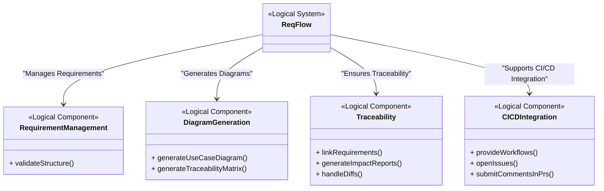

# Logical Architecture for ReqFlow

The Logical Architecture for ReqFlow defines the high-level functional organization of the tool, focusing on the main components that deliver its core functionalities. This architecture serves as the foundation for further refinement into physical architecture and system requirements.

### Explanation of the Diagram

1. ReqFlow:
   - Serves as the overarching logical system, encompassing all key components that deliver the tool’s core functionalities.

2. RequirementManagement:
   - Responsible for validating the structure of requirements to ensure compliance with conventions and rules defined in the methodology.

3. DiagramGeneration:
   - Handles the creation of visual representations, such as use case diagrams and traceability matrices, using Mermaid syntax from structured Markdown files.

4. Traceability:
   - Ensures relationships between requirements and other artifacts are maintained. It includes functionality for linking requirements, generating impact reports, and managing changes through Git diffs.

5. CICDIntegration:
   - Focuses on automating processes within CI/CD pipelines, providing GitHub workflows for tasks like validation and diagram generation. Additionally, it supports managing isssues, comments and PRs.

