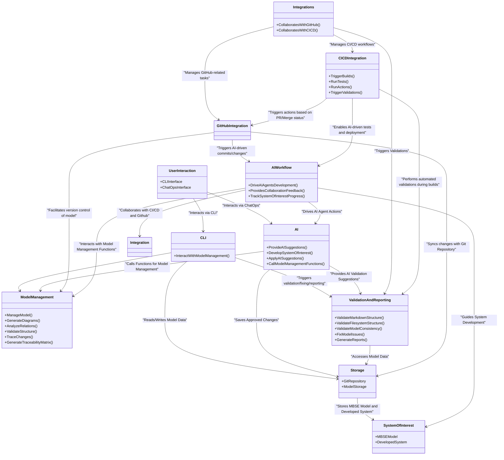

# Logical Architecture for ReqFlow

The Logical Architecture for ReqFlow defines the high-level functional organization of the tool, focusing on the main components that deliver its core functionalities. This architecture serves as the foundation for further refinement into physical architecture and system requirements.

### Explanation of the Logical Architecture

#### UserInteraction
  - Facilitates interaction through CLI and ChatOps interfaces.
  - Users can perform tasks like managing models, validating structures, and interacting with AI agents.
 
#### CLI
  - The CLI interface serves as the user-facing component that allows users to initiate interactions with the system.
  - It delegates tasks related to model management to the ModelManagement component.

#### ModelManagement
  - This is the core logical component responsible for performing the core functionalities associated with managing the MBSE model.
  - Functions include managing models, generating diagrams, analyzing relations, validating structures, and creating traceability matrices.
  - AI can also call these functions to interact with the model.

#### AI
  - Provides AI-powered suggestions for model refinement and validation.
  - In addition to suggesting changes, the AI component can also take a part in developing the SystemOfInterest.
  - It can also apply suggested changes and call ModelManagement functions to interact with the model directly.

#### AIWorkflow
  - The AIWorkflow component orchestrates AI-driven workflows that guide AI agents in the development process of the SystemOfInterest.
  - It provides feedback on collaboration between AI and CI/CD workflows and tracks the progress of the system's development.

#### ValidationAndReporting
  - This component performs checks on model consistency, structure (both filesystem and markdown), and generates reports summarizing relationships, changes, and dependencies within the MBSE model.
  - Also this component can be tasked with fixing some of consistency issues it finds.

#### Storage
  - Handles the storage of the MBSE model and developed system in Git repositories.
  - The Storage component serves as the central data source for the rest of the system, ensuring versioning and proper management of model-related data.

#### Integrations
  - The Integrations factiliates agile workflows while adhering to MBSE methodologies.
  - It manages the connection between the ReqFlow tool and external systems like GitHub and CI/CD tools, ensuring that both human users and AI agents collaborate seamlessly in an agile environment.
  - This component facilitates smooth synchronization of model changes, pull request management, automated testing, and deployment, all while ensuring the integrity of the MBSE model and system development process.

#### GitHubIntegration
  - Manages tasks related to GitHub, including monitoring pull requests (PRs), syncing branches, and handling commits.
  - Triggers AI-driven activities, such as committing changes or updating the model.

#### CICDIntegration
  - The CICDIntegration component manages the CI/CD pipeline, including triggering builds, running automated tests, and validating changes.
  - It also integrates with the AIWorkflow to enable AI-driven tests and deployments.

#### SystemOfInterest
  - The SystemOfInterest represents the real-world system being developed, which is guided by the MBSE model.
  - It includes the MBSEModel and the DevelopedSystem, both of which are versioned and stored in Git repositories.
