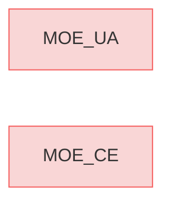

# MOEs

## Measures of Effectiveness (MOEs) and Key Performance Parameters (KPPs)

The **MOEs** and **KPPs** for **Reqvire** are designed to evaluate how effectively the methodology, toolset, and language deliver value to users and stakeholders. 
These metrics emphasize outcomes such as user adoption, operational efficiency, and community engagement, ensuring that Reqvire aligns with the needs of its open-source ecosystem.

---

### MOE_UA
**Increase User Adoption**
- Goal: Drive adoption of Reqvire within the open-source and engineering communities.
- Metric: User Adoption Rate (UA)
- Metric Calculation:  
  > UA = (Number of new projects using Reqvire / Total projects surveyed) × 100.
- Target Period: 1 year
- Target Window: 3 months
- Target Statement: Achieve a user adoption rate of X% within the first year.
- Objective: Expand Reqvire’s reach and influence in MBSE practices.

---

### MOE_CE
**Boost Community Engagement**
- Goal: Foster an active and collaborative open-source community around Reqvire.
- Metric: Contributor Engagement (CE)
- Metric Calculation:  
  > CE = (Number of active contributors / Total repository members) × 100.
- Target Period: 6 months
- Target Window: Monthly metric values averaged over the target period.
- Target Statement: Increase CE by X% over 6 months.
- Objective: Encourage contributions, feedback, and community involvement in the project’s growth.