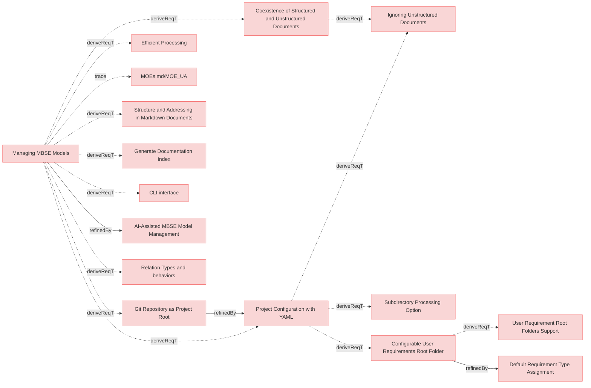

# MBSE Models Requirements

## Managing MBSE Models

---

### Coexistence of Structured and Unstructured Documents

The system shall allow structured markdown and unstructured. (eg., markdown, PDFs, DOCX, raw text) documents to coexist within the same MBSE model.

#### Relations
  * derivedFrom: [UserStories.md/Managing MBSE Models](UserStories.md#managing-mbse-models)

---

### Efficient Processing

The system shall process structured documents and relations to extract model-relevant information efficiently.

#### Relations
  * derivedFrom: [UserStories.md/Managing MBSE Models](UserStories.md#managing-mbse-models)

---

### Git Repository as Project Root

The system shall treat the **root directory of the Git repository as the project's base** for all file and folder references, streamlining configuration and promoting a self-contained project structure.

#### Details

All paths specified in the Reqvire configuration will be resolved relative to the Git repository root.

#### Relations
  * derivedFrom: [UserStories.md/Managing MBSE Models](UserStories.md#managing-mbse-models)

---

### Project Configuration with YAML

The system shall support a **YAML-based configuration file** that defines folder names and structures to be used by the tool when processing model artifacts, **relative to the Git repository root**.

#### Relations
  * derivedFrom: [UserStories.md/Managing MBSE Models](UserStories.md#managing-mbse-models)
   * refine: [Git Repository as Project Root](#git-repository-as-project-root)

---

### Configurable User Requirements Root Folder

The system shall allow users to configure a specific **root folder within the Git repository**, designated exclusively for **user requirements**.

#### Details

This folder will be specified in the `reqvire.yaml` configuration.

#### Relations
  * derivedFrom: [Project Configuration with YAML](#project-configuration-with-yaml)

---

### Default Requirement Type Assignment

The system shall automatically assign a **default type to requirements** if not explicitly specified in their `metadata`, based on their location:
* Requirements found directly within the designated "Configurable User Requirements Root Folder" (and not in its sub-folders) shall be assigned `user-requirements` type.
* Requirements found in any other folder or sub-folder within the Git repository (including sub-folders of the user requirements root) shall be assigned `system-requirements` type.

#### Relations
  * refine: [Configurable User Requirements Root Folder](#configurable-user-requirements-root-folder)

---