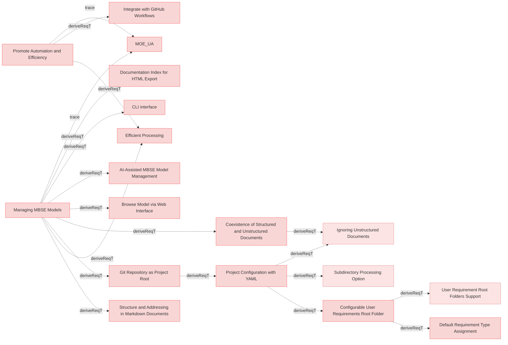

# MBSE Models Requirements

## Managing MBSE Models

### Coexistence of Structured and Unstructured Documents

The system shall allow structured markdown and unstructured. (eg., markdown, PDFs, DOCX, raw text) documents to coexist within the same MBSE model.

#### Metadata
  * type: user-requirement

#### Relations
  * derivedFrom: [Managing MBSE Models](UserStories.md#managing-mbse-models)
---

### Efficient Processing

The system shall process structured documents and relations to extract model-relevant information efficiently.

#### Metadata
  * type: user-requirement

#### Relations
  * derivedFrom: [Managing MBSE Models](UserStories.md#managing-mbse-models)
  * derivedFrom: [Promote Automation and Efficiency](MissionRequirements.md#promote-automation-and-efficiency)
---

### Git Repository as Project Root

The system shall treat the **root directory of the Git repository as the project's base** for all file and folder references, streamlining configuration and promoting a self-contained project structure.

#### Details
All paths specified in the Reqvire configuration will be resolved relative to the Git repository root.

#### Metadata
  * type: user-requirement

#### Relations
  * derivedFrom: [Managing MBSE Models](UserStories.md#managing-mbse-models)
---

### Project Configuration with YAML

DEPRECATED: This requirement is deprecated and removed. Configuration files are no longer supported.

The system shall NOT support YAML-based configuration files. All configuration is now done via hardcoded constants in the code.

#### Details
This requirement has been completely deprecated and removed from Reqvire.

**Previous behavior (deprecated):**
- System supported reqvire.yaml configuration files
- Configuration parameters included `user_requirements_root_folder` and `diagram_direction`
- Configuration files could be specified via `-c, --config` CLI option

**New behavior:**
- No configuration file support
- Configuration is done via hardcoded constants (e.g., DEFAULT_DIAGRAM_DIRECTION = "LR")
- All configuration parameters have been removed
- Element type defaults to 'requirement' regardless of file location

**Rationale for deprecation:**
- Simplifies system architecture by removing configuration layer
- Reduces complexity and potential configuration errors
- Promotes convention over configuration approach
- Makes system behavior more predictable and consistent

#### Metadata
  * type: user-requirement

#### Relations
  * derivedFrom: [Git Repository as Project Root](#git-repository-as-project-root)
---

### Configurable User Requirements Root Folder

DEPRECATED: This requirement is deprecated and will be removed in a future version.

The system shall NOT provide folder-based automatic element type assignment. Element types must be explicitly specified in metadata.

#### Details
This requirement deprecates the previous `user_requirements_root_folder` configuration parameter from `reqvire.yaml`.

The folder-based type assignment feature has been removed to simplify the system and provide more explicit control over element types. Users must now specify element types explicitly in the Metadata subsection using the `type` property.

**Rationale for deprecation:**
- Explicit type specification is clearer and less error-prone
- Removes implicit behavior that depends on file location
- Simplifies configuration and reduces confusion
- Aligns with principle of explicit over implicit configuration

#### Metadata
  * type: user-requirement

#### Relations
  * derivedFrom: [Project Configuration with YAML](#project-configuration-with-yaml)
---

### Default Requirement Type Assignment

The system shall automatically assign the **default type `requirement`** to all elements if not explicitly specified in their `metadata` subsection.

#### Details
<details>
<summary>Type Assignment Rules</summary>

When an element does not have a `#### Metadata` subsection with a `type` property, the system assigns the default type `requirement`.

**This behavior is location-independent:** All elements default to type `requirement` regardless of their folder location within the Git repository.

**To use other element types**, users must explicitly specify the type in the element's Metadata subsection:
```markdown
#### Metadata
  * type: user-requirement
```

**Supported element types:**
- `requirement` (default)
- `user-requirement`
- `verification` / `test-verification`
- `analysis-verification`
- `inspection-verification`
- `demonstration-verification`
- `other`

</details>

#### Metadata
  * type: user-requirement

#### Relations
  * derivedFrom: [Project Configuration with YAML](#project-configuration-with-yaml)
---