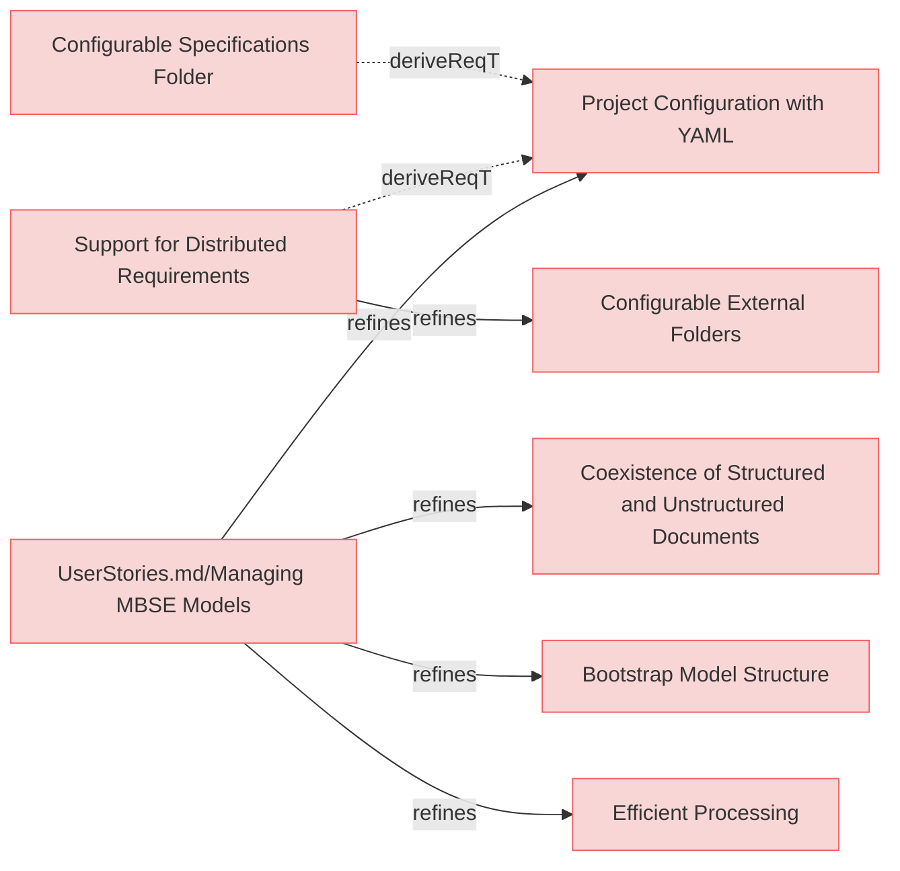

# MBSE Models Requirements

## Managing MBSE Models

---

### Coexistence of Structured and Unstructured Documents
The system shall allow structured markdown and unstructured. (eg., markdown, PDFs, DOCX, raw text) documents to coexist within the same MBSE model.

#### Relations
  * refine: [UserStories.md/Managing MBSE Models](UserStories.md#managing-mbse-models)

---

### Efficient Processing
The system shall process structured documents and relations to extract model-relevant information efficiently.

#### Relations
  * refine: [UserStories.md/Managing MBSE Models](UserStories.md#managing-mbse-models)

---

### Project Configuration with YAML
The system shall support a YAML-based configuration file that defines folder names and structures to be used by the Reqvire tool when processing model artifacts.

#### Relations
  * refine: [UserStories.md/Managing MBSE Models](UserStories.md#managing-mbse-models)

---

### Configurable Specifications Folder

The system shall allow users to configure the main specification folder through the configuration file, supporting flexible project organization.

#### Relations
  * derivedFrom: [Project Configuration with YAML](#project-configuration-with-yaml)

---

### Support for Distributed Requirements
The system shall support referencing folders that may exist in different repositories through configuration, allowing for distributed requirements management across multiple repositories.

#### Relations
  * derivedFrom: [Project Configuration with YAML](#project-configuration-with-yaml)

---

### Configurable External Folders
The system shall allow users to configure the External folders through the configuration file.

#### Relations
  * refine: [Support for Distributed Requirements](#support-for-distributed-requirements)

---

### Bootstrap Model Structure
The system shall provide a command to bootstrap a basic model structure with sample templates for common element types.

#### Relations
  * refine: [UserStories.md/Managing MBSE Models](UserStories.md#managing-mbse-models)

---