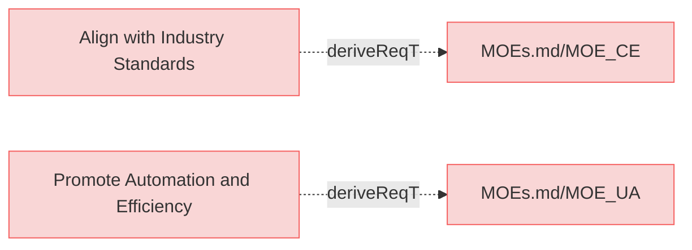

# Mission requirements
Mission requirements represent the high-level mission / enterprise  objectives, needs and measures of effectiveness, that a system must fulfill to align with the strategic goals of the organization and satisfy stakeholder expectations. 

## Requirements

---

### Align with Industry Standards
The system must adhere to widely recognized industry standards, such as ISO/IEC/IEEE 15288, to ensure compatibility and relevance in systems engineering practices.

#### Relations
  * derivedFrom: [MOEs.md/MOE_CE](MOEs.md#moe_ce)

---

### Promote Automation and Efficiency
The system must significantly reduce manual effort in managing requirements, models, and traceability by automating routine tasks.

#### Relations
  * derivedFrom: [MOEs.md/MOE_UA](MOEs.md#moe_ua)