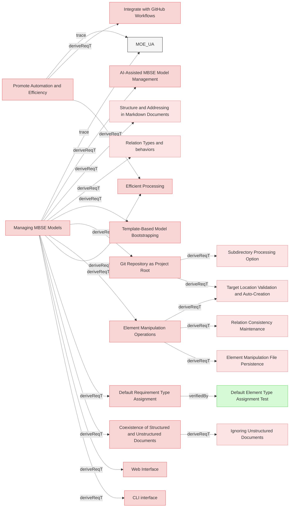

# Managing MBSE Models

## Requirements

### Coexistence of Structured and Unstructured Documents

The system shall allow structured markdown and unstructured. (eg., markdown, PDFs, DOCX, raw text) documents to coexist within the same MBSE model.

#### Metadata
  * type: user-requirement

#### Relations
  * derivedFrom: [Managing MBSE Models](UserStories.md#managing-mbse-models)
---

### Efficient Processing

The system shall process structured documents and relations to extract model-relevant information efficiently.

#### Metadata
  * type: user-requirement

#### Relations
  * derivedFrom: [Managing MBSE Models](UserStories.md#managing-mbse-models)
  * derivedFrom: [Promote Automation and Efficiency](Mission.md#promote-automation-and-efficiency)
---

### Git Repository as Project Root

The system shall treat the **root directory of the Git repository as the project's base** for all file and folder references, streamlining configuration and promoting a self-contained project structure.

#### Details
All paths specified in Reqvire commands will be resolved relative to the current working directory:
- When run from the git repository root: paths are relative to the git root
- When run from a subdirectory: paths are relative to that subdirectory, and processing is limited to files within that subdirectory scope

#### Metadata
  * type: user-requirement

#### Relations
  * derivedFrom: [Managing MBSE Models](UserStories.md#managing-mbse-models)
---

### Default Requirement Type Assignment

The system shall automatically assign the **default type `requirement`** to all elements if not explicitly specified in their `metadata` subsection.

#### Details
<details>
<summary>Type Assignment Rules</summary>

When an element does not have a `#### Metadata` subsection with a `type` property, the system assigns the default type `requirement`.

**This behavior is location-independent:** All elements default to type `requirement` regardless of their folder location within the Git repository.

**To use other element types**, users must explicitly specify the type in the element's Metadata subsection:
```markdown
#### Metadata
  * type: user-requirement
```

**Supported element types:**
- `requirement` (default)
- `user-requirement`
- `verification` / `test-verification`
- `analysis-verification`
- `inspection-verification`
- `demonstration-verification`
- `other`

</details>

#### Metadata
  * type: user-requirement

#### Relations
  * derivedFrom: [Managing MBSE Models](UserStories.md#managing-mbse-models)
---

### Template-Based Model Bootstrapping

The system shall enable systems engineers to quickly bootstrap new MBSE models from predefined templates stored in Git repositories, accelerating project initialization and promoting best-practice model structures.

#### Details
Template Bootstrapping Capabilities

Users can initialize new models using the CLI with templates from Git repositories:
- Discover available templates within a specified repository
- Select and apply templates interactively
- Bootstrap model structure with predefined files, folders, and requirements

Templates are consumed from Git repositories only, with support for repositories containing multiple templates alongside other content.

**Example usage:**
```bash
reqvire init --template <github-repo-url>
```

The system discovers all available templates in the repository and allows the user to select which template to apply.

#### Metadata
  * type: user-requirement

#### Relations
  * derivedFrom: [Managing MBSE Models](UserStories.md#managing-mbse-models)
---

### Element Manipulation Operations

The system shall provide programmatic manipulation of model elements through operations including, but not limited to, creating new elements, deleting existing elements, moving elements between locations, and renaming elements while maintaining model integrity and traceability.

#### Details
All manipulation operations shall:
- Maintain model integrity and consistency
- Update or remove affected relations automatically
- Preserve traceability where appropriate

#### Metadata
  * type: user-requirement

#### Relations
  * derivedFrom: [Managing MBSE Models](UserStories.md#managing-mbse-models)
---