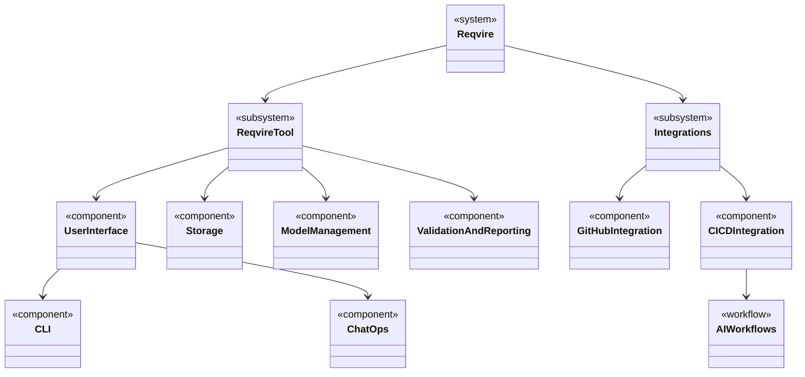

# Physical Architecture for Reqvire

The Physical Architecture represents the concrete systems, services, and components that implement the functionality of Reqvire. It defines the deployment-level structure of the tool, detailing how various components interact.

## Architecture Diagram

Logical to physical architecture mapping:

