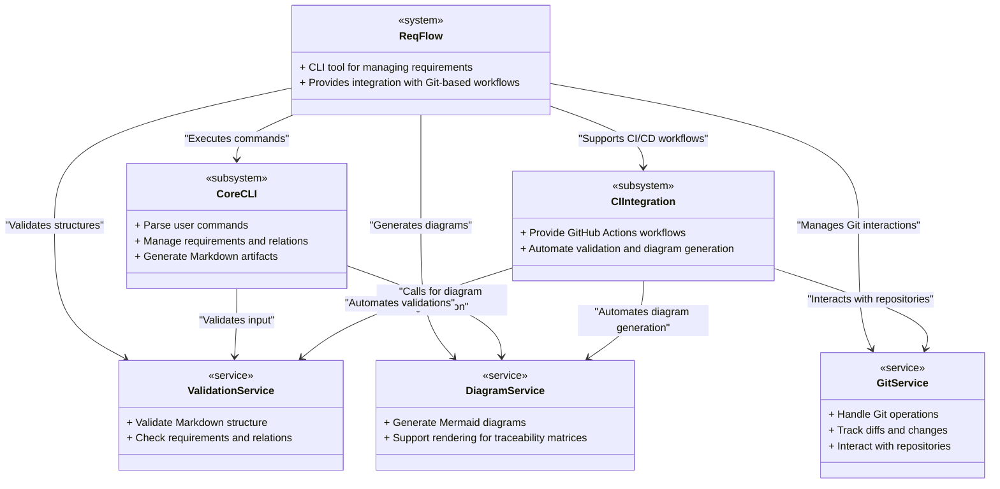

# Physical Architecture for ReqFlow

The Physical Architecture represents the concrete systems, services, and components that implement the functionality of ReqFlow. It defines the deployment-level structure of the tool, detailing how various components interact.

---

## Architecture Diagram

---

### Explanation of Physical Components

1. ReqFlow:
   - The overarching system that encapsulates all physical components.
   - Provides a CLI interface for users and integrates with CI/CD pipelines.

2. CoreCLI:
   - Parses user input and executes commands.
   - Manages requirements, relations, and artifact generation in Markdown.

3. DiagramService:
   - Handles the creation of diagrams such as use case diagrams and traceability matrices using Mermaid syntax.
   - Provides rendering support for CI/CD pipelines and local CLI usage.

4. ValidationService:
   - Validates the structure and consistency of Markdown files, ensuring requirements and relations comply with standards.
   - Provides immediate feedback during CLI operations or automated workflows.

5. CIIntegration:
   - Supplies GitHub workflows to automate validation, diagram generation, and traceability processes.
   - Enables seamless integration into Git-based CI/CD pipelines.

6. GitService:
   - Interacts with Git repositories to manage requirements stored in Markdown files.
   - Tracks diffs and changes in requirements and generates traceability summaries.

---

### Interaction and Use Cases

- Local CLI Use:
  - Users interact with the CoreCLI to manage requirements and validate their structure.
  - The DiagramService is invoked to generate diagrams for local documentation.

- CI/CD Integration:
  - The CIIntegration component automates validation and diagram generation during CI/CD pipeline runs.
  - The GitService manages repository interactions, tracking changes and ensuring traceability.

