# Provide Reports

## Requirements

```mermaid
graph LR;
  %% REQVIRE-AUTOGENERATED-DIAGRAM
  %% Graph styling
  classDef userRequirement fill:#f9d6d6,stroke:#f55f5f,stroke-width:1px;
  classDef systemRequirement fill:#fce4e4,stroke:#e68a8a,stroke-width:1px;
  classDef verification fill:#d6f9d6,stroke:#5fd75f,stroke-width:1px;
  classDef default fill:#f5f5f5,stroke:#333333,stroke-width:1px;

  fc4865d1e9b57596["Change Impact Analysis"];
  class fc4865d1e9b57596 userRequirement;
  click fc4865d1e9b57596 "Reports.md#change-impact-analysis";
  b72d56e7e360fe6c["Change Impact Analysis Verification"];
  class b72d56e7e360fe6c verification;
  click b72d56e7e360fe6c "Verifications/ChangeImpactTests.md#change-impact-analysis-verification";
  fc4865d1e9b57596 -.->|verifiedBy| b72d56e7e360fe6c;
  2a459f3a7a497b8e["Model Reports"];
  class 2a459f3a7a497b8e userRequirement;
  click 2a459f3a7a497b8e "Reports.md#model-reports";
  c1bbfdadfce7e10a["Deterministic Output for All Generated Content"];
  class c1bbfdadfce7e10a systemRequirement;
  click c1bbfdadfce7e10a "ReqvireTool/ValidationAndReporting/Reports.md#deterministic-output-for-all-generated-content";
  2a459f3a7a497b8e -.->|deriveReqT| c1bbfdadfce7e10a;
  8ebc9188f44f7785["Model Structure and Summaries"];
  class 8ebc9188f44f7785 userRequirement;
  click 8ebc9188f44f7785 "Reports.md#model-structure-and-summaries";
  c2e7b787c7b1dd99["Search Report Generator"];
  class c2e7b787c7b1dd99 systemRequirement;
  click c2e7b787c7b1dd99 "ReqvireTool/ValidationAndReporting/Reports.md#search-report-generator";
  8ebc9188f44f7785 -.->|deriveReqT| c2e7b787c7b1dd99;
  13b1d75fa43ceda2["Provide Validation Reports"];
  class 13b1d75fa43ceda2 userRequirement;
  click 13b1d75fa43ceda2 "Reports.md#provide-validation-reports";
  27e30811e4587820["Validate Command"];
  class 27e30811e4587820 systemRequirement;
  click 27e30811e4587820 "ReqvireTool/UserInterface/CLI.md#validate-command";
  13b1d75fa43ceda2 -.->|deriveReqT| 27e30811e4587820;
  7ab891515e6782ef["Validation Report Generator"];
  class 7ab891515e6782ef systemRequirement;
  click 7ab891515e6782ef "ReqvireTool/ValidationAndReporting/Reports.md#validation-report-generator";
  13b1d75fa43ceda2 -.->|deriveReqT| 7ab891515e6782ef;
  60fc330ec8dd12b6["Integrated Validation"];
  class 60fc330ec8dd12b6 systemRequirement;
  click 60fc330ec8dd12b6 "ReqvireTool/ValidationAndReporting/Validation.md#integrated-validation";
  13b1d75fa43ceda2 -.->|deriveReqT| 60fc330ec8dd12b6;
  1aba1587af87f21e["Structural Change Reports"];
  class 1aba1587af87f21e userRequirement;
  click 1aba1587af87f21e "Reports.md#structural-change-reports";
  30c2f7b2360f1dc9["Verification Coverage Report"];
  class 30c2f7b2360f1dc9 userRequirement;
  click 30c2f7b2360f1dc9 "Reports.md#verification-coverage-report";
  dba7405a40d698d9["Verification Upward Traceability"];
  class dba7405a40d698d9 userRequirement;
  click dba7405a40d698d9 "Reports.md#verification-upward-traceability";
  30c2f7b2360f1dc9 -.->|deriveReqT| dba7405a40d698d9;
  32e697e712b093ce["Verification Coverage Report Generator"];
  class 32e697e712b093ce systemRequirement;
  click 32e697e712b093ce "ReqvireTool/ValidationAndReporting/Reports.md#verification-coverage-report-generator";
  30c2f7b2360f1dc9 -.->|deriveReqT| 32e697e712b093ce;
  d9907cdae43de97a["Verification Roll-up Strategy"];
  class d9907cdae43de97a systemRequirement;
  click d9907cdae43de97a "ReqvireTool/ModelManagement/VerificationTraces.md#verification-roll-up-strategy";
  dba7405a40d698d9 -.->|deriveReqT| d9907cdae43de97a;
  c52fefea97861728["Verification Trace Builder"];
  class c52fefea97861728 systemRequirement;
  click c52fefea97861728 "ReqvireTool/ModelManagement/VerificationTraces.md#verification-trace-builder";
  dba7405a40d698d9 -.->|deriveReqT| c52fefea97861728;
  7d9bdb39c1c646f3["Logical Architecture Block"];
  class 7d9bdb39c1c646f3 default;
  click 7d9bdb39c1c646f3 "Architecture.md#logical-architecture-block";
  8abab383b0b3cde3["CLI interface"];
  class 8abab383b0b3cde3 userRequirement;
  click 8abab383b0b3cde3 "Interfaces.md#cli-interface";
  7d9bdb39c1c646f3 -.->|trace| 8abab383b0b3cde3;
  e77da96ed07d172c["Web Interface"];
  class e77da96ed07d172c userRequirement;
  click e77da96ed07d172c "Interfaces.md#web-interface";
  7d9bdb39c1c646f3 -.->|trace| e77da96ed07d172c;
  7d9bdb39c1c646f3 -.->|trace| 2a459f3a7a497b8e;
  cd2d5dab49985ca2["AI-Assisted MBSE Model Management"];
  class cd2d5dab49985ca2 userRequirement;
  click cd2d5dab49985ca2 "UserStories.md#ai-assisted-mbse-model-management";
  7d9bdb39c1c646f3 -.->|trace| cd2d5dab49985ca2;
  98eaeddc27f99e11["Integrate with GitHub Workflows"];
  class 98eaeddc27f99e11 userRequirement;
  click 98eaeddc27f99e11 "UserStories.md#integrate-with-github-workflows";
  7d9bdb39c1c646f3 -.->|trace| 98eaeddc27f99e11;
  e61b7c1baa89bfc6["Managing MBSE Models"];
  class e61b7c1baa89bfc6 userRequirement;
  click e61b7c1baa89bfc6 "UserStories.md#managing-mbse-models";
  7d9bdb39c1c646f3 -.->|trace| e61b7c1baa89bfc6;
  113748a94885138d["Validating Structures"];
  class 113748a94885138d userRequirement;
  click 113748a94885138d "UserStories.md#validating-structures";
  7d9bdb39c1c646f3 -.->|trace| 113748a94885138d;
  4f5b8eb9100ba32a["Physical Architecture Block"];
  class 4f5b8eb9100ba32a default;
  click 4f5b8eb9100ba32a "Architecture.md#physical-architecture-block";
  4f5b8eb9100ba32a -.->|trace| 8abab383b0b3cde3;
  4f5b8eb9100ba32a -.->|trace| e77da96ed07d172c;
  4f5b8eb9100ba32a -.->|trace| 2a459f3a7a497b8e;
  4f5b8eb9100ba32a -.->|trace| cd2d5dab49985ca2;
  4f5b8eb9100ba32a -.->|trace| 98eaeddc27f99e11;
  4f5b8eb9100ba32a -.->|trace| e61b7c1baa89bfc6;
  4f5b8eb9100ba32a -.->|trace| 113748a94885138d;
  6318258d140045e2["Align with Industry Standards"];
  class 6318258d140045e2 userRequirement;
  click 6318258d140045e2 "Mission.md#align-with-industry-standards";
  6318258d140045e2 -.->|deriveReqT| 13b1d75fa43ceda2;
  6e24e906a1c9d5ec["Format Consistency Enforcement"];
  class 6e24e906a1c9d5ec userRequirement;
  click 6e24e906a1c9d5ec "Validation.md#format-consistency-enforcement";
  6318258d140045e2 -.->|deriveReqT| 6e24e906a1c9d5ec;
  5e9e8e0fea56c140["Validate Cross-Component Dependencies"];
  class 5e9e8e0fea56c140 userRequirement;
  click 5e9e8e0fea56c140 "Validation.md#validate-cross-component-dependencies";
  6318258d140045e2 -.->|deriveReqT| 5e9e8e0fea56c140;
  51f3a96863c8744b["Validate Internal Consistency"];
  class 51f3a96863c8744b userRequirement;
  click 51f3a96863c8744b "Validation.md#validate-internal-consistency";
  6318258d140045e2 -.->|deriveReqT| 51f3a96863c8744b;
  11b5fe3115be7b77["Validate Markdown Structure"];
  class 11b5fe3115be7b77 userRequirement;
  click 11b5fe3115be7b77 "Validation.md#validate-markdown-structure";
  6318258d140045e2 -.->|deriveReqT| 11b5fe3115be7b77;
  377c97439aac9d3b["Validate Relation Types"];
  class 377c97439aac9d3b userRequirement;
  click 377c97439aac9d3b "Validation.md#validate-relation-types";
  6318258d140045e2 -.->|deriveReqT| 377c97439aac9d3b;
  e9ad540a6411a0fc["MOE_CE"];
  class e9ad540a6411a0fc default;
  click e9ad540a6411a0fc "MOEs.md#moe_ce";
  6318258d140045e2 -.->|trace| e9ad540a6411a0fc;
  5575b01daa5155ad["Complete Model Structure Visualization"];
  class 5575b01daa5155ad userRequirement;
  click 5575b01daa5155ad "DiagramGeneration.md#complete-model-structure-visualization";
  c1bbfdadfce7e10a -.->|deriveReqT| 5575b01daa5155ad;
  d64c45036b5300a["Interactive Mermaid Diagrams"];
  class d64c45036b5300a userRequirement;
  click d64c45036b5300a "DiagramGeneration.md#interactive-mermaid-diagrams";
  c1bbfdadfce7e10a -.->|deriveReqT| d64c45036b5300a;
  58b20ede35a77731["Model Visualization and Exploration"];
  class 58b20ede35a77731 userRequirement;
  click 58b20ede35a77731 "DiagramGeneration.md#model-visualization-and-exploration";
  c1bbfdadfce7e10a -.->|deriveReqT| 58b20ede35a77731;
  c1bbfdadfce7e10a -.->|deriveReqT| fc4865d1e9b57596;
  c1bbfdadfce7e10a -.->|deriveReqT| 8ebc9188f44f7785;
  c1bbfdadfce7e10a -.->|deriveReqT| 13b1d75fa43ceda2;
  c1bbfdadfce7e10a -.->|deriveReqT| 30c2f7b2360f1dc9;
  a43a5abca24c066c["HTML Export"];
  class a43a5abca24c066c systemRequirement;
  click a43a5abca24c066c "ReqvireTool/UserInterface/WebInterface.md#html-export";
  c1bbfdadfce7e10a -.->|deriveReqT| a43a5abca24c066c;
  c3ea27eb9d610e25["Model Linting"];
  class c3ea27eb9d610e25 userRequirement;
  click c3ea27eb9d610e25 "Validation.md#model-linting";
  c1bbfdadfce7e10a -.->|deriveReqT| c3ea27eb9d610e25;
  4137315e38ab921e["Requirements Change Propagation"];
  class 4137315e38ab921e systemRequirement;
  click 4137315e38ab921e "TraceChanges.md#requirements-change-propagation";
  4137315e38ab921e -.->|deriveReqT| fc4865d1e9b57596;
  16b284f882a920cc["Change Impact Detection Algorithm"];
  class 16b284f882a920cc systemRequirement;
  click 16b284f882a920cc "ReqvireTool/ModelManagement/ChangeImpact.md#change-impact-detection-algorithm";
  4137315e38ab921e -.->|deriveReqT| 16b284f882a920cc;
  674e6f27f5fda615["Change Impact Visualization"];
  class 674e6f27f5fda615 systemRequirement;
  click 674e6f27f5fda615 "ReqvireTool/ModelManagement/ChangeImpact.md#change-impact-visualization";
  4137315e38ab921e -.->|deriveReqT| 674e6f27f5fda615;
  5d60cdc1fa8c4bac["Smart Filtering for Change Impact Reports"];
  class 5d60cdc1fa8c4bac systemRequirement;
  click 5d60cdc1fa8c4bac "ReqvireTool/ModelManagement/ChangeImpact.md#smart-filtering-for-change-impact-reports";
  4137315e38ab921e -.->|deriveReqT| 5d60cdc1fa8c4bac;
  91a0adb0b4d959c4["Provide Reports"];
  class 91a0adb0b4d959c4 userRequirement;
  click 91a0adb0b4d959c4 "UserStories.md#provide-reports";
  91a0adb0b4d959c4 -.->|deriveReqT| 2a459f3a7a497b8e;
  91a0adb0b4d959c4 -.->|trace| e9ad540a6411a0fc;
  5ef9c8ae19a9f55a["Trace Changes in MBSE Model"];
  class 5ef9c8ae19a9f55a userRequirement;
  click 5ef9c8ae19a9f55a "UserStories.md#trace-changes-in-mbse-model";
  5ef9c8ae19a9f55a -.->|deriveReqT| 1aba1587af87f21e;
  9f47e50ee9028e7b["Tracing Structural Changes"];
  class 9f47e50ee9028e7b userRequirement;
  click 9f47e50ee9028e7b "TraceChanges.md#tracing-structural-changes";
  5ef9c8ae19a9f55a -.->|deriveReqT| 9f47e50ee9028e7b;
  2c5f30f14e792200["MOE_UA"];
  class 2c5f30f14e792200 default;
  click 2c5f30f14e792200 "MOEs.md#moe_ua";
  5ef9c8ae19a9f55a -.->|trace| 2c5f30f14e792200;
```

### Model Reports

When requested the system shall provide human readable MBSE model reports.

#### Metadata
  * type: user-requirement

#### Relations
  * derivedFrom: [Provide Reports](UserStories.md#provide-reports)
---

### Model Structure and Summaries

When requested the system shall generate reports summarizing the structure and relationships in the MBSE model, including counts and types of connections also supporting json and cypher output.

#### Metadata
  * type: user-requirement

#### Relations
  * derivedFrom: [Deterministic Output for All Generated Content](ReqvireTool/ValidationAndReporting/Reports.md#deterministic-output-for-all-generated-content)
---

### Structural Change Reports

The system shall generate detailed reports summarizing the impact of structural changes, including affected relationships and components.

#### Metadata
  * type: user-requirement

#### Relations
  * derivedFrom: [Trace Changes in MBSE Model](UserStories.md#trace-changes-in-mbse-model)
---

### Provide Validation Reports

The system shall generate detailed validation reports, highlighting any inconsistencies or errors in the MBSE model structure.

#### Details
Validation shall be performed automatically when any command requires the parsed model, eliminating the need for a separate validation command. Commands that operate on raw files shall skip validation to allow operation on potentially invalid documents.

#### Metadata
  * type: user-requirement

#### Relations
  * derivedFrom: [Align with Industry Standards](Mission.md#align-with-industry-standards)
  * derivedFrom: [Deterministic Output for All Generated Content](ReqvireTool/ValidationAndReporting/Reports.md#deterministic-output-for-all-generated-content)
---

### Verification Coverage Report

The system shall generate verification coverage reports focusing on leaf requirements (requirements that do not have forward relations to any other requirement), showing the percentage and details of verified and unverified leaf requirements, including breakdowns by file, section, and verification type.

#### Details
The verification coverage report shall provide:
- Total count of leaf requirements with breakdown by requirement type
- Count and percentage of verified leaf requirements (those with verifiedBy relations pointing to existing verification artifacts)
- Count and percentage of unverified leaf requirements
- Total count of verification artifacts with breakdown by verification type (test, analysis, inspection, demonstration)
- Count and percentage of satisfied test-verification artifacts (those with satisfiedBy relations pointing to existing test implementations)
- Count and percentage of orphaned verification artifacts (those without any verify relations to requirements)
- Detailed list of verified leaf requirements grouped by file and section
- Detailed list of unverified leaf requirements with impact analysis
- Detailed list of orphaned verifications (flagged for attention as they may be redundant or incorrectly configured)
- Output in both human-readable text and machine-readable JSON formats

The report helps track verification completeness and identify gaps in requirement verification coverage, supporting quality assurance and compliance activities.

**Coverage Philosophy:**
- **Leaf requirements** (requirements that don't derive other requirements) MUST be verified
- **Parent/intermediate requirements** MAY be verified but it's not a hard requirement as they might be covered in verification of leaf requirements
- One verification may verify multiple leaf requirements (N:1 relationship)
- The change impact analysis system propagates changes from parent requirements down to leaf requirements and their verifications
- System engineers/architects are responsible for ensuring verification scopes are broad enough to cover parent requirements when there's no dedicated parent verification
- AI systems can help create comprehensive verification scopes and prevent verification overlap

#### Metadata
  * type: user-requirement

#### Relations
  * derivedFrom: [Deterministic Output for All Generated Content](ReqvireTool/ValidationAndReporting/Reports.md#deterministic-output-for-all-generated-content)
---

### Change Impact Analysis

When requested the system shall generate change impact report, in Markdown format by default and also supporting json output.

#### Metadata
  * type: user-requirement

#### Relations
  * derivedFrom: [Requirements Change Propagation](TraceChanges.md#requirements-change-propagation)
  * derivedFrom: [Deterministic Output for All Generated Content](ReqvireTool/ValidationAndReporting/Reports.md#deterministic-output-for-all-generated-content)
---

### Verification Upward Traceability

The system shall provide upward traceability visualization from verifications to root requirements, showing the complete requirement hierarchy and indicating which requirements are directly verified.

#### Details
**Used for identifying redundant verifications**: When a verification directly verifies both a leaf requirement and its parent requirement, this creates a redundant relation that adds noise into the model and may be removed from the parent - verifying the leaf requirement is sufficient since it traces upward to the parent. This keeps verification placement at the most specific level.

#### Metadata
  * type: user-requirement

#### Relations
  * derivedFrom: [Verification Coverage Report](#verification-coverage-report)
---