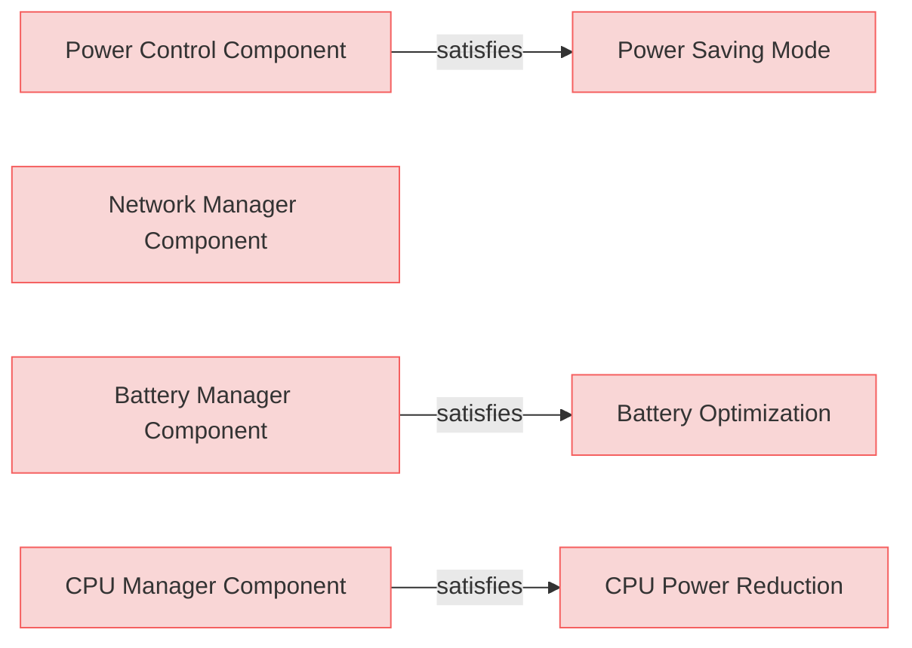
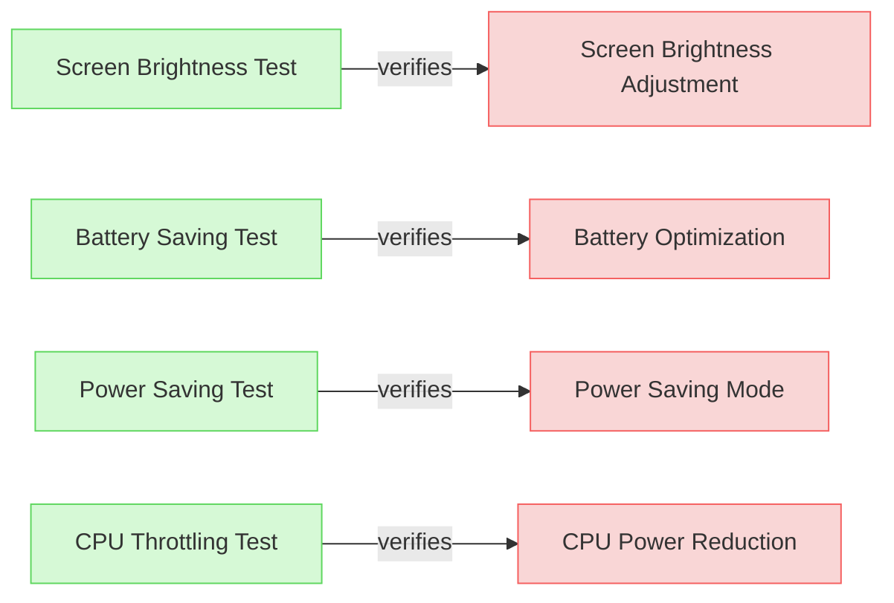
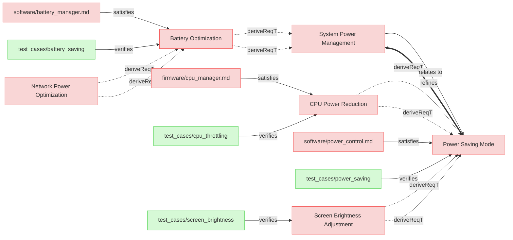

# System Requirements

This file should be processed.

## Implementation Elements

### Power Control Component

Power control component.

### CPU Manager Component
 
CPU Manager component.

### Battery Manager Component

Battery manager component.

### Network Manager Component

Network manager component.

## Verification Elements

### Power Saving Test

Power saving test.

#### Metadata
  * type: verification

### CPU Throttling Test

Cpu Throttling test.

#### Metadata
  * type: verification

### Screen Brightness Test

Screen brightness test new.

#### Metadata
  * type: verification

### Battery Saving Test

Battery Saving test.

#### Metadata
  * type: verification

## Requirements

### System Power Management

System Power Management text.

---

### Power Saving Mode

The systems shall activate power-saving mode when the battery level drops below 20%.  

#### Relations
  * refine: [System Power Management](#system-power-management)
  * satisfiedBy: [software/power_control.md](#power-control-component)
  * verifiedBy: [test_cases/power_saving](#power-saving-test)

---

### CPU Power Reduction

The system shall reduce CPU frequency by 30% in power-saving mode.  

#### Relations
  * derivedFrom: [Power Saving Mode](#power-saving-mode)
  * satisfiedBy: [firmware/cpu_manager.md](#cpu-manager-component)
  * verifiedBy: [test_cases/cpu_throttling](#cpu-throttling-test)

---

### Screen Brightness Adjustment

The system shall reduce screen brightness by 40% in power-saving mode.  

#### Relations
  * derivedFrom: [Power Saving Mode](#power-saving-mode)
  * verifiedBy: [test_cases/screen_brightness](#screen-brightness-test)

---

### Battery Optimization

The system shall disable non-essential background services when battery levels drop below 15%.  

#### Relations
  * derivedFrom: [System Power Management](#system-power-management)
  * satisfiedBy: [software/battery_manager.md](#battery-manager-component)
  * verifiedBy: [test_cases/battery_saving](#battery-saving-test)

---

### Network Power Optimization
The system shall reduce network polling frequency when battery levels drop below 15%.  

#### Relations
  * derivedFrom: [Battery Optimization](#battery-optimization)