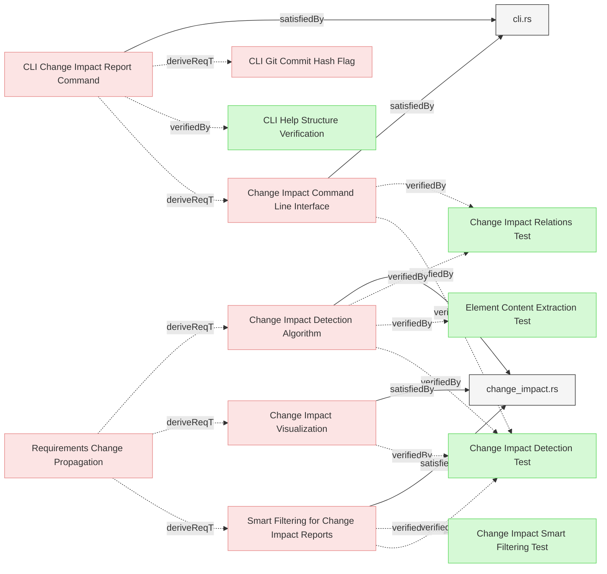
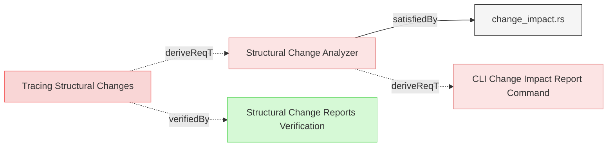

# Change Impact Detection

This document defines the detailed requirements for the change impact detection algorithm and visualization in Reqvire.

## Change Impact Detection Components

### Change Impact Detection Algorithm

The system shall implement a requirement change detection algorithm that identifies changes between versions of the model and determines their impact through relationship traversal.

#### Details
The algorithm shall consist of the following steps:

1. **Diff Analysis**:
   - Compare the current state of a requirement with its previous state
   - Identify structural changes (additions, deletions, modifications)
   - Generate a ChangeSet representing all detected changes
   - Associate changes with specific elements in the model

2. **Impact Determination**:
   - For each changed element, identify all relations from the element
   - Apply relation-specific propagation rules as defined in RelationTypesRegistry.md
   - Consider the relation direction and change impact direction for each relation
   - Build an impact tree representing the propagation of changes

3. **Recursive Traversal**:
   - Perform a depth-first traversal of relationships
   - Create a directed acyclic graph (DAG) of change impact
   - Handle circular dependencies by preventing infinite recursion
   - Track visited nodes to prevent duplicate processing

4. **Impact Classification**:
   - Assign impact severity levels based on relation types
   - Classify changes as:
     - Direct: Changes to the element itself
     - Indirect: Changes propagated from related elements
     - Potential: Changes that might affect an element based on semantic analysis
   - Calculate aggregated impact scores for each affected element

6. **Performance Optimization**:
   - Implement caching of traversal results
   - Use parallel processing for independent branches of the impact tree
   - Apply pruning techniques to limit traversal depth when appropriate
   - Support incremental impact analysis for large models

#### Relations
  * derivedFrom: [Requirements Change Propagation](../../SpecificationsRequirements.md#requirements-change-propagation)
  * satisfiedBy: [change_impact.rs](../../../core/src/change_impact.rs)
---

### Change Impact Visualization

The system shall provide visual representations of change impact to help users understand the scope and implications of changes.

#### Details
The visualization shall include:

1. **Tree View**:
   - Display a hierarchical tree of affected elements
   - Group elements by impact type (direct, indirect, potential)
   - Show relation types between elements
   - Support collapsing/expanding nodes for better navigation

2. **Color Coding**:
   - Use consistent color scheme for impact types:
     - Direct impacts: Red
     - Indirect impacts: Yellow
     - Potential impacts: Blue
   - Indicate relation types with different line styles
   - Highlight newly introduced or removed relationships

3. **Interactive Elements**:
   - Allow clicking on elements to focus the view

4. **Summary Statistics**:
   - Display counts of affected elements by type
   - Show metrics for impact breadth and depth
   - Calculate change propagation fan-out metrics
   - Generate overall change impact assessment

#### Relations
  * derivedFrom: [Requirements Change Propagation](../../SpecificationsRequirements.md#requirements-change-propagation)
  * satisfiedBy: [change_impact.rs](../../../core/src/change_impact.rs)
  * verifiedBy: [Change Impact Detection Test](../../Verifications/ChangeImpactTests.md#change-impact-detection-test)
---

### Smart Filtering for Change Impact Reports

The system shall implement intelligent filtering logic to eliminate redundant information from change impact reports and focus on primary changes and their relationships.

#### Details
<details>
<summary>View Full Specification</summary>


The smart filtering shall implement the following logic:

1. **Primary Change Detection**:
   - Distinguish between primary changes (elements that are modified, added, or removed as the main focus) and secondary changes (elements that appear in relations of primary changes)
   - Filter out elements that are already referenced in the relations of other elements to prevent duplicate entries
   - Apply filtering to both new-to-new and changed-to-changed element relationships

2. **Comprehensive Filtering Rules**:
   - **Eliminate Redundant New Elements**: If a new element is referenced in the relations of another new or changed element, do not show it separately in the "New Elements" section
   - **Eliminate Redundant Changed Elements**: If a changed element is referenced in the relations of another changed element, do not show it separately in the "Changed Elements" section  
   - **Show Only Independent Elements**: Elements should only appear in their own section if they are not already covered by relationships from other elements in the same report
   - **Relation Context Marking**: When displaying relations, mark elements that are new with "(new)" suffix and changed elements with "⚠️" symbol to provide context about the status of relation targets

3. **Cross-Category Filtering**:
   - Apply filtering across all categories (new, changed, removed)
   - A changed element referenced by another changed element should not appear as standalone
   - A new element referenced by a changed element should not appear as standalone
   - Preserve the most informative context for each filtered element

4. **Hierarchical Organization**:
   - Present changes in order of importance: modified elements first, then independent new elements, then removed elements
   - Group related changes together to show impact chains clearly
   - Maintain complete traceability while reducing visual clutter

5. **Benefits**:
   - **Reduced Clutter**: Eliminates redundant information that appears in multiple places
   - **Improved Focus**: Readers can quickly identify primary changes without scanning duplicate entries
   - **Clear Context**: Elements are shown in their most relevant relationship context
   - **Better Readability**: Reports are more concise while maintaining complete information

#### Enhanced Filtering Examples

**Example 1: New Element Filtering**

Before Smart Filtering:
```
New Elements:
- Element A (new)
- Element B (new)  
- Element C (new)

Changed Elements:
- Element X
  Relations:
  * derivedFrom: Element A
  * verifiedBy: Element B
```

After Smart Filtering:
```
Changed Elements:
- Element X
  Relations:
  * derivedFrom: Element A (new)
  * verifiedBy: Element B (new)

New Elements:
- Element C (new)
```

**Example 2: Changed Element Filtering**

Before Smart Filtering:
```
Changed Elements:
- Power Saving Mode (changed)
  Relations:
  * verifiedBy: Power Saving
- Power Saving (changed)
```

After Smart Filtering:
```
Changed Elements:
- Power Saving Mode (changed)
  Relations:
  * verifiedBy: Power Saving ⚠️
```

**Example 3: Cross-Category Filtering**

Before Smart Filtering:
```
New Elements:
- New Verification (new)

Changed Elements:
- Updated Requirement (changed)
  Relations:
  * verifiedBy: New Verification
- New Verification (new)
```

After Smart Filtering:
```
Changed Elements:
- Updated Requirement (changed)
  Relations:
  * verifiedBy: New Verification (new)
```

</details>

#### Relations
  * derivedFrom: [Requirements Change Propagation](../../SpecificationsRequirements.md#requirements-change-propagation)
  * satisfiedBy: [change_impact.rs](../../../core/src/change_impact.rs)
---

### Change Impact Command Line Interface

The system shall provide a command-line interface for initiating change impact analysis and controlling output formats.

#### Details
The CLI shall support the following functionality:

1. **Analysis Invocation**:
   - Support analyzing changes between git commits
   - Enable specifying elements to analyze by ID or pattern
   - Allow limiting analysis to specific relation types
   - Support depth limitations for large models

2. **Output Formats**:
   - Generate formatted text reports
   - Produce JSON-structured impact data
   - Create Mermaid diagrams of impact trees
   - Integrate with HTML report generation

3. **Integration Points**:
   - Support integration with CI/CD pipelines
   - Enable calling from external systems via API
   - Support webhook triggers for automated analysis
   - Allow scripting of analysis operations

#### Relations
  * derivedFrom: [CLI Change Impact Report Command](../UserInterface/CLI.md#cli-change-impact-report-command)
  * satisfiedBy: [cli.rs](../../../cli/src/cli.rs)
---

## Change Analysis Requirements

### Structural Change Analyzer

The system shall implement a model change analyzer that identifies structural modifications between model versions, determines affected elements through relationship traversal, and categorizes impacts according to change propagation rules.

#### Relations
  * derivedFrom: [Tracing Structural Changes](../../UserRequirements.md#tracing-structural-changes)
  * satisfiedBy: [change_impact.rs](../../../core/src/change_impact.rs)
---