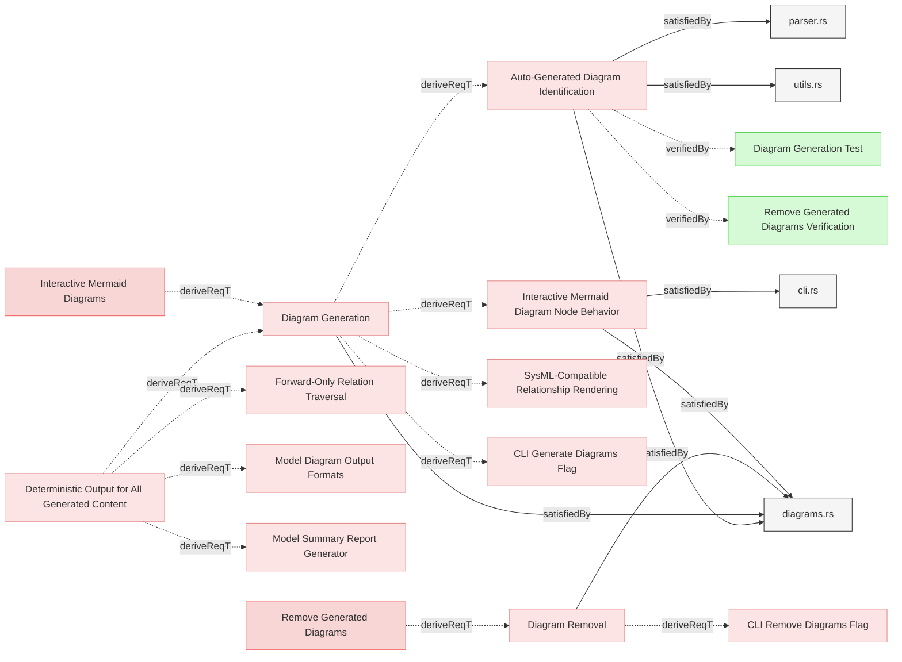
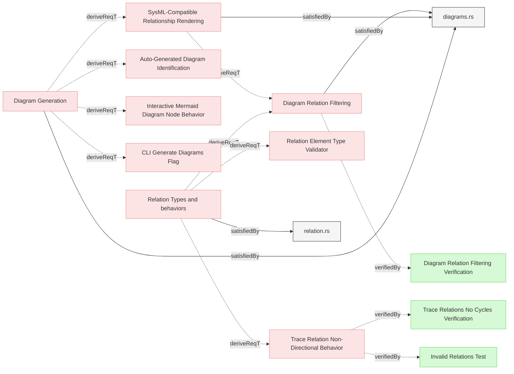

# Diagram Generation

## Diagram Management

### Diagram Generation

When requested, the system shall automatically generate diagrams and save them to the required locations of the model.

#### Relations
  * derivedFrom: [Interactive Mermaid Diagrams](../../UserRequirements.md#interactive-mermaid-diagrams)
  * derivedFrom: [Deterministic Output for All Generated Content](../ValidationAndReporting/Reports.md#deterministic-output-for-all-generated-content)
  * satisfiedBy: [diagrams.rs](../../../core/src/diagrams.rs)
---

### Auto-Generated Diagram Identification

The system shall embed a unique identification marker "REQVIRE-AUTOGENERATED-DIAGRAM" as a comment within all auto-generated mermaid diagrams to distinguish them from user-created diagrams for reliable filtering and removal operations.

#### Details
The marker must be:
- Embedded as a mermaid comment line using the `%% REQVIRE-AUTOGENERATED-DIAGRAM` format
- Present in every auto-generated diagram
- Used by diagram removal functionality to identify which diagrams to remove
- Not present in user-created custom diagrams

This enables the system to:
- Reliably identify auto-generated diagrams regardless of their location in documents
- Preserve user-created diagrams during removal operations
- Support mixed documents containing both auto-generated and custom diagrams

#### Relations
  * derivedFrom: [Diagram Generation](#diagram-generation)
  * satisfiedBy: [diagrams.rs](../../../core/src/diagrams.rs)
  * satisfiedBy: [utils.rs](../../../core/src/utils.rs)
  * satisfiedBy: [parser.rs](../../../core/src/parser.rs)
  * verifiedBy: [Diagram Generation Test](../../Verifications/DiagramsTests.md#diagram-generation-test)
  * verifiedBy: [Remove Generated Diagrams Verification](../../Verifications/DiagramsTests.md#remove-generated-diagrams-verification)
---

### Diagram Removal

When requested, the system shall remove all generated diagrams from the model by locating and deleting all mermaid code blocks that were automatically generated.

#### Relations
  * derivedFrom: [Remove Generated Diagrams](../../UserRequirements.md#remove-generated-diagrams)
  * satisfiedBy: [diagrams.rs](../../../core/src/diagrams.rs)
---

### Interactive Mermaid Diagram Node Behavior

The system shall implement interactive click behavior for Mermaid diagram nodes that redirects to the referenced element.

#### Details
Clickable mermaid diagrams links by default must use relative links to the git repository.

CLI flag options must be provided that can change default behavior to use stable github repository links:
  * diagrams click links are not working on Github if not using stable github repository links
  * from another side that pollutes PR diffs thus choice must be given to the user
  * Commands that generate diagrams (`generate-diagrams`, `export`, `serve`) must expose `--links-with-blobs` CLI flag for that purpose
  * The flag defaults to `false` (use relative paths)

When generating diagram node links and when `--links-with-blobs` flag is set to `true`, the system shall:
- Use stable git repository links (`{repository-url}/blob/{commit-hash}/{file-path}`) when git repository information is available
- Fallback to relative markdown links when git repository information is not available
- Use the current commit hash to ensure links remain stable even as the repository evolves
- Match the same link format used in traceability matrices and change impact reports
- Preserve interactive behavior across all generated diagrams

The `traces` command shall always use relative paths (hardcoded to `false`, no flag needed).

The `change-impact` command shall continue to use GitHub blob URLs by default (unchanged behavior).

#### Relations
  * derivedFrom: [Diagram Generation](#diagram-generation)
  * satisfiedBy: [diagrams.rs](../../../core/src/diagrams.rs)
  * satisfiedBy: [cli.rs](../../../cli/src/cli.rs)
---

## Diagram Rendering

### SysML-Compatible Relationship Rendering

The system shall implement a relationship rendering engine that adheres to SysML notation standards, defining specific arrow styles, line types, and visual properties for each relationship type to ensure diagram consistency and standards compliance.

#### Details
The visual representation and direction of relationships in diagrams aligns with the SysML specification.
Each relationship is represented using SysML standard notation with a specified arrow direction.
derive (Forward):
- Definition: Links a parent element to child elements derived from it.
- Notation: Dashed arrow with an open arrowhead.
- Arrow Direction: Parent → Child (derived)
- Used when: Parent element wants to show its derived children

derivedFrom (Backward):
- Definition: Links a child element to the parent element it is derived from.
- Notation: Dashed arrow with an open arrowhead.
- Arrow Direction: Child → Parent (source)
- Used when: Child element references its source parent

verify (Backward):
- Definition: Links a verification artifact to the requirement it verifies.
- Notation: Dashed arrow with an open arrowhead.
- Arrow Direction: Verification → Requirement
- Used when: Test/verification references the requirement it validates

verifiedBy (Forward):
- Definition: Links a requirement to verification artifacts.
- Notation: Dashed arrow with an open arrowhead.
- Arrow Direction: Requirement → Verification
- Used when: Requirement shows how it's verified

satisfy (Backward):
- Definition: Links an implementation to the requirement it satisfies.
- Notation: Solid arrow with an open arrowhead.
- Arrow Direction: Implementation → Requirement
- Used when: Implementation references the requirement it satisfies

satisfiedBy (Forward):
- Definition: Links a requirement to elements that satisfy it.
- Notation: Solid arrow with an open arrowhead.
- Arrow Direction: Requirement → Implementation
- Used when: Requirement shows how it's implemented

trace (Neutral):
- Definition: Shows a general traceability relationship without implying hierarchy.
- Notation: Dashed arrow with an open arrowhead.
- Arrow Direction: Tracing → Traced (neutral)
- Used when: Simple traceability connection is needed

**Summary Table**
| Relation        | Stereotype     | Line style            | Arrowhead               | Arrow Direction                   | Hierarchy Direction |
|-----------------|----------------|-----------------------|-------------------------|-----------------------------------|-------------------- |
| **derive**      | «deriveReqt»   | dashed dependency     | open (hollow) arrowhead | Parent → Child (derived)          | Forward             |
| **derivedFrom** | «deriveReqt»   | dashed dependency     | open (hollow) arrowhead | Child → Parent (source)           | Backward            |
| **satisfy**     | «satisfy»      | solid dependency      | open (hollow) arrowhead | Implementation → Requirement      | Backward            |
| **satisfiedBy** | «satisfy»      | solid dependency      | open (hollow) arrowhead | Requirement → Implementation      | Forward             |
| **verify**      | «verify»       | dashed dependency     | open (hollow) arrowhead | Verification → Requirement        | Backward            |
| **verifiedBy**  | «verify»       | dashed dependency     | open (hollow) arrowhead | Requirement → Verification        | Forward             |
| **trace**       | «trace»        | dashed dependency     | open (hollow) arrowhead | Tracing → Traced (neutral)        | Forward             |

#### Relations
  * derivedFrom: [Diagram Generation](#diagram-generation)
  * satisfiedBy: [diagrams.rs](../../../core/src/diagrams.rs)
---

### Diagram Relation Filtering

The system shall implement relation filtering in diagram generation to render only forward relations while ensuring complete element hierarchy representation starting from top-level parent elements.

#### Details
When generating diagrams, the system shall apply the following relation filtering rules:

1. **Diagram Relation Filtering**: Only relations specified in the DIAGRAM_RELATIONS list shall be rendered to prevent duplicate arrows representing the same logical relationship
2. **Complete Hierarchy Inclusion**: When any element in a hierarchical chain is included in a section, all parent elements up to the root of the hierarchy shall be automatically included in the diagram
3. **List-Based Rendering**: Relations shall be rendered according to the DIAGRAM_RELATIONS list which defines which relation from each opposite pair should be shown

The filtering ensures that:
- Bidirectional relationships (e.g., `derivedFrom`/`derive`) appear as single arrows using the relation specified in DIAGRAM_RELATIONS
- Hierarchical context is preserved by including parent elements even if they belong to different sections
- Diagram readability is maintained while accurately representing the complete model structure

#### Relations
  * derivedFrom: [SysML-Compatible Relationship Rendering](#sysml-compatible-relationship-rendering)
  * derivedFrom: [Relation Types and behaviors](../../SpecificationsRequirements.md#relation-types-and-behaviors)
  * satisfiedBy: [diagrams.rs](../../../core/src/diagrams.rs)
---

### Trace Relation Non-Directional Behavior

The system shall treat trace relations as non-directional for circular dependency detection while maintaining their traceability purpose, ensuring that trace relations do not participate in cycle detection algorithms.

#### Details
The trace relation behavior shall include:

1. **Circular Dependency Exclusion**:
   - Trace relations shall not be traversed during circular dependency detection
   - The cycle detection algorithm shall skip trace relations to prevent false positive cycles
   - Trace relations exist solely for traceability and documentation purposes

2. **Non-Propagation Behavior**:
   - Changes shall not propagate through trace relations
   - Trace relations shall not be included in change impact analysis
   - Impact trees shall not traverse trace relation connections

3. **Bidirectional Traceability**:
   - Trace relations shall provide bidirectional navigational capability
   - Users can navigate from source to target and target to source
   - Both directions are semantically equivalent for traceability purposes

4. **Validation Behavior**:
   - Trace relations shall be validated for target existence
   - Trace relations shall not require type compatibility validation
   - Trace relations can connect any element type to any other element type

This ensures that trace relations serve their intended purpose of establishing lightweight traceability connections without creating artificial dependency constraints or participating in architectural validation logic.

#### Relations
  * derivedFrom: [Relation Types and behaviors](../../SpecificationsRequirements.md#relation-types-and-behaviors)
  * verifiedBy: [Invalid Relations Test](../../Verifications/ValidationTests.md#invalid-relations-test)
  * verifiedBy: [Trace Relations No Cycles Verification](../../Verifications/TraceRelationTests.md#trace-relations-no-cycles-verification)
---