# Element Manipulation

## Element Manipulation

```mermaid
graph LR;
  %% REQVIRE-AUTOGENERATED-DIAGRAM
  %% Graph styling
  classDef userRequirement fill:#f9d6d6,stroke:#f55f5f,stroke-width:1px;
  classDef systemRequirement fill:#fce4e4,stroke:#e68a8a,stroke-width:1px;
  classDef verification fill:#d6f9d6,stroke:#5fd75f,stroke-width:1px;
  classDef default fill:#f5f5f5,stroke:#333333,stroke-width:1px;

  b8373b7489450d74["Create Element Operation"];
  class b8373b7489450d74 systemRequirement;
  click b8373b7489450d74 "ElementManipulation.md#create-element-operation";
  b6d8b456400fff51["CLI Add Element Command"];
  class b6d8b456400fff51 systemRequirement;
  click b6d8b456400fff51 "../UserInterface/CLI.md#cli-add-element-command";
  b8373b7489450d74 -.->|deriveReqT| b6d8b456400fff51;
  80defdd4cbc7ee18["cli.rs"];
  class 80defdd4cbc7ee18 default;
  click 80defdd4cbc7ee18 "../../../cli/src/cli.rs";
  b8373b7489450d74 -->|satisfiedBy| 80defdd4cbc7ee18;
  ea4ba0d9ffba93a5["crud.rs"];
  class ea4ba0d9ffba93a5 default;
  click ea4ba0d9ffba93a5 "../../../core/src/crud.rs";
  b8373b7489450d74 -->|satisfiedBy| ea4ba0d9ffba93a5;
  e69395f926bba6a5["diff.rs"];
  class e69395f926bba6a5 default;
  click e69395f926bba6a5 "../../../core/src/diff.rs";
  b8373b7489450d74 -->|satisfiedBy| e69395f926bba6a5;
  b7c871ab64a7059a["graph_registry.rs"];
  class b7c871ab64a7059a default;
  click b7c871ab64a7059a "../../../core/src/graph_registry.rs";
  b8373b7489450d74 -->|satisfiedBy| b7c871ab64a7059a;
  f22d93285fcd7664["parser.rs"];
  class f22d93285fcd7664 default;
  click f22d93285fcd7664 "../../../core/src/parser.rs";
  b8373b7489450d74 -->|satisfiedBy| f22d93285fcd7664;
  ce2625feec883e55["utils.rs"];
  class ce2625feec883e55 default;
  click ce2625feec883e55 "../../../core/src/utils.rs";
  b8373b7489450d74 -->|satisfiedBy| ce2625feec883e55;
  487744115c3b8763["Create Element Test"];
  class 487744115c3b8763 verification;
  click 487744115c3b8763 "../../Verifications/ElementManipulationTests.md#create-element-test";
  b8373b7489450d74 -.->|verifiedBy| 487744115c3b8763;
  7b3f37efb9540d9b["Delete Element Operation"];
  class 7b3f37efb9540d9b systemRequirement;
  click 7b3f37efb9540d9b "ElementManipulation.md#delete-element-operation";
  a2a1d528d199817e["CLI Remove Element Command"];
  class a2a1d528d199817e systemRequirement;
  click a2a1d528d199817e "../UserInterface/CLI.md#cli-remove-element-command";
  7b3f37efb9540d9b -.->|deriveReqT| a2a1d528d199817e;
  80defdd4cbc7ee18["cli.rs"];
  class 80defdd4cbc7ee18 default;
  click 80defdd4cbc7ee18 "../../../cli/src/cli.rs";
  7b3f37efb9540d9b -->|satisfiedBy| 80defdd4cbc7ee18;
  ea4ba0d9ffba93a5["crud.rs"];
  class ea4ba0d9ffba93a5 default;
  click ea4ba0d9ffba93a5 "../../../core/src/crud.rs";
  7b3f37efb9540d9b -->|satisfiedBy| ea4ba0d9ffba93a5;
  e69395f926bba6a5["diff.rs"];
  class e69395f926bba6a5 default;
  click e69395f926bba6a5 "../../../core/src/diff.rs";
  7b3f37efb9540d9b -->|satisfiedBy| e69395f926bba6a5;
  b7c871ab64a7059a["graph_registry.rs"];
  class b7c871ab64a7059a default;
  click b7c871ab64a7059a "../../../core/src/graph_registry.rs";
  7b3f37efb9540d9b -->|satisfiedBy| b7c871ab64a7059a;
  ea26ad174cd5ac61["Delete Element Test"];
  class ea26ad174cd5ac61 verification;
  click ea26ad174cd5ac61 "../../Verifications/ElementManipulationTests.md#delete-element-test";
  7b3f37efb9540d9b -.->|verifiedBy| ea26ad174cd5ac61;
  8c290d5566457ba5["Element Manipulation File Persistence"];
  class 8c290d5566457ba5 systemRequirement;
  click 8c290d5566457ba5 "ElementManipulation.md#element-manipulation-file-persistence";
  8c290d5566457ba5 -.->|deriveReqT| b8373b7489450d74;
  8c290d5566457ba5 -.->|deriveReqT| 7b3f37efb9540d9b;
  19d15f2fe6e8fe9b["Move Element Operation"];
  class 19d15f2fe6e8fe9b systemRequirement;
  click 19d15f2fe6e8fe9b "ElementManipulation.md#move-element-operation";
  8c290d5566457ba5 -.->|deriveReqT| 19d15f2fe6e8fe9b;
  8e80e227a441c46["Move File Operation"];
  class 8e80e227a441c46 systemRequirement;
  click 8e80e227a441c46 "ElementManipulation.md#move-file-operation";
  8c290d5566457ba5 -.->|deriveReqT| 8e80e227a441c46;
  7254f47bef365922["Rename Element Operation"];
  class 7254f47bef365922 systemRequirement;
  click 7254f47bef365922 "ElementManipulation.md#rename-element-operation";
  8c290d5566457ba5 -.->|deriveReqT| 7254f47bef365922;
  ea4ba0d9ffba93a5["crud.rs"];
  class ea4ba0d9ffba93a5 default;
  click ea4ba0d9ffba93a5 "../../../core/src/crud.rs";
  8c290d5566457ba5 -->|satisfiedBy| ea4ba0d9ffba93a5;
  b7c871ab64a7059a["graph_registry.rs"];
  class b7c871ab64a7059a default;
  click b7c871ab64a7059a "../../../core/src/graph_registry.rs";
  8c290d5566457ba5 -->|satisfiedBy| b7c871ab64a7059a;
  ddab12b49502390f["File Persistence Test"];
  class ddab12b49502390f verification;
  click ddab12b49502390f "../../Verifications/ElementManipulationTests.md#file-persistence-test";
  8c290d5566457ba5 -.->|verifiedBy| ddab12b49502390f;
  35312fa2d2840fdf["CLI Move Element Command"];
  class 35312fa2d2840fdf systemRequirement;
  click 35312fa2d2840fdf "../UserInterface/CLI.md#cli-move-element-command";
  19d15f2fe6e8fe9b -.->|deriveReqT| 35312fa2d2840fdf;
  80defdd4cbc7ee18["cli.rs"];
  class 80defdd4cbc7ee18 default;
  click 80defdd4cbc7ee18 "../../../cli/src/cli.rs";
  19d15f2fe6e8fe9b -->|satisfiedBy| 80defdd4cbc7ee18;
  ea4ba0d9ffba93a5["crud.rs"];
  class ea4ba0d9ffba93a5 default;
  click ea4ba0d9ffba93a5 "../../../core/src/crud.rs";
  19d15f2fe6e8fe9b -->|satisfiedBy| ea4ba0d9ffba93a5;
  e69395f926bba6a5["diff.rs"];
  class e69395f926bba6a5 default;
  click e69395f926bba6a5 "../../../core/src/diff.rs";
  19d15f2fe6e8fe9b -->|satisfiedBy| e69395f926bba6a5;
  b7c871ab64a7059a["graph_registry.rs"];
  class b7c871ab64a7059a default;
  click b7c871ab64a7059a "../../../core/src/graph_registry.rs";
  19d15f2fe6e8fe9b -->|satisfiedBy| b7c871ab64a7059a;
  66c3ddd461235ef["Move Element Test"];
  class 66c3ddd461235ef verification;
  click 66c3ddd461235ef "../../Verifications/ElementManipulationTests.md#move-element-test";
  19d15f2fe6e8fe9b -.->|verifiedBy| 66c3ddd461235ef;
  8dd370d72a06cb18["CLI Move File Command"];
  class 8dd370d72a06cb18 systemRequirement;
  click 8dd370d72a06cb18 "../UserInterface/CLI.md#cli-move-file-command";
  8e80e227a441c46 -.->|deriveReqT| 8dd370d72a06cb18;
  6e51f6f72fa9376a["Relation Consistency Maintenance"];
  class 6e51f6f72fa9376a systemRequirement;
  click 6e51f6f72fa9376a "ElementManipulation.md#relation-consistency-maintenance";
  b7c871ab64a7059a["graph_registry.rs"];
  class b7c871ab64a7059a default;
  click b7c871ab64a7059a "../../../core/src/graph_registry.rs";
  6e51f6f72fa9376a -->|satisfiedBy| b7c871ab64a7059a;
  361ae6c3b78f5624["Relation Consistency Test"];
  class 361ae6c3b78f5624 verification;
  click 361ae6c3b78f5624 "../../Verifications/ElementManipulationTests.md#relation-consistency-test";
  6e51f6f72fa9376a -.->|verifiedBy| 361ae6c3b78f5624;
  7b46a079724dce38["CLI Rename Element Command"];
  class 7b46a079724dce38 systemRequirement;
  click 7b46a079724dce38 "../UserInterface/CLI.md#cli-rename-element-command";
  7254f47bef365922 -.->|deriveReqT| 7b46a079724dce38;
  ea4ba0d9ffba93a5["crud.rs"];
  class ea4ba0d9ffba93a5 default;
  click ea4ba0d9ffba93a5 "../../../core/src/crud.rs";
  7254f47bef365922 -->|satisfiedBy| ea4ba0d9ffba93a5;
  e69395f926bba6a5["diff.rs"];
  class e69395f926bba6a5 default;
  click e69395f926bba6a5 "../../../core/src/diff.rs";
  7254f47bef365922 -->|satisfiedBy| e69395f926bba6a5;
  b7c871ab64a7059a["graph_registry.rs"];
  class b7c871ab64a7059a default;
  click b7c871ab64a7059a "../../../core/src/graph_registry.rs";
  7254f47bef365922 -->|satisfiedBy| b7c871ab64a7059a;
  d907f7d20af9a6f1["Target Location Validation and Auto-Creation"];
  class d907f7d20af9a6f1 systemRequirement;
  click d907f7d20af9a6f1 "ElementManipulation.md#target-location-validation-and-auto-creation";
  d907f7d20af9a6f1 -.->|deriveReqT| b8373b7489450d74;
  d907f7d20af9a6f1 -.->|deriveReqT| 19d15f2fe6e8fe9b;
  d907f7d20af9a6f1 -.->|deriveReqT| 8e80e227a441c46;
  b7c871ab64a7059a["graph_registry.rs"];
  class b7c871ab64a7059a default;
  click b7c871ab64a7059a "../../../core/src/graph_registry.rs";
  d907f7d20af9a6f1 -->|satisfiedBy| b7c871ab64a7059a;
  ce2625feec883e55["utils.rs"];
  class ce2625feec883e55 default;
  click ce2625feec883e55 "../../../core/src/utils.rs";
  d907f7d20af9a6f1 -->|satisfiedBy| ce2625feec883e55;
  1b8a1cc85b265679["Target Location Validation Test"];
  class 1b8a1cc85b265679 verification;
  click 1b8a1cc85b265679 "../../Verifications/ElementManipulationTests.md#target-location-validation-test";
  d907f7d20af9a6f1 -.->|verifiedBy| 1b8a1cc85b265679;
  e8d8647a359063b1["Element Manipulation Operations"];
  class e8d8647a359063b1 userRequirement;
  click e8d8647a359063b1 "../../ModelManagement.md#element-manipulation-operations";
  e8d8647a359063b1 -.->|deriveReqT| 8c290d5566457ba5;
  e8d8647a359063b1 -.->|deriveReqT| 6e51f6f72fa9376a;
  e8d8647a359063b1 -.->|deriveReqT| d907f7d20af9a6f1;
  d8b261376275b6b9["Git Repository as Project Root"];
  class d8b261376275b6b9 userRequirement;
  click d8b261376275b6b9 "../../ModelManagement.md#git-repository-as-project-root";
  d8b261376275b6b9 -.->|deriveReqT| d907f7d20af9a6f1;
  8e1ebba79e760691["Subdirectory Processing Option"];
  class 8e1ebba79e760691 systemRequirement;
  click 8e1ebba79e760691 "../UserInterface/CLI.md#subdirectory-processing-option";
  d8b261376275b6b9 -.->|deriveReqT| 8e1ebba79e760691;
  64143b69e6c0e251["Ignore Files Integration"];
  class 64143b69e6c0e251 systemRequirement;
  click 64143b69e6c0e251 "../Configuration.md#ignore-files-integration";
  64143b69e6c0e251 -.->|deriveReqT| d907f7d20af9a6f1;
  8419dcc77d92b609["config.rs"];
  class 8419dcc77d92b609 default;
  click 8419dcc77d92b609 "../../../cli/src/config.rs";
  64143b69e6c0e251 -->|satisfiedBy| 8419dcc77d92b609;
  55e6d839dbcc7077["File Exclusion Test"];
  class 55e6d839dbcc7077 verification;
  click 55e6d839dbcc7077 "../../Verifications/ValidationTests.md#file-exclusion-test";
  64143b69e6c0e251 -.->|verifiedBy| 55e6d839dbcc7077;
  df3d1e30a948a4e0["Structure of Markdown Documents"];
  class df3d1e30a948a4e0 systemRequirement;
  click df3d1e30a948a4e0 "../../Structure/SpecificationsRequirements.md#structure-of-markdown-documents";
  df3d1e30a948a4e0 -.->|deriveReqT| b8373b7489450d74;
  a814c4935e1a0449["element.rs"];
  class a814c4935e1a0449 default;
  click a814c4935e1a0449 "../../../core/src/element.rs";
  df3d1e30a948a4e0 -->|satisfiedBy| a814c4935e1a0449;
  d50a859650933e55["model.rs"];
  class d50a859650933e55 default;
  click d50a859650933e55 "../../../core/src/model.rs";
  df3d1e30a948a4e0 -->|satisfiedBy| d50a859650933e55;
  f22d93285fcd7664["parser.rs"];
  class f22d93285fcd7664 default;
  click f22d93285fcd7664 "../../../core/src/parser.rs";
  df3d1e30a948a4e0 -->|satisfiedBy| f22d93285fcd7664;
  9450d4313f47ef36["relation.rs"];
  class 9450d4313f47ef36 default;
  click 9450d4313f47ef36 "../../../core/src/relation.rs";
  df3d1e30a948a4e0 -->|satisfiedBy| 9450d4313f47ef36;
  398003c91b6b2cde["subsection.rs"];
  class 398003c91b6b2cde default;
  click 398003c91b6b2cde "../../../core/src/subsection.rs";
  df3d1e30a948a4e0 -->|satisfiedBy| 398003c91b6b2cde;
  735766802775ec41["Format Command Requirements Verification"];
  class 735766802775ec41 verification;
  click 735766802775ec41 "../../Verifications/Misc.md#format-command-requirements-verification";
  df3d1e30a948a4e0 -.->|verifiedBy| 735766802775ec41;
  b0d0999636b025fa["Invalid Header Structure Test"];
  class b0d0999636b025fa verification;
  click b0d0999636b025fa "../../Verifications/ValidationTests.md#invalid-header-structure-test";
  df3d1e30a948a4e0 -.->|verifiedBy| b0d0999636b025fa;
```

### Element Manipulation File Persistence

The system shall persist all element manipulation operations to the source files in storage, synchronizing changes from the in-memory model to the file system to ensure data durability.

#### Details
When element manipulation operations are performed, the system shall:
- Track which files have been modified during manipulation operations
- Flush modified files to storage after manipulation operations complete
- Update only the files that were actually modified (optimization)
- Ensure file content on disk reflects the current state of the in-memory model
- Maintain file format and structure during write operations
- Handle file I/O errors gracefully with appropriate error reporting

**Optimization Strategy:**
- The system may maintain a list of modified files during manipulation operations
- Only files marked as modified need to be written to storage
- Unmodified files shall not be rewritten to avoid unnecessary I/O operations

**Synchronization Guarantee:**
- After a manipulation operation completes successfully, all changes shall be persisted to disk
- The on-disk representation shall match the in-memory model state
- No changes shall be lost due to lack of persistence

#### Relations
  * derivedFrom: [Element Manipulation Operations](../../ModelManagement.md#element-manipulation-operations)
  * satisfiedBy: [graph_registry.rs](../../../core/src/graph_registry.rs)
  * satisfiedBy: [crud.rs](../../../core/src/crud.rs)
---

### Target Location Validation and Auto-Creation

The system shall validate target file paths for element manipulation operations and automatically create files and sections when they do not exist, subject to path safety constraints.

#### Details
When validating and preparing target locations, the system shall:

**Path Validation:**
- Verify the target file path is not excluded by `.gitignore` patterns
- Verify the target file path is not excluded by `.reqvireignore` patterns
- Verify the file path nesting depth does not exceed 10 subdirectories from the git repository root
- Reject operations with invalid paths and provide clear error messages

**Auto-Creation:**
- If the target file does not exist and the path is valid, create the file with proper structure:
  - Add level 1 header based on filename (e.g., `# Requirements` for `Requirements.md`)
  - Add level 2 section header if section name is provided
- If the target file exists but the specified section does not exist, add the section header
- Ensure created files and sections follow Reqvire markdown structure conventions

**Error Handling:**
- Report error if path would be ignored by `.gitignore` or `.reqvireignore`
- Report error if path nesting exceeds 10 subdirectories
- Report error if file path is invalid or inaccessible
- Provide specific error message indicating which constraint was violated

#### Relations
  * derivedFrom: [Element Manipulation Operations](../../ModelManagement.md#element-manipulation-operations)
  * derivedFrom: [Ignore Files Integration](../Configuration.md#ignore-files-integration)
  * derivedFrom: [Git Repository as Project Root](../../ModelManagement.md#git-repository-as-project-root)
  * satisfiedBy: [utils.rs](../../../core/src/utils.rs)
  * satisfiedBy: [graph_registry.rs](../../../core/src/graph_registry.rs)
---

### Create Element Operation

The system shall provide the capability to create new model elements by accepting a full element definition string in Markdown format, validating the element structure and relations, and inserting it into the specified location if valid.

#### Details
When creating a new element, the system shall:
- Accept a string containing the full element definition in Markdown format (including ### header, metadata, relations, and content)
- Accept target location: file path and section name
- Accept optional index parameter for insertion position within section (0-based)
- Validate the target location using path validation rules
- Create target file and/or section if they do not exist (subject to validation constraints)
- Parse the element definition string to extract element structure
- Validate the element structure (proper subsections, valid relations, correct format)
- Verify the element name is unique within the target file
- Generate a unique element identifier based on file path and element name
- **Validate and normalize all relations in the element:**
  - Parse relation targets from the markdown (may be relative paths or repo-relative paths)
  - Normalize relation targets to be relative to the git repository root
  - Validate that each relation target element exists in the model
  - Reject the operation if any relation target does not exist
  - Provide clear error messages indicating which relation target was not found
- If validation passes, insert the element into the specified file and section:
  - If index is provided and valid, insert at that position within the section
  - If index is not provided or out of bounds, append to the end of the section
- If validation fails, reject the operation and report validation errors
- Maintain file structure and formatting after insertion

**Relation Validation Rules:**
- Relation targets may be specified as:
  - Relative paths from the target file location (e.g., `../UserReqs.md#requirement`)
  - Paths relative to git repository root (e.g., `specifications/UserReqs.md#requirement`)
  - Same-file references (e.g., `#other-requirement`)
- All relation targets must be normalized to git repository root relative format before insertion
- All relation targets must reference existing elements in the model
- External links (http://, https://, etc.) are allowed and not validated

#### Relations
  * derivedFrom: [Element Manipulation File Persistence](#element-manipulation-file-persistence)
  * derivedFrom: [Target Location Validation and Auto-Creation](#target-location-validation-and-auto-creation)
  * derivedFrom: [Structure of Markdown Documents](../../Structure/SpecificationsRequirements.md#structure-of-markdown-documents)
  * satisfiedBy: [parser.rs](../../../core/src/parser.rs)
  * satisfiedBy: [graph_registry.rs](../../../core/src/graph_registry.rs)
  * satisfiedBy: [crud.rs](../../../core/src/crud.rs)
  * satisfiedBy: [diff.rs](../../../core/src/diff.rs)
  * satisfiedBy: [cli.rs](../../../cli/src/cli.rs)
  * satisfiedBy: [utils.rs](../../../core/src/utils.rs)
---

### Delete Element Operation

The system shall provide the capability to delete existing model elements while automatically removing or updating all relations that reference the deleted element, and removing empty files when no elements remain.

#### Details
When deleting an element, the system shall:
- Remove the element and all its content from the source file
- Identify all relations pointing to the deleted element (incoming relations)
- Remove all relations that reference the deleted element from other elements
- Identify all relations from the deleted element (outgoing relations)
- Remove the complete element section including separators
- Maintain file structure and formatting after deletion
- Provide a report of all relations that were affected by the deletion

**Empty File Cleanup:**
- After deleting the element, check if the source file contains any remaining elements
- If no elements remain and all sections are empty (only page content, headers, or whitespace), remove the file from the filesystem
- If the file is removed, report the file deletion in the operation output

**Relation Handling:**
- All `derivedFrom` relations pointing to the deleted element shall be removed
- All `verifiedBy` relations pointing to the deleted element shall be removed
- All `verify` relations pointing to the deleted element shall be removed
- All `satisfiedBy` relations pointing to the deleted element shall be removed
- Relations from the deleted element are automatically removed with the element

#### Relations
  * derivedFrom: [Element Manipulation File Persistence](#element-manipulation-file-persistence)
  * satisfiedBy: [graph_registry.rs](../../../core/src/graph_registry.rs)
  * satisfiedBy: [crud.rs](../../../core/src/crud.rs)
  * satisfiedBy: [diff.rs](../../../core/src/diff.rs)
  * satisfiedBy: [cli.rs](../../../cli/src/cli.rs)
---

### Move Element Operation

The system shall provide the capability to move existing model elements to different locations (file and/or section) while automatically updating all relations that reference the moved element, creating target locations if needed, and removing empty source files when no elements remain.

#### Details
When moving an element, the system shall:
- Validate the target location using path validation rules
- Create target file and/or section if they do not exist (subject to validation constraints)
- Remove the element from the source location (file and section)
- Accept optional index parameter for insertion position within target section (0-based)
- Insert the element into the target location (file and section):
  - If index is provided and valid, insert at that position within the target section
  - If index is not provided or out of bounds, append to the end of the target section
- Preserve all element content, metadata, and relations
- Update the element's identifier to reflect the new location
- Identify all relations pointing to the moved element (incoming relations)
- Update all relations that reference the moved element with the new identifier
- Maintain file structure and formatting in both source and target files
- Ensure the element name is unique within the target file
- Provide a report of all relations that were updated

**Empty Source File Cleanup:**
- After moving the element, check if the source file contains any remaining elements
- If no elements remain and all sections are empty (only page content, headers, or whitespace), remove the source file from the filesystem
- If the file is removed, report the file deletion in the operation output

**Relation Update Requirements:**
- All relations (both forward and backward) pointing to the moved element shall be updated to the new identifier
- Relations within the moved element (outgoing relations) shall be preserved unchanged

**Identifier Update:**
- The element's identifier changes from `<old-file>#<element-name>` to `<new-file>#<element-name>`
- All references to the old identifier shall be updated to the new identifier

#### Relations
  * derivedFrom: [Element Manipulation File Persistence](#element-manipulation-file-persistence)
  * derivedFrom: [Target Location Validation and Auto-Creation](#target-location-validation-and-auto-creation)
  * satisfiedBy: [graph_registry.rs](../../../core/src/graph_registry.rs)
  * satisfiedBy: [crud.rs](../../../core/src/crud.rs)
  * satisfiedBy: [diff.rs](../../../core/src/diff.rs)
  * satisfiedBy: [cli.rs](../../../cli/src/cli.rs)
---

### Move File Operation

The system shall provide the capability to move entire specification files with all their elements to a new location in the repository while updating all relation references throughout the model.

#### Details
When moving a file, the system shall:
- Accept source file path (relative to git repository root)
- Accept target file path (relative to git repository root)
- Validate both source and target paths
- Move the physical file from source to target location
- Update all element identifiers within the file to reflect the new file path
- Update all relation references (both forward and backward) throughout the model that point to any element in the moved file
- Preserve all file content, structure, and formatting

The system shall reject the operation with a clear error message if:
- The source file does not exist
- The target file already exists
- The source or target paths fail validation

#### Relations
  * derivedFrom: [Element Manipulation File Persistence](#element-manipulation-file-persistence)
  * derivedFrom: [Target Location Validation and Auto-Creation](#target-location-validation-and-auto-creation)
---

### Relation Consistency Maintenance

The system shall maintain bidirectional relation consistency when elements are manipulated, ensuring that forward and backward relations remain synchronized.

#### Details
When manipulating elements, the system shall ensure:
- If element A derives from element B, then B must have a derive relation to A
- If element A is verified by verification V, then V must have a verify relation to A
- When an element is deleted, both forward and backward relations are removed
- When an element is moved, both forward and backward relations are updated
- After any manipulation operation, the model remains in a valid state with no dangling relations

**Validation:**
- The system shall validate relation consistency after each manipulation operation
- The system shall report any inconsistencies detected during manipulation
- The system shall prevent operations that would leave the model in an inconsistent state

#### Relations
  * derivedFrom: [Element Manipulation Operations](../../ModelManagement.md#element-manipulation-operations)
  * satisfiedBy: [graph_registry.rs](../../../core/src/graph_registry.rs)
---

### Rename Element Operation

The system shall provide the capability to rename existing model elements by changing their heading text while updating all relation references and the registry.

#### Details
When renaming an element, the system shall:
- Accept the current element name and the new element name
- Validate that the current element exists in the model registry
- Validate that the new name is globally unique in the model registry
- Update the element's heading text in the markdown file
- Update all relation references (both forward and backward) to use the new element identifier
- Update the element identifier in the registry

The system shall reject the operation with a clear error message if:
- The element does not exist
- The new name conflicts with an existing element

#### Relations
  * derivedFrom: [Element Manipulation File Persistence](#element-manipulation-file-persistence)
  * satisfiedBy: [graph_registry.rs](../../../core/src/graph_registry.rs)
  * satisfiedBy: [crud.rs](../../../core/src/crud.rs)
  * satisfiedBy: [diff.rs](../../../core/src/diff.rs)
---