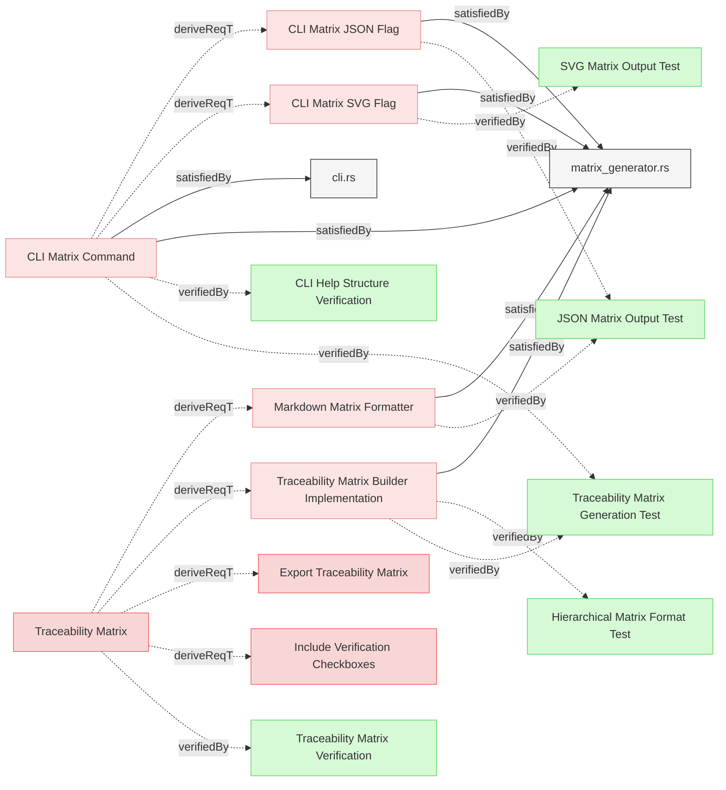
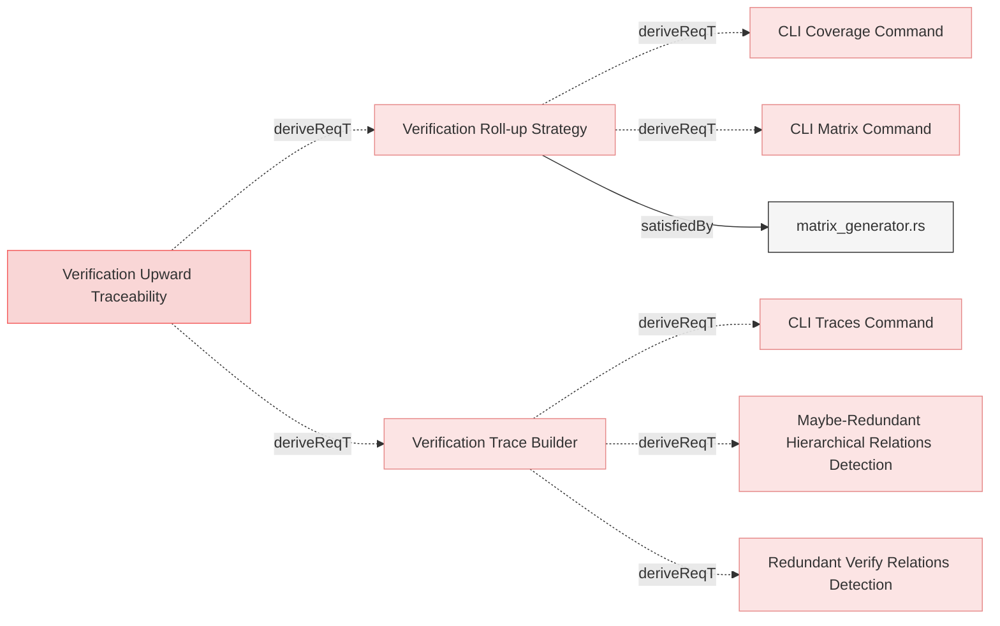

# Traceability Matrix

## Traceability Matrix Implementation

### Traceability Matrix Builder Implementation

The system shall implement a traceability matrix builder component that extracts relationship data from the model, processes it according to configured parameters, and generates structured matrix representations showing connections between requirements and other elements.

#### Details
The traceability matrix shall be organized into multiple tables, with one table per root requirement (requirements without parents). This organization improves readability by grouping related requirements together.

Each table shall have the following structure:
- The first column shows the requirement name as a markdown link to its location in the git repository using the current commit hash
- Requirements shall be displayed in a hierarchical structure with parent-child relationships clearly indicated
- Child requirements shall be indented to show their relationship to parent requirements using arrow and underscore characters:
  - Level 1 (direct children): "↳ " (right arrow followed by a space)
  - Level 2 (grandchildren): "__↳ " (two underscores, then arrow and space)
  - Level 3 (great-grandchildren): "____↳ " (four underscores, then arrow and space)
  - Deeper levels: "______↳ " (six underscores, then arrow and space)
- The second column shows the verification status with a green checkmark "✅" if verified by at least one verification element, or "❌" if not verified
- The subsequent columns represent individual verification elements that verify requirements in this group, with each element name displayed as a markdown link to its location in the git repository
- Each row represents a requirement within the group
- Cell intersections show the relationship between requirements and verifications with a green checkmark "✅" where a relationship exists or empty where no relationship exists
- The matrix shall be rendered as a markdown table for human readability
- The JSON format shall be available for machine processing with all identifiers relative to the repository root

The links in the matrix shall use the git repository URL with the current commit hash to ensure that links remain stable even as the repository evolves. The format shall be similar to that used in the change impact report.

#### Relations
  * derivedFrom: [Traceability Matrix](../../UserRequirements.md#traceability-matrix)
  * satisfiedBy: [matrix_generator.rs](../../../core/src/matrix_generator.rs)
---

### Markdown Matrix Formatter

The system shall implement a markdown formatter for traceability matrices that produces well-structured, readable markdown tables conforming to the Reqvire markdown-first methodology.

#### Relations
  * derivedFrom: [Traceability Matrix](../../UserRequirements.md#traceability-matrix)
  * satisfiedBy: [matrix_generator.rs](../../../core/src/matrix_generator.rs)
---

### CLI Matrix JSON Flag

The system shall provide a JSON output option for verification traceability matrices, activated by the `--json` command option flag when used with `matrix` command.

#### Details
The JSON output shall:
- Only be available when the `matrix` command is used
- Cannot be used together with the --svg command option flag (they are mutually exclusive)
- Include metadata about sources and targets
- Include matrix data mapping source requirements to target verifications
- Include verification status for each requirement using [Verification Roll-up Strategy](#verification-roll-up-strategy)
- Provide structured data suitable for programmatic processing

#### Relations
  * derivedFrom: [CLI Matrix Command](../UserInterface/CLI.md#cli-matrix-command)
  * satisfiedBy: [matrix_generator.rs](../../../core/src/matrix_generator.rs)
  * verifiedBy: [JSON Matrix Output Test](../../Verifications/TreacibilityMatrix.md#json-matrix-output-test)
---

### CLI Matrix SVG Flag

The system shall provide an SVG output option for verification traceability matrices, activated by the `--svg` command option flag when used with `matrix` command, which shall generate a simplified SVG representation of the matrix that can be viewed directly or embedded in documents.

#### Details
The SVG output of the verification traceability matrix shall have the following characteristics:
- It shall only be available when the `matrix` command is used
- It cannot be used together with the --json command option flag (they are mutually exclusive)
- It shall display full element names instead of truncated names with ellipses
- It shall dynamically adjust column widths based on the maximum element name length to ensure all text is readable
- It shall not include hyperlinks to elements in the git repository
- It shall maintain the same hierarchical structure as the markdown version
- It shall use visual indicators for verification status following [Verification Roll-up Strategy](#verification-roll-up-strategy)
- Verification columns shall be sorted alphabetically by verification identifier for deterministic output
- The output shall be in a self-contained SVG format suitable for embedding in other documents

#### Relations
  * derivedFrom: [CLI Matrix Command](../UserInterface/CLI.md#cli-matrix-command)
  * satisfiedBy: [matrix_generator.rs](../../../core/src/matrix_generator.rs)
  * verifiedBy: [SVG Matrix Output Test](../../Verifications/TreacibilityMatrix.md#svg-matrix-output-test)
---

## Verification Traceability

### Verification Trace Builder

The system shall provide functionality to build upward trace trees from verification elements by traversing all upward parent relations to reach root requirements, merging all paths into a single tree structure with marked directly-verified requirements.

#### Relations
  * derivedFrom: [Verification Upward Traceability](../../UserRequirements.md#verification-upward-traceability)
---

### Verification Roll-up Strategy

The system shall implement a verification roll-up strategy where parent requirements are considered verified based on the verification status of their child requirements.

#### Details
The roll-up strategy shall work as follows:
- When a requirement has children (through derivedFrom relations), it is considered verified if ALL of its child requirements are verified, regardless of whether the parent has direct verifiedBy relations
- When a requirement has no children (leaf requirement), it is considered verified if it has direct verifiedBy relations
- A parent with any unverified child shall be marked as unverified (❌), even if the parent itself has direct verification
- Verification status rolls up from leaf requirements through the entire parent chain to root requirements
- This strategy applies to all verification matrices, coverage reports, and trace outputs

#### Relations
  * derivedFrom: [Verification Upward Traceability](../../UserRequirements.md#verification-upward-traceability)
  * satisfiedBy: [matrix_generator.rs](../../../core/src/matrix_generator.rs)
---