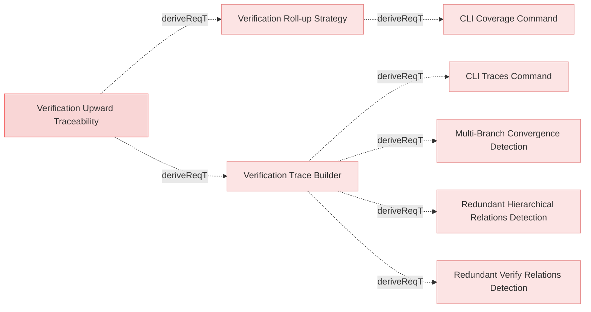

# Verification Traces

## Verification Traceability

### Verification Trace Builder

The system shall provide functionality to build upward trace trees from verification elements by traversing all upward parent relations to reach root requirements, merging all paths into a single tree structure with marked directly-verified requirements.

#### Relations
  * derivedFrom: [Verification Upward Traceability](../../Reports.md#verification-upward-traceability)
---

### Verification Roll-up Strategy

The system shall implement a verification roll-up strategy where parent requirements are considered verified based on the verification status of their child requirements.

#### Details
The roll-up strategy shall work as follows:
- When a requirement has children (through derivedFrom relations), it is considered verified if ALL of its child requirements are verified, regardless of whether the parent has direct verifiedBy relations
- When a requirement has no children (leaf requirement), it is considered verified if it has direct verifiedBy relations
- A parent with any unverified child shall be marked as unverified (❌), even if the parent itself has direct verification
- Verification status rolls up from leaf requirements through the entire parent chain to root requirements
- This strategy applies to all verification matrices, coverage reports, and trace outputs

#### Relations
  * derivedFrom: [Verification Upward Traceability](../../Reports.md#verification-upward-traceability)
---