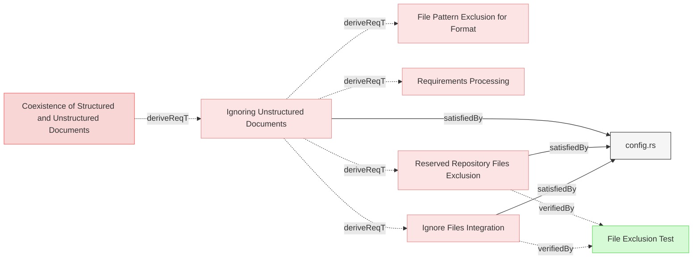
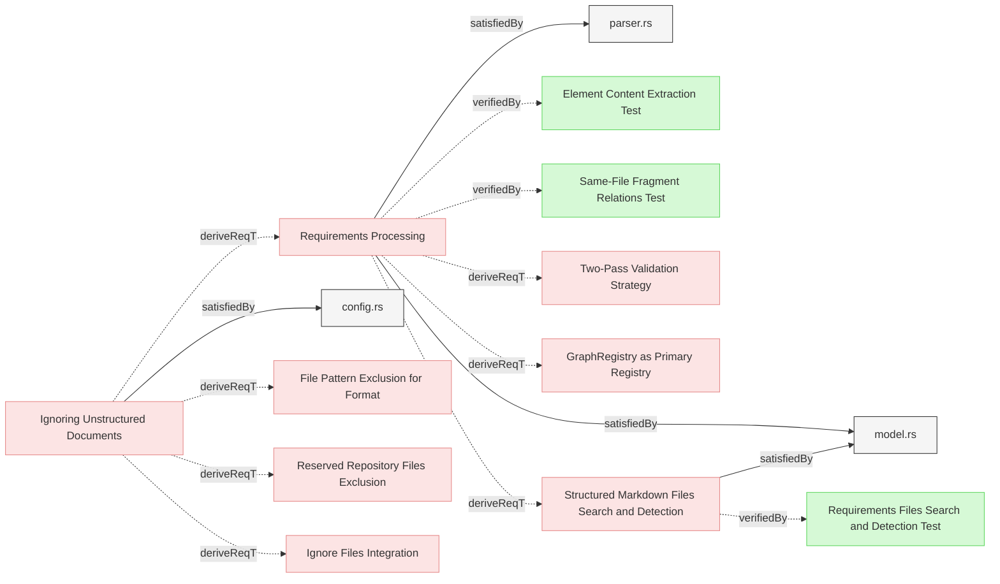

# Configuration

## File Exclusion Configuration

### Ignoring Unstructured Documents

The system shall support configurable glob patterns to exclude specific files from requirement processing.

#### Details
Exclusion patterns are defined in `.reqvireignore` file at the repository root, using the same format as `.gitignore`:

```.reqvireignore
# Example patterns to exclude from structured documents processing
**/Logical*.md
**/Physical*.md
**/draft-*.md
examples/**
```

The `.reqvireignore` file provides Reqvire-specific exclusions for files that should remain in version control but not be processed as requirements.

#### Relations
  * derivedFrom: [Coexistence of Structured and Unstructured Documents](../../UserRequirements.md#coexistence-of-structured-and-unstructured-documents)
  * satisfiedBy: [config.rs](../../../cli/src/config.rs)
---

### Ignore Files Integration

The system shall read exclusion patterns from the repository root .gitignore file and .reqvireignore file to automatically exclude files from requirement processing.

#### Details
Reqvire integrates with Git workflows by respecting exclusion patterns from two sources:
- **`.gitignore`** - Version control exclusions (files not tracked by Git)
- **`.reqvireignore`** - Reqvire-specific exclusions (files tracked by Git but excluded from requirements processing)

Both ignore files use standard gitignore pattern syntax to exclude files from being parsed as structured markdown (requirements/verifications). However, they differ in an important way:

- **`.gitignore`**: Files matching these patterns are **completely excluded** - they cannot be parsed as structured markdown AND cannot be referenced in file relations to elements
- **`.reqvireignore`**: Files matching these patterns are excluded from structured markdown parsing BUT **can still be referenced** in file relations to elements (useful for design documents, diagrams, or other supporting files that you want to link to but not parse)

**Rules:**
- ONLY the root .gitignore file shall be used (not nested .gitignore files in subdirectories)
- ONLY the root .reqvireignore file shall be used (not nested .reqvireignore files in subdirectories)
- .reqvireignore shall use the same format and syntax as .gitignore
- Patterns from .gitignore and .reqvireignore shall be combined
- Files matching ANY exclusion pattern (from .gitignore or .reqvireignore) shall be excluded from parsing as requirements
- Files excluded by .gitignore shall NOT be usable as relation targets (internal-path type) since they don't exist in the repository
- Files excluded by .reqvireignore shall remain usable as relation targets (internal-path type) since they exist in the repository but are not parsed as requirements
- If .reqvireignore does not exist, the system shall process normally using only .gitignore patterns
- If .gitignore does not exist, the system shall process normally using only .reqvireignore patterns

**Rationale:**
- `.gitignore` integration ensures anything not tracked by version control is also excluded from requirements processing
- `.reqvireignore` provides flexibility to exclude specific files from requirements processing while keeping them in version control (e.g., draft specifications, example files, or documentation that shouldn't be processed as requirements)
- Using a `.reqvireignore` file follows the established convention that developers are familiar with from `.gitignore`, making it more intuitive
- File-based exclusion patterns are more maintainable than configuration-based approaches

#### Relations
  * derivedFrom: [Ignoring Unstructured Documents](#ignoring-unstructured-documents)
  * satisfiedBy: [config.rs](../../../cli/src/config.rs)
---

### Reserved Repository Files Exclusion

The system shall automatically exclude certain common repository documentation files from structured markdown processing.

#### Details
The following reserved filenames are always excluded from structured markdown processing, as they are typically used for general repository documentation purposes rather than system requirements:

- `README.md`
- `CHANGELOG.md`, `CHANGES.md`
- `CONTRIBUTING.md`
- `LICENSE.md`
- `CODE_OF_CONDUCT.md`
- `SECURITY.md`
- `AUTHORS.md`
- `ROADMAP.md`

**Rules:**
- Reserved filenames shall be automatically excluded from structured markdown parsing across the entire repository
- Reserved files can still be referenced in file relations to elements (they are excluded from parsing but can be linked to)
- The exclusion of reserved filenames shall be combined with .gitignore and .reqvireignore patterns
- Files matching reserved filenames shall be excluded from parsing regardless of .gitignore or .reqvireignore configuration

**Rationale:**
- These files serve general repository documentation purposes and should not be processed as structured requirements
- Standard repository files like README.md or LICENSE.md contain free-form documentation rather than structured requirements
- Automatically excluding these files prevents confusion and reduces the need for explicit .reqvireignore patterns

#### Relations
  * derivedFrom: [Ignoring Unstructured Documents](#ignoring-unstructured-documents)
  * satisfiedBy: [config.rs](../../../cli/src/config.rs)
---

## Requirements Processing Logic

### Requirements Processing

The system shall parse the files in all folders and subfolders from the root of git repository which are not explicitly excluded using .gitignore and .reqvireignore files.

#### Details
File exclusion is handled through:
- .gitignore patterns (files not in version control)
- .reqvireignore patterns (files in version control but excluded from requirements processing)
- Reserved repository files (README.md, LICENSE.md, etc.)

No configuration file is used for this purpose.

#### Relations
  * derivedFrom: [Ignoring Unstructured Documents](#ignoring-unstructured-documents)
  * satisfiedBy: [model.rs](../../../core/src/model.rs)
  * satisfiedBy: [parser.rs](../../../core/src/parser.rs)
---

### Structured Markdown Files Search and Detection

The system shall identify all structured markdown documents available for processing in all directories and sub-directories of the git repository root based on predefined rules.

#### Details
Identification Process:
1. **File Selection**: The process scans all files in the the git repository root and all sub folders.
2. **Excluded Patterns Check**: If a file matches any excluded patterns, it is marked as **not a structured document file**.
3. **File Extension Check**: If the file does not have a `.md` extension, it is marked as **not a structured document file**.

#### Relations
  * derivedFrom: [Requirements Processing](#requirements-processing)
  * satisfiedBy: [model.rs](../../../core/src/model.rs)
---