# Web Interface

## HTML Export

```mermaid
graph LR;
  %% REQVIRE-AUTOGENERATED-DIAGRAM
  %% Graph styling
  classDef userRequirement fill:#f9d6d6,stroke:#f55f5f,stroke-width:1px;
  classDef systemRequirement fill:#fce4e4,stroke:#e68a8a,stroke-width:1px;
  classDef verification fill:#d6f9d6,stroke:#5fd75f,stroke-width:1px;
  classDef default fill:#f5f5f5,stroke:#333333,stroke-width:1px;

  a6eeaf9457b68c6d["Model Diagram SVG Generation"];
  class a6eeaf9457b68c6d systemRequirement;
  click a6eeaf9457b68c6d "WebInterface.md#model-diagram-svg-generation";
  31c322770503f80["Model Diagram SVG Verification"];
  class 31c322770503f80 verification;
  click 31c322770503f80 "../../Verifications/DiagramsTests.md#model-diagram-svg-verification";
  a6eeaf9457b68c6d -.->|verifiedBy| 31c322770503f80;
  ed03f89aa02f9313["HTML Navigation Enhancement"];
  class ed03f89aa02f9313 systemRequirement;
  click ed03f89aa02f9313 "WebInterface.md#html-navigation-enhancement";
  d0e6cc47b904faa5["html.rs"];
  class d0e6cc47b904faa5 default;
  click d0e6cc47b904faa5 "../../../core/src/html.rs";
  ed03f89aa02f9313 -->|satisfiedBy| d0e6cc47b904faa5;
  c3d63c5d4133e346["html_export.rs"];
  class c3d63c5d4133e346 default;
  click c3d63c5d4133e346 "../../../core/src/html_export.rs";
  ed03f89aa02f9313 -->|satisfiedBy| c3d63c5d4133e346;
  14ef985b9a43174e["HTML Export Verification"];
  class 14ef985b9a43174e verification;
  click 14ef985b9a43174e "../../Verifications/Misc.md#html-export-verification";
  ed03f89aa02f9313 -.->|verifiedBy| 14ef985b9a43174e;
  a43a5abca24c066c["HTML Export"];
  class a43a5abca24c066c systemRequirement;
  click a43a5abca24c066c "WebInterface.md#html-export";
  c3d63c5d4133e346["html_export.rs"];
  class c3d63c5d4133e346 default;
  click c3d63c5d4133e346 "../../../core/src/html_export.rs";
  a43a5abca24c066c -->|satisfiedBy| c3d63c5d4133e346;
  d0e6cc47b904faa5["html.rs"];
  class d0e6cc47b904faa5 default;
  click d0e6cc47b904faa5 "../../../core/src/html.rs";
  a43a5abca24c066c -->|satisfiedBy| d0e6cc47b904faa5;
  80defdd4cbc7ee18["cli.rs"];
  class 80defdd4cbc7ee18 default;
  click 80defdd4cbc7ee18 "../../../cli/src/cli.rs";
  a43a5abca24c066c -->|satisfiedBy| 80defdd4cbc7ee18;
  a43a5abca24c066c -.->|deriveReqT| a6eeaf9457b68c6d;
  21223366cdd4ce90["Index Generation"];
  class 21223366cdd4ce90 systemRequirement;
  click 21223366cdd4ce90 "WebInterface.md#index-generation";
  a43a5abca24c066c -.->|deriveReqT| 21223366cdd4ce90;
  34c75e4a88e1f381["CLI Help Structure Verification"];
  class 34c75e4a88e1f381 verification;
  click 34c75e4a88e1f381 "../../Verifications/Misc.md#cli-help-structure-verification";
  a43a5abca24c066c -.->|verifiedBy| 34c75e4a88e1f381;
  bcf832a934807ed0["Serve Command"];
  class bcf832a934807ed0 systemRequirement;
  click bcf832a934807ed0 "WebInterface.md#serve-command";
  a43a5abca24c066c -.->|deriveReqT| bcf832a934807ed0;
  67e2ac6a378e9fae["Model HTML Pages Design"];
  class 67e2ac6a378e9fae systemRequirement;
  click 67e2ac6a378e9fae "WebInterface.md#model-html-pages-design";
  a43a5abca24c066c -.->|deriveReqT| 67e2ac6a378e9fae;
  f9b6c8a9147b50f3["Export Related System Elements"];
  class f9b6c8a9147b50f3 systemRequirement;
  click f9b6c8a9147b50f3 "WebInterface.md#export-related-system-elements";
  a43a5abca24c066c -.->|deriveReqT| f9b6c8a9147b50f3;
  1a173441705701a0["index_generator.rs"];
  class 1a173441705701a0 default;
  click 1a173441705701a0 "../../../core/src/index_generator.rs";
  21223366cdd4ce90 -->|satisfiedBy| 1a173441705701a0;
  c3d63c5d4133e346["html_export.rs"];
  class c3d63c5d4133e346 default;
  click c3d63c5d4133e346 "../../../core/src/html_export.rs";
  21223366cdd4ce90 -->|satisfiedBy| c3d63c5d4133e346;
  21223366cdd4ce90 -.->|verifiedBy| 14ef985b9a43174e;
  27e30811e4587820["Validate Command"];
  class 27e30811e4587820 systemRequirement;
  click 27e30811e4587820 "CLI.md#validate-command";
  bcf832a934807ed0 -.->|trace| 27e30811e4587820;
  80defdd4cbc7ee18["cli.rs"];
  class 80defdd4cbc7ee18 default;
  click 80defdd4cbc7ee18 "../../../cli/src/cli.rs";
  bcf832a934807ed0 -->|satisfiedBy| 80defdd4cbc7ee18;
  e313808f7a755f6["serve.rs"];
  class e313808f7a755f6 default;
  click e313808f7a755f6 "../../../cli/src/serve.rs";
  bcf832a934807ed0 -->|satisfiedBy| e313808f7a755f6;
  a5590d2dcfffe431["Serve Command Verification"];
  class a5590d2dcfffe431 verification;
  click a5590d2dcfffe431 "../../Verifications/Misc.md#serve-command-verification";
  bcf832a934807ed0 -.->|verifiedBy| a5590d2dcfffe431;
  d0e6cc47b904faa5["html.rs"];
  class d0e6cc47b904faa5 default;
  click d0e6cc47b904faa5 "../../../core/src/html.rs";
  67e2ac6a378e9fae -->|satisfiedBy| d0e6cc47b904faa5;
  c3d63c5d4133e346["html_export.rs"];
  class c3d63c5d4133e346 default;
  click c3d63c5d4133e346 "../../../core/src/html_export.rs";
  67e2ac6a378e9fae -->|satisfiedBy| c3d63c5d4133e346;
  c3d63c5d4133e346["html_export.rs"];
  class c3d63c5d4133e346 default;
  click c3d63c5d4133e346 "../../../core/src/html_export.rs";
  f9b6c8a9147b50f3 -->|satisfiedBy| c3d63c5d4133e346;
  d0e6cc47b904faa5["html.rs"];
  class d0e6cc47b904faa5 default;
  click d0e6cc47b904faa5 "../../../core/src/html.rs";
  f9b6c8a9147b50f3 -->|satisfiedBy| d0e6cc47b904faa5;
  b080cbe28d92ddf3["Complete Model Structure Visualization"];
  class b080cbe28d92ddf3 userRequirement;
  click b080cbe28d92ddf3 "../../UserRequirements.md#complete-model-structure-visualization";
  b080cbe28d92ddf3 -.->|deriveReqT| a6eeaf9457b68c6d;
  94d9018991f76e0c["CLI Interface Structure"];
  class 94d9018991f76e0c systemRequirement;
  click 94d9018991f76e0c "CLI.md#cli-interface-structure";
  80defdd4cbc7ee18["cli.rs"];
  class 80defdd4cbc7ee18 default;
  click 80defdd4cbc7ee18 "../../../cli/src/cli.rs";
  94d9018991f76e0c -->|satisfiedBy| 80defdd4cbc7ee18;
  94d9018991f76e0c -.->|deriveReqT| 27e30811e4587820;
  9a9c560f6dd37689["CLI Summary Report Command"];
  class 9a9c560f6dd37689 systemRequirement;
  click 9a9c560f6dd37689 "CLI.md#cli-summary-report-command";
  94d9018991f76e0c -.->|deriveReqT| 9a9c560f6dd37689;
  6ca4ccd32e3b556["CLI Remove Diagrams Flag"];
  class 6ca4ccd32e3b556 systemRequirement;
  click 6ca4ccd32e3b556 "CLI.md#cli-remove-diagrams-flag";
  94d9018991f76e0c -.->|deriveReqT| 6ca4ccd32e3b556;
  8e1ebba79e760691["Subdirectory Processing Option"];
  class 8e1ebba79e760691 systemRequirement;
  click 8e1ebba79e760691 "CLI.md#subdirectory-processing-option";
  94d9018991f76e0c -.->|deriveReqT| 8e1ebba79e760691;
  329255589f5b01a2["CLI Change Impact Report Command"];
  class 329255589f5b01a2 systemRequirement;
  click 329255589f5b01a2 "CLI.md#cli-change-impact-report-command";
  94d9018991f76e0c -.->|deriveReqT| 329255589f5b01a2;
  94d9018991f76e0c -.->|deriveReqT| a43a5abca24c066c;
  60fc330ec8dd12b6["Integrated Validation"];
  class 60fc330ec8dd12b6 systemRequirement;
  click 60fc330ec8dd12b6 "../ValidationAndReporting/Validation.md#integrated-validation";
  94d9018991f76e0c -.->|deriveReqT| 60fc330ec8dd12b6;
  dae82e912381c0d8["CLI Generate Diagrams Flag"];
  class dae82e912381c0d8 systemRequirement;
  click dae82e912381c0d8 "CLI.md#cli-generate-diagrams-flag";
  94d9018991f76e0c -.->|deriveReqT| dae82e912381c0d8;
  8c22c72bf047a650["Format Command"];
  class 8c22c72bf047a650 systemRequirement;
  click 8c22c72bf047a650 "CLI.md#format-command";
  94d9018991f76e0c -.->|deriveReqT| 8c22c72bf047a650;
  5cf5c9e2e5f6f00d["CLI Lint Command"];
  class 5cf5c9e2e5f6f00d systemRequirement;
  click 5cf5c9e2e5f6f00d "CLI.md#cli-lint-command";
  94d9018991f76e0c -.->|deriveReqT| 5cf5c9e2e5f6f00d;
  a44b59684c593d1e["Browse Model via Web Interface"];
  class a44b59684c593d1e userRequirement;
  click a44b59684c593d1e "../../UserRequirements.md#browse-model-via-web-interface";
  a44b59684c593d1e -.->|deriveReqT| bcf832a934807ed0;
  cd5e76abfb99fec8["HTML Navigation Bar"];
  class cd5e76abfb99fec8 userRequirement;
  click cd5e76abfb99fec8 "../../UserRequirements.md#html-navigation-bar";
  a44b59684c593d1e -.->|deriveReqT| cd5e76abfb99fec8;
  a4c40962cac85d0c["Export HTML specifications"];
  class a4c40962cac85d0c userRequirement;
  click a4c40962cac85d0c "../../UserRequirements.md#export-html-specifications";
  a4c40962cac85d0c -.->|deriveReqT| a43a5abca24c066c;
  2f4125edaacb1231["Documentation Index for HTML Export"];
  class 2f4125edaacb1231 userRequirement;
  click 2f4125edaacb1231 "../../UserRequirements.md#documentation-index-for-html-export";
  2f4125edaacb1231 -.->|deriveReqT| ed03f89aa02f9313;
  2f4125edaacb1231 -.->|deriveReqT| 21223366cdd4ce90;
```

### Index Generation

The system shall implement an IndexGenerator component that is automatically invoked during HTML export to create a hierarchical index with links to documents and elements.

#### Details
The index generator shall:
1. Traverse all specifications and documents in the model
2. Group elements by file and section
3. Create a hierarchical index with links to documents and elements
4. Generate summary statistics including total files, sections, and elements
5. Generate the index as index.md during HTML export
6. Be integrated into the HTML export pipeline (see [HTML Export](#html-export))

The index generation is automatically performed as part of the HTML export process and saves the result as index.md in the temporary working directory, which is then converted to index.html when exported.

#### Relations
  * derivedFrom: [Documentation Index for HTML Export](../../UserRequirements.md#documentation-index-for-html-export)
  * derivedFrom: [HTML Export](#html-export)
  * satisfiedBy: [index_generator.rs](../../../core/src/index_generator.rs)
  * satisfiedBy: [html_export.rs](../../../core/src/html_export.rs)
---

### HTML Navigation Enhancement

The system shall enhance the HTML generator to process SpecificationIndex.md as a special file, adding navigation elements and ensuring it serves as the primary entry point.

#### Details
SpecificationIndex.md file must be saved as index.html file when exported to the HTML output directory.

#### Relations
  * derivedFrom: [Documentation Index for HTML Export](../../UserRequirements.md#documentation-index-for-html-export)
  * satisfiedBy: [html.rs](../../../core/src/html.rs)
  * satisfiedBy: [html_export.rs](../../../core/src/html_export.rs)
  * verifiedBy: [HTML Export Verification](../../Verifications/Misc.md#html-export-verification)
---

### Model HTML Pages Design

The system SHALL design and implement HTML pages with consistent layout, styling, and navigation for browsing the MBSE model.

#### Relations
  * derivedFrom: [HTML Export](#html-export)
  * satisfiedBy: [html.rs](../../../core/src/html.rs)
  * satisfiedBy: [html_export.rs](../../../core/src/html_export.rs)
---

### HTML Export

The system SHALL generate comprehensive HTML documentation with all model artifacts by creating a temporary working copy, generating all reports in that copy, and exporting to the output directory.

#### Details
**Working Directory Setup:**
- Create temporary working directory (e.g., in /tmp)
- Use graph registry to identify all model files and artifacts
- Copy all identified files to temporary directory preserving structure
- Copy all related system elements (following satisfiedBy and other relations)

**Generation Pipeline (in temporary directory):**
Execute all generation commands treating temporary directory as repository root:
1. Generate all Mermaid diagrams in markdown files
2. Generate index.md (model structure overview)
3. Generate matrix.svg (traceability matrix visualization)
4. Generate traces.md (verification upward traceability)
5. Generate coverage.md (verification coverage report)

**HTML Conversion:**
- Convert all markdown files to HTML with embedded styles
- Process Mermaid diagrams for web rendering
- Convert internal .md links to .html links
- Preserve directory structure

**Output:**
- Accept `--output` option (default: 'html')
- Create output folder if not existing
- Copy generated HTML and all artifacts from temp directory to output directory
- Add .gitignore file to output directory ignoring all files except itself
- Clean up temporary working directory

**Source Protection:**
- Never modify original repository files
- All generation happens in isolated temporary directory

#### Relations
  * derivedFrom: [Export HTML specifications](../../UserRequirements.md#export-html-specifications)
  * derivedFrom: [CLI Interface Structure](CLI.md#cli-interface-structure)
  * satisfiedBy: [html_export.rs](../../../core/src/html_export.rs)
  * satisfiedBy: [html.rs](../../../core/src/html.rs)
  * satisfiedBy: [cli.rs](../../../cli/src/cli.rs)
---

### Export Related System Elements

The system shall ensure that any related system elements are also copied into output folder to ensure consistency of exported model.

#### Relations
  * derivedFrom: [HTML Export](#html-export)
  * satisfiedBy: [html_export.rs](../../../core/src/html_export.rs)
  * satisfiedBy: [html.rs](../../../core/src/html.rs)
---

### Model Diagram SVG Generation

The export command shall generate model.svg that visualizes the entire model structure using nested containment boxes (folders > files > sections > elements) with relations connecting elements, rendered in a style consistent with existing mermaid diagrams.

#### Details
The model diagram shall:
- Use nested containment boxes to show the hierarchy: folders contain files, files contain sections, sections contain elements
- Display elements with their relations connecting them inside their containing sections
- Use consistent visual styling (colors, fonts, line styles) matching existing mermaid diagrams generated by the system
- Render as a standalone SVG file suitable for embedding in HTML documentation
- Be generated as part of the HTML export pipeline alongside other artifacts (index.md, traces.md, matrix.svg, coverage.md)
- Follow the same generation approach as matrix.svg using mermaid syntax or direct SVG generation

The diagram helps users quickly understand the overall model structure and navigate complex requirement hierarchies visually.

#### Relations
  * derivedFrom: [Complete Model Structure Visualization](../../UserRequirements.md#complete-model-structure-visualization)
  * derivedFrom: [HTML Export](#html-export)
  * verifiedBy: [Model Diagram SVG Verification](../../Verifications/DiagramsTests.md#model-diagram-svg-verification)
---

### Serve Command

The system SHALL provide a serve command that exports comprehensive HTML documentation and serves it via an HTTP server for browsing.

#### Details
`serve` command shall:
  - Accept `--host <HOST>` option to specify the bind address (default: localhost)
  - Accept `--port <PORT>` option to specify the server port (default: 8080)
  - Use a random temporary directory for HTML export
  - Run HTML Export to generate complete documentation in temporary directory
  - Start an HTTP server serving static files from the temporary directory
  - Display clickable server URL for user to open in browser
  - Display instructions to press Ctrl-C to stop server
  - Continue serving until terminated by the user (Ctrl-C)

#### Relations
  * derivedFrom: [Browse Model via Web Interface](../../UserRequirements.md#browse-model-via-web-interface)
  * derivedFrom: [HTML Export](#html-export)
  * trace: [Validate Command](CLI.md#validate-command)
  * satisfiedBy: [cli.rs](../../../cli/src/cli.rs)
  * satisfiedBy: [serve.rs](../../../cli/src/serve.rs)
  * verifiedBy: [Serve Command Verification](../../Verifications/Misc.md#serve-command-verification)
---