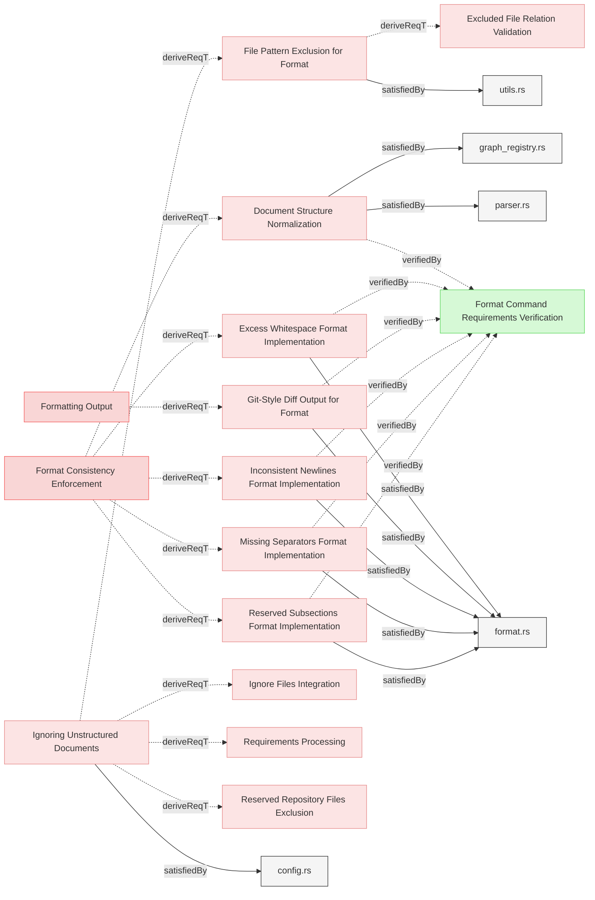

# Formatting

## Format Implementation

### Excess Whitespace Format Implementation

The system shall detect and fix excess whitespace after element headers, subsection headers, and relation identifiers to maintain consistent formatting across all requirements documents.

#### Relations
  * derivedFrom: [Format Consistency Enforcement](../../UserRequirements.md#format-consistency-enforcement)
  * satisfiedBy: [format.rs](../../../core/src/format.rs)
  * verifiedBy: [Format Command Requirements Verification](../../Verifications/Misc.md#format-command-requirements-verification)
---

### Inconsistent Newlines Format Implementation

The system shall detect and fix excess or missing newlines before element headers, subsection headers to maintain consistent formatting across all requirements documents.

#### Relations
  * derivedFrom: [Format Consistency Enforcement](../../UserRequirements.md#format-consistency-enforcement)
  * satisfiedBy: [format.rs](../../../core/src/format.rs)
  * verifiedBy: [Format Command Requirements Verification](../../Verifications/Misc.md#format-command-requirements-verification)
---

### Missing Separators Format Implementation

The system shall detect consecutive element sections that lack a separator line (---) between them and insert the separator to maintain consistent visual separation in the documentation.

#### Relations
  * derivedFrom: [Format Consistency Enforcement](../../UserRequirements.md#format-consistency-enforcement)
  * satisfiedBy: [format.rs](../../../core/src/format.rs)
  * verifiedBy: [Format Command Requirements Verification](../../Verifications/Misc.md#format-command-requirements-verification)
---

### Reserved Subsections Format Implementation

The system shall identify and fix inconsistent indentation and bullet types in relation lists and other reserved subsections, standardizing to a consistent format across all requirements documents.

#### Relations
  * derivedFrom: [Format Consistency Enforcement](../../UserRequirements.md#format-consistency-enforcement)
  * satisfiedBy: [format.rs](../../../core/src/format.rs)
  * verifiedBy: [Format Command Requirements Verification](../../Verifications/Misc.md#format-command-requirements-verification)
---

### Git-Style Diff Output for Format

The system shall display formatting change suggestions in a git-style diff format, color-coded when possible, to clearly show what modifications will be or have been made to the documents.

#### Relations
  * derivedFrom: [Formatting Output](../../UserRequirements.md#formatting-output)
  * satisfiedBy: [format.rs](../../../core/src/format.rs)
  * verifiedBy: [Format Command Requirements Verification](../../Verifications/Misc.md#format-command-requirements-verification)
---

### File Pattern Exclusion for Format

The system shall respect configured excluded filename patterns when performing formatting operations, ensuring that files intentionally excluded from processing do not receive inappropriate formatting suggestions.

#### Relations
  * derivedFrom: [Ignoring Unstructured Documents](../Storage/Configuration.md#ignoring-unstructured-documents)
  * satisfiedBy: [utils.rs](../../../core/src/utils.rs)
---

### Document Structure Normalization

When parsing documents, the system shall normalize document by adding missing page headers and section headers to ensure all documents follow a consistent hierarchical structure.

#### Details
When parsing  documents, the system shall:
- Add a level 1 page header based on the filename when document lacks a page header (does not start with `# `)
- Add a default section header `## Requirements` when elements exist without an explicit section header
- Preserve existing page headers when present (starting with `# `)
- Preserve existing section headers when present (starting with `## `)
- Correctly distinguish between level 1 headers (`# `) and level 2 or deeper headers (`##`, `###`)

**Default Header Names:**
- Page header: Derived from filename (e.g., "User Requirements" from "UserRequirements.md")
- Section header: "Requirements" (the default section name used by parser)

**Normalization Rules:**
1. If document starts with `###` element (no `#` and no `##`): Add both page header and section header
2. If document starts with `#` then `###` (no `##`): Add section header only
3. If document starts with `##` (no `#`): Add page header only
4. If document has both `#` and `##`: No header additions needed

#### Relations
  * derivedFrom: [Format Consistency Enforcement](../../UserRequirements.md#format-consistency-enforcement)
  * satisfiedBy: [graph_registry.rs](../../../core/src/graph_registry.rs)
  * satisfiedBy: [parser.rs](../../../core/src/parser.rs)
---