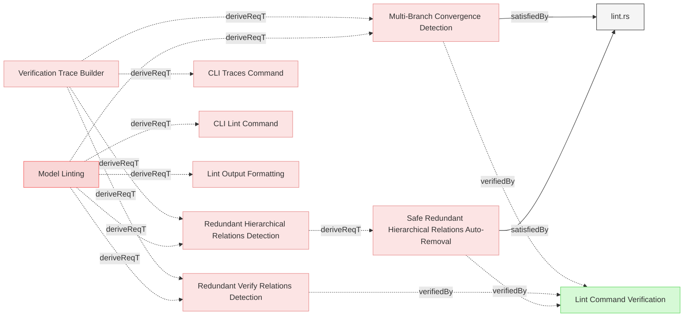
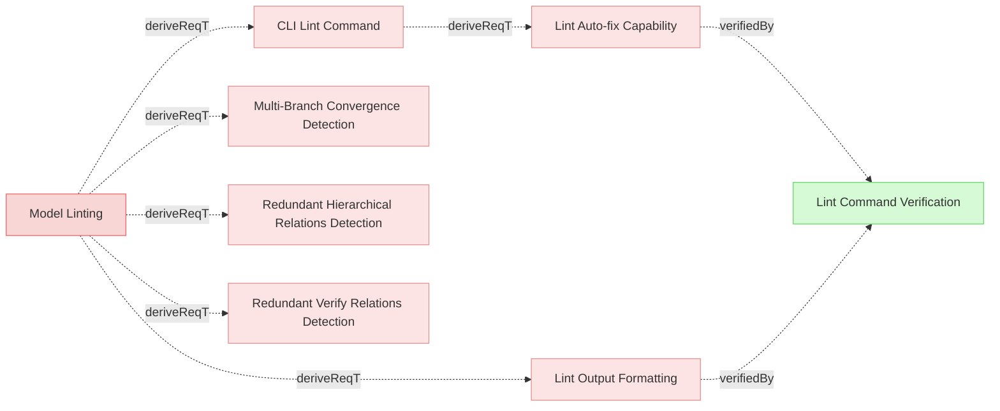

# Lint

## Lint Detection

### Redundant Verify Relations Detection

The system shall detect redundant verify relations where a verification directly verifies both a child requirement and its ancestor, leveraging the existing verification trace tree logic from the Verification Trace Builder.

#### Details
A verify relation is redundant when:
- A verification directly verifies both a leaf requirement AND its parent/ancestor in the hierarchy
- The verification trace tree shows that an ancestor requirement is also directly verified
- Since verification traces roll up automatically through derivedFrom relations, verifying the leaf is sufficient

Detection shall:
- Reuse the trace tree building logic from [Verification Trace Builder](../ModelManagement/TraceabilityMatrix.md#verification-trace-builder)
- Identify ancestor requirements in each verification's trace tree that are also directly verified
- Report these as redundant relations that add noise to the model
- Categorize as **auto-fixable** since removing them is safe and mechanical

#### Relations
  * derivedFrom: [Model Linting](../../UserRequirements.md#model-linting)
  * derivedFrom: [Verification Trace Builder](../ModelManagement/TraceabilityMatrix.md#verification-trace-builder)
---

### Redundant Hierarchical Relations Detection

The system shall detect redundant derivedFrom relations where an element has direct derivedFrom relations to both a requirement and its ancestor in the requirement hierarchy, by leveraging the existing verification trace tree logic with a virtual verification element.

#### Details
A derivedFrom relation is redundant when:
- An element has a derivedFrom relation to an ancestor requirement
- The same element also reaches that ancestor through other derivedFrom relations via intermediate elements
- The hierarchy chain is already established through other paths (single or multiple convergent paths)

**Core Rule**: If an element has a direct relation to a parent, AND that parent is also reachable through ANY other path(s), then the direct relation is redundant and can be safely auto-removed.

This applies to:
- **Single-chain redundancy**: Element reaches ancestor through exactly one intermediate path (e.g., A → B → C, with redundant A → C)
- **Multi-path/branching redundancy**: Element reaches ancestor through multiple convergent paths (e.g., A → B → D and A → C → D, with redundant A → D)

Detection shall:
- Create a virtual/dummy verification element
- Connect the virtual verification to ALL leaf requirements (requirements with no derived children) via virtual verify relations
- Apply the same trace tree building logic used for verification upward traceability
- The trace tree will naturally identify when leaf requirements have derivedFrom relations to both a parent and its ancestor
- Report these as redundant hierarchical relations
- Categorize ALL redundant hierarchical relations as **auto-fixable** since the direct relation adds no value when alternate paths exist
- Identify which intermediate paths provide the alternate routes to the ancestor

This approach reuses the proven trace tree logic for redundancy detection, ensuring consistency with verify relation redundancy detection.

**Note**: The current implementation only detects cases where a direct redundant relation EXISTS. It does not detect or suggest whether converging paths without a direct relation should have one added - that remains a semantic modeling decision.

#### Relations
  * derivedFrom: [Model Linting](../../UserRequirements.md#model-linting)
  * derivedFrom: [Verification Trace Builder](../ModelManagement/TraceabilityMatrix.md#verification-trace-builder)
---

### Multi-Branch Convergence Detection

The system shall detect when an element reaches a common ancestor through multiple distinct branch paths without a direct relation, reporting these cases as needing manual review to determine if both branches are semantically necessary or if one represents a modeling error.

#### Details
A multi-branch convergence occurs when:
- An element reaches a common ancestor through two or more distinct derivedFrom branch paths
- There is NO direct derivedFrom relation from the element to the ancestor
- Each branch represents a potentially different semantic relationship
- The convergence may be intentional (element truly derives from ancestor through multiple contexts) OR may represent redundant modeling

**Key Distinction from Redundant Hierarchical Relations:**
- **Redundant Hierarchical Relations**: Element has a DIRECT relation to ancestor PLUS alternate paths → auto-fixable (remove direct relation)
- **Multi-Branch Convergence**: Element reaches ancestor through MULTIPLE branches with NO direct relation → needs manual review (determine if branches are semantically distinct)

**Example:**
```
Authorization (root)
  → Management API
    → API Specification
  → Public API
    → API Specification
```
API Specification reaches Authorization through two branches (Management API and Public API). Both branches might be semantically valid (spec derives from auth in context of both APIs), OR one might be a modeling error that should be removed.

Detection shall:
- Use the trace tree building logic to identify elements that reach common ancestors through multiple distinct branch paths
- Exclude cases where a direct relation exists (those are handled by Redundant Hierarchical Relations Detection)
- Report the element, the common ancestor, and all distinct branch paths
- Categorize as **needs manual review** since determining semantic necessity requires human judgment
- Explain that the user must decide whether all branches represent valid semantic relationships or if one is redundant

This enables the model author to review and decide:
- Are both branches semantically necessary? (keep both)
- Is one branch a modeling error? (remove that branch's intermediate relations)
- Should there be a direct relation instead? (restructure the model)

#### Relations
  * derivedFrom: [Model Linting](../../UserRequirements.md#model-linting)
  * derivedFrom: [Verification Trace Builder](../ModelManagement/TraceabilityMatrix.md#verification-trace-builder)
  * satisfiedBy: [lint.rs](../../../core/src/lint.rs)
  * verifiedBy: [Lint Command Verification](../../Verifications/Misc.md#lint-command-verification)
---

### Safe Redundant Hierarchical Relations Auto-Removal

The system shall provide safe auto-removal of redundant hierarchical derivation relations when alternate paths to the target exist, ensuring model integrity is preserved while reducing redundancy.

#### Details
A redundant hierarchical derivation relation shall be considered safe to auto-remove when ALL of the following conditions are met:

**Safe Auto-Removal Criteria:**
1. **Direct relation exists**: Element A has a direct derivedFrom relation to element C
2. **Alternate path exists**: There exists at least one path from A to C through intermediate elements (single or multiple convergent paths)
3. **Transitive redundancy**: The direct A → C relation is redundant because C is reachable through other derivedFrom relations

**Core Principle**: If an element has a direct relation to an ancestor AND that ancestor is reachable through any other path(s), the direct relation adds no traceability value and can be safely removed. This applies whether there is a single intermediate path or multiple convergent paths.

**Examples:**

*Single-chain redundancy (auto-removable):*
```
User Requirement A
  → System Requirement B
    → Implementation C

Redundant: A → C (can be safely auto-removed)
Reason: C is reachable via A → B → C
```

*Multi-path/branching redundancy (auto-removable):*
```
Authorization A
  → Public API B → API Specification D
  → Management API C → API Specification D

Redundant: A → D (can be safely auto-removed)
Reason: D is reachable via A → B → D and A → C → D
```

**Auto-Removal Behavior:**
- Remove ALL redundant derivedFrom relations where alternate paths exist
- Preserve traceability through intermediate elements
- Maintain model coherence by ensuring all elements remain reachable through non-redundant paths
- Report removed relations to the user for transparency
- Show which intermediate paths provide the alternate routes

#### Relations
  * derivedFrom: [Redundant Hierarchical Relations Detection](#redundant-hierarchical-relations-detection)
  * satisfiedBy: [lint.rs](../../../core/src/lint.rs)
  * verifiedBy: [Lint Command Verification](../../Verifications/Misc.md#lint-command-verification)
---

## Lint Output

### Lint Output Formatting

The system shall format lint command output with clear categorization of issues, showing affected elements, relation details, and rationale for each finding.

#### Details
Output format shall include:
- Section headers: "Auto-fixable Issues" and "Needs Manual Review" (when applicable)
- For each issue category:
  * Issue type heading (e.g., "Safe Redundant Hierarchical Relations", "Redundant Verify Relations")
  * List of affected elements with file paths and identifiers
  * Specific relations flagged as redundant
  * Brief explanation of why the relation is redundant, including which intermediate paths provide alternate routes
- JSON output shall include:
  * Issue categorization (auto_fixable vs. needs_manual_review)
  * Issue type classification
  * Affected element identifiers
  * Specific relation details (type, target)
  * Rationale text explaining the redundancy
  * Intermediate paths that make the direct relation redundant

For auto-fixable issues, the output indicates these can be fixed with `--fix` flag. For manual review issues, the output explains why human judgment is required.

#### Relations
  * derivedFrom: [Model Linting](../../UserRequirements.md#model-linting)
---

### Lint Auto-fix Capability

The system shall provide automatic fixing capability for auto-fixable lint issues, applying changes directly to model files when the `--fix` flag is used.

#### Details
Auto-fix shall:
- Only apply fixes for issues categorized as auto-fixable
- Modify the affected markdown files directly
- Remove redundant verify relations from verification elements
- Preserve all other content and formatting in the files
- Report all changes made (files modified, relations removed)
- Skip issues categorized as needing manual review

#### Relations
  * derivedFrom: [CLI Lint Command](../UserInterface/CLI.md#cli-lint-command)
---