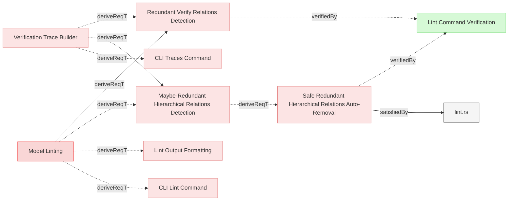
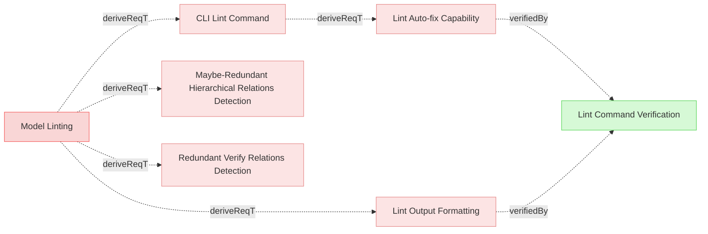

# Lint

## Lint Detection

### Redundant Verify Relations Detection

The system shall detect redundant verify relations where a verification directly verifies both a child requirement and its ancestor, leveraging the existing verification trace tree logic from the Verification Trace Builder.

#### Details
A verify relation is redundant when:
- A verification directly verifies both a leaf requirement AND its parent/ancestor in the hierarchy
- The verification trace tree shows that an ancestor requirement is also directly verified
- Since verification traces roll up automatically through derivedFrom relations, verifying the leaf is sufficient

Detection shall:
- Reuse the trace tree building logic from [Verification Trace Builder](../ModelManagement/TraceabilityMatrix.md#verification-trace-builder)
- Identify ancestor requirements in each verification's trace tree that are also directly verified
- Report these as redundant relations that add noise to the model
- Categorize as **auto-fixable** since removing them is safe and mechanical

#### Relations
  * derivedFrom: [Model Linting](../../UserRequirements.md#model-linting)
  * derivedFrom: [Verification Trace Builder](../ModelManagement/TraceabilityMatrix.md#verification-trace-builder)
---

### Maybe-Redundant Hierarchical Relations Detection

The system shall detect potentially redundant derivedFrom relations where an element has direct derivedFrom relations to both a requirement and its ancestor in the requirement hierarchy, by leveraging the existing verification trace tree logic with a virtual verification element.

#### Details
A derivedFrom relation may be redundant when:
- An element has a derivedFrom relation to a parent requirement
- The same element also has a derivedFrom relation to an ancestor of that parent requirement
- The hierarchy chain is already established through the parent

Detection shall:
- Create a virtual/dummy verification element
- Connect the virtual verification to ALL leaf requirements (requirements with no derived children) via virtual verify relations
- Apply the same trace tree building logic used for verification upward traceability
- The trace tree will naturally identify when leaf requirements have derivedFrom relations to both a parent and its ancestor
- Report these as potentially redundant hierarchical relations
- Categorize as **needs manual review** since removal requires understanding the intended semantic meaning
- Not suggest what to remove, only report the potential redundancy for human review

This approach reuses the proven trace tree logic for redundancy detection, ensuring consistency with verify relation redundancy detection.

#### Relations
  * derivedFrom: [Model Linting](../../UserRequirements.md#model-linting)
  * derivedFrom: [Verification Trace Builder](../ModelManagement/TraceabilityMatrix.md#verification-trace-builder)
---

### Safe Redundant Hierarchical Relations Auto-Removal

The system shall provide safe auto-removal of redundant hierarchical derivation relations only when there is a single unambiguous chain connecting elements, ensuring model integrity is preserved.

#### Details
A redundant hierarchical derivation relation shall be considered safe to auto-remove when ALL of the following conditions are met:

**Safe Auto-Removal Criteria:**
1. **Transitive redundancy pattern exists**: Element A has derivedFrom relation to element C, and there exists a chain A → B → C (where B is the only intermediate element)
2. **Single chain constraint**: There is ONLY ONE path from A to C through intermediate elements (not multiple converging paths)
3. **Direct redundancy**: The direct A → C relation is truly redundant because the same target is reachable through exactly one intermediate path

**NOT Safe to Auto-Remove (Requires Manual Review):**
- **Multiple paths converging**: When A reaches C through multiple different intermediate elements (e.g., A → B → C and A → D → C), both paths may have semantic meaning and should not be auto-removed
- **Complex hierarchies**: When the relation network has multiple branches or reconvergence points

**Examples:**

*Safe to auto-remove:*
```
User Requirement A
  → System Requirement B
    → Implementation C

Redundant: A → C (can be safely auto-removed)
```

*NOT safe to auto-remove (needs manual review):*
```
Requirement A
  → Design Requirement B → Implementation D
  → Security Requirement C → Implementation D

Both paths A→B→D and A→C→D are meaningful
Direct A→D should NOT be auto-removed without review
```

**Auto-Removal Behavior:**
- Only remove relations that meet ALL safe auto-removal criteria
- Preserve traceability through intermediate elements
- Maintain model coherence by ensuring all elements remain reachable
- Report removed relations to the user for transparency

#### Relations
  * derivedFrom: [Maybe-Redundant Hierarchical Relations Detection](#maybe-redundant-hierarchical-relations-detection)
  * satisfiedBy: [lint.rs](../../../core/src/lint.rs)
  * verifiedBy: [Lint Command Verification](../../Verifications/Misc.md#lint-command-verification)
---

## Lint Output

### Lint Output Formatting

The system shall format lint command output with clear categorization of issues, showing affected elements, relation details, and rationale for each finding.

#### Details
Output format shall include:
- Section headers: "Auto-fixable Issues" and "Needs Manual Review"
- For each issue category:
  * Issue type heading (e.g., "Redundant Verify Relations", "Maybe-Redundant Hierarchical Relations")
  * List of affected elements with file paths and identifiers
  * Specific relations flagged as potentially redundant
  * Brief explanation of why the relation may be redundant
- JSON output shall include:
  * Issue categorization (fixable vs. auditable)
  * Issue type classification
  * Affected element identifiers
  * Specific relation details (type, target)
  * Rationale text

The output shall NOT suggest which relations to remove, only report the findings for user review and decision.

#### Relations
  * derivedFrom: [Model Linting](../../UserRequirements.md#model-linting)
---

### Lint Auto-fix Capability

The system shall provide automatic fixing capability for auto-fixable lint issues, applying changes directly to model files when the `--fix` flag is used.

#### Details
Auto-fix shall:
- Only apply fixes for issues categorized as auto-fixable
- Modify the affected markdown files directly
- Remove redundant verify relations from verification elements
- Preserve all other content and formatting in the files
- Report all changes made (files modified, relations removed)
- Skip issues categorized as needing manual review

#### Relations
  * derivedFrom: [CLI Lint Command](../UserInterface/CLI.md#cli-lint-command)
---