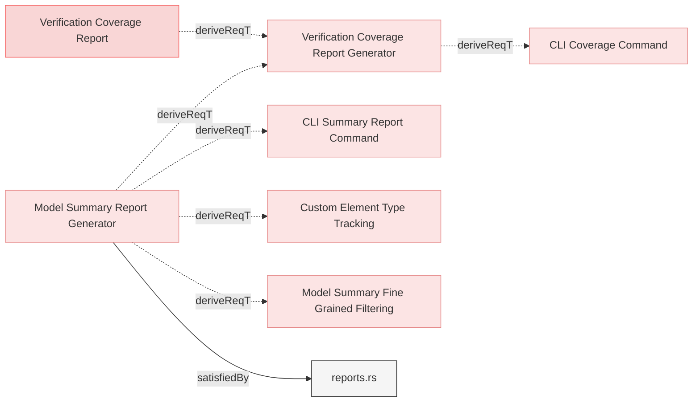
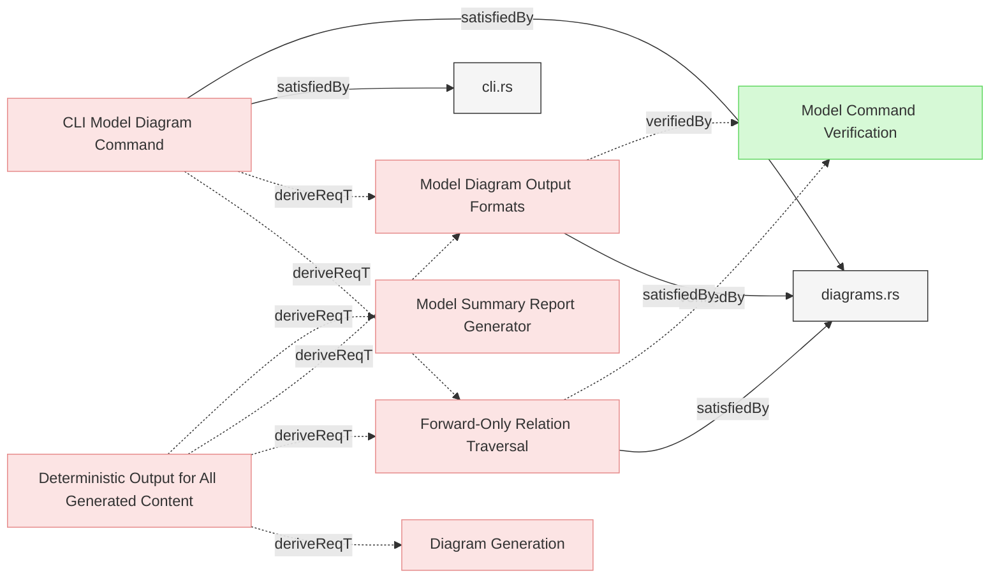

# Reports

## Model Summary Reports

```mermaid
graph LR;
  %% REQVIRE-AUTOGENERATED-DIAGRAM
  %% Graph styling
  classDef userRequirement fill:#f9d6d6,stroke:#f55f5f,stroke-width:1px;
  classDef systemRequirement fill:#fce4e4,stroke:#e68a8a,stroke-width:1px;
  classDef verification fill:#d6f9d6,stroke:#5fd75f,stroke-width:1px;
  classDef default fill:#f5f5f5,stroke:#333333,stroke-width:1px;

  9ba85ead8a1ca9fd["Custom Element Type Tracking"];
  class 9ba85ead8a1ca9fd systemRequirement;
  click 9ba85ead8a1ca9fd "Reports.md#custom-element-type-tracking";
  c4ea332ba94e8299["reports.rs"];
  class c4ea332ba94e8299 default;
  click c4ea332ba94e8299 "../../../core/src/reports.rs";
  9ba85ead8a1ca9fd -->|satisfiedBy| c4ea332ba94e8299;
  b266b2fae4370efb["Custom Element Type Tracking Test"];
  class b266b2fae4370efb verification;
  click b266b2fae4370efb "../../Verifications/ReportsTests.md#custom-element-type-tracking-test";
  9ba85ead8a1ca9fd -.->|verifiedBy| b266b2fae4370efb;
  c1bbfdadfce7e10a["Deterministic Output for All Generated Content"];
  class c1bbfdadfce7e10a systemRequirement;
  click c1bbfdadfce7e10a "Reports.md#deterministic-output-for-all-generated-content";
  4538e809d640b93a["Diagram Generation"];
  class 4538e809d640b93a systemRequirement;
  click 4538e809d640b93a "../ModelManagement/DiagramGeneration.md#diagram-generation";
  c1bbfdadfce7e10a -.->|deriveReqT| 4538e809d640b93a;
  11ca6eab6e458ae0["Forward-Only Relation Traversal"];
  class 11ca6eab6e458ae0 systemRequirement;
  click 11ca6eab6e458ae0 "Reports.md#forward-only-relation-traversal";
  c1bbfdadfce7e10a -.->|deriveReqT| 11ca6eab6e458ae0;
  96873a19c51bd42f["Model Diagram Output Formats"];
  class 96873a19c51bd42f systemRequirement;
  click 96873a19c51bd42f "Reports.md#model-diagram-output-formats";
  c1bbfdadfce7e10a -.->|deriveReqT| 96873a19c51bd42f;
  5491ea982d2d6370["Model Summary Report Generator"];
  class 5491ea982d2d6370 systemRequirement;
  click 5491ea982d2d6370 "Reports.md#model-summary-report-generator";
  c1bbfdadfce7e10a -.->|deriveReqT| 5491ea982d2d6370;
  746097d8a83067f1["Model Summary Fine Grained Filtering"];
  class 746097d8a83067f1 systemRequirement;
  click 746097d8a83067f1 "Reports.md#model-summary-fine-grained-filtering";
  80defdd4cbc7ee18["cli.rs"];
  class 80defdd4cbc7ee18 default;
  click 80defdd4cbc7ee18 "../../../cli/src/cli.rs";
  746097d8a83067f1 -->|satisfiedBy| 80defdd4cbc7ee18;
  c4ea332ba94e8299["reports.rs"];
  class c4ea332ba94e8299 default;
  click c4ea332ba94e8299 "../../../core/src/reports.rs";
  746097d8a83067f1 -->|satisfiedBy| c4ea332ba94e8299;
  76ae69270700044b["Model Summary Tests"];
  class 76ae69270700044b verification;
  click 76ae69270700044b "../../Verifications/ReportsTests.md#model-summary-tests";
  746097d8a83067f1 -.->|verifiedBy| 76ae69270700044b;
  9a9c560f6dd37689["CLI Summary Report Command"];
  class 9a9c560f6dd37689 systemRequirement;
  click 9a9c560f6dd37689 "../UserInterface/CLI.md#cli-summary-report-command";
  5491ea982d2d6370 -.->|deriveReqT| 9a9c560f6dd37689;
  5491ea982d2d6370 -.->|deriveReqT| 9ba85ead8a1ca9fd;
  5491ea982d2d6370 -.->|deriveReqT| 746097d8a83067f1;
  32e697e712b093ce["Verification Coverage Report Generator"];
  class 32e697e712b093ce systemRequirement;
  click 32e697e712b093ce "Reports.md#verification-coverage-report-generator";
  5491ea982d2d6370 -.->|deriveReqT| 32e697e712b093ce;
  c4ea332ba94e8299["reports.rs"];
  class c4ea332ba94e8299 default;
  click c4ea332ba94e8299 "../../../core/src/reports.rs";
  5491ea982d2d6370 -->|satisfiedBy| c4ea332ba94e8299;
  c44d61ceb06f372e["Sections Summary Report Generator"];
  class c44d61ceb06f372e systemRequirement;
  click c44d61ceb06f372e "Reports.md#sections-summary-report-generator";
  18a5b514a8c14b09["CLI Sections Summary Command"];
  class 18a5b514a8c14b09 systemRequirement;
  click 18a5b514a8c14b09 "../UserInterface/CLI.md#cli-sections-summary-command";
  c44d61ceb06f372e -.->|deriveReqT| 18a5b514a8c14b09;
  994f165ff784760d["sections_summary.rs"];
  class 994f165ff784760d default;
  click 994f165ff784760d "../../../core/src/sections_summary.rs";
  c44d61ceb06f372e -->|satisfiedBy| 994f165ff784760d;
  7ab891515e6782ef["Validation Report Generator"];
  class 7ab891515e6782ef systemRequirement;
  click 7ab891515e6782ef "Reports.md#validation-report-generator";
  edfaf8b9c988d13b["Validation Error Handling"];
  class edfaf8b9c988d13b systemRequirement;
  click edfaf8b9c988d13b "Validation.md#validation-error-handling";
  7ab891515e6782ef -.->|deriveReqT| edfaf8b9c988d13b;
  d50a859650933e55["model.rs"];
  class d50a859650933e55 default;
  click d50a859650933e55 "../../../core/src/model.rs";
  7ab891515e6782ef -->|satisfiedBy| d50a859650933e55;
  fae83fbd83a35540["Display Name-Regex Option in Help"];
  class fae83fbd83a35540 systemRequirement;
  click fae83fbd83a35540 "../UserInterface/CLI.md#display-name-regex-option-in-help";
  9a9c560f6dd37689 -.->|deriveReqT| fae83fbd83a35540;
  dcbc1dc3a347ee00["Handle Invalid Regex Filter Patterns"];
  class dcbc1dc3a347ee00 systemRequirement;
  click dcbc1dc3a347ee00 "../UserInterface/CLI.md#handle-invalid-regex-filter-patterns";
  9a9c560f6dd37689 -.->|deriveReqT| dcbc1dc3a347ee00;
  9a9c560f6dd37689 -.->|deriveReqT| c44d61ceb06f372e;
  80defdd4cbc7ee18["cli.rs"];
  class 80defdd4cbc7ee18 default;
  click 80defdd4cbc7ee18 "../../../cli/src/cli.rs";
  9a9c560f6dd37689 -->|satisfiedBy| 80defdd4cbc7ee18;
  70701096d332c0b2["Model Reports"];
  class 70701096d332c0b2 userRequirement;
  click 70701096d332c0b2 "../../UserRequirements.md#model-reports";
  70701096d332c0b2 -.->|deriveReqT| c1bbfdadfce7e10a;
  9933cac5853a8584["Change Impact Analysis"];
  class 9933cac5853a8584 userRequirement;
  click 9933cac5853a8584 "../../UserRequirements.md#change-impact-analysis";
  70701096d332c0b2 -.->|deriveReqT| 9933cac5853a8584;
  ad6f7a2d41d80a38["Model Structure and Summaries"];
  class ad6f7a2d41d80a38 userRequirement;
  click ad6f7a2d41d80a38 "../../UserRequirements.md#model-structure-and-summaries";
  70701096d332c0b2 -.->|deriveReqT| ad6f7a2d41d80a38;
  f7a606aa79ba438["Verification Coverage Report"];
  class f7a606aa79ba438 userRequirement;
  click f7a606aa79ba438 "../../UserRequirements.md#verification-coverage-report";
  70701096d332c0b2 -.->|deriveReqT| f7a606aa79ba438;
  7ceb6b9bed1a94e1["Verification Upward Traceability"];
  class 7ceb6b9bed1a94e1 userRequirement;
  click 7ceb6b9bed1a94e1 "../../UserRequirements.md#verification-upward-traceability";
  70701096d332c0b2 -.->|deriveReqT| 7ceb6b9bed1a94e1;
  ad6f7a2d41d80a38 -.->|deriveReqT| 5491ea982d2d6370;
  ed31b6bed1cde2f8["Provide Validation Reports"];
  class ed31b6bed1cde2f8 userRequirement;
  click ed31b6bed1cde2f8 "../../UserRequirements.md#provide-validation-reports";
  27e30811e4587820["Validate Command"];
  class 27e30811e4587820 systemRequirement;
  click 27e30811e4587820 "../UserInterface/CLI.md#validate-command";
  ed31b6bed1cde2f8 -.->|deriveReqT| 27e30811e4587820;
  ed31b6bed1cde2f8 -.->|deriveReqT| 7ab891515e6782ef;
  60fc330ec8dd12b6["Integrated Validation"];
  class 60fc330ec8dd12b6 systemRequirement;
  click 60fc330ec8dd12b6 "Validation.md#integrated-validation";
  ed31b6bed1cde2f8 -.->|deriveReqT| 60fc330ec8dd12b6;
```

### Model Summary Report Generator

The system shall implement a summary report generator that  produces comprehensive summaries of model relationships, including key metrics, element counts by type and counts.

#### Details
The summary report must include:

**File-level Information:**
- File path and name
- Number of sections per file
- Number of elements per file
- Page content (frontmatter content before first section header)

**Section-level Information:**
- Section name and hierarchy
- Number of elements per section
- Section content (content between section header and first element, excluding generated diagrams)

**Element Information:**
- Element identifier, name, type, and section
- Element content
- Verified and satisfied relations counts
- Complete list of relations with targets and types

**Global Counts:**
- Total files, pages, sections, and elements
- Requirements by type (system, user)
- Verifications by type (test, analysis, inspection, demonstration)
- Missing relations (unverified and unsatisfied requirements)

**Output Formats:**
- Human-readable text format with hierarchical display
- JSON format for programmatic processing
- Cypher format for graph database import

The system must support filtering by file path, element name, section, type, content, verification status, and satisfaction status. All filters are applied conjunctively.

#### Relations
  * derivedFrom: [Model Structure and Summaries](../../UserRequirements.md#model-structure-and-summaries)
  * derivedFrom: [Deterministic Output for All Generated Content](#deterministic-output-for-all-generated-content)
  * satisfiedBy: [reports.rs](../../../core/src/reports.rs)
---

### Custom Element Type Tracking

The system SHALL track and display custom element types (any type not in the standard categories) in model summary reports, providing counts for each custom type in both text and JSON output formats.

#### Details
The custom element type tracking feature must:

**Custom Type Definition:**
- Identify any element type that is not one of the standard types: requirement, user-requirement, verification, test-verification, analysis-verification, inspection-verification, or demonstration-verification
- Track custom types separately from standard element type counters
- Store custom types in a HashMap with type name as key and count as value

**Text Output:**
- Display custom element types in the "Element Types" section of the summary
- Format: `Custom (type-name): count`
- Sort custom types alphabetically by type name
- Only display custom types section when at least one custom type exists

**JSON Output:**
- Include custom element types in global_counters as `custom_element_types` field
- Structure: `{"custom_element_types": {"type-name": count, ...}}`
- Skip serialization of the field when no custom types exist (using `skip_serializing_if`)
- Maintain alphabetical sorting of type names in JSON output

**Exclusions:**
- Standard requirement types (requirement, user-requirement) SHALL NOT be counted as custom
- Standard verification types (verification, test-verification, analysis-verification, inspection-verification, demonstration-verification) SHALL NOT be counted as custom
- File-type elements SHALL NOT be counted as custom types

#### Relations
  * derivedFrom: [Model Summary Report Generator](#model-summary-report-generator)
  * satisfiedBy: [reports.rs](../../../core/src/reports.rs)
---

### Sections Summary Report Generator

The system shall implement a sections summary report generator that produces focused summaries showing only file paths, section names, section order indices, and section content without individual elements.

#### Details
The sections summary report must include:

**File-level Information:**
- File path and name
- Number of sections per file
- Page content (frontmatter content before first section header)

**Section-level Information:**
- Section name and hierarchy
- Section order index (original document order)
- Section content (content between section header and first element, excluding generated diagrams)

**Output Formats:**
- Human-readable text format with hierarchical display preserving section order
- JSON format for programmatic processing with section order information

The system must support filtering by file path (glob pattern), section name (glob pattern), and section content (regex pattern). All filters are applied conjunctively. The JSON output shall include section order information to enable reconstructing the original document structure.

#### Relations
  * derivedFrom: [CLI Summary Report Command](../UserInterface/CLI.md#cli-summary-report-command)
  * satisfiedBy: [sections_summary.rs](../../../core/src/sections_summary.rs)
---

### Model Summary Fine Grained Filtering

The system shall implement a fine grained filtering for the  summary report generator following the specifications.

#### Details

View Full Specification

## Summary

This specification defines the functional requirements for a filtering subsystem used within the `model-summary` reporting feature. The system must allow clients to selectively include or exclude elements from the summary output based on metadata, content, and traceability properties.

The filters shall be composable and applied conjunctively (i.e., all active filters must match for an element to be included). The filtering system must support both human-readable text output and structured machine-readable output (e.g., JSON).

---

## Filtering Scope

Filtering shall operate on the level of individual `Element` objects in the model registry. Each `Element` has the following relevant properties:

- `file_path: String`
- `name: String`
- `section: String`
- `element_type: ElementType`
- `content: String`
- `relations: Vec<Relation>`

---

## Supported Filters

The filtering system **must support the following filters**, which may be active simultaneously.

### 1. File Path Filter (Glob)

**Purpose:** Restrict summary to elements defined in files whose paths match a given glob pattern.

**Input:** A single string pattern using glob syntax (e.g., `"src/**/*Spec.md"`)

**Match Target:** `Element.file_path`

**Behavior:** Case-sensitive glob match. If the glob does not match any file, no elements are included.

---

### 2. Name Filter (Regex)

**Purpose:** Include only elements whose `name` matches a regular expression.

**Input:** A valid Rust-compatible regular expression (e.g., `"autonomous.*"`)

**Match Target:** `Element.name`

**Behavior:** Case-sensitive match by default. The filter is considered invalid if the regex fails to compile.

---

### 3. Section Filter (Glob)

**Purpose:** Include only elements belonging to sections with matching names.

**Input:** A glob pattern string (e.g., `"System Requirements*"`)

**Match Target:** `Element.section`

**Behavior:** Case-sensitive match. Globbing follows standard `globset` semantics.

---

### 4. Type Filter (Exact Match)

**Purpose:** Include only elements of a specific type.

**Input:** One of the following valid string identifiers:

- `"user-requirement"`
- `"system-requirement"`
- `"verification"`
- `"file"`
- Any user-defined type (e.g., `"interface"`, `"design"`)

**Match Target:** `Element.element_type`

**Behavior:** Matching must be exact. Internally, the filter string shall be mapped to an `ElementType` via a deterministic lookup function.

---

### 5. Content Filter (Regex)

**Purpose:** Include only elements whose body content matches a regular expression.

**Input:** A valid regex pattern applied to the element's `content`.

**Match Target:** `Element.content`

**Behavior:** Case-sensitive regex match. Invalid patterns must cause an immediate user-facing error.

---

### 6. Not Verified Filter (Boolean)

**Purpose:** Include only requirement elements that are not connected via a `verifiedBy` or `verify` relation.

**Input:** Boolean flag

**Match Target:** `Element.relations`

**Behavior:** When enabled, any element with one or more verification-related relations must be excluded.

---

### 7. Not Satisfied Filter (Boolean)

**Purpose:** Include only requirement elements that are not connected via a `satisfiedBy` or `satisfy` relation.

**Input:** Boolean flag

**Match Target:** `Element.relations`

**Behavior:** when enabled, any element with one or more satisfaction-related relations must be excluded.

---

## Filter Composition

All filters are applied **conjunctively**. That is, an element is included in the summary **only if all active filters return `true`** for that element.

---

## Error Handling

- Invalid regular expressions must produce a fatal error with a descriptive message.
- Invalid glob patterns should fail at startup with appropriate feedback.
- Unknown or malformed `type` filters should be rejected with a list of accepted values.

---

## Extension Considerations

The filtering system must be designed to allow future additions, including:

- Filtering by relation type presence (e.g., "has any relation")
- Filtering by linked element types (e.g., "verifiedBy test-verification")
- Inversion (e.g., "not in section X")

---

## Output Behavior

Filtered results must be consistent across all output modes (text, JSON, HTML). The final summary must include only elements passing the full filter set, and global counters should reflect the filtered subset.

---

## Performance Considerations

The filtering system must evaluate filters with minimal passes over element data. Repeated relation scans (e.g., for verification/satisfaction) should be avoided in favor of single-pass accumulation.

---

## Test Cases (Examples)

| Filter Combination | Expected Result |
|--------------------|------------------|
| `type = verification` | Only verification elements |
| `section = "System*"` + `name = ".*GPS.*"` | System section elements with GPS in name |
| `type = system-requirement` + `not_verified = true` | Unverified system requirements only |

---

#### Relations
  * satisfiedBy: [reports.rs](../../../core/src/reports.rs)
  * satisfiedBy: [cli.rs](../../../cli/src/cli.rs)
  * derivedFrom: [Model Summary Report Generator](#model-summary-report-generator)
  * verifiedBy: [Model Summary Tests](../../Verifications/ReportsTests.md#model-summary-tests)
---

### Deterministic Output for All Generated Content

All generated content including reports, diagrams, exports, text, JSON, and HTML shall produce deterministic output with consistent ordering to enable reliable testing, version control, and reproducible builds.

#### Details
The system shall ensure deterministic output by:

1. **Element Ordering**: Elements shall be sorted by identifier before iteration to ensure consistent processing order across all operations
2. **Relation Ordering**: Relations within each element shall be sorted by relation type name and then by target identifier before rendering
3. **Section Ordering**: Sections within files shall be sorted alphabetically when order is not semantically significant
4. **File Ordering**: Files within folders shall be sorted alphabetically

This determinism ensures that:
- Running the same operation multiple times produces byte-identical output
- Automated tests can reliably compare expected and actual outputs using simple diff tools without special normalization
- Version control diffs are meaningful and reflect actual changes rather than random ordering variations
- Continuous integration pipelines produce consistent, reproducible results
- Generated diagrams maintain stable node and relation ordering for easier review

This requirement applies to all capabilities and operations that generate output, including but not limited to:
- Diagram generation - Mermaid diagrams embedded in markdown files
- Documentation export - Complete HTML documentation with all pages
- Model summary reporting - Summary reports in text and JSON formats
- Section summary reporting - Section-focused summaries
- Verification tracing - Upward traceability trees from verifications to requirements
- Traceability matrix generation - Requirement-to-verification matrices
- Coverage reporting - Verification coverage analysis
- Change impact analysis - Reports showing propagation of changes
- Validation reporting - Model validation error reports
- Linting - Model quality issue reports
- All JSON output formats
- All HTML output formats
- All text output formats

#### Relations
  * derivedFrom: [Model Reports](../../UserRequirements.md#model-reports)
---

### Validation Report Generator

The system shall implement a validation report generator that compiles and formats validation results from all validators, providing a unified view of model quality with categorized issues, remediation suggestions, and compliance metrics.

#### Relations
  * derivedFrom: [Provide Validation Reports](../../UserRequirements.md#provide-validation-reports)
  * satisfiedBy: [model.rs](../../../core/src/model.rs)
---

## Verification Coverage Reports

### Verification Coverage Report Generator

The system shall provide a verification coverage report generator that analyzes leaf requirements verification status, test-verification satisfaction status, and orphaned verifications to produce coverage metrics and detailed reports.

#### Details
The coverage report generator must:
- Identify all leaf requirements (requirements without forward relations to other requirements) in the model
- Determine leaf requirement verification status based on presence of verifiedBy relations
- Identify all verification elements in the model with breakdown by verification type
- Determine test-verification satisfaction status based on presence of satisfiedBy relations
- Identify orphaned verifications (verification elements without any verify relations to requirements)
- Calculate coverage percentages: (verified_leaf_requirements/total_leaf_requirements * 100), (satisfied_test_verifications/total_test_verifications * 100), and (orphaned_verifications/total_verifications * 100)
- Group results by file and section for organization
- Support both human-readable text and machine-readable JSON output formats

The report structure shall include:
- Summary section with leaf requirements, test-verification, and orphaned verification counts and percentages
- Verified leaf requirements section grouped by file and section
- Unverified leaf requirements section with details (flagged for attention)
- Satisfied test-verification elements section grouped by file and section
- Unsatisfied test-verification elements section with details (flagged for attention)
- Orphaned verifications section with details (flagged for attention as they may be redundant or incorrectly configured)
- Analysis, inspection, and demonstration verification elements are considered satisfied by default

#### Relations
  * derivedFrom: [Verification Coverage Report](../../UserRequirements.md#verification-coverage-report)
  * derivedFrom: [Model Summary Report Generator](#model-summary-report-generator)
---

## Model Diagram Reports

### Forward-Only Relation Traversal

When filtering by root element, system shall traverse only forward relations down to leaf elements.

#### Details
- Shall follow only forward relations (derive, satisfiedBy, verifiedBy, trace)
- Shall start from specified root element
- Shall recursively traverse outgoing relations to leaf elements
- Shall NOT traverse backward (no bidirectional traversal)
- Unfiltered diagrams (no --root-id) shall show complete model with all elements

#### Relations
  * derivedFrom: [CLI Model Diagram Command](../UserInterface/CLI.md#cli-model-diagram-command)
  * derivedFrom: [Deterministic Output for All Generated Content](#deterministic-output-for-all-generated-content)
  * satisfiedBy: [diagrams.rs](../../../core/src/diagrams.rs)
  * verifiedBy: [Model Command Verification](../../Verifications/ReportsTests.md#model-command-verification)
---

### Model Diagram Output Formats

System shall support markdown and JSON output formats.

#### Details
- Markdown format shall include embedded Mermaid diagram with model structure
- Markdown shall show hierarchical structure (folders > files > sections > elements)
- JSON format shall use structured data with folders, files, sections, elements, and relations
- Both formats shall represent the same filtered or complete model data

#### Relations
  * derivedFrom: [CLI Model Diagram Command](../UserInterface/CLI.md#cli-model-diagram-command)
  * derivedFrom: [Deterministic Output for All Generated Content](#deterministic-output-for-all-generated-content)
  * satisfiedBy: [diagrams.rs](../../../core/src/diagrams.rs)
  * verifiedBy: [Model Command Verification](../../Verifications/ReportsTests.md#model-command-verification)
---