# Two-Pass Validation Architecture

## Overview

```mermaid
graph LR;
  %% REQVIRE-AUTOGENERATED-DIAGRAM
  %% Graph styling
  classDef userRequirement fill:#f9d6d6,stroke:#f55f5f,stroke-width:1px;
  classDef systemRequirement fill:#fce4e4,stroke:#e68a8a,stroke-width:1px;
  classDef verification fill:#d6f9d6,stroke:#5fd75f,stroke-width:1px;
  classDef default fill:#f5f5f5,stroke:#333333,stroke-width:1px;

  edfaf8b9c988d13b["Validation Error Handling"];
  class edfaf8b9c988d13b systemRequirement;
  click edfaf8b9c988d13b "Validation.md#validation-error-handling";
  a581221890d15c0c["error.rs"];
  class a581221890d15c0c default;
  click a581221890d15c0c "../../../core/src/error.rs";
  edfaf8b9c988d13b -->|satisfiedBy| a581221890d15c0c;
  d50a859650933e55["model.rs"];
  class d50a859650933e55 default;
  click d50a859650933e55 "../../../core/src/model.rs";
  edfaf8b9c988d13b -->|satisfiedBy| d50a859650933e55;
  e37dc7f46d75d46["Invalid Relations Test"];
  class e37dc7f46d75d46 verification;
  click e37dc7f46d75d46 "../../Verifications/ValidationTests.md#invalid-relations-test";
  edfaf8b9c988d13b -.->|verifiedBy| e37dc7f46d75d46;
  6f1d7610c2419511["Two-Pass Validation Strategy"];
  class 6f1d7610c2419511 systemRequirement;
  click 6f1d7610c2419511 "Validation.md#two-pass-validation-strategy";
  d50a859650933e55["model.rs"];
  class d50a859650933e55 default;
  click d50a859650933e55 "../../../core/src/model.rs";
  6f1d7610c2419511 -->|satisfiedBy| d50a859650933e55;
  27e30811e4587820["Validate Command"];
  class 27e30811e4587820 systemRequirement;
  click 27e30811e4587820 "../UserInterface/CLI.md#validate-command";
  6f1d7610c2419511 -.->|deriveReqT| 27e30811e4587820;
  e1d08514a32ae308["GraphRegistry as Primary Registry"];
  class e1d08514a32ae308 systemRequirement;
  click e1d08514a32ae308 "Validation.md#graphregistry-as-primary-registry";
  b7c871ab64a7059a["graph_registry.rs"];
  class b7c871ab64a7059a default;
  click b7c871ab64a7059a "../../../core/src/graph_registry.rs";
  e1d08514a32ae308 -->|satisfiedBy| b7c871ab64a7059a;
  d50a859650933e55["model.rs"];
  class d50a859650933e55 default;
  click d50a859650933e55 "../../../core/src/model.rs";
  e1d08514a32ae308 -->|satisfiedBy| d50a859650933e55;
  184bc01c18f5506f["Requirements Files Search and Detection Test"];
  class 184bc01c18f5506f verification;
  click 184bc01c18f5506f "../../Verifications/ValidationTests.md#requirements-files-search-and-detection-test";
  e1d08514a32ae308 -.->|verifiedBy| 184bc01c18f5506f;
  60fc330ec8dd12b6["Integrated Validation"];
  class 60fc330ec8dd12b6 systemRequirement;
  click 60fc330ec8dd12b6 "Validation.md#integrated-validation";
  80defdd4cbc7ee18["cli.rs"];
  class 80defdd4cbc7ee18 default;
  click 80defdd4cbc7ee18 "../../../cli/src/cli.rs";
  60fc330ec8dd12b6 -->|satisfiedBy| 80defdd4cbc7ee18;
  ed31b6bed1cde2f8["Provide Validation Reports"];
  class ed31b6bed1cde2f8 userRequirement;
  click ed31b6bed1cde2f8 "../../UserRequirements.md#provide-validation-reports";
  ed31b6bed1cde2f8 -.->|deriveReqT| 27e30811e4587820;
  ed31b6bed1cde2f8 -.->|deriveReqT| 60fc330ec8dd12b6;
  7ab891515e6782ef["Validation Report Generator"];
  class 7ab891515e6782ef systemRequirement;
  click 7ab891515e6782ef "Reports.md#validation-report-generator";
  ed31b6bed1cde2f8 -.->|deriveReqT| 7ab891515e6782ef;
  c50887ce89be280a["Validate Internal Consistency"];
  class c50887ce89be280a userRequirement;
  click c50887ce89be280a "../../UserRequirements.md#validate-internal-consistency";
  c50887ce89be280a -.->|deriveReqT| 6f1d7610c2419511;
  19106261e8369e50["Internal Consistency Validator"];
  class 19106261e8369e50 systemRequirement;
  click 19106261e8369e50 "Validation.md#internal-consistency-validator";
  c50887ce89be280a -.->|deriveReqT| 19106261e8369e50;
  45f9231a94c04f4e["Requirements Processing"];
  class 45f9231a94c04f4e systemRequirement;
  click 45f9231a94c04f4e "../Storage/Configuration.md#requirements-processing";
  d50a859650933e55["model.rs"];
  class d50a859650933e55 default;
  click d50a859650933e55 "../../../core/src/model.rs";
  45f9231a94c04f4e -->|satisfiedBy| d50a859650933e55;
  f22d93285fcd7664["parser.rs"];
  class f22d93285fcd7664 default;
  click f22d93285fcd7664 "../../../core/src/parser.rs";
  45f9231a94c04f4e -->|satisfiedBy| f22d93285fcd7664;
  a4090fe7e30eeae4["Element Content Extraction Test"];
  class a4090fe7e30eeae4 verification;
  click a4090fe7e30eeae4 "../../Verifications/ChangeImpactTests.md#element-content-extraction-test";
  45f9231a94c04f4e -.->|verifiedBy| a4090fe7e30eeae4;
  6ca2ff1567644e78["Same-File Fragment Relations Test"];
  class 6ca2ff1567644e78 verification;
  click 6ca2ff1567644e78 "../../Verifications/ValidationTests.md#same-file-fragment-relations-test";
  45f9231a94c04f4e -.->|verifiedBy| 6ca2ff1567644e78;
  45f9231a94c04f4e -.->|deriveReqT| 6f1d7610c2419511;
  45f9231a94c04f4e -.->|deriveReqT| e1d08514a32ae308;
  8e563a19dae4183b["Structured Markdown Files Search and Detection"];
  class 8e563a19dae4183b systemRequirement;
  click 8e563a19dae4183b "../Storage/Configuration.md#structured-markdown-files-search-and-detection";
  45f9231a94c04f4e -.->|deriveReqT| 8e563a19dae4183b;
  94d9018991f76e0c["CLI Interface Structure"];
  class 94d9018991f76e0c systemRequirement;
  click 94d9018991f76e0c "../UserInterface/CLI.md#cli-interface-structure";
  80defdd4cbc7ee18["cli.rs"];
  class 80defdd4cbc7ee18 default;
  click 80defdd4cbc7ee18 "../../../cli/src/cli.rs";
  94d9018991f76e0c -->|satisfiedBy| 80defdd4cbc7ee18;
  94d9018991f76e0c -.->|deriveReqT| 27e30811e4587820;
  9a9c560f6dd37689["CLI Summary Report Command"];
  class 9a9c560f6dd37689 systemRequirement;
  click 9a9c560f6dd37689 "../UserInterface/CLI.md#cli-summary-report-command";
  94d9018991f76e0c -.->|deriveReqT| 9a9c560f6dd37689;
  6ca4ccd32e3b556["CLI Remove Diagrams Flag"];
  class 6ca4ccd32e3b556 systemRequirement;
  click 6ca4ccd32e3b556 "../UserInterface/CLI.md#cli-remove-diagrams-flag";
  94d9018991f76e0c -.->|deriveReqT| 6ca4ccd32e3b556;
  8e1ebba79e760691["Subdirectory Processing Option"];
  class 8e1ebba79e760691 systemRequirement;
  click 8e1ebba79e760691 "../UserInterface/CLI.md#subdirectory-processing-option";
  94d9018991f76e0c -.->|deriveReqT| 8e1ebba79e760691;
  329255589f5b01a2["CLI Change Impact Report Command"];
  class 329255589f5b01a2 systemRequirement;
  click 329255589f5b01a2 "../UserInterface/CLI.md#cli-change-impact-report-command";
  94d9018991f76e0c -.->|deriveReqT| 329255589f5b01a2;
  a43a5abca24c066c["HTML Export"];
  class a43a5abca24c066c systemRequirement;
  click a43a5abca24c066c "../UserInterface/WebInterface.md#html-export";
  94d9018991f76e0c -.->|deriveReqT| a43a5abca24c066c;
  94d9018991f76e0c -.->|deriveReqT| 60fc330ec8dd12b6;
  dae82e912381c0d8["CLI Generate Diagrams Flag"];
  class dae82e912381c0d8 systemRequirement;
  click dae82e912381c0d8 "../UserInterface/CLI.md#cli-generate-diagrams-flag";
  94d9018991f76e0c -.->|deriveReqT| dae82e912381c0d8;
  8c22c72bf047a650["Format Command"];
  class 8c22c72bf047a650 systemRequirement;
  click 8c22c72bf047a650 "../UserInterface/CLI.md#format-command";
  94d9018991f76e0c -.->|deriveReqT| 8c22c72bf047a650;
  5cf5c9e2e5f6f00d["CLI Lint Command"];
  class 5cf5c9e2e5f6f00d systemRequirement;
  click 5cf5c9e2e5f6f00d "../UserInterface/CLI.md#cli-lint-command";
  94d9018991f76e0c -.->|deriveReqT| 5cf5c9e2e5f6f00d;
  d50a859650933e55["model.rs"];
  class d50a859650933e55 default;
  click d50a859650933e55 "../../../core/src/model.rs";
  7ab891515e6782ef -->|satisfiedBy| d50a859650933e55;
  7ab891515e6782ef -.->|deriveReqT| edfaf8b9c988d13b;
  626279768f0dd586["Detailed Error Handling and Logging"];
  class 626279768f0dd586 systemRequirement;
  click 626279768f0dd586 "../UserInterface/CLI.md#detailed-error-handling-and-logging";
  a581221890d15c0c["error.rs"];
  class a581221890d15c0c default;
  click a581221890d15c0c "../../../core/src/error.rs";
  626279768f0dd586 -->|satisfiedBy| a581221890d15c0c;
  626279768f0dd586 -.->|deriveReqT| edfaf8b9c988d13b;
```

This document specifies the two-pass validation architecture that integrates validation into all commands that require the model, eliminating the need for a separate validation command.

---

### Two-Pass Validation Strategy

The system shall implement a two-pass validation strategy that separates element collection from relation validation, enabling complete error reporting while maintaining existing error behavior.

#### Details
The validation process shall be split into two distinct passes:

**Pass 1: Element Collection and Local Validation**
- Parse all markdown files
- Extract elements with metadata
- Apply automatic semantic normalization during parsing:
  - Convert non-link identifiers to proper markdown links with display text
  - Normalize absolute paths to relative paths for portable references
- Perform local validation (element uniqueness, identifier format, metadata syntax)
- Store elements in ElementRegistry
- Defer relation validation to Pass 2
- If errors are found, report them and exit the process

**Pass 2: Graph Construction and Relation Validation**
- Build GraphRegistry from ElementRegistry
- Validate all relations (target existence, type compatibility)
- Generate missing opposite relations
- Perform cross-component validation
- If errors are found, report them and exit the process

Both passes maintain the existing behavior where validation errors cause process termination with appropriate error reporting.

#### Relations
  * derivedFrom: [Validate Internal Consistency](../../UserRequirements.md#validate-internal-consistency)
  * derivedFrom: [Requirements Processing](../Storage/Configuration.md#requirements-processing)
  * satisfiedBy: [model.rs](../../../core/src/model.rs)
---

### Integrated Validation

The system shall automatically perform validation when any command requires the parsed model, eliminating the need for a separate validate command.

#### Details
Commands shall be categorized into two groups:

**Commands requiring validated model:**
- model-summary: Needs complete element and relation data
- change-impact: Requires valid relations for impact analysis
- traces: Needs validated relationships for traceability
- generate-index: Requires complete element registry
- generate-diagrams: Needs valid relations for visualization
- remove-diagrams: Operates on validated markdown structure
- coverage-report: Requires complete verification data

**Commands operating on raw files:**
- html: Converts markdown to HTML without parsing elements
- format: Fixes markdown formatting without validation
- shell: Interactive mode with optional validation

Commands in the first group shall automatically run the two-pass validation and exit if any errors are found. Commands in the second group shall skip validation to allow operation on potentially invalid documents.

#### Relations
  * derivedFrom: [Provide Validation Reports](../../UserRequirements.md#provide-validation-reports)
  * derivedFrom: [CLI Interface Structure](../UserInterface/CLI.md#cli-interface-structure)
  * satisfiedBy: [cli.rs](../../../cli/src/cli.rs)
---

### Validation Error Handling

The system shall maintain consistent error handling across both validation passes, collecting all errors within each pass before reporting.

#### Details
Error handling shall follow these principles:

1. **Complete pass execution**: Each pass runs to completion, collecting all errors found
2. **Aggregated reporting**: All errors from a pass are reported together
3. **Early termination**: Process exits after reporting errors from either pass
4. **Existing error format**: Error messages maintain the current format and structure
5. **Exit codes**: Non-zero exit codes indicate validation failures

This ensures users see all relevant errors at once rather than fixing issues one at a time.

#### Relations
  * derivedFrom: [Detailed Error Handling and Logging](../UserInterface/CLI.md#detailed-error-handling-and-logging)
  * derivedFrom: [Validation Report Generator](Reports.md#validation-report-generator)
  * satisfiedBy: [error.rs](../../../core/src/error.rs)
  * satisfiedBy: [model.rs](../../../core/src/model.rs)
---

### GraphRegistry as Primary Registry

The system shall enhance GraphRegistry to serve as the primary structure for relation operations and validation during Pass 2.

#### Details
The GraphRegistry shall be responsible for:

1. **Graph construction**: Building adjacency lists from ElementRegistry
2. **Relation validation**: Checking target existence and type compatibility
3. **Opposite generation**: Creating missing bidirectional relations
4. **Cycle detection**: Identifying circular dependencies
5. **Orphan detection**: Finding isolated elements
6. **Impact analysis**: Supporting change propagation queries

The GraphRegistry shall be constructed from the ElementRegistry after Pass 1 completes successfully.

#### Relations
  * derivedFrom: [Requirements Processing](../Storage/Configuration.md#requirements-processing)
  * satisfiedBy: [graph_registry.rs](../../../core/src/graph_registry.rs)
  * satisfiedBy: [model.rs](../../../core/src/model.rs)
  * verifiedBy: [Requirements Files Search and Detection Test](../../Verifications/ValidationTests.md#requirements-files-search-and-detection-test)
---

## Validation Capabilities

```mermaid
graph LR;
  %% REQVIRE-AUTOGENERATED-DIAGRAM
  %% Graph styling
  classDef userRequirement fill:#f9d6d6,stroke:#f55f5f,stroke-width:1px;
  classDef systemRequirement fill:#fce4e4,stroke:#e68a8a,stroke-width:1px;
  classDef verification fill:#d6f9d6,stroke:#5fd75f,stroke-width:1px;
  classDef default fill:#f5f5f5,stroke:#333333,stroke-width:1px;

  19ef88dd52a92a0a["Cross-Component Dependency Validator"];
  class 19ef88dd52a92a0a systemRequirement;
  click 19ef88dd52a92a0a "Validation.md#cross-component-dependency-validator";
  d50a859650933e55["model.rs"];
  class d50a859650933e55 default;
  click d50a859650933e55 "../../../core/src/model.rs";
  19ef88dd52a92a0a -->|satisfiedBy| d50a859650933e55;
  f22d93285fcd7664["parser.rs"];
  class f22d93285fcd7664 default;
  click f22d93285fcd7664 "../../../core/src/parser.rs";
  19ef88dd52a92a0a -->|satisfiedBy| f22d93285fcd7664;
  e37dc7f46d75d46["Invalid Relations Test"];
  class e37dc7f46d75d46 verification;
  click e37dc7f46d75d46 "../../Verifications/ValidationTests.md#invalid-relations-test";
  19ef88dd52a92a0a -.->|verifiedBy| e37dc7f46d75d46;
  19106261e8369e50["Internal Consistency Validator"];
  class 19106261e8369e50 systemRequirement;
  click 19106261e8369e50 "Validation.md#internal-consistency-validator";
  d50a859650933e55["model.rs"];
  class d50a859650933e55 default;
  click d50a859650933e55 "../../../core/src/model.rs";
  19106261e8369e50 -->|satisfiedBy| d50a859650933e55;
  f22d93285fcd7664["parser.rs"];
  class f22d93285fcd7664 default;
  click f22d93285fcd7664 "../../../core/src/parser.rs";
  19106261e8369e50 -->|satisfiedBy| f22d93285fcd7664;
  19106261e8369e50 -.->|verifiedBy| e37dc7f46d75d46;
  d1c4f6a4da249044["Relation Type Validation"];
  class d1c4f6a4da249044 systemRequirement;
  click d1c4f6a4da249044 "Validation.md#relation-type-validation";
  9450d4313f47ef36["relation.rs"];
  class 9450d4313f47ef36 default;
  click 9450d4313f47ef36 "../../../core/src/relation.rs";
  d1c4f6a4da249044 -->|satisfiedBy| 9450d4313f47ef36;
  6ca2ff1567644e78["Same-File Fragment Relations Test"];
  class 6ca2ff1567644e78 verification;
  click 6ca2ff1567644e78 "../../Verifications/ValidationTests.md#same-file-fragment-relations-test";
  d1c4f6a4da249044 -.->|verifiedBy| 6ca2ff1567644e78;
  d1c4f6a4da249044 -.->|verifiedBy| e37dc7f46d75d46;
  bc1555a765d8bca3["Markdown Structure Validator"];
  class bc1555a765d8bca3 systemRequirement;
  click bc1555a765d8bca3 "Validation.md#markdown-structure-validator";
  d50a859650933e55["model.rs"];
  class d50a859650933e55 default;
  click d50a859650933e55 "../../../core/src/model.rs";
  bc1555a765d8bca3 -->|satisfiedBy| d50a859650933e55;
  f22d93285fcd7664["parser.rs"];
  class f22d93285fcd7664 default;
  click f22d93285fcd7664 "../../../core/src/parser.rs";
  bc1555a765d8bca3 -->|satisfiedBy| f22d93285fcd7664;
  bc1555a765d8bca3 -.->|verifiedBy| e37dc7f46d75d46;
  b0d0999636b025fa["Invalid Header Structure Test"];
  class b0d0999636b025fa verification;
  click b0d0999636b025fa "../../Verifications/ValidationTests.md#invalid-header-structure-test";
  bc1555a765d8bca3 -.->|verifiedBy| b0d0999636b025fa;
  1bb19f609996c42d["Excluded File Relation Validation"];
  class 1bb19f609996c42d systemRequirement;
  click 1bb19f609996c42d "Validation.md#excluded-file-relation-validation";
  f22d93285fcd7664["parser.rs"];
  class f22d93285fcd7664 default;
  click f22d93285fcd7664 "../../../core/src/parser.rs";
  1bb19f609996c42d -->|satisfiedBy| f22d93285fcd7664;
  526fb26c223ad188["Unstructured Documents Test"];
  class 526fb26c223ad188 verification;
  click 526fb26c223ad188 "../../Verifications/ValidationTests.md#unstructured-documents-test";
  1bb19f609996c42d -.->|verifiedBy| 526fb26c223ad188;
  7444737db501bf59["Relation Element Type Validator"];
  class 7444737db501bf59 systemRequirement;
  click 7444737db501bf59 "Validation.md#relation-element-type-validator";
  d50a859650933e55["model.rs"];
  class d50a859650933e55 default;
  click d50a859650933e55 "../../../core/src/model.rs";
  7444737db501bf59 -->|satisfiedBy| d50a859650933e55;
  f22d93285fcd7664["parser.rs"];
  class f22d93285fcd7664 default;
  click f22d93285fcd7664 "../../../core/src/parser.rs";
  7444737db501bf59 -->|satisfiedBy| f22d93285fcd7664;
  7444737db501bf59 -.->|verifiedBy| e37dc7f46d75d46;
  dd454dd5831a33a0["File Pattern Exclusion for Format"];
  class dd454dd5831a33a0 systemRequirement;
  click dd454dd5831a33a0 "Formatting.md#file-pattern-exclusion-for-format";
  ce2625feec883e55["utils.rs"];
  class ce2625feec883e55 default;
  click ce2625feec883e55 "../../../core/src/utils.rs";
  dd454dd5831a33a0 -->|satisfiedBy| ce2625feec883e55;
  dd454dd5831a33a0 -.->|deriveReqT| 1bb19f609996c42d;
  551906d5c51d91d9["Relation Types and behaviors"];
  class 551906d5c51d91d9 systemRequirement;
  click 551906d5c51d91d9 "../../SpecificationsRequirements.md#relation-types-and-behaviors";
  9450d4313f47ef36["relation.rs"];
  class 9450d4313f47ef36 default;
  click 9450d4313f47ef36 "../../../core/src/relation.rs";
  551906d5c51d91d9 -->|satisfiedBy| 9450d4313f47ef36;
  c860d0d799c1948f["Trace Relation Non-Directional Behavior"];
  class c860d0d799c1948f systemRequirement;
  click c860d0d799c1948f "../ModelManagement/DiagramGeneration.md#trace-relation-non-directional-behavior";
  551906d5c51d91d9 -.->|deriveReqT| c860d0d799c1948f;
  78e3cd9cda00a39["Diagram Relation Filtering"];
  class 78e3cd9cda00a39 systemRequirement;
  click 78e3cd9cda00a39 "../ModelManagement/DiagramGeneration.md#diagram-relation-filtering";
  551906d5c51d91d9 -.->|deriveReqT| 78e3cd9cda00a39;
  551906d5c51d91d9 -.->|deriveReqT| 7444737db501bf59;
  f25cbfbca6d6d92e["Validate Relation Types"];
  class f25cbfbca6d6d92e userRequirement;
  click f25cbfbca6d6d92e "../../UserRequirements.md#validate-relation-types";
  f25cbfbca6d6d92e -.->|deriveReqT| 7444737db501bf59;
  c50887ce89be280a["Validate Internal Consistency"];
  class c50887ce89be280a userRequirement;
  click c50887ce89be280a "../../UserRequirements.md#validate-internal-consistency";
  6f1d7610c2419511["Two-Pass Validation Strategy"];
  class 6f1d7610c2419511 systemRequirement;
  click 6f1d7610c2419511 "Validation.md#two-pass-validation-strategy";
  c50887ce89be280a -.->|deriveReqT| 6f1d7610c2419511;
  c50887ce89be280a -.->|deriveReqT| 19106261e8369e50;
  3bd9d29239564eeb["Validate Cross-Component Dependencies"];
  class 3bd9d29239564eeb userRequirement;
  click 3bd9d29239564eeb "../../UserRequirements.md#validate-cross-component-dependencies";
  3bd9d29239564eeb -.->|deriveReqT| 19ef88dd52a92a0a;
  3b10b8811daaed67["Enhanced Validation Error Reporting"];
  class 3b10b8811daaed67 userRequirement;
  click 3b10b8811daaed67 "../../UserRequirements.md#enhanced-validation-error-reporting";
  27e30811e4587820["Validate Command"];
  class 27e30811e4587820 systemRequirement;
  click 27e30811e4587820 "../UserInterface/CLI.md#validate-command";
  3b10b8811daaed67 -.->|deriveReqT| 27e30811e4587820;
  3b10b8811daaed67 -.->|deriveReqT| d1c4f6a4da249044;
  626279768f0dd586["Detailed Error Handling and Logging"];
  class 626279768f0dd586 systemRequirement;
  click 626279768f0dd586 "../UserInterface/CLI.md#detailed-error-handling-and-logging";
  3b10b8811daaed67 -.->|deriveReqT| 626279768f0dd586;
  586b073cd97908da["Validate Markdown Structure"];
  class 586b073cd97908da userRequirement;
  click 586b073cd97908da "../../UserRequirements.md#validate-markdown-structure";
  586b073cd97908da -.->|deriveReqT| bc1555a765d8bca3;
```

### Markdown Structure Validator

The system shall implement a markdown structure validator that enforces Reqvire's requirements for header levels, element structure, relation formatting, and other markdown-specific syntax rules, reporting violations with line numbers and suggested fixes.

#### Relations
  * derivedFrom: [Validate Markdown Structure](../../UserRequirements.md#validate-markdown-structure)
  * satisfiedBy: [model.rs](../../../core/src/model.rs)
  * satisfiedBy: [parser.rs](../../../core/src/parser.rs)
  * verifiedBy: [Invalid Relations Test](../../Verifications/ValidationTests.md#invalid-relations-test)
---

### Internal Consistency Validator

The system shall implement a consistency validator that verifies logical coherence within the model, including checking for circular dependencies, orphaned elements, and inconsistent relationship patterns, with detailed error reporting.

#### Relations
  * derivedFrom: [Validate Internal Consistency](../../UserRequirements.md#validate-internal-consistency)
  * satisfiedBy: [model.rs](../../../core/src/model.rs)
  * satisfiedBy: [parser.rs](../../../core/src/parser.rs)
  * verifiedBy: [Invalid Relations Test](../../Verifications/ValidationTests.md#invalid-relations-test)
---

### Cross-Component Dependency Validator

The system shall implement a specialized validator that analyzes dependencies across different model components, ensuring proper alignment between architectural layers, requirement levels, and verification elements.

#### Relations
  * derivedFrom: [Validate Cross-Component Dependencies](../../UserRequirements.md#validate-cross-component-dependencies)
  * satisfiedBy: [model.rs](../../../core/src/model.rs)
  * satisfiedBy: [parser.rs](../../../core/src/parser.rs)
  * verifiedBy: [Invalid Relations Test](../../Verifications/ValidationTests.md#invalid-relations-test)
---

### Relation Element Type Validator

The system shall implement validation that verifies relation endpoints have appropriate element types based on the relation type.

#### Details
- For `verifiedBy`/`verify` relations, validate that one endpoint is a requirement element and the other is a verification element
- For `satisfiedBy`/`satisfy` relations, validate that one endpoint is a requirement or test-verification element and the other is an implementation element
- For verification elements with `satisfiedBy` relations, validate that only test-verification elements may use satisfiedBy (other verification types should not have satisfiedBy relations)
- `trace` relations are always allowed for any verification type
- Relations should only connect elements of appropriate types based on the RelationTypesRegistry definition
- Warnings should be issued when relation endpoints have incompatible element types

#### Relations
  * derivedFrom: [Validate Relation Types](../../UserRequirements.md#validate-relation-types)
  * derivedFrom: [Relation Types and behaviors](../../SpecificationsRequirements.md#relation-types-and-behaviors)
  * satisfiedBy: [model.rs](../../../core/src/model.rs)
  * satisfiedBy: [parser.rs](../../../core/src/parser.rs)
  * verifiedBy: [Invalid Relations Test](../../Verifications/ValidationTests.md#invalid-relations-test)
---

### Relation Type Validation

The system shall validate relation types against a defined vocabulary and provide clear error messages for unsupported relation types, including suggestions for the correct relation types.

#### Relations
  * derivedFrom: [Enhanced Validation Error Reporting](../../UserRequirements.md#enhanced-validation-error-reporting)
  * satisfiedBy: [relation.rs](../../../core/src/relation.rs)
---

### Excluded File Relation Validation

The system shall properly validate relations targeting files matching excluded filename patterns, enabling references to excluded files while still respecting their exclusion from processing and formatting operations.

#### Details
The validation process for excluded files:
1. Files matching excluded patterns are registered in the element registry for relation validation only
2. Internal elements within excluded files are not processed or validated

#### Relations
  * derivedFrom: [File Pattern Exclusion for Format](Formatting.md#file-pattern-exclusion-for-format)
  * satisfiedBy: [parser.rs](../../../core/src/parser.rs)
---