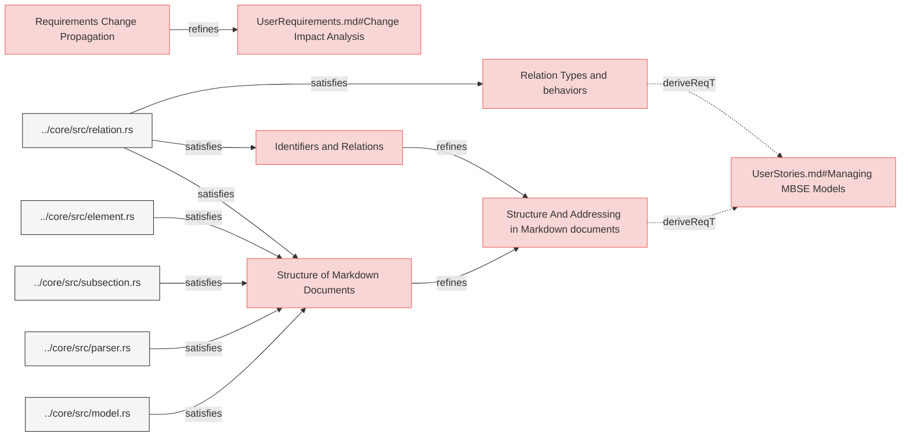
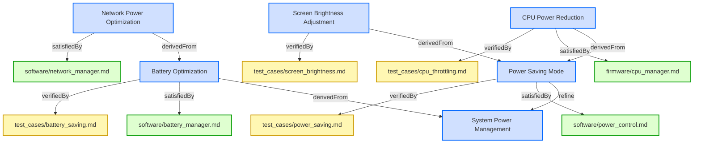
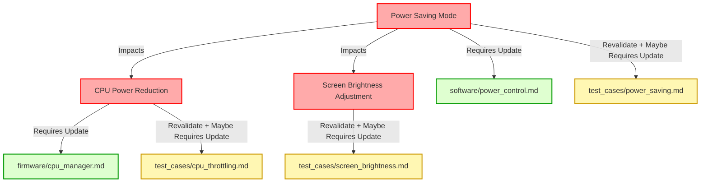

# User Requirements

## Specifications Requirements


---

### Requirements Change Propagation

When a requirement is changed, the system shall propagate the change through related requirements, verification artifacts, and design elements according to relation type definitions and propagation rules.

#### Relations
  * refine: [UserRequirements.md#Change Impact Analysis](UserRequirements.md#change-impact-analysis)

#### Details


<details>
<summary>View Full Specification</summary>


## Change Impact Propagation in Requirements

Requirements are interconnected through relations, and changes to a requirement may affect related requirements, verification methods, design specifications, or software components.

Changes propagate based on the relation type, which determines the impact direction and scope.

Changes to high-level requirements cascade down to implementation.
Verification artifacts must be marked for revalidation to reflect changes.
Automated tools should flag all impacted requirements for review.


## Relation Types and Change Propagation

The specific relation types, their directionality, and change propagation behaviors are defined in the [RelationTypesRegistry.md](RelationTypesRegistry.md) document, which serves as the single source of truth for all relation types in the system.

This document focuses on the implementation and mechanics of change propagation, while the registry defines the specific behaviors for each relation type.

### Relation Categories for Change Propagation

For change propagation purposes, relations can be categorized into several groups:

1. **Hierarchical Relations** - Changes propagate from parent to child elements (containedBy, contain, derivedFrom, derive, refine, refinedBy)
2. **Satisfaction Relations** - Changes to requirements affect implementations (satisfiedBy, satisfy)
3. **Verification Relations** - Changes to requirements invalidate verifications (verifiedBy, verify)
4. **Traceability Relations** - No change propagation, for documentation only (trace)

See the [RelationTypesRegistry.md](RelationTypesRegistry.md) document for the complete definition of each relation type, including its directionality and change propagation behavior.

---


## Change Propagation Mechanism

When a requirement changes, impact analysis must be conducted based on its relations. The following mechanism ensures traceability and controlled updates.

- Identify Impacted Relations
  - When a requirement is modified, check its Relations subsection to identify linked elements.
- Determine Change Propagation Scope
  - Apply the rules in Relation Types and Change Propagation Rules to assess whether the change affects child requirements, design artifacts, verification, or other linked documents.
- Invalidate Affected Elements
  - If a related element is impacted, flag it for review.  
  - Example: If a requirement verified by a test changes, the test must be reviewed.
- Require Re-validation or Re-design
  - If changes affect satisfaction (e.g., code or architecture), update the relevant design.  
  - If changes affect verification, update test cases or validation documents.
- If a change results in a requirement being merged, split, or removed, update its Relations to maintain traceability.


## Examples of Change Propagation


### Parent-Child Requirement Change

```markdown

---

### Parent Requirement
This requirement defines a high-level system constraint.

#### Relations
  * contain: [Child Requirement](#child-requirement)


---

### Child Requirement
This requirement defines additional functionality.

#### Relations
  * containedBy: [Parent Requirement](#parent-requirement)
  
```

If Parent Requirement changes, Child Requirement must be reviewed and updated.


---

### Requirement Satisfied by a Design Specification

```markdown

---

### Functional Requirement
The system shall process transactions within 500ms.

#### Relations
  * satisfiedBy: [architecture/system_design.md/Performance Constraints](architecture/system_design.md#performance-constraints)
```

If Functional Requirement changes, Performance Constraints in the architecture document must be updated.


---

### Requirement Verified by a Test

```

---

### Safety Requirement
The system shall shut down if temperature exceeds 100°C.

#### Relations
  * verifiedBy: [test_cases/safety_verification.md/Overheat Shutdown Test](test_cases/safety_verification.md#overheat-shutdown-test)

```

If Safety Requirement changes, the Overheat Shutdown Test must be reviewed for update and executed again for verification.


---

### Example of Multi-Level Change Propagation in Requirements

The following analysis explains how a **change in the requirement**  propagates through multiple levels of related requirements, impacting their definitions, design artifacts, and verification processes.

---

```
### Root Requirement: System Power Management

The system shall implement power-saving mechanisms to optimize battery usage.  

---

### Power Saving Mode

The system shall activate power-saving mode when the battery level drops below 20%.  

#### Relations
  * refine: [System Power Management](#system-power-management)
  * satisfiedBy: [software/power_control.md](software/power_control.md)
  * verifiedBy: [test_cases/power_saving.md](test_cases/power_saving.md)

---

### CPU Power Reduction

The system shall reduce CPU frequency by 30% in power-saving mode.  

#### Relations
  * derivedFrom: [Power Saving Mode](#power-saving-mode)
  * satisfiedBy: [firmware/cpu_manager.md](firmware/cpu_manager.md)
  * verifiedBy: [test_cases/cpu_throttling.md](test_cases/cpu_throttling.md)

---

### Screen Brightness Adjustment

The system shall reduce screen brightness by 40% in power-saving mode.  

#### Relations
  * derivedFrom: [Power Saving Mode](#power-saving-mode)
  * verifiedBy: [test_cases/screen_brightness.md](test_cases/screen_brightness.md)

---

### Battery Optimization

The system shall disable non-essential background services when battery levels drop below 15%.  

#### Relations
  * derivedFrom: [System Power Management](#system-power-management)
  * satisfiedBy: [software/battery_manager.md](software/battery_manager.md)
  * verifiedBy: [test_cases/battery_saving.md](test_cases/battery_saving.md)

---

### Network Power Optimization
The system shall reduce network polling frequency when battery levels drop below 15%.  

#### Relations
  * derivedFrom: [Battery Optimization](#battery-optimization)
  * satisfiedBy: [software/network_manager.md](software/network_manager.md)
```

**Power Saving Mode** requirment has been changed to:
>The system shall activate power-saving mode when the battery level drops below 30%.


Change Propagation Flow:
1. A **change** in **Power Saving Mode** flows **downward** to **CPU Power Reduction** because it is **derivedFrom** it.
2. A **change** in **Power Saving Mode** flows **downward** to **Screen Brightness Adjustment** because it is **derivedFrom** it.    
3. Additionally, all **satisfiedBy** and **verifiedBy** relations from affected requirements must be reviewed:
   - **Power Saving Mode** → **software/power_control.md** (implementation) & **test_cases/power_saving.md** (verification).  
   - **CPU Power Reduction** → **firmware/cpu_manager.md** (implementation) & **test_cases/cpu_throttling.md** (verification).  
   - **Screen Brightness Adjustment** → **[test_cases/screen_brightness.md** (verification).  


Mermaid diagram showing relations:


Legend:
- **🟦 Requirements (Blue)** → Directly from your provided requirements.  
- **🟩 Implementations (Green)** → Only **satisfiedBy** links
- **🟨 Verifications (Yellow)** → Only **verifiedBy** links

Change propagation flow diagram:

</details>

---

### Structure and Addressing in Markdown Documents

The system shall implement semi-structured markdown format specifications that defines the structure, rules, and usage of **Elements**, **Relations**, and **Identifiers** in Markdown (`.md`) documents. 

#### Relations
  * derivedFrom: [UserStories.md#Managing MBSE Models](UserStories.md#managing-mbse-models)

---

### Structure of Markdown Documents

The system shall implement the structure, rules, and usage of **Sections**, **Elements**, **Subsections**, **Relations**, and **Identifiers** in Markdown (`.md`) documents following clearly defined specifications.

#### Relations
  * refine: [Structure And Addressing in Markdown documents](#structure-and-addressing-in-markdown-documents)
  * satisfiedBy: [../core/src/relation.rs](../core/src/relation.rs)
  * satisfiedBy: [../core/src/element.rs](../core/src/element.rs)
  * satisfiedBy: [../core/src/subsection.rs](../core/src/subsection.rs)      
  * satisfiedBy: [../core/src/parser.rs](../core/src/parser.rs)
  * satisfiedBy: [../core/src/model.rs](../core/src/model.rs)    

#### Details

<details>
<summary>View Full Specification</summary>


## Sections in Markdown Documents

A **Section** is used for grouping of similar requirements for easier management and visualizations. It starts with a `##` header and includes all system elements under that header until the next header of the same or higher hierarchy.

## Elements in Markdown Documents

An **Element** is a uniquely identifiable system element within a Markdown document. It starts with a `###` header and includes all content under that header until the next header of the same or higher hierarchy.

### Structure of an Element

1. **Element Header**
  - The `###` header defines the start of an element.
  - The text of the `###` header serves as the **element name**.
  - The element name must be unique within the same document to ensure unambiguous references.

2. **Element Content**
  - The element includes all content under the `###` header until:
    - The next `###` header, or
    - A higher-level header (`##`, `#`), or
    - The end of the document.
  - The content can include:
    - Text
    - Subheaders (e.g., `####`)
    - Bullet points, code blocks, tables, etc.


## Rules for Elements

1. **Header Format**:
   - An element must start with a 3 `###` header.
   - The `###` header text must not be empty.

2. **Uniqueness**:
   - Element names must be unique within the same file.
 
3. **Nested Subheaders**:
   - Subheaders within an element defined with 4 header (e.g., `####`) are part of the same element and do not create new elements.

4. **No Overlapping Content**:
   - Content in an element belongs exclusively to that element and cannot overlap with another.


### Examples of Elements

Single Element:
```markdown


### My Element

This is the content of My Element.

#### Subsection
Additional details about My Element.
```

Multiple Elements:
```


### Element One

This is the content of Element One.


### Element Two

This is the content of Element Two.
```

Nested Subheaders:
```


### Main Element
This is the main element content.

#### Subsection
Details about the subsection.

#### Another Subsection
More details about another subsection.
```


### Invalid Cases

Element headers empty:
```
###
```

Headers not unique within the same document:
```


### Duplicate
Content of the first duplicate.


### Duplicate
Content of the second duplicate.
```


## Sections in Markdown Documents

A **Section** is used for grouping of similar requirements for easier management and visualizations. It starts with a `##` header and includes all system elements under that header until the next header of the same or higher hierarchy.

## Elements in Markdown Documents

An **Element** is a uniquely identifiable system element within a Markdown document. It starts with a `###` header and includes all content under that header until the next header of the same or higher hierarchy.

### Structure of an Element

1. **Element Header**
  - The `###` header defines the start of an element.
  - The text of the `###` header serves as the **element name**.
  - The element name must be unique within the same document to ensure unambiguous references.

2. **Element Content**
  - The element includes all content under the `###` header until:
    - The next `###` header, or
    - A higher-level header (`##`, `#`), or
    - The end of the document.
  - The content can include:
    - Text
    - Subheaders (e.g., `####`)
    - Bullet points, code blocks, tables, etc.


## Rules for Elements

1. **Header Format**:
   - An element must start with a 3 `###` header.
   - The `###` header text must not be empty.

2. **Uniqueness**:
   - Element names must be unique within the same file.
 
3. **Nested Subheaders**:
   - Subheaders within an element defined with 4 header (e.g., `####`) are part of the same element and do not create new elements.

4. **No Overlapping Content**:
   - Content in an element belongs exclusively to that element and cannot overlap with another.

### Examples of Elements

Single Element:
```markdown


### My Element

This is the content of My Element.

#### Subsection
Additional details about My Element.
```

Multiple Elements:
```


### Element One

This is the content of Element One.


### Element Two

This is the content of Element Two.
```

Nested Subheaders:
```


### Main Element
This is the main element content.

#### Subsection
Details about the subsection.

#### Another Subsection
More details about another subsection.
```


### Invalid Cases

Element headers empty:
```
###
```

Headers not unique within the same document:
```

### Duplicate
Content of the first duplicate.


### Duplicate
Content of the second duplicate.
```

## Subsections in Markdown documents

An element may contain different **Subsections**, some of which are strictly defined, while others allow free-form content.
- **Reserved Subsections**: These subsections follow a predefined structure.
- **Other Subsections**: These allow additional descriptive or supporting information.

Subsections starts with the `#### Subsection Name` and ends either with new element or next subsection.
Subsection must be located **within an element chunk**.

The `#### ` header marks the beginning of the subsection.
It must appear directly within an element chunk, **following** the `###` header of the parent element and any preceding content, including previous subsections.
Each element chunk can have **at most one** `#### SubsectionName` subsection where 'SubsectionName' is a unique name of the subsection within an element.

The reserved subsections are:
 * Relations
 * Details
 * Properties
 * Metadata
 
Those have defines structure that must be followed.


### Details Subsection

Must be defined with a level 4 header: `#### Details`.

When parsing `#### Details` subsections, any markdown headers or elements within <details>...</details> tags are skipped.

The **#### Details** subsection within an element provides additional information directly related to the main requirement text.

- Content within the **Details** subsection is considered an **extension of the requirement text**.
- Any statements in the **Details** subsection hold the same validity as the main requirement text.

###  Relations Subsection

Must be defined with a level 4 header: `#### Relations`.

Duplicate relation entries within the same `#### Relations` subsection are not allowed.

### Metadata Subsection

Must be defined with a level 4 header: `#### Metadata`.

The metadata section of an element follows these rules:
1. Contains properties in list format: `* property_name: property_value`
2. Property entries are listed as bullet points (`*`), with **two spaces** (`  *`) of indentation followed by property_name + ': ' + property_value.
3. May include any custom properties, not just `type`

#### Reserved Properties

The following properties have special meaning:

- `type`: Defines the element type
  
- Additional reserved properties may be defined in future releases

#### Supported Element Types

Element types are identified through a reserved "type" metadata property. The following types are supported:
1. **requirement**: System requirment
2. **user-requirement**: User requirement
3. **verification**: For verification tests and validation procedures
4. **test-verification**: For verification tests and validation procedures
5. **analysis-verification**: For verification tests and validation procedures
6. **inspection-verification**: For verification tests and validation procedures
7. **demonstration-verification**: For verification tests and validation procedures
8. **other**: Custom element types defined by users

#### Type Determination

The type of an element is determined through the following process:

1. If a `#### Metadata` subsection exists and includes a `type` property, use that value
2. If no type is specified, default to `user-requirement`, if document is in the root of `specifications` folder, otherwise to `requirement` type.
3. Future versions may add more built-in types as needed

#### Example Metadata Section

```markdown

### My Element

This is a verification element.

#### Metadata
  * type: verification
  * priority: high
  * owner: team-a

#### Relations
* verifies: [Some Requirement](#some-requirement)
```

```markdown

### My Element

This is a verification element.

#### Details

Some details.

#### Metadata
  * type: verification
  * priority: high
  * owner: team-a

#### Relations
  * verifies: [Some Requirement](#some-requirement)
```

#### Verification Type Categories

The following verification types are supported:

1. **Default Verification Type**
   - `verification` - Verification through testing (equivalent to `test-verification`)

2. **Specific Verification Types**
   - `test-verification` - Explicit verification through testing with documented test procedures
   - `analysis-verification` - Verification through formal analysis of documentation or code
   - `inspection-verification` - Verification through formal inspection or review
   - `demonstration-verification` - Verification through demonstration in a realistic environment

These verification types align with standard systems engineering verification methods:
- **Test**: Verification through formal testing according to documented test procedures with expected outcomes
- **Analysis**: Verification through systematic analysis of artifacts without physical testing
- **Inspection**: Verification through examination of documentation, code, or physical components
- **Demonstration**: Verification through showing functionality in an operational-like environment


The appropriate verification type should be selected based on the nature of the requirement:
- **Test**: Verification through formal testing according to documented test procedures with expected outcomes
- **Analysis**: Verification through systematic analysis of artifacts without physical testing
- **Inspection**: Verification through examination of documentation, code, or physical components
- **Demonstration**: Verification through showing functionality in an operational-like environment

The appropriate verification type should be selected based on the nature of the requirement:
- **Test-verification**: Used when formal test procedures with expected outcomes are required
- **Analysis-verification**: Used when requirements can be verified through analysis of documentation or code
- **Inspection-verification**: Used when requirements can be verified through review of artifacts
- **Demonstration-verification**: Used when requirements can be verified by demonstrating functionality


</details>

---

### Identifiers and Relations

The system shall implement  **Identifiers** and **Relations** following clearly defined specifications to ensure consistency, validity, and efficient querying and manipulation of these entities.

#### Relations
  * refine: [Structure And Addressing in Markdown documents](#structure-and-addressing-in-markdown-documents)
  * satisfiedBy: [../core/src/relation.rs](../core/src/relation.rs)

#### Details

<details>
<summary>View Full Specification</summary>

## Identifiers in Markdown Documents

An **identifier** consists of a path following a filename with an extension (e.g., `file.md`) and optionally an **element** name (fragment).  

Every **element** in the system has unique identifier that depends on document it appears in, path of the document, and element name (fragment).


### Path Resolution Rules

- If an identifier **starts with `/<specficiation_folder>/`**, it is considered relative to the **specifications folder**.
- If an identifier **starts with `/<external_folder>/`**, it is considered relative to the **external folder**.
- If an identifier **does not start with `/`**, it is considered **relative** to the path of the document in which it appears.
- If an identifier **starts with `/`**, it is considered absolute path that is preserved during normalizations.

Each **identifier** must uniquely reference either:
  - A **file**, or
  - An **element within a file**.

#### Path Resolution Examples

Assuming the **<specifications> folder** is `project` and a file exists at `/path/to/project/documents/File1.md`:

| Identifier | Resolves to |
|------------|------------|
| `File2.md` | `/path/to/project/documents/File2.md` |
| `subfolder/File3.md` | `/path/to/project/documents/subfolder/File3.md` |
| `../File4.md` | `/path/to/project/File4.md` |
| `../../somefolder/File4.md` | `/path/to/somefolder/File4.md` |
| `/project/File4.md` | `/path/to/project/File4.md` |

---

The same rule is applied when normalazing **<external_folder> folder** .

---


### Identifier Form Variations and Examples

System recognises 2 kinds of identifier that may appear in documents and relations:
 * Simple identifiers
 * GitHub-style Markdown Link Identifiers


Both Simple identifier and link part of GitHub-style markdown identifier can be etiher internal internal paths or external links (eg. starting with known scheme eg. https://)
 
 
When parsing identifiers, both styles are nomarlized into the same form used internally by the system.

As part of normailization process, element names are converted to **GitHub-style anchor link** fragments which are internal identifer representations:
  - Convert to **lowercase**.
  - Replace **spaces with hyphens (`-`)**.
  - Remove **disallowed characters**.
  - Remove **leading and trailing whitespace**.


#### 1. Simple Identifiers

Plain file or element references, following the path resolution rules.


Examples (<specifications> folder is some path):

- File only identifier found in the document '<specifications>/path/to/document.md'
```
file.md
```
  - Normalized to '<specifications>/path/to/file.md'

- File with an element fragment in the document '<specifications>/path/to/document.md':  
```
file.md#element name
```
  - Normalized to '<specifications>/path/to/file.md#element-name'

- Relative path with an element fragment in the document '<specifications>/path/to/document.md':  
```
../relative_path/file.md#element name
```
  - Normalized to '<specifications>/path/file.md#element-name'

- Element name fragment only (within the same file) in the document '<specifications>/path/to/document.md':  
```
#element name
```
  - Normalized to '<specifications>/path/to/document.md#element-name'
  
  
- Relative path with the element fragment with special characters in the document '<specifications>/path/to/document.md'::  
```
path/file.md#My Element (Draft)
```
  - Normalized to '<specifications>/path/to/path/file.md##my-element-draft'
  

- Absolute path starting with the 'specifications' <specification> folder with the element fragment in any document:
```
/specifications/path/file.md#Elements
```
  - Normalized to '<specifications>/path/file.md#elements'
  
       
#### 2. GitHub-style Markdown Link Identifiers

A valid GitHub-style Markdown link to a file or a fragment within a file.
Identifier is considered the **link** part of the markdown link: everything inside '(identifier)'.

Once link part is obtained from GitHub-style Markdown link, it is following same rules for normalization as **simple identifiers**. 
   
Examples:

- File link in '<specifications>/path/to/document.md':  
```
[Specification](documents/specification.md)
```
  - Normalized to '<specifications>/path/to/path/documents/specification.md'

- Fragment link in '<specifications>/path/to/document.md':  :  
```
[My Element](documents/specification.md#my-element)
```
  - Normalized to '<specifications>/path/to/path/documents/specification.md#my-element'

---


##  Relations in Markdown Documents

The `#### Relations` subsection specifies associations between elements, files, or other resources, forming the logical and dependency structure of the model.  

The `#### Relations` subsection:
- Is a dedicated part of an **element** section in Markdown document.
- Starts with the `#### Relations` header.
- Contains a list of relations in a specific format.


The `#### Relations` subsection must be located within an element chunk.
Each element chunk can have at most one `#### Relations` subsection.

The `#### Relations` header marks the beginning of the subsection.

The `#### Relations` subsection must appear directly within an element  chunk.
It must follow the `###` header of the parent element and any preceding content.


### Relation Structure

- Relation entries are listed as bullet points (`*`), with **two spaces** (`  *`) of indentation.

####  **Relation Format**
   - Relations follow this format:
     ```
     * relationType: **identifier**
     ```
   - Example:
     ```
     * dependsOn: [Element2](#element2)
     ```

####  **Relation Type**
   - Specifies the type of the relationship.
   - Allowed characters: `[a-zA-Z]`
   - Minimum length: **2 characters**  
   - Maximum length: **80 characters**  
   - Must be one of the predefined, case-sensitive types


####  **Target Identifier**
   - Specifies the target of the relation.
   - Must be a valid **Simple Identifier** or **Git Valid Markdown Link Identifier** as defined in this document.


---

### Examples of `#### Relations`

#### 1. **Simple Relations**
```markdown


### My Element
This is the content of My Element.

#### Relations
  * dependsOn: [Element2](#element2)
  * relatedTo: [path/to/anotherFile.md/Section3](path/to/anotherFile.html#section3)
  * uses: [file.md](file.html)
```

#### 2. **Relations with Special Characters**
```markdown


### API v2.0
Details about API version 2.0.

#### Relations
  * satisfies: [documents/specification.md#API: v2.0](documents/specification.html#api-v20)

```

#### 3. **Relation to an Element in the Same File**
If the referenced element exists within the same file, the identifier can be a fragment only.

```markdown

#### Relations
  * extends: [Another Section](#another-section)
```

#### 4. **Relative Path Relations**
If the referenced file is located in a subfolder relative to the current document, use a relative path.
```markdown

#### Relations
  * refines: [subfolder/details.md#refined-section](subfolder/details.html#refined-section)

```

#### 5. **Absolute Path Relations**

If the reference starts with /, it points to a file or element relative to the root specifications folder.

```markdown

#### Relations
  * verifiedBy: [/specifications.md#verification-steps](/specifications.html#verification-steps)

```

#### 6. **Invalid Relations Example**

```markdown

This element contains invalid relation entries.

#### Relations
  * derivedFrom: [Element2](#element2)
* InvalidEntry
* : MissingRelationType
  * trace: [path/to/file.md](path/to/file.html)
```

## Identifier Usage in Relations

Identifiers are used in relations to reference files or specific elements within files. Examples:

1. **Relation to a File**:
   ```markdown
   #### Relations
     * satisfiedBy: [documents/specification.md](documents/specification.html)
   ```
    
2. **Relation to an Element**:
   ```markdown
   #### Relations
     * derivedFrom: [documents/specification.md/section one](documents/specification.html#section-one)
   ```
   

## Valiation rules (TODO: add mising rules)

The system must validate relation usage according to these rules:
- Only the relation types defined in this registry are allowed
- Relations should connect elements of appropriate types (TODO: append spec with rules).
- Circular dependencies should be detected and reported
- Duplicate relation entries of same type and target are not allowed.
      

</details>

---

---

### Relation Types and behaviors

The system shall implement relations following clearly defined specifications for types and behaviors.

#### Relations
  * derivedFrom: [UserStories.md#Managing MBSE Models](UserStories.md#managing-mbse-models)
  * satisfiedBy: [../core/src/relation.rs](../core/src/relation.rs)

#### Details

<details>
<summary>View Full Specification</summary>


## Relation Type Definition

A relation type in Reqvire:
- Defines a semantic connection between elements
- Specifies the directionality of the relationship
- Determines change propagation behavior
- May have an opposite/inverse relation type

## Core Concepts

### Directionality

Relations have three possible directionality patterns:

1. **Forward** - The relation flows from the source element to the target element 
   - Example: `contain` points from a parent to a child element
   
2. **Backward** - The relation flows from the target element to the source element
   - Example: `derivedFrom` points from a child back to its parent element
   
3. **Neutral** - The relation has no inherent direction
   - Example: `trace` simply indicates a relationship without directionality

### Change Propagation

The direction of change propagation is not always the same as relation directionality:

- In hierarchical relationships, changes propagate downward from parents to children
- Some relations like `verifiedBy` specifically trigger invalidation rather than just change propagation 

## Comprehensive Relation Type Table

| Relation Type | Direction | Opposite Type | Change Propagation | Description |
|---------------|-----------|---------------|-------------------|-------------|
| **containedBy** | Backward | contain | Parent → Child | Links a child element to its containing parent element |
| **contain** | Forward | containedBy | Parent → Child | Links a parent element to the child elements it contains |
| **derivedFrom** | Backward | derive | Parent → Child | Links a child element to the parent element it is derived from |
| **derive** | Forward | derivedFrom | Parent → Child | Links a parent element to child elements derived from it |
| **refine** | Backward | refinedBy | Parent → Child | Links a child element to a parent element it refines with more detail |
| **refinedBy** | Forward | refine | Parent → Child | Links a parent element to child elements that refine it |
| **satisfiedBy** | Forward | satisfy | Requirement → Implementation | Links a requirement to elements that satisfy it |
| **satisfy** | Backward | satisfiedBy | Requirement → Implementation | Links an implementation to the requirement it satisfies |
| **verifiedBy** | Forward | verify | Requirement → Verification | Links a requirement to verification artifacts |
| **verify** | Backward | verifiedBy | Requirement → Verification | Links a verification artifact to the requirement it verifies |
| **trace** | Neutral | None | None (Documentation) | Establishes a trace relationship without change propagation |

## Relation Categories

Relations are grouped into logical categories based on their semantic meaning:

### 1. Parent-Child Hierarchical Relations

These relations define hierarchical structures within the model:

- **containedBy/contain**: Physical or logical containment hierarchy
- **derivedFrom/derive**: Derivation of elements from higher-level elements
- **refine/refinedBy**: Refinement relationships adding more detail

### 2. Satisfaction Relations

These relations connect requirements to implementations:

- **satisfiedBy/satisfy**: Links requirements to design, code, or architectural elements

### 3. Verification Relations

These relations connect requirements to verification elements:

- **verifiedBy/verify**: Links requirements to tests, validations, or other verification artifacts

### 4. Traceability Relations

These relations establish lightweight connections for documentation:

- **trace**: Simple non-directional traceability without strong semantic meaning or change propagation

## Change Impact Rules

When an element changes, the impact propagates according to these rules:

1. **Hierarchical Changes**:
   - Changes to parent elements propagate to all children
   - This includes containment, derivation, and refinement relationships

2. **Requirement Changes**:
   - Changes to requirements propagate to all satisfying implementations
   - Changes to requirements invalidate all verifications

3. **Implementation Changes**:
   - Changes to implementations rarely propagate upward to requirements
   - Implementations should be updated to maintain satisfaction

4. **Verification Changes**:
   - Changes to verification artifacts generally don't propagate
   - Verification updates may be needed after requirement changes

5. **Trace Relationships**:
   - Changes do not propagate through trace relationships
   - Trace relationships are used for documentation and discovery purposes only
   
</details>

---